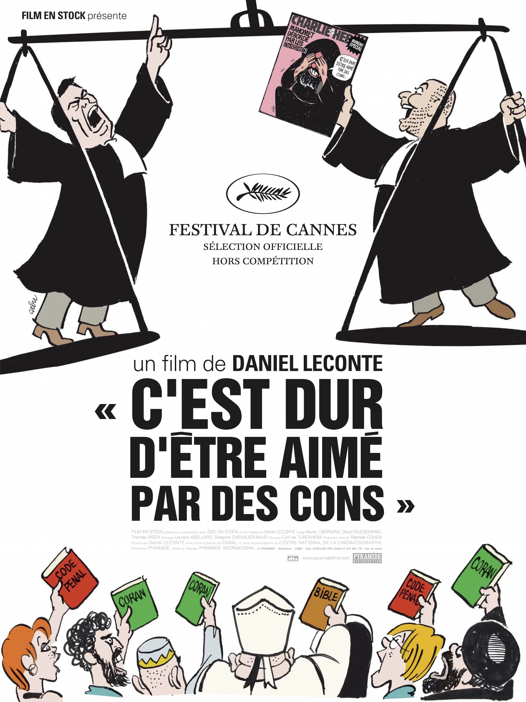

+++
titre = "<em>C&rsquo;est dur d&rsquo;être aimé par des cons</em>, Daniel Leconte"
title = "C'est dur d'être aimé par des cons, Daniel Leconte"
url = "/dur-etre-aime-cons-leconte"
date = "2015-01-18T10:30:15"
Lastmod = "2015-01-18T10:32:40"
cover = "dur-etre-aime-par-cons-patrice-leconte.jpg"
categorie = [ "À voir" ]
tag = [ "Caricature", "Documentaire", "Histoire", "Journalisme", "Presse", "Procès", "Religion" ]
createur = [ "Daniel Leconte" ]
annee = [ "2008" ]
weight = 2008
pays = [ "France" ]

+++

Sélectionné à Cannes, hors compétition, en 2008, <em>C&rsquo;est dur d&rsquo;être aimé par des cons</em> n&rsquo;aurait probablement jamais eu le même impact que le coup de projecteur malheureusement envoyé par l&rsquo;attentat contre <em>Charlie Hebdo</em>. Depuis les faits, on ne peut plus regarder le documentaire de Daniel Leconte avec le même regard, et pour cause. Revoir ces dessinateurs assassinés pour avoir dessiné des caricatures contre les intégristes musulmans a une toute autre saveur, tout comme ce procès a pris une dimension autrement plus importante depuis. En 2006 et 2007, le journal satirique s&rsquo;est retrouvé au cœur d&rsquo;une polémique autour de la diffusion de caricatures de Mahomet et ce procès s&rsquo;est transformé en débat de société. Les menaces de mort affluaient alors contre <em>Charlie Hebdo</em> et ses principaux protagonistes, de Cabu à Charb en passant par Cavana. Daniel Leconte ne pouvait évidemment pas imaginer qu&rsquo;elles allaient finir par se concrétiser, mais son documentaire est un témoignage indispensable, qui n&rsquo;a jamais autant mérité d&rsquo;être (re)vu qu&rsquo;aujourd&rsquo;hui. <em>C&rsquo;est dur d&rsquo;être aimé par des cons</em> est devenu un film indispensable, tout simplement.

Daniel Leconte commence assez naturellement par situer le contexte du procès. Tout a commencé par l&rsquo;<a href="http://fr.wikipedia.org/wiki/Assassinat_de_Theo_van_Gogh">assassinat</a> du réalisateur néerlandais Theo van Gogh à l&rsquo;automne 2004. En réaction, un journal danois publie douze caricatures contre les extrémistes musulmans qui enflamment une partie des croyants dans le monde, mais aussi en France. <em>Charlie Hebdo</em> décide de publier lui aussi ces caricatures avec quelques <a href="http://voiretmanger.fr/wp-content/2015/01/charlie-hebdo.jpeg">autres dessins</a> de son cru dans un numéro devenu célèbre pour sa couverture, dessinée par Cabu. On y voyait Mahomet, le visage entre les mains, se plaindre « <em>C&rsquo;est dur d&rsquo;être aimé par des cons</em> ». Alors même que l&rsquo;hebdomadaire satirique n&rsquo;est pas le seul journal en France à les publier — le documentaire rappelle ainsi que <em>France Soir</em> et <em>L&rsquo;Express</em> ont publié les caricatures —, c&rsquo;est le seul attaqué en justice par la mosquée de Paris et plusieurs organismes musulmans et le film documentaire de Daniel Leconte suit justement le déroulement du procès. Deux jours seulement, mais deux jours chargés en témoignages de personnalités religieuses et politiques, de journalistes également menacés pour leur liberté… et finalement, un procès autour de l&rsquo;idée même de liberté de la presse. Depuis l&rsquo;attentat qui a touché le journal, ce procès a pris une autre dimension et <em>C&rsquo;est dur d&rsquo;être aimé par des cons</em> résonne de manière assez tragique rétrospectivement, tout en restant toujours aussi passionnant.

Il y a ces menaces de mort, prises à la légère par les caricaturistes qui s&rsquo;amusent même d&rsquo;être protégés par la police. Il y a Cabu qui monte sur une chaise pour accrocher son dernier dessin et qui se plaint de la dangerosité de son métier. Il y a aussi ces citoyens devant les portes du procès, qui ont des mots durs contre <em>Charlie Hebdo</em> et même un jeune, qui envoie des menaces aujourd&rsquo;hui lourdes de sens. Il y a ces politiques qui n&rsquo;ont apporté leur soutien que par opportunisme — Nicolas Sarkozy, alors ministre de l&rsquo;Intérieur et candidat à la présidentielle, qui envoie une lettre vibrante en soutien au journal — ou qui ne l&rsquo;ont pas apporté justement — Ségolène Royal a envoyé un SMS un peu lâche. Il y a même le soutien gênant de Dieudonné, venu expliquer que l&rsquo;on devrait pouvoir se moquer des musulmans et des noirs sans problème. Autant de signes qui pourraient être annonciateurs du drame, mais qui sont d&rsquo;abord un portrait de la société de l&rsquo;époque et surtout de la classe politique. Daniel Leconte ne le dit pas dans son film, mais l&rsquo;un des avocats des plaignants contre <em>Charlie Hebdo</em> est conseiller de Jacques Chirac. Derrière ce procès contre des caricatures, il s&rsquo;agit bien d&rsquo;une affaire politique et <em>C&rsquo;est dur d&rsquo;être aimé par des cons</em> le montre très bien, avec cette histoire acadabrantesque racontée par le patron de <em>L&rsquo;Express</em>. Denis Jeambar avait choisi de publier les caricatures, mais il reçoit un appel de Serge Dassault, son actionnaire qui veut empêcher leur publication et laisser entendre, de façon à peine implicite, que l&rsquo;ordre vient de l&rsquo;Élysée. Une affaire assez terrifiante pour le monde politique d&rsquo;alors et qui tranche, fort heureusement, avec le soutien général actuel.

<iframe class="aligncenter" src="//www.youtube.com/embed/CzD9AofspII" frameborder="0" allowfullscreen></iframe>

On aurait aimé voir plus de dessins, notamment ceux contre les autres religions évoqués pendant le procès et qui sont bizarrement absents, on aurait surtout aimé voir plus le travail des dessinateurs aujourd&rsquo;hui disparus, mais le documentaire reste passionnant et mérite d&rsquo;être vu. On peut le regarder d&rsquo;autant plus facilement, que <em>C&rsquo;est dur d&rsquo;être aimé par des cons</em> n&rsquo;est pas un documentaire sérieux. Au contraire même, Daniel Leconte le filme comme un long-métrage, avec une musique entraînante et même un générique qui évoquerait un thriller ou un film d&rsquo;espionnage. Résultat, on prend beaucoup de plaisir à suivre ce procès et même si le cinéaste n&rsquo;a pas pu le filmer directement, il en restitue bien les rebondissements et même l&rsquo;humour qui avait place dans la salle de justice. Certes, la qualité de l&rsquo;image est souvent médiocre, mais qu&rsquo;importe : <em>C&rsquo;est dur d&rsquo;être aimé par des cons</em> est un document précieux, qui gagnera à être plus largement diffusé.

<h3>Vous voulez <a href="http://voiretmanger.fr/soutien/">m&rsquo;aider</a> ?</h3>
<ul>
<li><a href="http://www.amazon.fr/gp/product/B001ND9BXU/ref=as_li_ss_tl?ie=UTF8&amp;tag=leblogdenic07-21&amp;linkCode=as2&amp;camp=1642&amp;creative=19458&amp;creativeASIN=B001ND9BXU">Acheter le film en DVD sur Amazon</a></li>
</ul>

