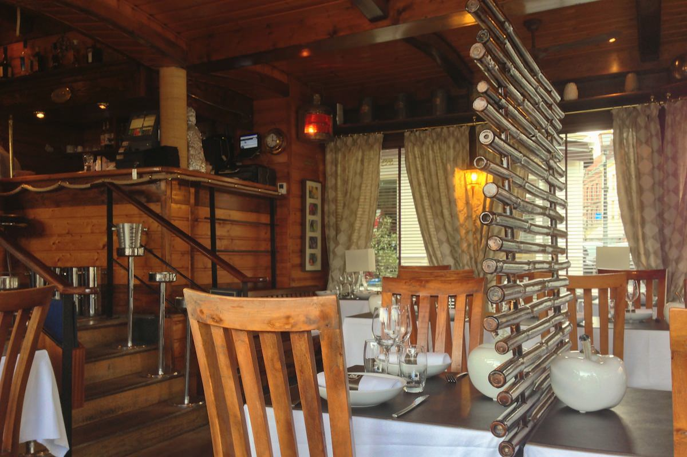
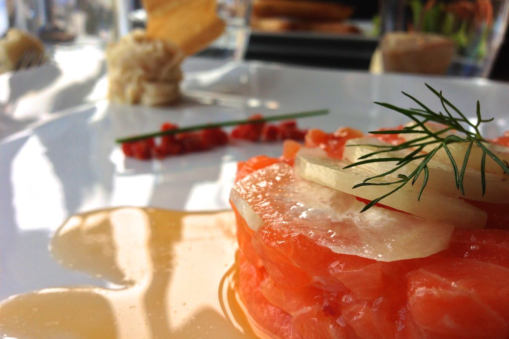
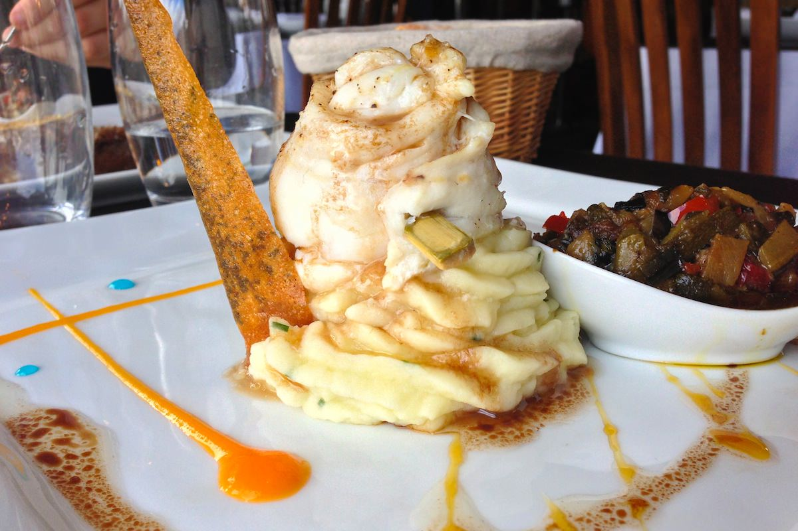

+++
type = "post"
titre = "L&rsquo;écailleur à Honfleur"
title = "L'écailleur à Honfleur"
url = "/ecailleur-honfleur"
date = "2013-02-11T22:51:09"
Lastmod = "2013-06-01T10:01:58"
cover = "ecailleur-honfleur.jpg"
categorie = [ "À manger" ]
tag = [ "Cuisine française", "Cuisine moderne", "Poisson" ]

+++

Ce ne sont pas les restaurants qui manquent autour du vieux port de Honfleur. La petite ville située en face du Havre a su conserver son originalité avec ce centre ancien qui tranche avec les constructions bétonnées du grand port de l’autre côté de l’estuaire, mais aussi avec celles de Deauville, un petit peu plus à l’Ouest. En saison, les touristes affluent et les restaurateurs ne sont pas privés pour en profiter. La majorité des établissements semble quelconque, un attrape-touriste aux prix prohibitifs au regard de la qualité proposée, mais une adresse sort du lot d’emblée. Par la simplicité de sa devanture et par la multiplicité des récompenses et recommandations, <a href="http://www.lecailleur.fr"><strong>L’écailleur</strong></a> attire l’œil et sa carte originale finit de convaincre. De fait, les produits de qualité et la cuisine raisonnablement inventive sont convaincants, surtout avec les tarifs pratiqués hors-saison.

La salle de <strong>L’écailleur</strong> imite l’intérieur d’un vieux gréement, une réussite qui exploite parfaitement bien la forme allongée du restaurant. Ce dernier n’est d’ailleurs pas situé au plus près du port : contrairement à d’autres adresses qui exploitent le rez de chaussé des vieux immeubles de Honfleur, on est ici dans un bâtiment plus moderne coincé entre deux rues. Cet inconvénient a été astucieusement transformé en avantage avec cette forme de navire qui fait la part belle, à l’intérieur, aux boiseries. La salle est assez petite, on y dénombre une vingtaine de couverts peut-être, ce qui est plutôt un bon point à côté des usines à touristes aux alentours. Ce lundi midi d’hiver, il n’y avait foule ni dans la ville, ni dans <strong>l’écailleur</strong>. Un autre couple et un groupe constituaient l’unique clientèle, pour un service très rapide. En piochant dans le menu du jour à 20 € pour deux plats, le repas était plié en moins d’une heure, sans jamais être pressé par les serveurs. Parfait pour un midi, en somme. 

La carte de <strong>L’écailleur</strong> joue l’originalité avec un <a href="http://www.lecailleur.fr/?page_id=6">ensemble de plats</a> de la mer et de la terre, mais souvent réunis en une même assiette. Deux menus — le premier à une trentaine d’euros, le second qui tourne autour des 40 € — permettent de déguster une entrée, un plat et un dessert, mais le midi uniquement en semaine, on peut piocher deux plats du premier midi pour 20 € seulement. Le prix reste très raisonnable par rapport à la position du restaurant et on retrouve des plats d’un très bon niveau. Le tartare de saumon, plat classique s’il en est, était relevé par une association terre-mer qui a prouvé son efficacité : le chorizo. Outre les dès rouges qui parsemaient l’assiette, le tartare avait été préparé avec une huile à base de chorizo qui ajoutait la note de nouveauté nécessaire. Face à moi, les nems de chèvre frais étaient très goûteux et techniquement réussis, même si la sauce qui les accompagnait était un peu trop forte en miel. Côté plat, nous avons eu un excellent filet de bœuf parfaitement cuit et arrosé d’un jus de viande enrichi avec de la graisse de foie gras, et un filet de poisson encore plus étonnant. La présentation spectaculaire présente le filet replié sur un monticule de pommes de terre, mais c’est surtout les couleurs des sauces — orange vif et pointes de bleu — qui surprenaient. Cette recette originale mêle en fait des produits traditionnels à une vinaigrette balsamique au combawa d’une part, et à un caramel de mandarine. L’ensemble des saveurs explose en bouche, pour une assiette vraiment réussie, même si les accompagnements étaient un ton en dessous (purée banale et ratatouille un peu brulée). 

<strong>L’écailleur</strong>, c’est d’abord un rapport qualité/prix qui défie indéniablement toute concurrence à Honfleur. La cuisine qui y est proposée est simple, mais de qualité et surtout avec la pointe de nouveauté qui rend chaque assiette intéressante et dépasse le côté trop simple de bon nombre de restaurants touristiques. Les prix sont raisonnables, surtout si on ne pioche pas dans la large carte des vins et même si le café conclut le repas avec un prix digne des cafés parisiens (4 € le Nespresso, heureusement qu’il y avait une petite mignardise à côté de la tasse). Reste que c&rsquo;est incontestablement une adresse à retenir pour qui veut manger face au port de Honfleur…

