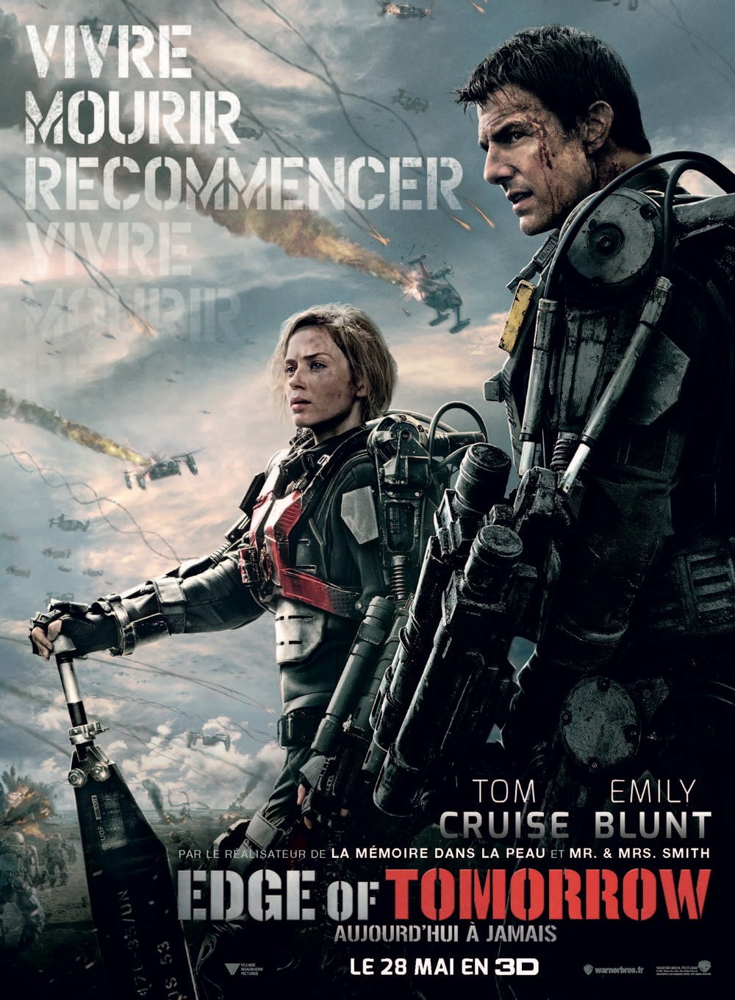
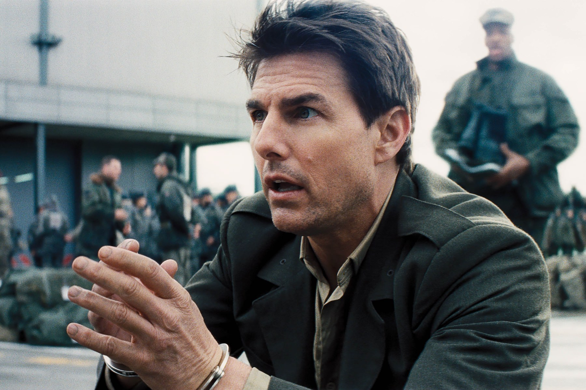

+++
type = "post"
titre = "<em>Edge of Tomorrow</em>, Doug Liman"
title = "Edge of Tomorrow, Doug Liman"
url = "/edge-of-tomorrow-liman"
date = "2014-06-04T23:52:58"
Lastmod = "2014-06-05T11:29:37"
cover = "edge-of-tomorrow-doug-liman.jpeg"
categorie = [ "À voir" ]
tag = [ "Action", "Adaptation bande-dessinée", "Blockbuster", "Extra-terrestre", "Guerre", "Science-Fiction", "Sorties du mois", "Voyage temporel" ]
createur = [ "Doug Liman" ]
acteur = [ "Bill Paxton", "Brendan Gleeson", "Emily Blunt", "Tom Cruise" ]
annee = [ "2014" ]
weight = 2014
pays = [ "Australie", "États-Unis" ]

+++

Depuis <em>Un Jour sans fin</em>, on connait tous ce principe de revivre une journée pour toujours. Après la comédie teintée de romance, <em>Edge of Tomorrow</em> reprend l’idée à son compte, mais dans un tout autre domaine. Pour son huitième long-métrage, Doug Liman exploite le même concept, mais appliqué cette fois à un blockbuster explosif. Dans un futur que l’on imagine proche, un homme peut contrôler le temps et recommence la même journée qui voit la défaite de l’humanité contre d’implacables extra-terrestres à chaque fois qu’il meurt. Une excellente idée et surtout un concept parfaitement maîtrisé et cohérent : <em>Edge of Tomorrow</em> est un très bon blockbuster, divertissant et pas stupide, sauf dans son dernier quart d’heure. Une fin en demi-teinte qui ne remet pas en cause le plaisir éprouvé dans l’ensemble, dans ce grand spectacle très efficace et plaisant.

Pour bien introduire le concept de cette journée qui reprend sans arrêt, il faut d’abord la vivre une fois normalement. Fort de ce constat, <em>Edge of Tomorrow</em> suit les pas de Bill Cage alors qu’une guerre impitoyable fait rage dans toute l’Europe. D’étranges extra-terrestres ont très rapidement envahi le continent et tué des centaines de millions de personnes, sans laisser aucune chance de survie. Les pays qui restent dans la course — rassurez-vous, les États-Unis n’ont pas été touchés, pas plus que la Grande-Bretagne — ont développé une sorte de squelette bionique qui renforce la puissance de tir des soldats et leur offre les capacités supplémentaires pour tirer sur les envahisseurs qui s’avèrent, notamment, extrêmement rapides. Quand le film commence, la plus grande opération de la guerre commence et Doug Liman filme la première journée de son héros… comme un remake de la scène d’ouverture d’<a href="http://voiretmanger.fr/il-faut-sauver-le-soldat-ryan-spielberg/" title="Il faut sauver le soldat Ryan, Steven Spielberg"><em>Il faut sauver le soldat Ryan</em></a>. Et pour cause, <em>Edge of Tomorrow</em> commence avec cette drôle d’idée de répéter le Débarquement de 1944 : tout est similaire, la base anglaise, les côtes normandes et l’attaque par la mer et, futur oblige, par les airs. Nonobstant quelques ajustements pour coller avec l’époque, c’est une réplique parfaite du Débarquement qui ouvre le long-métrage et le scénario ne se contente pas de ce rappel historique, puisqu’il situe à Verdun la première victoire des Alliés contre l’envahisseur. Une relecture originale de l’histoire, mais qui n’a pas vraiment d’importance : au-delà du clin d’œil historique, c’est la débâcle des gentils et la victoire des méchants qui importe dans la première partie. On suit Bill se débattre pendant un massacre très bien organisé par les envahisseurs et très vite, le personnage meurt… pour se réveiller en sursaut quelques heures auparavant, la veille du débarquement.

Une fois posé le principe du retour avant le débarquement après chaque mort, <em>Edge of Tomorrow</em> entre dans sa phase la plus ludique. À chaque fois, Bill Cage revit exactement la même chose, mais puisqu’il sait ce qui va se passer, il peut changer son comportement et obtenir un résultat différent. Au début, il essaie de convaincre son entourage de l’imminence de la catastrophe, mais comme on s’en doute, cela ne fonctionne pas. Peu à peu, il met en place une stratégie, rencontre celle qui a gagné Verdun et découvre qu’elle a gagné en bénéficiant de la même capacité à recommencer chaque journée sans arrêt. Partant de là, Doug Liman associe les deux personnages en un couple qui avance peu à peu, parvient à sortir de la plage pour essayer de bloquer complètement l’ennemi en le détruisant avant même le début de l’invasion. Même si l’issue de cette guerre n’est pas vraiment l’enjeu principal du film et même si elle ne fait guère de doute, on ne peut pas trop en dire, sous peine de révéler quelques-unes des bonnes idées d’<em>Edge of Tomorrow</em>. Le scénario est malin et le concept reste cohérent pendant la majorité du film, ce qui fait un divertissement réjouissant, pour qui aime les jeux de ce genre. Les deux personnages revivent chaque moment jusqu’à les connaître par cœur, ce qui donne quelques scènes assez amusantes, à l’image de celle où ils entrent dans le QG de l’armée en comptant chaque mouvement et chaque pas, dans un ballet parfaitement organisé. Doug Liman sait tenir l’ensemble avec beaucoup de conviction et le résultat est excellent… jusqu’à cette fin beaucoup trop facile et surtout stupide. Alors que les deux héros exploitaient jusque-là parfaitement leur aptitude, ils semblent brutalement oublier les règles en place et se mettent à faire n’importe quoi, cassant toute cohérence. C’est agaçant, mais c’est la fin et on peut pardonner cet écart quand on voit la réussite de l’ensemble.

<em>Edge of Tomorrow</em> n’a rien d’un grand film, il n’en a de toute façon aucune prétention, mais le dernier long-métrage de Doug Liman est un solide divertissement. Loin de la bêtise de certains blockbusters qui n’existent que pour dilapider un budget en effets spéciaux, il met en place une idée simple, mais à la cohérence parfaite, et il s’y tient quasiment jusqu’au bout. Tom Cruise comme Emily Blunt sont très bien dans leur rôle, la réalisation est efficace… bref, <em>Edge of Tomorrow</em> mérite d’être vu si vous aimez les séances popcorn sans prétention, mais très fun.

