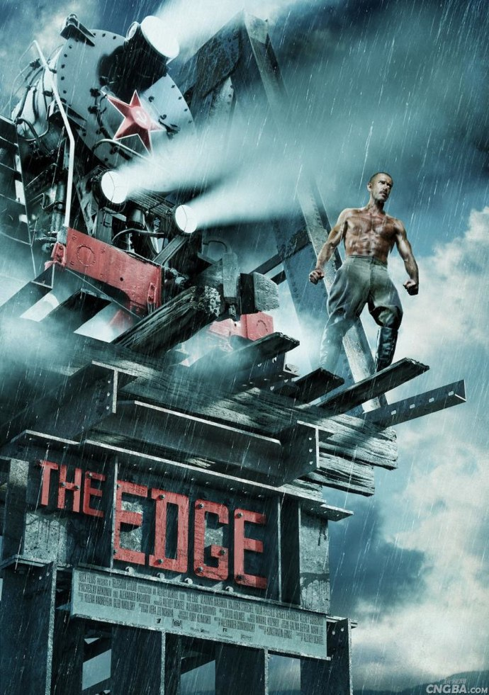
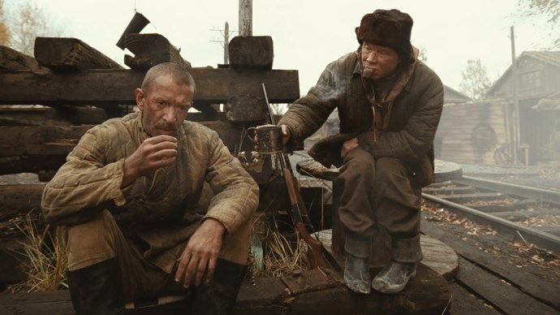
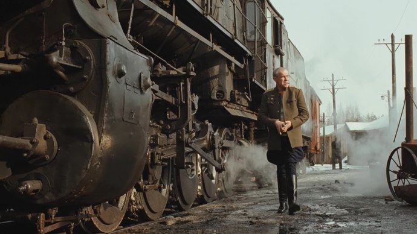

+++
titre = "The Edge, Aleksei Uchitel"
title = "The Edge, Aleksei Uchitel"
url = "/edge-uchitel"
date = "2010-12-19T00:40:29"
Lastmod = "2010-12-17T14:55:34"
cover = "kray.jpg"
categorie = [ "À voir" ]
tag = [ "Arcs 2010", "Festival", "Guerre", "Histoire", "Société", "Train" ]
createur = [ "Aleksei Uchitel" ]
annee = [ "2011" ]
weight = 2011
pays = [ "Russie" ]

+++

<a href="http://www.lesarcs-filmfest.com/2010/accueil/">

</a>

Les trains sont à la mode au cinéma. Après la version américaine avec <em><a href="http://voiretmanger.fr/2010/11/20/unstoppable-scott/">Unstoppable</a></em>, c&rsquo;est au tour des Russes de proposer un film de train avec <em>The Edge</em>. Mais là où Tony Scott en tirait un blockbuster à l&rsquo;ancienne où le train devenait le monstre destructeur, Aleksei Uchitel choisit une voie très différente, quelque part entre le récit historique et le conte fantastique, avec toutefois le même amour pour les monstres d&rsquo;acier que sont les trains. Un film riche et passionnant.

<a href="http://www.allocine.fr/film/fichefilm_gen_cfilm=187847.html">

</a>

Ignat est un héros de guerre médaillé quand il débarque dans le fin fond de la Sibérie, à l&rsquo;automne 1945. Dans une sorte de camp ouvert, l&rsquo;URSS envoie ses &laquo;&nbsp;traitres à la mère patrie&nbsp;&raquo;, notamment des Russes faits prisonniers par les Allemands au début de la guerre et qui ont besoin, selon le régime, d&rsquo;un lavage de cerveau en règle avant de pouvoir redevenir des Soviétiques à part entière. Ce n&rsquo;est pas tout à fait un <a href="http://fr.wikipedia.org/wiki/Goulag">goulag</a>, mais les conditions n&rsquo;en sont pas si éloignées : froid de la Sibérie bien sûr, travaux plus ou moins forcés, vie en communauté dans des dortoirs… Ces hommes et femmes rassemblées par le régime doivent tout simplement couper du bois dans les forêts sibériennes infinies avant de l&rsquo;envoyer vers le reste de la Russie par train. Le train est donc un élément essentiel et c&rsquo;est justement pour cela qu&rsquo;Ignat y a été envoyé. Avant d&rsquo;être un héros de guerre, il était conducteur de locomotive et pas n&rsquo;importe lequel puisque c&rsquo;est lui qui conduisait la fameuse locomotive Staline, la plus rapide jamais produite par l&rsquo;URSS. Avec cette locomotive, il a réussi à atteindre une vitesse exceptionnelle pour l&rsquo;époque. Mais la guerre ne lui a pas apporté que des médailles, Ignat souffre également régulièrement de crises qui en font un légume. C&rsquo;est pourquoi il ne peut désormais plus conduire de locomotives et n&rsquo;est plus qu&rsquo;un technicien envoyé dans le fin fond de la Sibérie, ultime punition. L&rsquo;arrivée d&rsquo;Ignat ne fait pas que des heureux : si le chef du lieu est ravi de recevoir un illustre invité, le mécanicien qui était en poste voit cette arrivée d&rsquo;un autre œil. Très vite, le conflit entre les deux hommes s&rsquo;accentue, d&rsquo;autant que la compagne du mécanicien est rapidement séduite par le nouvel arrivant, arrivant qui n&rsquo;est pas insensible aux charmes de la belle.

Le conflit entre les deux hommes est certes un conflit physique, quelques coups seront ainsi échangés au cours du film, mais le conflit change bien vite de <em>medium</em> puisque les deux hommes finissent par se battre par l&rsquo;intermédiaire de leurs locomotives. Comme chez Tony Scott, les trains sont personnifiés et deviennent des personnages à part entière dans le film. Ce principe va plus loin encore chez Aleksei Uchitel puisque les trains sont baptisés, à la manière des navires. Il y a la locomotive Stalin, une autre se nomme Gustav et les hommes crient les noms des machines, comme pour les encourager. Inévitablement, une course de locomotives a lieu dans <em>The Edge</em>, entre le mécanicien et Ignat. Les vitesses ne sont pas exceptionnelles pour aujourd&rsquo;hui, mais elles l&rsquo;étaient à l&rsquo;époque et le film parvient à les rendre trépidantes. Le film renforce encore la confrontation en jouant sur les couleurs de fumée, avec la traditionnelle opposition entre le blanc et le noir. Il est vrai que ces monstres de métal sont assez impressionnants et passent très bien au cinéma. Aleksei Uchitel est marqué manifestement par le même amour pour les trains que son collègue américain et il filme les locomotives sous tous les angles possibles, déposant le regard de la caméra sur tous leurs coins et recoins. La vapeur est encore plus impressionnante d&rsquo;ailleurs que les locomotives d&rsquo;<em>Unstoppable</em> : elle rend les machines vivantes. On a le sentiment étrange qu&rsquo;elles respirent en même temps que la vapeur sort de la cheminée, un sentiment renforcé par l&rsquo;amour avec lequel les mécaniciens les traitent. Quand Ignat frappe avec un marteau les essieux de sa locomotive, il constate ainsi qu&rsquo;elle est « vivante », non pas simplement qu&rsquo;elle fonctionne.

À l&rsquo;image de ces locomotives vivantes, <em>The Edge</em> oscille entre réalisme de la reconstitution historique et récit fantastique. À défaut de s&rsquo;inspirer d&rsquo;une histoire vraie, Aleksei Uchitel propose une reconstitution historique réaliste de la Sibérie des années 1940. Les conditions météorologiques difficiles sont bien rendues par le film, de même que les conditions de vie de ces Soviétiques mis au ban de la société pour avoir été emprisonné pendant la guerre. Des baraquements aux costumes, on croit sans peine à cette vie estivale où la neige est déjà présente, mais où on peut encore sortir sans risquer immédiatement les gelures nocives. Le film fait aussi écho de la société russe dans son ensemble, avec la menace toujours présente de l&rsquo;arrivée d&rsquo;un officier soviétique haut-gradé qui remettra de l&rsquo;ordre dans le camp. On est surpris en effet de la très grande liberté dont jouit ce camp, liberté qui est bien éloignée des clichés sur les camps soviétiques que l&rsquo;on a souvent en mémoire. Liberté effectivement vite réprimée par cet officier en question dès son arrivée : peut-on y voir un rappel des rafles staliniennes ? <em>The Edge</em> entretient en tout cas un rapport complexe à la société soviétique, mélange de réalisme et de délires ou hallucinations qui orientent au contraire le film vers le fantastique. Si <em>The Edge</em> n&rsquo;est jamais pleinement fantastique, on note quand même une orientation en ce sens : au-delà des locomotives à vapeur qui prennent vie, on peut relever le rôle récurrent de cet ours qui passe à plusieurs reprises sur la pellicule avant de devenir un trophée du camp. Et que penser de cette jeune Allemande qui survit seule pendant plusieurs années dans les forêts sibériennes ? Un des prisonniers du camp affirme ainsi qu&rsquo;elle n&rsquo;est plus vivante, qu&rsquo;elle ne peut plus être vivante même et qu&rsquo;elle serait donc une sorte de mort vivante : même si le doute n&rsquo;est pas permis, le film n&rsquo;élucide pas comment cette jeune femme a pu survivre, seule dans la forêt. Autre élément enfin qui rattache ce film au conte, le pont construit par seulement deux personnes avec quelques troncs et un bout de ficelle et qui peut soutenir le passage d&rsquo;une locomotive…

Cette tension est aussi visible à l&rsquo;écran, avec une photographie assez classique qui met particulièrement bien en valeur à la fois la force spectaculaire des machines à vapeur, et celle encore plus importante de la nature. Certains plans de forêts sont ainsi sublimes, au moins autant que les plans de nuit dans le camp où le feu joue un rôle essentiel. <em>The Edge</em> est ainsi très efficace, le film est rythmé et tend même presque au thriller par moment, tout en sachant prendre le temps de bien poser ses personnages.

La comparaison avec <em>Unstoppable</em> tient en fait plus de la boutade : <em>The Edge</em> est loin du blockbuster survitaminé que proposait Tony Scott. Aleksei Uchitel construit un film plus complexe qui multiplie les thématiques et s&rsquo;avère riche et assez passionnant. Oscillant entre réalisme historique et conte fantastique, le film fait des locomotives des êtres vivants, des personnages à part entière qui luttent en même temps que leurs conducteurs. Cette histoire de camps sibériens et la confrontation entre deux peuples (allemand et russe) ne sont finalement que le prétexte à une histoire d&rsquo;amour entre un homme et sa locomotive, redoublée d&rsquo;un amour entre cet homme et une jeune allemande.

<em>Date de sortie en salles inconnue</em>

