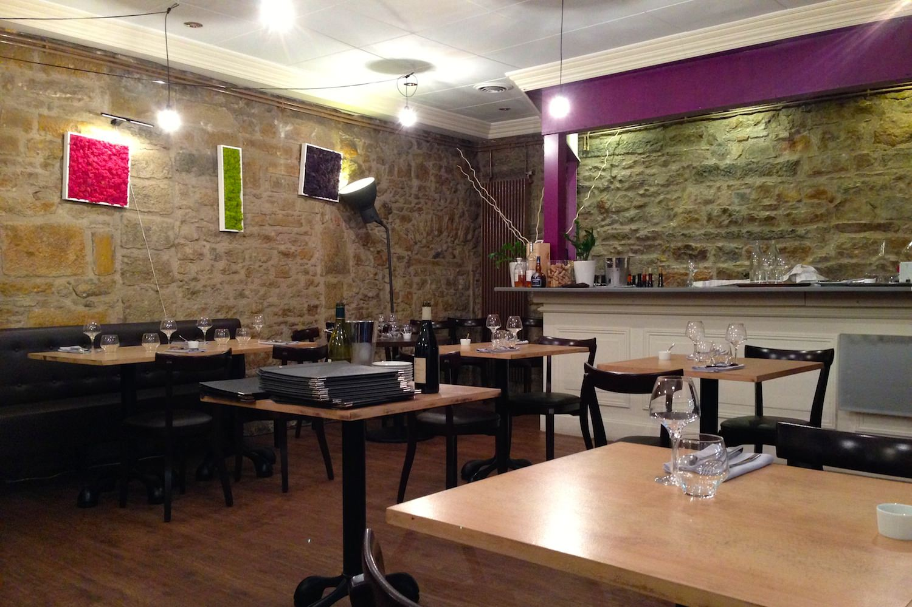
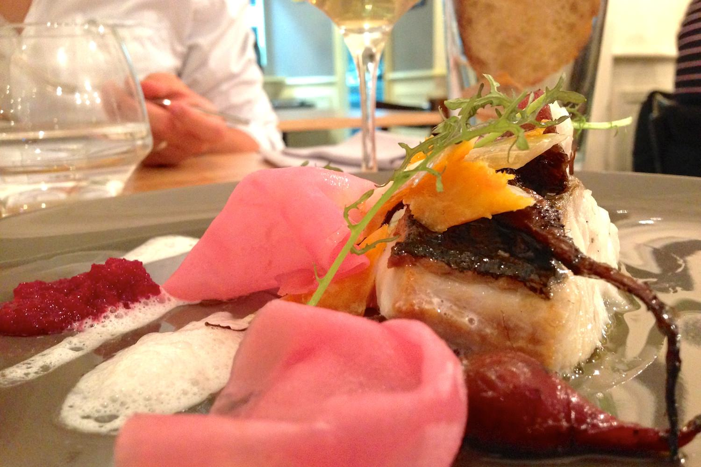
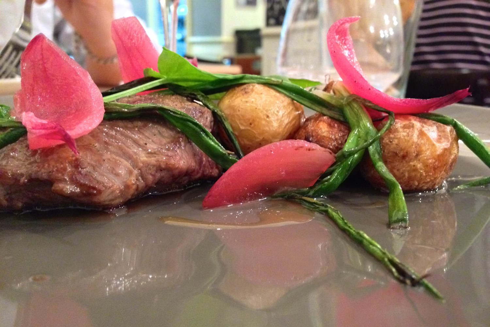
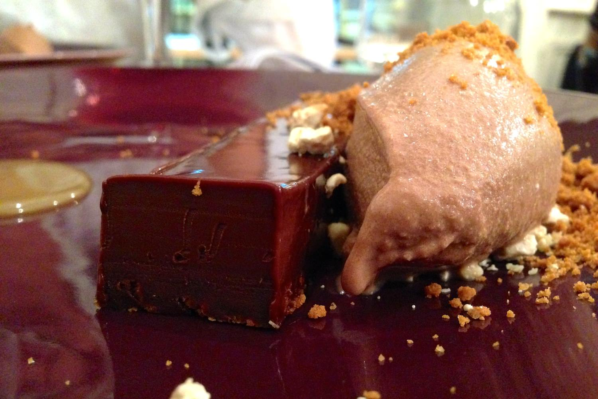

+++
titre = "L&rsquo;Effervescence à Lyon"
title = "L'Effervescence à Lyon"
url = "/effervescence-lyon"
date = "2013-09-01T00:40:24"
Lastmod = "2013-09-01T00:43:48"
cover = "l-effervescence-lyon.jpg"
categorie = [ "À manger" ]
tag = [ "Cadre original", "Cuisine française", "Menu surprise", "Une étoile Guide Michelin" ]

+++

Situé dans une petite rue parallèle aux quais du Rhône, coincé contre un parking urbain en hauteur, <a href="http://www.restaurant-effervescence.fr"><strong>L’Effervescence</strong></a> ne peut pas compter sur son cadre pour attirer du monde. De fait, sa façade sans intérêt ne donne pas vraiment envie, moins peut-être que les restaurants alentours et leurs terrasses engageantes l’été. À quelques pas de la station de métro Cordeliers, dans le deuxième arrondissement, cette adresse est pourtant étoilée par le fameux <em>Guide Michelin</em> et pour cause : si l’on n’y viendra pas pour son cadre, on y reviendra sans hésiter pour sa cuisine sophistiquée qui a su rester simple et bon marché. 

Derrière sa devanture sans grand intérêt, <strong>L’Effervescence</strong> tente une ambiance rustique, mais chic. La décoration se veut ainsi très simple et le site officiel vante même l’absence de nappes. Au plafond, de simples ampoules au bout d’un fil, c’est original et bien vu. Les tables sont en bois brut, pour une ambiance de bistrot pas désagréable, même si la décoration gagnerait à être plus cohérente : les pieds de table, quelques touches de couleur vive ou encore un peu de papier peint en forme de gouttes sont trop modernes et cassent un peu le côté rustique. Un pari assez audacieux dans un univers où les étoiles récompensent aussi un certain niveau de standing, mais un pari payant : on n’est absolument pas intimidé quand on entre dans ce restaurant étoilé, bien au contraire. L’unique serveur qui gère la petite salle n’est pas constamment sur votre dos, un bon point également. La petite vingtaine de tables accueille le double de clients environ et en ce samedi soir, le restaurant affichait complet, ou presque. On reste ainsi dans des proportions raisonnables et le niveau sonore n’atteint pas des sommets, c’est agréable. Le service est assez lent, mais ce n’est pas une critique : on prend le temps de profiter des plats, de digérer entre deux assiettes et la soirée passe paisiblement, quoique l’on apprécierait une température inférieure dans la salle sans aération ni climatisation.

« <em>Ici pas de chichi, juste la bonne cuisine, tout simplement…</em> » : tel est le crédo affiché sur le site du restaurant. Cette bonne cuisine, <strong>L’Effervescence</strong> la veut fraiche, si fraiche qu’il n’y a aucune carte établie à l’avance. Chaque jour, le chef décide du menu en fonction des produits à sa disposition et ce sera ainsi à chaque fois la surprise. Cette façon de faire est incontestablement la meilleure pour offrir de la fraicheur, c’est aussi le meilleur moyen d’être surpris à chaque fois que l’on revient manger. Les plats du jour sont toujours présents dans un menu : le midi, on peut manger deux plats pour 25 € seulement, ou la totale pour à peine 30 €. Le soir, il faut compter près de 40 € pour le menu qui comprend entrée, plat et dessert à choisir dans tous les cas parmi deux propositions à chaque fois. Si vous aimez les surprises, vous auriez toutefois tort de passer à côté de l’autre menu, dit carte blanche. Cette fois, vous aurez quatre plats — entrée, poisson, viande et dessert — sélectionnés librement par le chef. Il peut s’agir d’un élément présent dans l’autre menu et c’est le cas du dessert avec même, dans ce cas, le choix entre les deux propositions du jour. Il s’agit aussi d’autres assiettes concoctées selon les envies du chef… et selon vos goûts à définir avant le repas. Pour cinquante euros par convive (mais obligatoirement pour toute la table), c’est incontestablement la meilleure formule si on aime se laisser porter.

Ce soir-là, la <a href="http://voiretmanger.fr/wp-content/2013/09/effervescence-carte.jpg">carte du jour</a> offrait une sélection assez variée, avec à chaque fois un produit de la mer ou de la terre, du chocolat ou des fruits pour le dessert. D’emblée, on apprécie plusieurs choix de <strong>L’Effervescence</strong>. Lister simplement les ingrédients composants chaque assiette plutôt que de trouver des noms complexes et volontairement obscurs en est un. On note aussi les associations terre-mer qui sont présentes dans tous les plats : le lieu servi avec du chorizo, le porcelet avec des coques et le tartare de bœuf est accompagné de haddock. Même si c’est un peu systématique, on sent bien que le chef aime chercher des associations originales et mélanger des produits qui ne sont pas censés <em>a priori</em> se retrouver dans la même assiette. Les légumes sont à l’honneur et l’ensemble respire la légèreté, même si la gourmandise fait son grand retour avec le dernier dessert, un appétissant trio ganache, nougat et caramel. Pour accompagner cette carte, on présente une liste de vins tout aussi resserrée, mais on peut aussi faire confiance au serveur pour accompagner le menu-surprise de verres tout aussi imprévus. 

Laissant carte blanche au chef, on attaque notre repas avec la mystérieuse eau de tomates qui est aussi servie, mais sous une autre forme, au menu. Cette entrée très légère ressemble un peu à un gaspacho déstructuré : on a un bouillon froid très léger à la tomate verte et des cubes de concombres, un duo qui évoque la soupe espagnole. En plus, quelques tranches fines de radis et des moules : l’ensemble n’est pas mauvais, mais assez fade et l’équilibre des saveurs attendu n’est pas vraiment au rendez-vous. C’est une petite déception, mais <strong>L’Effervescence</strong> se rattrape vite avec le premier plat, un filet de maigre accompagné de betteraves et de haddock. Deux poissons dans l’assiette donc, mais le deuxième, très salé, fait office de condiment et relève précisément comme il faut le plat. On a aussi des tranches de betteraves, d’autres nouvelles simplement poêlées et aussi une compotée de ce même légume. L’ensemble est parfaitement équilibré, tout en douceur, un régal. Le second plat est dans ce même esprit d’équilibre : la pièce de bœuf Wagyu est moelleuse et savoureuse alors même qu’elle était légèrement trop cuite ; autour, des cébettes et des oignons marinés ajoutent juste ce qu’il faut de force à ce plat encore une fois simple en apparence, mais sophistiqué dans sa construction. Quant au dessert, il clôt un repas jusque-là assez léger par une explosion de gourmandise. Le beau morceau de chocolat noir assez corsé pourrait être écœurant, mais il est contrebalancé par un sorbet à la nougatine à la fois frais et croustillant. Le spéculoos dessus ajoute une note supplémentaire et on a aussi un caramel fudge qui vient lier le tout… un régal qui passe sans forcer.

<strong>L’Effervescence</strong> a reçu une étoile au <em>Guide Michelin</em>, certes, mais le restaurant semble mettre un point d’honneur à ne rien changer pour autant. Ses tarifs défient toute concurrence et l’adresse se paye même le luxe d’être moins cher que d’autres établissements aux alentours, tout en proposant une cuisine de meilleure qualité. Ne vous attendez pas à un service de haut standing, ce n’est pas le propos et vous serez reçu ici très simplement. En contrepartie, vous pourrez déguster des assiettes en apparence simplistes, mais qui valorisent des produits souvent bruts en les associant avec précision. Le chef de <strong>L’Effervescence</strong> n’a pas son pareil pour équilibrer ses assiettes et c’est un régal. Une adresse à tester, sans aucun doute !

