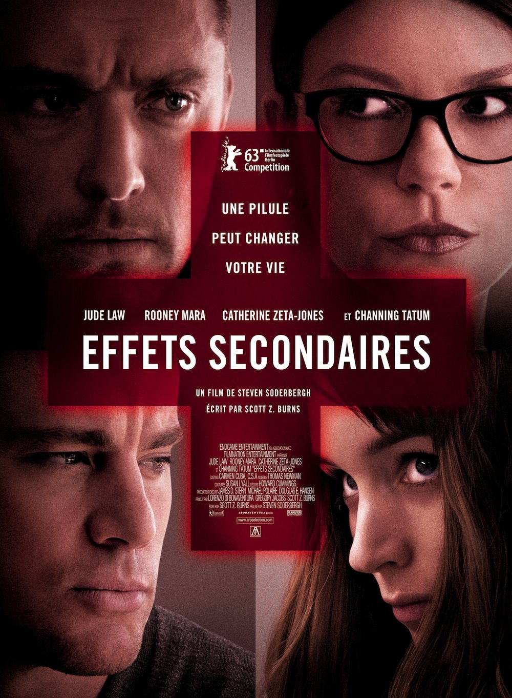

+++
type = "post"
titre = "<em>Effets secondaires</em>, Steven Soderbergh"
title = "Effets secondaires, Steven Soderbergh"
url = "/effets-secondaires-soderbergh"
date = "2013-04-03T23:49:27"
Lastmod = "2013-09-20T23:32:09"
cover = "effets-secondaires-jude-law-catherine-zeta-jones-soderbergh.jpg"
categorie = [ "À voir" ]
tag = [ "Amour", "Drame", "Drogue", "Folie", "Médecine", "Société", "Thriller" ]
createur = [ "Steven Soderbergh" ]
acteur = [ "Catherine Zeta-Jones", "Channing Tatum", "Jude Law", "Rooney Mara" ]
annee = [ "2013" ]
weight = 2013
pays = [ "États-Unis" ]
original = "Side Effects"

+++

Le très prolifique Steven Soderbergh revient à nouveau au cinéma et quelques mois après le surprenant <a href="http://voiretmanger.fr/2012/08/16/magic-mike-soderbergh/" title="Magic Mike, Steven Soderbergh - À voir et à manger"><em>Magic Mike</em></a>, il revient aussi au thriller, son genre de prédilection. <em>Effets secondaires</em> est l’histoire en apparence plus classique d’une femme dépressive qui tue son mari sous l’effet d’un médicament. Une pilule qui change sa vie comme l’indique l’affiche du long-métrage, mais c’est une histoire qui en cache une autre. La vraie force de ce petit film tout à fait plaisant, c’est son côté déroutant : Steven Soderbergh prend un malin plaisir à nous mener du bout du nez et à constamment nous faire croire que sa réalisation va dans une direction, alors que ce n’est pas le cas. <em>Effets secondaires</em> est un divertissement très réussi, à défaut d’être un grand film. 

<em>Effets secondaires</em> commence avec la sortie de prison de Martin, un <em>trader</em> qui a joué un peu trop avec le feu et qui s’est fait prendre quatre ans auparavant pour un délit d’initiés. Emily, sa femme, l’attend un peu fébrile, mais on comprend immédiatement que quelque chose ne va pas. La jeune femme devrait être heureuse, mais elle a connu une phase de dépression sévère après la condamnation de son mari, et cette phase laisse des traces. Après une tentative de suicide un peu bidon qui ressemble plus à un appel au secours qu’à un acte sérieux, elle rencontre le docteur Jonathan Banks, psychanalyste ambitieux qui s’intéresse à ce cas étonnant et commence à suivre la jeune femme. Steven Soderbergh commence avec cette base somme toute assez banale pour construire son thriller. Suivre une thérapie est chose courante aux États-Unis, comme le dit lui-même le docteur Bank qui a traversé l’océan Atlantique pour y pratiquer plutôt qu’en Grande-Bretagne. Tout le monde se fait soigner et le personnage principal d’<em>Effets secondaires</em> croise d’ailleurs sans cesse d’autres femmes qui lui recommandent tel ou tel traitement. Très vite, l’attention du film se porte en effet sur les médicaments pris par les patients des psychanalystes. Le cinéaste prend le temps de poser le décor et de montrer l’emprise de ces médicaments non seulement sur les malades, mais sur la société tout entière. Les laboratoires passent leur temps et leur argent à en inventer de nouveaux et les publicités envahissent alors la télévision et les espaces publics. Toujours offrir de la nouveauté et inciter les médecins à prescrire ces nouveautés, telles sont les deux priorités de ces riches laboratoires qui n’hésitent pas à offrir de grosses sommes aux psychanalystes qui acceptent de les aider. Le docteur Bank justement a besoin d’argent pour financer son nouvel appartement et l’école privée de son fils et il accepte de mettre en avant l’un de ces nouveaux traitements. <em>Effets secondaires</em> insiste tellement sur ces aspects que le film semble pencher de ce côté, mais c’était sans compter sur la malice du scénario. 

Mieux vaut ne pas trop en savoir sur son intrigue pour bien apprécier le dernier long-métrage de Steven Soderbergh. Disons simplement qu’<em>Effets secondaires</em> bascule autour de la mort de Martin, tué par plusieurs coups de couteau donnés par sa femme alors qu’elle coupait un poivron. Avant cela, Emily avait reçu de la part du Dr Bank un nouveau traitement qui venait juste de sortir et qui était censé être la solution miracle, sans effets secondaires aussi indésirables que les autres traitements traditionnels. Pourtant, parmi les effets envisageables, il y a l’insomnie et la jeune femme souffre d’une insomnie sévère qui pourrait expliquer que son acte ait été totalement inconscient. Si c’est le cas, le médicament doit-il être mis en cause ? Ou n’est-ce pas plutôt son psychanalyste qui n’a pas su changer de traitement à temps ? Steven Soderbergh lance toutes ces questions le temps d’un procès, avant de relancer son intrigue avec une autre idée. Et alors qu’une conclusion d’ailleurs assez décevante semble se former, coup de théâtre, <em>Effets secondaires</em> repart de plus belle sur une autre piste. Ce jeu constant d’attentes déçues fait tout l’intérêt du long-métrage qui évite ainsi d’être simpliste, sans pour autant tomber dans l’excès inverse. Steven Soderbergh mène idéalement son histoire, si bien que le spectateur n’est jamais perdu, quand bien même les intrigues s’imbriquent comme elles le font constamment ici. C’est une belle prouesse qui justifie à elle seule le succès du film. Le cinéaste bénéficie aussi d’une belle troupe d’acteurs qui jouent tous très bien leur partition qui évolue tout au long d’<em>Effets secondaires</em> entre la victime et le bourreau. C’est flagrant pour le personnage d’Emily, très justement interprétée par Rooney Mara, mais c’est aussi le cas du très juste Jude Law ou de Catherine Zeta-Jones, parfaite dans son rôle de psy manipulatrice. 

Rythmé et joliment réalisé avec sa photographie souvent très contrastée, <em>Effets secondaires</em> est un thriller réjouissant par sa capacité à toujours nous surprendre. Steven Soderbergh réalise une sorte de grand jeu qui n’oublie pas de pointer du doigt une société de procès et de thérapies médicamenteuses, mais sans jamais effacer le divertissement pur. Ce n’est certainement pas le grand film de l’année, mais c’est un bon opus chez ce cinéaste si inégal. À ne pas rater pour une agréable soirée ciné, en somme !

<h3>Vous voulez m&rsquo;aider ?<a href="#footnote_0_9052" id="identifier_0_9052" class="footnote-link footnote-identifier-link" title="&Agrave; propos de la publicit&eacute;&hellip;">1</a></h3>
<ul>
<li><a href="http://www.amazon.fr/gp/product/B00DGCFYGE/ref=as_li_ss_tl?ie=UTF8&tag=leblogdenic07-21&linkCode=as2&camp=1642&creative=19458&creativeASIN=B00DGCFYGE">Acheter le film en Blu-Ray sur Amazon</a></li>
<li><a href="http://www.amazon.fr/gp/product/B00DGCFZ5O/ref=as_li_ss_tl?ie=UTF8&tag=leblogdenic07-21&linkCode=as2&camp=1642&creative=19458&creativeASIN=B00DGCFZ5O">Acheter le film en DVD sur Amazon</a></li>
<li><a href="https://itunes.apple.com/fr/movie/effets-secondaires-vost/id677986362">Acheter ou louer le film sur l&rsquo;iTunes Store</a></li>
</ul>

<ol class="footnotes"><li id="footnote_0_9052" class="footnote"><a href="http://voiretmanger.fr/soutien/">À propos de la publicité…</a> [<a href="#identifier_0_9052" class="footnote-link footnote-back-link">&#8617;</a>]</li></ol>
