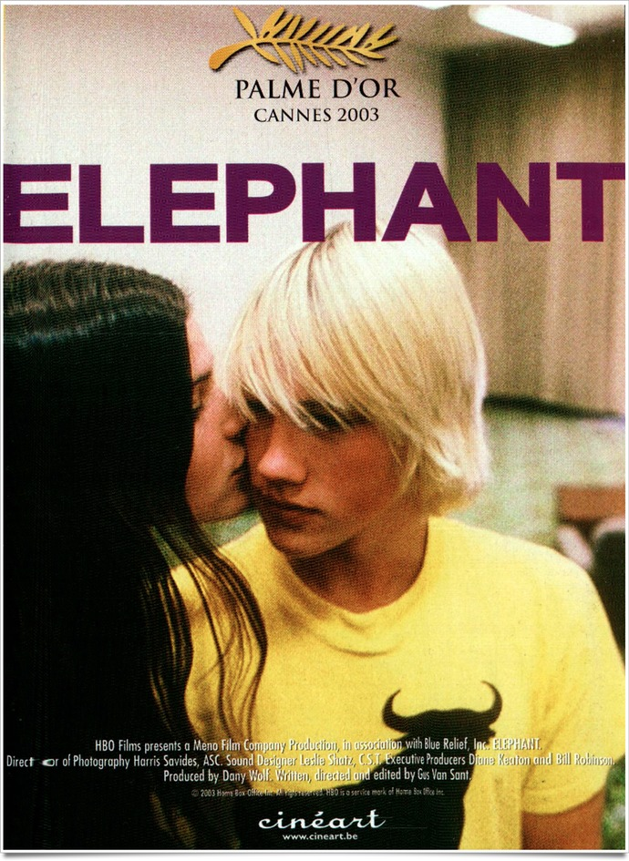
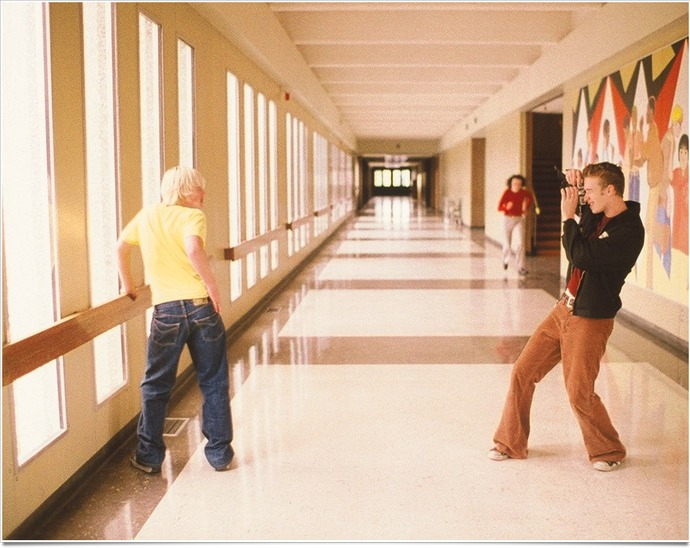
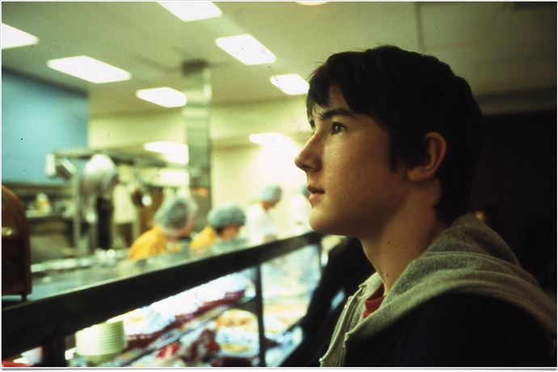

+++
titre = "<em>Elephant</em>, Gus Van Sant (Palme d&rsquo;or 2003)"
title = "Elephant, Gus Van Sant (Palme d'or 2003)"
url = "/elephant-van-sant"
date = "2011-06-06T00:40:40"
Lastmod = "2013-10-12T13:45:40"
cover = "elephant-gus-van-sant.jpg"
categorie = [ "À voir" ]
tag = [ "Adolescence", "Palme d'or", "Société", "Violence" ]
acteur = [ "Alex Frost", "Elias McConnell", "John Robinson" ]
annee = [ "2003" ]
weight = 2003
saga = [ "Palmes d'or" ]
pays = [ "États-Unis" ]

+++

Deux films se sont inspirés de la <a href="http://fr.wikipedia.org/wiki/Fusillade_du_lycée_Columbine">fusillade du lycée de Columbine</a>, en avril 1999, deux films extrêmement différents. Quand Michael Moore en tirait <em>Bowling for Columbine</em>, un documentaire satirique et un pamphlet aussi drôle qu&rsquo;efficace contre le port des armes aux États-Unis, Gus Van Sant en a fait un film d&rsquo;une beauté glaçante sur l&rsquo;adolescence américaine. Doublement primé à Cannes en 2003, <em>Elephant</em> est le deuxième film du réalisateur à se présenter comme un puzzle. S&rsquo;inspirant de la tragédie, le cinéaste ne propose pas une reconstitution réaliste, pas plus qu&rsquo;il ne propose une explication complète. <em>Elephant</em> n&rsquo;est pas une enquête, mais une plongée dans un lycée moderne aux États-Unis et un film techniquement impressionnant. Une Palme d&rsquo;or amplement méritée, à (re)voir.

Le fait divers qui a inspiré <em>Elephant</em> est connu. Un jour, deux lycéens arrivent au lycée, armés jusqu&rsquo;aux dents, et ils tirent sur tous les élèves et professeurs qui passent devant eux, sans raison, sans épargner un seul, impitoyables et froids, avant de se suicider. Le fait est connu et ce n&rsquo;est pas ce qui intéresse Gus Van Sant. Ce dernier n&rsquo;évite pas les scènes de violence, mais il les réduit au maximum, se concentrant plutôt les quelques heures qui précèdent le drame. <em>Elephant</em> suit ainsi plusieurs jeunes adolescents dans leur vie quotidienne, comme un jour lambda dans un lycée lambda. On suit les pas (littéralement) de John, blondinet insouciant qui arrive encore une fois en retard, d&rsquo;Elias qui prend encore des photos avant de les développer dans le labo du lycée, de Michelle, jeune femme complexée, de… Des jeunes qui parlent, se déplacent dans les vastes couloirs vides, mangent à la cantine… sans savoir qu&rsquo;une menace plane. Parallèlement, Eric et Alex, deux adolescents mal dans leur peau, préparent un plan pour exterminer tout le lycée. L&rsquo;un comme l&rsquo;autre se sentent persécutés et s&rsquo;ils ont des allures innocentes, ils ont une violence intérieure extrêmement marquée. Ils débarquent armés et ouvrent le feu à l&rsquo;aveugle.

Là où Michael Moore dénonçait par le ridicule le droit constitutionnel de porter des armes aux États-Unis, Gus Van Sant n&rsquo;impose pas d&rsquo;explications toutes faites. Le cinéaste se fait d&rsquo;ailleurs très discret et <em>Elephant</em> rappelle par bien des aspects le genre du documentaire. Si le film est extrêmement travaillé, notamment sur le plan du montage, il a été tourné comme on tournerait un documentaire : les acteurs ne sont pas des professionnels, mais des lycéens qui jouent en quelque sorte leur propre rôle. Les dialogues n&rsquo;ont pas été préparés à l&rsquo;avance, mais improvisés et même si les situations sont souvent provoquées, et même si certains personnages sont un peu trop typiques pour ne pas être archétypiques, <em>Elephant</em> est un film extrêmement réaliste sur l&rsquo;adolescence de la fin du XXe siècle. C&rsquo;était avant Internet et Facebook, mais les jeunes d&rsquo;alors sont proches de ceux de nos jours. Toujours les mêmes problèmes, les mêmes sujets de conversation, l&rsquo;amour naissant, le mal-être de certains, la difficulté aussi à s&rsquo;exprimer, à sortir ce mal-être… Le campus paraît néanmoins baigné d&rsquo;une insouciance assez plaisante : feuilles mortes dans les vastes parcs qui entourent les bâtiments, on voit peu de cours, mais des réunions où les élèves discutent librement de sujets comme l&rsquo;homosexualité et des lycéens qui vaquent à leurs occupations, tranquillement. Cette insouciance ne met que mieux en valeur la violence qui va suivre, violence que le cinéaste rend diffuse pendant tout son film, comme une menace inexplicable qui semble tomber sur le lycée.

Si <em>Elephant</em> ne se veut pas une critique de la société américaine et de son enseignement, si Gus Van Sant ne veut pas donner toutes les clés pour comprendre la folie meurtrière, son film donne tout de même plusieurs pistes. Ces dernières ne sont jamais explicites, elles sont toujours suggérées discrètement, ce qui les rend d&rsquo;autant plus efficaces et fortes pour les spectateurs. Les deux adolescents à l&rsquo;origine des meurtres sont isolés dans leur bulle et ils manquent d&rsquo;encadrement par le monde adulte. Ni les parents, trop souvenus absents, ni le corps enseignant, trop aveugle, n&rsquo;aident Alex et Eric alors qu&rsquo;ils en auraient bien besoin. À la place, ils passent du temps ensemble à jouer à des jeux violents et à commander des armes sur Internet. L&rsquo;un apprend difficilement la fameuse &laquo;&nbsp;Lettre à Élise&nbsp;&raquo; de Beethoven, musique romantique souvent associée aux troubles de l&rsquo;adolescence. Les deux garçons se sentent proches et incompris, ils décident alors de monter leur plan meurtrier. Dans le faisceau des raisons, Van Sant suggère une homosexualité refoulée (très belle scène de la dernière douche prise ensemble), la fascination malsaine pour le nazisme, l&rsquo;identification aux jeux vidéos violents. Au-delà de ces éléments assez évidents, le film dénonce en filigrane une société qui permet à deux mineurs de commander des armes sur Internet et qui leur permet surtout d&rsquo;entrer dans un lycée public avec ces armes, sans jamais être inquiété. Quand le massacre commence, la manque s&rsquo;empare de la majeure partie des élèves, mais aucune alarme n&rsquo;est lancée, la police n&rsquo;arrive sur les lieux que bien plus tard et manifestement rien n&rsquo;a été prévu pour un tel cas. Gus Van Sant se contente de poser sa caméra, mais <em>Elephant</em> soulève beaucoup de questions passionnantes et le film s&rsquo;avère plus politique qu&rsquo;il n&rsquo;y paraît. Le titre lui-même est d&rsquo;ailleurs une charge politique : cette fusillade est un éléphant que personne ne voulait voir.

Avec <em>Elephant</em>, Gus Van Sant poursuit un travail commencé avec <em>Gerry</em> et qu&rsquo;il poursuivra avec <em>Last Days</em>. Ces trois films sont reliés par un même rejet de la linéarité chronologique et par le même goût d&rsquo;une reconstitution sous forme de puzzle. <em>Elephant</em> est certainement le plus réussi des trois : les quelques heures qui précèdent le drame contiennent suffisamment de points de repère pour offrir au spectateur de quoi comprendre, tout en étant suffisamment désordonnées pour le déstabiliser. L&rsquo;histoire est en fait globalement chronologique, avec simplement un flashback pour les deux meurtriers : on suit autrement les mouvements de plusieurs jeunes avant le drame. <em>Elephant</em> est quasiment en temps réel et l&rsquo;effet est d&rsquo;autant plus saisissant que le cinéaste tourne en plans longs, voire en plans-séquences. La scène avec les trois adolescentes à la cafétéria en est sans doute le meilleur exemple et ce cas montre parfaitement bien l&rsquo;époustouflante maîtrise technique de Gus Van Sant. En un seul mouvement de caméra, on suit les jeunes filles, d&rsquo;abord de dos, puis de face quand elles choisissent leurs plats, avant de passer en cuisine, de revenir en salle par le biais d&rsquo;un homme qui apporte un plateau, les suivre ensuite discuter à table tout en voyant une scène à l&rsquo;extérieur, avant de les suivre aux toilettes. La caméra a rarement été aussi virtuose que dans <em>Elephant</em>, elle se pose au milieu d&rsquo;une scène et joue alors sur la profondeur des champs, ou alors elle suit de dos ou elle précède les personnages, quand elle ne tourne pas sur elle-même. <em>Elephant</em> est d&rsquo;une beauté plastique assez remarquable qui justifie totalement le prix de la mise en scène reçu en même temps que la Palme d&rsquo;or. C&rsquo;est une beauté froide teintée de menace que parvient à rendre le film par un travail approfondi sur le son. Il y a peu de musique dans <em>Elephant</em>, mais elle est annonciatrice du drame. Le travail est aussi effectué sur les bruitages : certains sont amplifiés, d&rsquo;autres au contraire étouffés. À chaque fois, c&rsquo;est le point de vue d&rsquo;un personnage qui est proposé, jamais celui du cinéaste et ce travail sur le son l&rsquo;indique à merveille.

Gus Van Sant rafle le gros lot à Cannes en 2003 avec <em>Elephant</em>, et pour cause. Son dixième film est un modèle du genre : ce puzzle chronologique offre une plongée saisissante de réalisme dans un lycée américain typique. C&rsquo;est un film techniquement parfait, visuellement splendide, mais d&rsquo;une beauté glaçante. La menace plane et elle éclate soudainement, mais ce n&rsquo;est pas vraiment la violence et le sang qui intéresse le cinéaste. Quand la fusillade éclate, le film touche à sa fin, l&rsquo;essentiel a été dit et montré. Brillant.

<h3>Vous voulez m&rsquo;aider ?<a href="#footnote_0_4886" id="identifier_0_4886" class="footnote-link footnote-identifier-link" title="&Agrave; propos de la publicit&eacute;&hellip;">1</a></h3>
<ul>
<li><a href="http://www.amazon.fr/gp/product/B00DE6NFVI/ref=as_li_ss_tl?ie=UTF8&#038;tag=leblogdenic07-21&#038;linkCode=as2&#038;camp=1642&#038;creative=19458&#038;creativeASIN=B00DE6NFVI">Acheter le film en Blu-Ray sur Amazon</a></li>
<li><a href="http://www.amazon.fr/gp/product/B000VPMQCO/ref=as_li_ss_tl?ie=UTF8&#038;tag=leblogdenic07-21&#038;linkCode=as2&#038;camp=1642&#038;creative=19458&#038;creativeASIN=B000VPMQCO">Acheter le film en DVD sur Amazon</a></li>
<li><a href="https://itunes.apple.com/fr/movie/elephant-vost/id682870980">Acheter ou louer le film sur l&rsquo;iTunes Store</a></li>
</ul>

<ol class="footnotes"><li id="footnote_0_4886" class="footnote"><a href="http://voiretmanger.fr/soutien/">À propos de la publicité…</a> [<a href="#identifier_0_4886" class="footnote-link footnote-back-link">&#8617;</a>]</li></ol>
