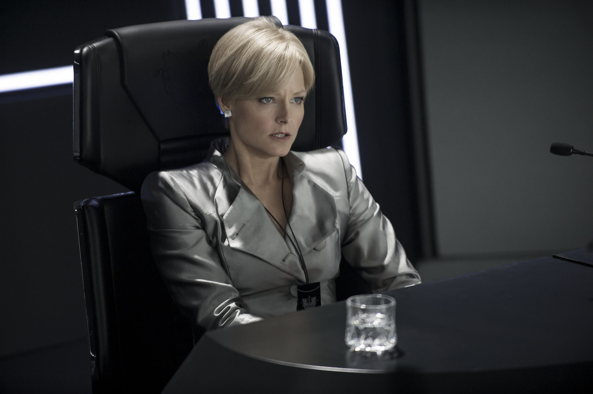

+++
type = "post"
titre = "<em>Elysium</em>, Neill Blomkamp"
title = "Elysium, Neill Blomkamp"
url = "/elysium-blomkamp"
date = "2013-08-15T20:26:31"
Lastmod = "2015-02-19T08:55:06"
cover = "elysium-neill-blomkamp.jpg"
categorie = [ "À voir" ]
tag = [ "Action", "Argent", "Blockbuster", "Dystopie", "Maladie", "Science-Fiction", "Société", "Sorties du mois", "Vite oublié" ]
createur = [ "Neill Blomkamp" ]
acteur = [ "Alice Braga", "Jodie Foster", "Matt Damon", "Sharlto Copley", "William Fichtner" ]
annee = [ "2013" ]
weight = 2013
pays = [ "États-Unis" ]

+++

En 2009, le jeune cinéaste sud-africain Neill Blomkamp créait la surprise avec <a href="http://voiretmanger.fr/district-9-neill-blomkamp/" title="District 9, Neill Blomkamp"><em>District 9</em></a>, un film de science-fiction fauché marqué par un réalisme brutal et un scénario très intéressant. Autant dire que l’on attendait avec une certaine impatience la suite de sa carrière et en premier lieu <em>Elysium</em>, son nouveau long-métrage. Cette dystopie assez classique où la Terre, surpeuplée et dévastée, est abandonnée par les plus riches annonçait le meilleur, mais le résultat est loin du compte, très loin même. Privilégiant l’action au détriment de tout le reste, le cinéaste tombe dans les clichés les plus éculés du cinéma hollywoodien et offre un spectacle souvent illisible, mais qui n’est surtout jamais crédible. Pendant près de deux heures, on assiste à une accumulation d’erreurs à tous les niveaux, si bien que cet <em>Elysium</em> ne fonctionne jamais et s’avère même plutôt agaçant. Une déception, que l’on pourra s’éviter en salles…

L’idée de départ, pourtant, était plutôt bonne, à défaut d’être extrêmement originale. Neill Blomkamp a imaginé un futur relativement proche — l’action se déroule en 2154 — où la surpopulation et la pollution ont considérablement abîmé la Terre. La planète reste vivable, mais les conditions de vie ont été considérablement dégradées, si bien que tous ceux qui en ont les moyens sont partis. Une énorme station spatiale a été installée en orbite et les plus riches s’y sont installés, loin des tracas de la surface terrestre. Sur Elysium, il fait toujours beau et il n’y a ni pauvreté, ni violence, ni maladie. Les progrès techniques aidant, on peut s’y soigner en s’allongeant quelques secondes dans une cabine qui répare tout et empêche même de vieillir. À ce cadre idyllique, <em>Elysium</em> oppose une dystopie convenue, mais qui a fait ses preuves. Sur Terre donc, l’humanité restée sur place tente de survivre comme elle peut. La pauvreté et le crime sont la norme, alors que les ordres viennent d’en haut et la répression menée par des droïdes est impitoyable. Les hôpitaux archaïques font ce qu’ils peuvent pour sauver ces milliards d’êtres humains, mais ils ne font pas des miracles, d’autant que partir dans l’espace est tout simplement impensable. Rien de tout cela n’est très original et l’amateur de science-fiction en aura déjà vu ou lu autant, mais cet univers était prometteur et Neill Blomkamp pouvait en tirer une histoire passionnante avec son personnage de Max, un Terrien qui ne rêve que de s’installer sur Elysium.

Las, <em>Elysium</em> ne fait rien de ses bonnes bases et privilégie une action brutale parfois impressionnante, mais qui bloque toute possibilité de développer un récit un tant soit peu intéressant. Neill Blomkamp aime manifestement faire des films nerveux et <em>District 9</em> se terminait lui aussi sur de l’action assez brutale. Mais ce premier long-métrage prenait le temps, avant cela, de poser son univers avec excellente idée du faux documentaire. Rien de cela ici, puisqu’on est plongé dès les premières minutes dans un monde manichéen extrêmement caricatural, où l’idée même de nuance est exclue. Le cinéaste fait tout pour opposer aussi fortement que possible les deux univers : la Terre, filmée dans des bidonvilles de Mexico, est pauvre, sale et pleine de gens violents. On y parle espagnol et la bande originale, jamais subtile, y est composée de rap ou de hard-rock, tandis que la caméra sur l’épaule est la règle. En face, <em>Elysium</em> crée une sorte d’utopie à la suisse où l’on a d’immenses villas avec piscines à perte de vue. Sans aucune subtilité, Neill Blomkamp renforce le message en faisant entendre de la musique classique — forcément… —, en utilisant des travellings depuis des vues aériennes ou encore en les faisant parler français. Le message est déjà clair, mais le scénario le renforce encore avec des personnages désespérés en bas : la fille qui se meurt d’une leucémie, le quotidien fait de vols et de prison, le patron qui ne pense qu’à la rentabilité de son usine, quitte à martyriser ses employés. On pourrait continuer la liste ainsi longtemps, tout comme on pourrait détailler les dizaines et les dizaines de clichés accumulés pour caractériser le monde des riches, mais on peut se contenter de dire que le long-métrage manque cruellement de nuances. C’est dommage, on aurait pu imaginer des questions plus intéressantes : <em>Elysium</em> ne fait rien du caractère exigu et artificiel de la station spatiale qui en fait plus une prison dorée qu’un paradis. Cet aspect n’est jamais évoqué et Neill Blomkamp ne traite pas plus tous les aspects politiques qui sont à peine esquissés. Pourquoi les personnages parlent en français sur Elysium et espagnol sur la Terre ? Pourquoi se concentrer exclusivement sur les États-Unis dans ces conditions ? Bref, il y avait de quoi faire, mais le cinéaste privilégie l’action pure et tant pis si son film perd en intérêt.

<em>Elysium</em> manque de subtilité et se complait dans une opposition caricaturale, c’est une chose. Pis, le film manque constamment de réalisme, si bien que l’on ne croit à rien de cet univers. Sur ce point, l’échec est total et cruel et on pourrait consacrer le double de cet article à évoquer en détail tout ce qui ne fonctionne pas. De manière générale, l’histoire de Max ne tient pas la route et son lien avec Frey et la fille de cette dernière est écœurant de déjà-vu. On ne dévoilera pas la fin, mais on la comprend bien en amont, dès que les personnages apparaissent dans le cours de l’histoire et on se désespère en constatant, impuissants, que Neill Blomkamp fait précisément ce qu’il ne faut pas. Jusqu’au bout, il accumule les clichés hollywoodiens et imagine des personnages si caricaturaux qu’ils deviennent des parodies ; c’est gênant dans un film aussi sérieux. Aucun personnage ne tient la route et des acteurs aussi bons que Matt Damon ou Jodie Foster ont beau faire ce qu’ils peuvent, ils ne parviennent jamais à redresser la barre. On ne croit pas une seconde à cette ministre de la Défense qui a tous les pouvoirs, mais le pire est sans doute le personnage de Kruger. Ce mercenaire interprété par Sharlto Copley qui avait déjà le premier rôle dans <em>District 9</em> est un sadique si extrême qu’il provoque de la gêne pour les scénaristes. <em>Elysium</em> donne souvent l’impression d’avoir été écrit par un gamin de dix ans et les oublis ou erreurs de cohérence se comptent par dizaine. Un exemple significatif de ces problèmes qui se multiplient : des navettes illégales se dirigent vers Elysium, elles sont abattues par des missiles, sauf l’une d’entre elles qui esquivent l’attaque. Le missile termine alors par erreur dans la station, mais le scénario l’oublie instantanément, comme si cela n’avait aucune importance. Plus tard, la station est attaquée par Max, mais les habitants d’Elysium ne répliquent pas et se contentent d’envoyer un seul homme pour les arrêter. Ce n’est pas crédible, c’est une vision simpliste qui ne tient pas la route et nuit à l’ensemble. Son précédent film était bien écrit, mais Neill Blomkamp se plante sur toute la ligne ici et ce n’est pas l’accumulation facile des flashbacks qui vient arranger quoi que ce soit.

Un ratage complet : <em>Elysium</em> était prometteur, mais le résultat est mauvais, tout simplement. Sans même critiquer le style nerveux un peu facile du cinéaste — la caméra sur l’épaule qui rend bon nombre de scènes d’action illisibles —, on ne peut accepter les incohérences dans l’univers mis en place, les personnages tellement caricaturaux qu’ils ne sont jamais crédibles, ni ce scénario qui cumule tant de clichés qu’il ferait une bonne parodie. Il y a tellement de choses qui ne fonctionnent pas dans <em>Elysium</em> que cela en devient embarrassant. Il aurait fait une bonne parodie de série B, mais le deuxième film de Neill Blomkamp est beaucoup trop ambitieux et prétentieux pour cela.

En guise de contrepoint critique, je recommande l&rsquo;<a href="http://www.filmosphere.com/movies/elysium-neill-blomkamp-2013/">avis de Nicolas</a>, enthousiaste.

<h3>Vous voulez m&rsquo;aider ?</h3>
<ul>
<li><a href="http://www.amazon.fr/gp/product/B00EJB4V8I/ref=as_li_ss_tl?ie=UTF8&#038;tag=leblogdenic07-21&#038;linkCode=as2&#038;camp=1642&#038;creative=19458&#038;creativeASIN=B00EJB4V8I">Acheter le film en Blu-Ray sur Amazon</a></li>
<li><a href="http://www.amazon.fr/gp/product/B00EJB4SY0/ref=as_li_ss_tl?ie=UTF8&#038;tag=leblogdenic07-21&#038;linkCode=as2&#038;camp=1642&#038;creative=19458&#038;creativeASIN=B00EJB4SY0">Acheter le film en DVD sur Amazon</a></li>
<li><a href="https://itunes.apple.com/fr/movie/elysium/id726686893">Acheter ou louer le film sur l&rsquo;iTunes Store</a></li>
</ul>

