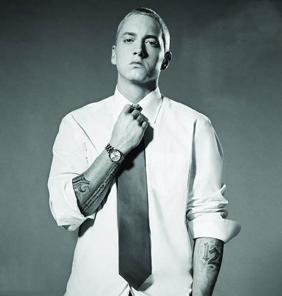
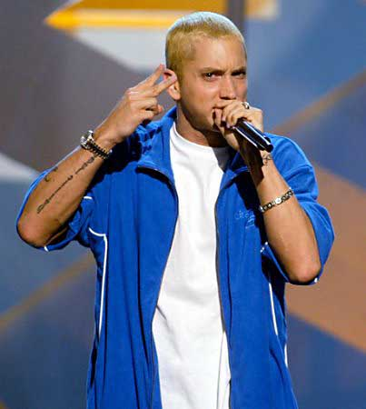
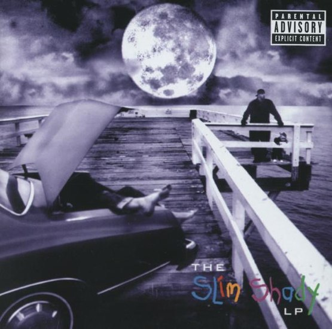
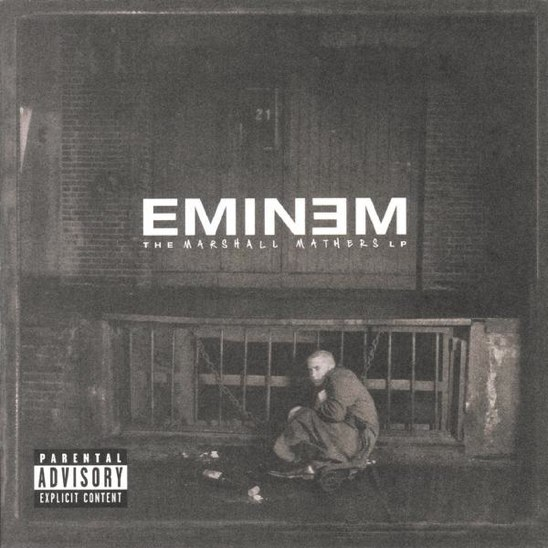
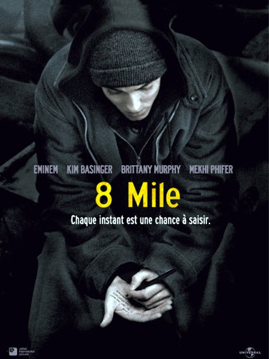
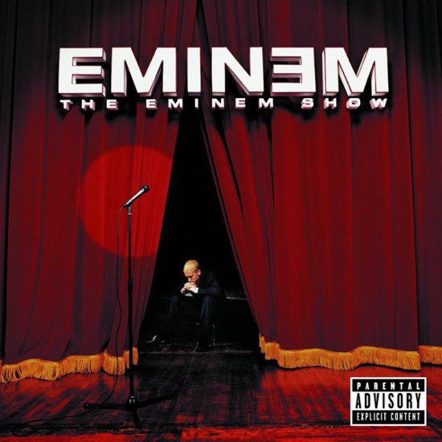
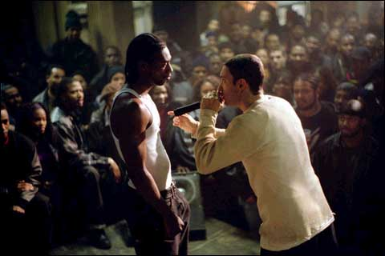
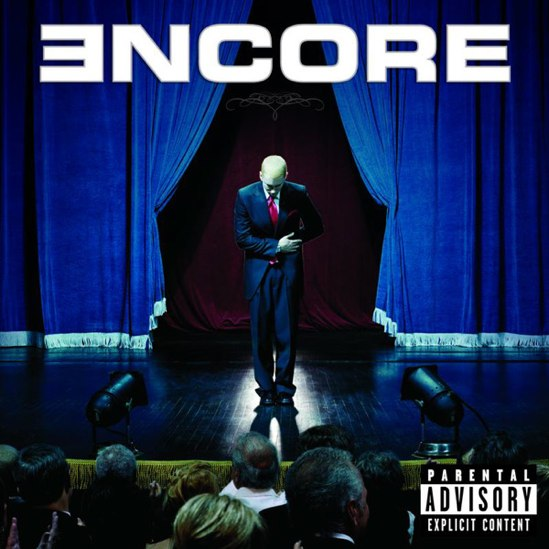

+++
type = "post"
titre = "Eminem, le maître"
title = "Eminem, le maître"
url = "/eminem-le-maitre"
date = "2009-03-01T23:33:48"
Lastmod = "2012-05-05T18:26:33"
cover = "Eminem.jpg"
categorie = [ "Musique" ]
tag = [ "Homosexualité", "Rap", "Société" ]
pays = [ "États-Unis" ]

+++

J&rsquo;attaque cette sous-série de la série sur le rap (vous suivez ?) par Eminem, maître actuel du rap américain s&rsquo;il en est. Quelques autres portraits de rappeurs devraient ensuite suivre, mais connaissant mon habitude de ne jamais faire ce que j&rsquo;annonce, je préfère ne pas trop m&rsquo;avancer.

Eminem, voilà un personnage étonnant et qui occupe une place bien particulière dans mon histoire personnelle. Longtemps, en effet, il fut à mes yeux l&rsquo;Antéchrist incarné, un horrible rappeur raciste, homophobe, misogyne&#8230; bref pas quelqu&rsquo;un de fréquentable, le symbole de tout ce que je n&rsquo;aimais pas dans le rap, voire dans la musique en général. J&rsquo;ai donc longtemps décidé de l&rsquo;ignorer royalement.

Mais ça, c&rsquo;était avant ma découverte du rap que <a href="/2009/01/28/un-an-en-musique/">j&rsquo;ai déjà eu l&rsquo;occasion de longuement évoquer</a>. Or dans cette découverte, un artiste tient une part clairement à part par la rapidité et la force avec laquelle il est entré dans mes habitudes musicales, vous l&rsquo;aurez compris, c&rsquo;est Eminem. Et après avoir écouté toute sa discographie<a href="#footnote_0_1285" id="identifier_0_1285" class="footnote-link footnote-identifier-link" title="Sauf son premier album, que j&rsquo;ignore totalement et qui ne m&rsquo;int&eacute;resse que moyennement. Donc la discographie d&rsquo;Eminem correspond &agrave; quatre albums pour le moment, du Slim Shady LP jusqu&rsquo;au Encore, sans passer par la case 8 Mile.">1</a>, le premier terme qui me vient si je devais le qualifier d&rsquo;un seul mot est &laquo;&nbsp;le maître&nbsp;&raquo;. Oui, j&rsquo;assume totalement, Eminem est un excellent rappeur et je vais essayer de convaincre quelques indécis&#8230;

<h2 id="1285_eminem-la-mauvaise-c_1">Eminem, la mauvaise conscience de l&rsquo;Amérique ?</h2>

On ne peut pas évoquer Eminem sans évoquer les multiples polémiques qui l&rsquo;entourent. Les plus fréquentes dénoncent un artiste homophobe et misogyne. On relève alors les chansons dans lesquelles il dit vouloir tuer tous les homos qu&rsquo;il rencontre, ou les multiples chansons où les femmes sont présentées comme ayant pour seule fonction de donner du plaisir, faute de quoi on est autorisé à les frapper voire les tuer.

Je ne nie pas que ces paroles existent, mais je ne comprends pas bien ce procès d&rsquo;intention que l&rsquo;on fait encore à Eminem. En écoutant ses albums, je n&rsquo;ai pas pu ne pas entendre les messages à la morale parfois douteuse, voire carrément scandaleuse. La violence y est régulièrement prônée, tandis que les mots grossiers s&rsquo;accumulent voire se bousculent dans la bouche du rappeur. Bon. Mais, ai-je envie de réponse, et alors ?

D&rsquo;une part, depuis quand doit-on prendre au sérieux des paroles de chanson ? A-t-on oublié que le rock a pratiqué depuis ses origines la chanson aux paroles bouche-trou ? Vous savez, ces paroles d&rsquo;un intérêt intellectuel proche de la notice d&rsquo;un paquet de lessive et qui n&rsquo;ont d&rsquo;autres buts que de permettre au chanteur&#8230; ben de chanter quelque chose (je suppose qu&rsquo;ils se seraient vite lassés des &laquo;&nbsp;lalalalala&nbsp;&raquo;). Je n&rsquo;ai jamais été un grand fan des mots dans la musique, de toute façon, mais je n&rsquo;ai jamais non plus craché sur des paroles intéressantes, pour moi c&rsquo;est un plus non négligeable. Or, dans le cas d&rsquo;Eminem, les paroles sont présentes pour elles-mêmes : le plus souvent immorales, elles sont aussi régulièrement drôles, parfois touchantes. Mais de toute manière, n&rsquo;oublions pas qu&rsquo;il ne s&rsquo;agit que de paroles et que cela ne devrait pas être considéré comme autre chose.

D&rsquo;autant plus qu&rsquo;Eminem est un maître dans l&rsquo;art de la manipulation. Il aime choquer, il sait qu&rsquo;il choque, il en profite et, comme il le répète à plusieurs reprises, il n&rsquo;en a rien à faire (traduction gentillette du &laquo;&nbsp;I don&rsquo;t give a fuck&nbsp;&raquo; qui scande son premier album). Évidemment, on doit y lire ici un mélange de véritable sentiment (il n&rsquo;a sans doute vraiment rien à faire de la réaction des gens) et de marketing : quoi de mieux pour vendre qu&rsquo;une polémique, et quoi de plus vendeur que la figure du <em>bad-boy</em> qu&rsquo;incarne si bien Eminem ? Au-delà de cet argument financier, je pense qu&rsquo;Eminem adore jouer avec les réactions de son public, adore nous choquer, pour le plaisir de choquer. Dès lors, l&rsquo;attaquer sur le contenu n&rsquo;a aucun sens : c&rsquo;est exactement la même chose que de répondre à un troll sur Internet, cela ne conduit qu&rsquo;à un nouveau troll ou, ici, une nouvelle chanson encore plus choquante. Notons, par ailleurs, que sa discographie s&rsquo;apaise au fur et à mesure des disques : les deux premiers s&rsquo;opposent, de fait, assez clairement aux deux derniers. Faut-il y voir une sorte de crise d&rsquo;adolescence sur le tard concernant les deux premiers ?

D&rsquo;autre part, Eminem n&rsquo;est pas idiot — il est même très intelligent — et ça n&rsquo;est jamais lui qui chante des horreurs, mais son alter ego créé sur le <em>Slim Shady LP</em>, le célèbre Slim Shady. Ce personnage imaginaire est <a href="http://fr.wikipedia.org/wiki/Eminem#La_naissance_de_Slim_Shady">décrit par l&rsquo;artiste</a> comme un &laquo;&nbsp;exutoire&nbsp;&raquo; lui permettant de s&rsquo;évader de sa triste vie d&rsquo;avant le succès, mais aussi de tout faire et de tout dire. Comme sa mauvaise conscience (explicitée dans &laquo;&nbsp;Guilty Conscience&nbsp;&raquo;), un double imaginaire et noir. Ce personnage devient, au fil des albums, une caricature que son créateur manipule à l&rsquo;envi. Il est évident que Slim Shady n&rsquo;est pas Eminem et je me demande bien comment on pourrait encore en douter (sinon, vous imaginez tous les personnages que les écrivains seraient vraiment ?). Ça n&rsquo;est pas le premier à s&rsquo;être créé un personnage de scène après tout, et ça n&rsquo;est pas parce qu&rsquo;il est rappeur que cela devrait, brusquement, poser problème.

Ce qui pose problème évidemment, c&rsquo;est qu&rsquo;Eminem est aussi maître du brouillage de piste et adore mêler à ses délires &laquo;&nbsp;slimesques&nbsp;&raquo; de vrais éléments de sa vie. Peu à peu se dessine ainsi une sorte d&rsquo;autobiographie même si on ne sait jamais où s&rsquo;arrête le délire et où commence le biographique. À cet égard, les noms deux premiers albums sont assez bien trouvés et placent l&rsquo;artiste entre son double Slim Shady et son vrai nom, Marshal Bruce Matters (<em>The Marshal Matters LP</em>), comme un symbole de ces allers et retours entre les deux. Ce flou n&rsquo;a rien de choquant à mes yeux : j&rsquo;irai même plus loin, c&rsquo;est même un des principaux intérêts de l&rsquo;artiste ! Je ne comprends pas bien pourquoi tout devrait être très clair, rien ne devrait être laissé au hasard. En littérature, le flou, le doute sont souvent jugés comme une qualité ; de même au cinéma, rien ne vaut un film un peu troublant qu&rsquo;un film qui explicite tout. Pourquoi pas dans le rap ?

Comme tous les artistes un peu sérieux, Eminem aime parler de lui, il ne fait même finalement que cela. Il faut dire qu&rsquo;il n&rsquo;a pas eu une enfance facile : père absent, mère alcoolique, racisme dans la banlieue pauvre et donc<a href="#footnote_1_1285" id="identifier_1_1285" class="footnote-link footnote-identifier-link" title="Le lien de cause &agrave; effet est malheureusement encore tr&egrave;s pr&eacute;sent aux &Eacute;tats-Unis&hellip;">2</a> noire de Detroit au point de l&rsquo;envoyer dans le coma pendant une dizaine de jours à l&rsquo;âge de 10 ans (on ne rigole pas trop avec la violence de ce côté-ci de l&rsquo;Atlantique). Bref, une enfance difficile qui explique assez aisément certains aspects de ses chansons : on comprend qu&rsquo;il s&rsquo;est construit dans un monde violent, et en répondant par la violence, même si elle était plus verbale que physique. La pochette de son second album (ci-dessous), le plus violent, est assez significative de cette vie difficile, ou au moins de l&rsquo;idée qu&rsquo;il s&rsquo;en fait. Il ne s&rsquo;agit pas, bien sûr, d&rsquo;excuser par avance tout ce qu&rsquo;il peut dire ou faire sous prétexte qu&rsquo;il a eu une enfance difficile.

Par la suite, il a eu beaucoup de mal avec sa femme : double divorce et une fille, mais surtout l&rsquo;occasion de quelques chansons violentes (voire très très violentes, &laquo;&nbsp;<a href="http://en.wikipedia.org/wiki/Kim_(song)">Kim</a>&nbsp;&raquo; atteignant des sommets dans le domaine), parfois drôles aussi (&laquo;&nbsp;97&prime; Bonnie and Clyde&nbsp;&raquo;, un sommet de son art si vous voulez mon avis) contre sa femme. Mais aussi quelques chansons émouvantes dans les derniers albums concernant sa fille (&laquo;&nbsp;Mockingbird&nbsp;&raquo; par exemple), montrant au passage qu&rsquo;il n&rsquo;est pas qu&rsquo;un mari violent (si tant est qu&rsquo;il ne le fût jamais). D&rsquo;ailleurs, on trouve aussi dans sa musique quelques aveux de faiblesse touchants, comme quand il exprime sa peur de la mort dans le premier album, ou quand il exprime des regrets à la fois à sa fille et au monde (notamment sur sa prise de conscience de l&rsquo;influence qu&rsquo;il a pu avoir sur les plus jeunes) dans les deux derniers.

Que l&rsquo;on soit choqué par les paroles du rappeur, c&rsquo;est peut-être normal, c&rsquo;est en tout cas voulu. Mais qu&rsquo;on en vienne à tous ces procès d&rsquo;intention (voire procès tout court) c&rsquo;est, je trouve, un peu fort. Je suis convaincu que s&rsquo;il n&rsquo;avait pas fait du rap, les choses auraient été différentes, comme si un rappeur ne pouvait que rester au premier degré, comme s&rsquo;il ne pouvait pas créer un univers mythique. Cela ressemble fort à un préjugé aussi léger qu&rsquo;un éléphant dans un magasin de porcelaine, et je crois que c&rsquo;est mésestimer le genre, et tout particulièrement Eminem. Dès les premières écoutes de ses albums, j&rsquo;ai senti une sorte d&rsquo;intelligence qui m&rsquo;a, le premier, étonné puisque cela ne correspondait pas à l&rsquo;image que j&rsquo;en avais, une image que je sais désormais fautive. Je le crois sincère quand il se moque, au début de &laquo;&nbsp;Criminal&nbsp;&raquo;, de ceux qui le prennent au mot et au premier degré, disant en gros qu&rsquo;il veut tuer ceux qui pensent qu&rsquo;il tue vraiment tous ceux qu&rsquo;il dit vouloir tuer dans ses chansons. Une chanson qui est, d&rsquo;ailleurs, assez brillante dans l&rsquo;auto-dérision.

Pour finir sur les polémiques, je voudrais <a href="http://www.jacksonkatz.com/eminem2.html">citer un article</a> ma foi fort intéressant, qui établit huit raisons de ne pas aimer Eminem, d&rsquo;autant plus quand l&rsquo;on est une femme ou gay (voire les deux). Cet article de Jackson Katz (un militant américain contre le sexisme masculin) date de 2002 et a été écrit peu après la sortie de <em>8 Mile</em>. Ce qu&rsquo;il dit est très intéressant et je ne peux pas écarter ses arguments d&rsquo;un revers de la main. Il dit notamment que la violence d&rsquo;Eminem désinhibe les hommes et les encourage à se comporter violemment contre les femmes, mais aussi que son succès encourage les hommes à le suivre. Il dénonce aussi un rebelle qui n&rsquo;est que marketing, sur le mode du <em>bad guy</em>, ce qui est à la fois totalement vrai et banal, je dirais. Évidemment qu&rsquo;un artiste vendant autant se construit une image, que les &laquo;&nbsp;<em>storytellers</em>&nbsp;&raquo; de tout bord se mettent au boulot. C&rsquo;est, malheureusement peut-être, la routine.

Plus intéressant encore, il démonte en gros tous mes arguments (l&rsquo;humour, le fait que ça ne soit pas lui, mais Slim Shady qui parle) un à un et je dois dire qu&rsquo;il est assez efficace à plusieurs reprises. Notamment, son point 7 est, je trouve, plutôt convaincant. Néanmoins, je trouve vraiment que c&rsquo;est donner beaucoup de crédit à un artiste, aussi talentueux fût-il, que de penser qu&rsquo;il influence ainsi toute sa génération aveuglément. Par ailleurs, je n&rsquo;aime pas l&rsquo;argument de l&rsquo;influence sur les jeunes que l&rsquo;on retrouve régulièrement pour les jeux : je ne vois pas en quoi, sous prétexte que des enfants n&rsquo;ont pas le recul nécessaire pour comprendre le second degré, on devrait en rester au premier et interdire des œuvres violentes. Le problème ne devrait pas être les œuvres violentes, mais l&rsquo;absence d&rsquo;éducation aux œuvres violentes et m&rsquo;est avis que plutôt que d&rsquo;attaquer un artiste, on devrait d&rsquo;abord chercher du côté des parents.

Eminem a répondu, en quelque sorte, à quelques-unes de ces critiques puisque ses derniers albums se sont calmés et expriment même clairement la conscience d&rsquo;une influence potentiellement néfaste auprès des enfants (et pas seulement). Malgré tout, je revendique le droit d&rsquo;écouter les deux premiers et d&rsquo;apprécier des chansons appelant au meurtre, déjà par principe (au moins tant que l&rsquo;appel n&rsquo;est pas un vrai qui tomberait sous le coup de la justice), mais aussi parce qu&rsquo;Eminem fait de l&rsquo;excellent rap, quelles que soient ses idées par ailleurs.

<h2 id="1285_eminem-un-artiste-ta_1">Eminem, un artiste talentueux</h2>

J&rsquo;ai assez évoqué les polémiques sur les idées d&rsquo;Eminem, passons maintenant vraiment à sa musique. Certes, le rap est encore assez peu connu de moi, j&rsquo;ai de grosses lacunes dans certains de ses aspects et notamment son histoire. J&rsquo;en ai néanmoins entendu suffisamment pour savoir qu&rsquo;Eminem est un artiste un peu à part, qui a sans aucun doute profondément changé la scène rap. Pour reprendre une formule un peu galvaudée, il y eut un avant et un après Eminem.

Je crois que son talent tient d&rsquo;abord dans ses textes, à la fois pour son écriture et son &laquo;&nbsp;<em><a href="http://en.wikipedia.org/wiki/Flow_(rapping)#Flow">flow</a></em>&nbsp;&raquo; comme on dit dans le milieu. Pour peu que l&rsquo;on prête une oreille attentive au monsieur, on remarque une écriture très fluide et une maîtrise de la langue assez impressionnante. Je ne pensais pas dire cela un jour, mais je vais le faire : Eminem est un véritable poète. Certes, il ne s&rsquo;agit pas de poésie à la française, mais bien plus de poésie à l&rsquo;anglaise où les sons prennent toute leur place et où le rythme compte plus que le nombre de syllabes. Or Eminem n&rsquo;a pas son pareil pour jouer des assonances et allitérations dans les phrases, offrant à l&rsquo;oreille des phrases agréables à entendre et que l&rsquo;on aimerait prononcer aussi bien que lui (surtout quand on a un accent pourri, mais je ferme la parenthèse personnelle).

Par ailleurs, son écriture contient une énergie parfois débordante et très poétique, comme si, à la manière des poètes et leurs muses, il y avait une urgence de l&rsquo;écriture. On sent, souvent, l&rsquo;exutoire de l&rsquo;écrit, en plus du plaisir des mots que je pense réel chez Eminem. Je ne sais pas s&rsquo;il aurait fait un bon khâgneux, mais à une époque où l&rsquo;on se plaint de la perte des langues, voilà un bon contre-exemple, d&rsquo;autant que le rap est souvent associé à cette perte. Moi qui, d&rsquo;habitude, ne prête pas attention aux mots de la musique, voilà que je me suis surpris à plusieurs reprises à décrypter les paroles, rien que pour ce plaisir des mots.

Bon, mais il n&rsquo;y a pas que des mots dans les albums d&rsquo;Eminem. Sur le plan plus musical, Eminem reste plus dans les limites traditionnelles et ne va pas, comme Kanye West par exemple, dans des champs musicaux atypiques pour le rap. Néanmoins, la partie purement musicale remplit, ici, parfaitement son rôle qui est, dans le rap, d&rsquo;accompagner la voix. Évidemment, les extraits audio (les fameux &laquo;&nbsp;samples&nbsp;&raquo;) sont continuellement présents, souvent bien trouvés d&rsquo;ailleurs.

Plus intéressant (original ?), les quatre albums que j&rsquo;ai écouté (donc ni le premier, ni la BO d&rsquo;<em>8 Mile</em>) dialoguent en permanence entre eux, comme si Eminem refaisait toujours la même chose ce qui, après tout, est le lot des génies. Entre les albums, on retrouve des personnages : Slim Shady évidemment, mais aussi Paul, ou encore Ken Kannif. J&rsquo;emploie &laquo;&nbsp;personnages&nbsp;&raquo; à dessein puisque la musique d&rsquo;Eminem a quelque chose d&rsquo;assez théâtral et à cet égard, le choix des pochettes des deux derniers albums (un rideau de scène) est très significatif. Ces deux albums commencent et se terminent d&rsquo;ailleurs de la même façon, sur un &laquo;&nbsp;<em>Curtains Up</em>&laquo;&nbsp;/&nbsp;&raquo;<em>Curtains Down</em>&nbsp;&raquo; (lever/fermeture de rideau) et fonctionnent, un peu, comme des concepts albums. Les différents &laquo;&nbsp;<em>skits</em>&nbsp;&raquo; (courts morceaux, en général uniquement parlés, qui introduisent ou concluent une chanson) qui ponctuent les albums joueraient alors le rôle d&rsquo;entractes. Cette théâtralité est néanmoins présente dès le premier album, où une voix off introduit les morceaux, voire les commentent, créant un véritable film (c&rsquo;est flagrant sur &laquo;&nbsp;Bad Meets Evil&nbsp;&raquo;). La fin d&rsquo;<em>Encore</em> simule un &laquo;&nbsp;suicide&nbsp;&raquo; collectif où Slim Shady tue toute la salle avant de se tuer, symbole d&rsquo;une mise à mort que l&rsquo;on sait temporaire depuis la sortie du nouveau single, mais qui fait sens dans cette logique du théâtre.

Mais les liens entre les albums vont plus loin et sont souvent encore plus directs puisque, tout simplement, Eminem cite ses précédents albums par des samples internes si j&rsquo;ose dire. Ainsi, le &laquo;&nbsp;<em>I&rsquo;m just playin&rsquo; American, you know I love you</em>&nbsp;&raquo; à la fin de &laquo;&nbsp;White America&nbsp;&raquo; (sur <em>The Eminem Show</em>) est une citation explicite du précédent album (<em>The Marshall Mathers LP</em>, dans &laquo;&nbsp;Kill You&nbsp;&raquo;) au détail près qu&rsquo;il s&rsquo;adressait alors aux femmes. Par le biais de ces références internes, l&rsquo;œuvre se conçoit comme un tout qui fait sens et je pense que c&rsquo;est bien la première fois que j&rsquo;entends ça, ou plutôt que je le remarque (ça doit exister ailleurs).

Si la discographie fonctionne comme un tout, j&rsquo;ai déjà eu l&rsquo;occasion de l&rsquo;évoquer, il s&rsquo;agit en fait d&rsquo;un diptyque : le second répond au premier, tandis que le quatrième est le compagnon du troisième. Entre chaque groupe d&rsquo;albums, le ton change, Eminem perd peut-être un peu de son génie. C&rsquo;est, en tout cas, la critique faite le plus souvent contre le dernier album : pour ma part, ayant découvert l&rsquo;artiste avec celui-ci et le précédent, cela me semble un peu incongru. Il est vrai, néanmoins, que les deux premiers ont une force que les deux derniers n&rsquo;ont pas. Peut-être, aussi, que les premiers ont vraiment frappé les auditeurs à l&rsquo;époque, par leur nouveauté. Et puis on est toujours déçu quand on attend beaucoup d&rsquo;un artiste, Eminem ne fait pas exception à cette règle.

Toujours est-il que d&rsquo;aucuns s&rsquo;inquiètent, aujourd&rsquo;hui, de savoir si Eminem n&rsquo;aurait pas mieux fait de prendre sa retraite. Rappelons qu&rsquo;un nouvel album est prévu pour cette année, et qu&rsquo;un single est sorti récemment, avec les habitués (50 Cent et Dr. Dre). Je l&rsquo;ai écouté, et n&rsquo;ai pas été déçu même si, effectivement, à première écoute, on est en terrain connu. Le risque serait qu&rsquo;Eminem se caricature lui-même en ne prenant aucun risque. Dans le domaine de l&rsquo;innovation, la relève est sans doute déjà là avec quelqu&rsquo;un comme Kanye West, mais je trouve qu&rsquo;Eminem a de beaux restes.

Quelle que soit la qualité du prochain album, la discographie d&rsquo;Eminem est définitivement à découvrir. Je n&rsquo;hésite pas à dire que c&rsquo;est l&rsquo;un des meilleurs artistes, tous genres confondus, de ce début de XXIe siècle ! Certes, certaines de ses chansons ne sont pas politiquement correctes. Mais par les temps qui courent, j&rsquo;ai tendance à trouver que c&rsquo;est un compliment plutôt qu&rsquo;un défaut : la liberté d&rsquo;expression, c&rsquo;est aussi ça. Et puis, encore une fois, Eminem n&rsquo;est qu&rsquo;un artiste, pas un homme politique et il n&rsquo;est pas forcément conseillé de prendre au premier degré tout ce qu&rsquo;un artiste produit (sinon, on serait plutôt ennuyé avec certaines œuvres d&rsquo;art moderne&#8230;).

<h3>Vous voulez m&rsquo;aider ?<a href="#footnote_2_1285" id="identifier_2_1285" class="footnote-link footnote-identifier-link" title="&Agrave; propos de la publicit&eacute;&hellip;">3</a></h3>
<ul>
<li><a href="http://www.amazon.fr/gp/entity/Eminem/B000APFS8Y/?ie=UTF8&tag=leblogdenic07-21&linkCode=ur2&qid=1336235052&camp=1642&sr=1-2-ent&creative=19458">Tout Eminem sur Amazon</a></li>
<li><a href="http://itunes.apple.com/fr/artist/eminem/id111051">Toute la discographie d&rsquo;Eminem sur l&rsquo;iTunes Store</a></li>
</ul>

<ol class="footnotes"><li id="footnote_0_1285" class="footnote">Sauf son premier album, que j&rsquo;ignore totalement et qui ne m&rsquo;intéresse que moyennement. Donc la discographie d&rsquo;Eminem correspond à quatre albums pour le moment, du <em>Slim Shady LP</em> jusqu&rsquo;au <em>Encore</em>, sans passer par la case <em>8 Mile</em>. [<a href="#identifier_0_1285" class="footnote-link footnote-back-link">&#8617;</a>]</li><li id="footnote_1_1285" class="footnote">Le lien de cause à effet est malheureusement encore très présent aux États-Unis&#8230; [<a href="#identifier_1_1285" class="footnote-link footnote-back-link">&#8617;</a>]</li><li id="footnote_2_1285" class="footnote"><a href="/a-propos/publicite/">À propos de la publicité…</a> [<a href="#identifier_2_1285" class="footnote-link footnote-back-link">&#8617;</a>]</li></ol>
