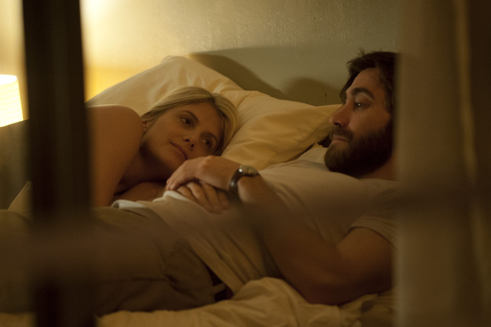

+++
type = "post"
titre = "<em>Enemy</em>, Denis Villeneuve"
title = "Enemy, Denis Villeneuve"
url = "/enemy-villeneuve"
date = "2014-08-30T23:00:02"
Lastmod = "2015-02-27T22:18:57"
cover = "enemy-jake-gyllenhaal.jpg"
categorie = [ "À voir" ]
tag = [ "Adaptation littéraire", "Ambiance", "Amour", "Fantastique", "Puzzle", "Sorties du mois", "Thriller" ]
createur = [ "Denis Villeneuve" ]
acteur = [ "Jake Gyllenhaal", "Mélanie Laurent", "Sarah Gadon" ]
annee = [ "2014" ]
weight = 2014
pays = [ "Canada", "Espagne" ]

+++

Moins d&rsquo;un an après le très réussi <a href="/prisoners-villeneuve/" title="Prisoners, Denis Villeneuve"><em>Prisoners</em></a>, Denis Villeneuve sort un nouveau film extrêmement différent. Alors que le précédent était long et riche, <em>Enemy</em> est court — 1h30 — et resserré autour d&rsquo;une idée en apparence assez simple. Mais que l&rsquo;on ne s&rsquo;y trompe pas : comme l&rsquo;affiche l&rsquo;indique d&rsquo;entrée de jeu, cette simplicité est un piège. Ce nouveau long-métrage est tout aussi complexe que son prédécesseur, et même sans doute plus. <em>Enemy</em> est une œuvre énigmatique, qui peut s&rsquo;expliquer, mais qui peut aussi être prise sans la moindre explication selon votre humeur. Quoi qu&rsquo;il en soit, le dernier film de Denis Villeneuve est une réussite, un long-métrage prenant qu&rsquo;il vaut mieux découvrir sans rien avoir lu à son sujet.

<em>Enemy</em> se construit autour d&rsquo;une idée finalement assez simple, à défaut d&rsquo;être banale : Adam est un professeur d&rsquo;histoire sans histoire, du moins jusqu&rsquo;au jour où il fait une découverte étonnante. Lui qui ne regarde jamais de film se fait conseiller une mystérieuse comédie, qu&rsquo;il décide de louer et qu&rsquo;il regarde dans la foulée. Le film est assez mauvais, mais au milieu il reconnaît un acteur qui lui ressemble à deux gouttes d&rsquo;eau. C&rsquo;est un clone parfait, même un double, et cette découverte le trouble énormément, comme on se doute bien. Il décide d&rsquo;enquêter sur son double, puis le contacte même directement, bien décidé à le rencontrer. Sauf que son double n&rsquo;a pas forcément envie de voir cet homme qui ressemble à une copie parfaite et qui menace son couple. Jusque-là, <em>Enemy</em> est un film assez simple à comprendre, sur la base d&rsquo;un postulat fantastique étonnant, c&rsquo;est vrai, mais que l&rsquo;on peut naturellement accepter. Dès les premières images, Denis Villeneuve parvient à créer une ambiance inquiétante, avec une photographie très jaune, presque sépia, et un épais brouillard sur tous les plans de la ville. Le cinéaste exploite aussi beaucoup la <a href="http://www.amazon.fr/gp/product/B00HZMRY32/ref=as_li_ss_tl?ie=UTF8&amp;tag=leblogdenic07-21&amp;linkCode=as2&amp;camp=1642&amp;creative=19458&amp;creativeASIN=B00HZMRY32">bande originale</a> composée par Danny Bensi et Saunder Jurriaans, une musique elle aussi anxiogène parfaitement dosée pour créer une ambiance anxiogène à souhait. <em>Prisoners</em> était déjà un très bon film d&rsquo;ambiance, mais celui-ci met la barre encore un petit peu plus haut, et s&rsquo;il ne fallait qu&rsquo;une raison de le voir, ce serait pour cette ambiance poisseuse.

Difficile de parler d&rsquo;<em>Enemy</em> sans trop en dire et, encore une fois, mieux vaut ne rien lire à son sujet avant de le voir. Après l&rsquo;avoir vu, il y a de forte chance que vous ne sachiez pas quoi en penser, et c&rsquo;est assez normal. Le dernier film de Denis Villeneuve fait partie de ces œuvres qui conservent une part de mystère, et peut-être même qui doivent la conserver. Que viennent faire ces araignées qui ouvrent et ferment le long-métrage ? Doit-on les expliquer de manière logique, ou se résigner à considérer que l&rsquo;on est dans la même veine fantastique qu&rsquo;un conte d&rsquo;Edgar Allan Poe ou de Théophile Gauthier ? Pourtant, le spectateur attentif ne manquera pas de remarquer les indices disséminés par le cinéaste tout au long du film. Il y a ce cours, au début, répété deux fois à l&rsquo;identique. Il y a les similitudes inexplicables, comme la cicatrice au même endroit. Il y a aussi les doutes sur la fidélité du mari, les faux-noms, des lunettes qui ne devraient pas se retrouver à un endroit, la mère qui pose la bonne question… <em>Enemy</em> n&rsquo;est incompréhensible, loin de là, mais il est présenté de façon déstructurée, comme un puzzle que le spectateur peut, s&rsquo;il le souhaite, reconstituer. Tous les éléments sont là, mais ils ne sont pas donnés dans le bon ordre et si on les organise de manière plus logique, on peut éclairer l&rsquo;ensemble de l&rsquo;œuvre sous un nouveau jour. Est-ce seulement nécessaire ? C&rsquo;est là, sans doute, la grande réussite du long-métrage : Denis Villeneuve ne nous impose rien, il fait confiance en notre intelligence de spectateur et nous laisse le soin de juger son travail. Et même si on choisit la voie de la raison, il reste des zones d&rsquo;ombre difficiles, voire impossibles, à expliquer…

Quel que soit le sens que l&rsquo;on veut bien donner à <em>Enemy</em>, le film mérite d&rsquo;être vu ne serait-ce que pour son ambiance exceptionnelle, mais aussi pour son acteur principal. Dans ce rôle étrange de double personnalité, Jake Gyllenhaal est parfait pour proposer deux variantes suffisamment différentes pour qu&rsquo;on les distingue instantanément, mais en même temps suffisamment proches pour semer le trouble. C&rsquo;est la force du dernier long-métrage de Denis Villeneuve : quoi qu&rsquo;on en pense, il ne laisse personne indifférent et troublera probablement tous les spectateurs. <em>Enemy</em> est déroutant, et c&rsquo;est précisément pourquoi il est réussi : à voir, si vous aimez être bousculé.

<h3>Vous voulez <a href="/soutien/">m&rsquo;aider</a> ?</h3>
<ul>
<li><a href="http://www.amazon.fr/gp/product/B00OGQUB0S/ref=as_li_ss_tl?ie=UTF8&amp;tag=leblogdenic07-21&amp;linkCode=as2&amp;camp=1642&amp;creative=19458&amp;creativeASIN=B00OGQUB0S">Acheter le film en Blu-ray sur Amazon</a></li>
<li><a href="http://www.amazon.fr/gp/product/B00OGQUB2G/ref=as_li_ss_tl?ie=UTF8&amp;tag=leblogdenic07-21&amp;linkCode=as2&amp;camp=1642&amp;creative=19458&amp;creativeASIN=B00OGQUB2G">Acheter le film en DVD sur Amazon</a></li>
<li><a href="https://itunes.apple.com/fr/movie/enemy/id942867167">Acheter ou louer le film sur l&rsquo;iTunes Store</a></li>
</ul>

