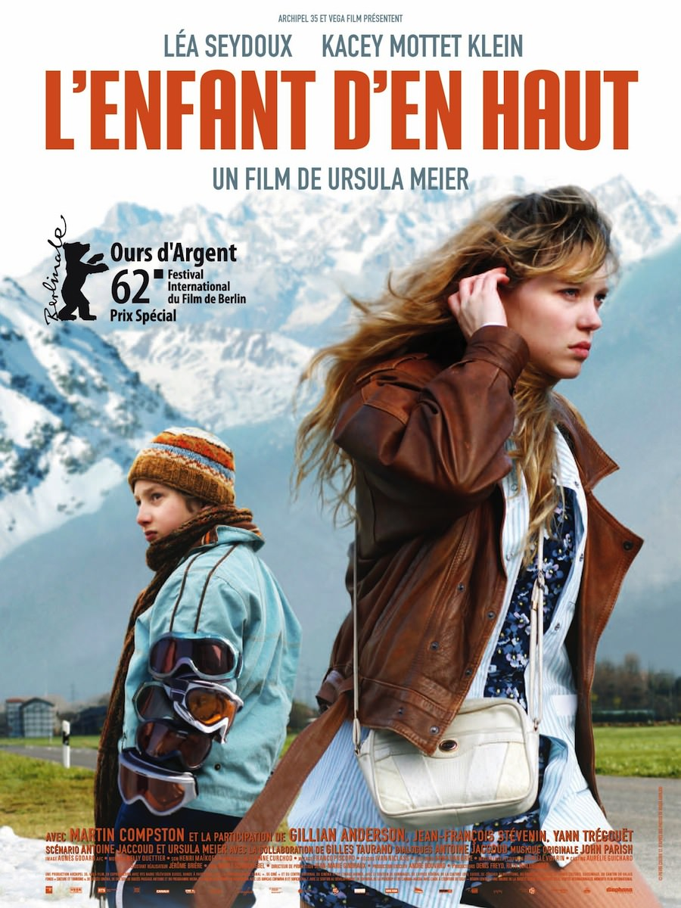
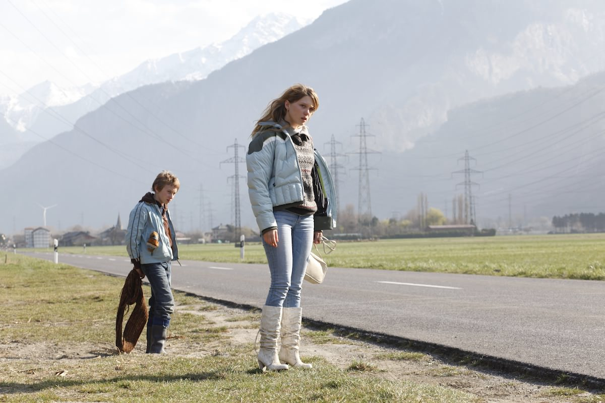
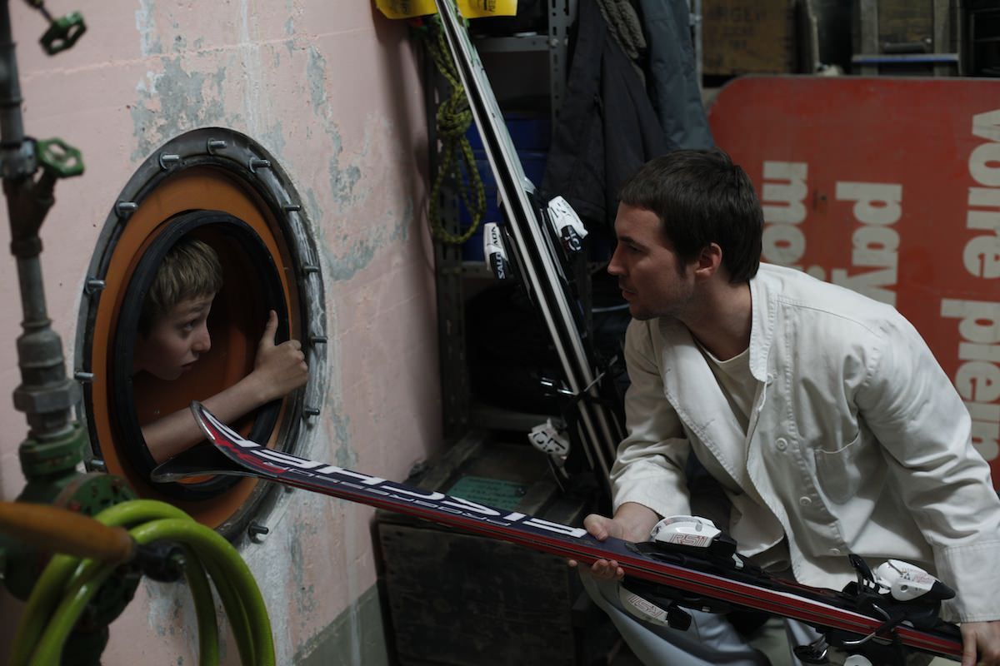
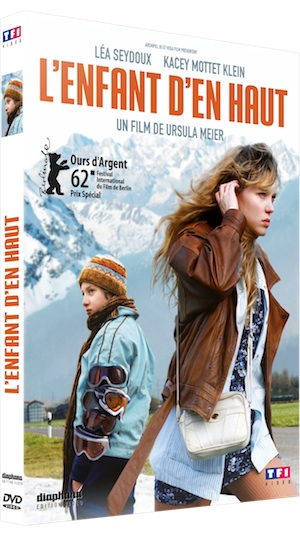

+++
type = "post"
titre = "L&rsquo;enfant d&rsquo;en haut, Ursula Meier"
title = "L'enfant d'en haut, Ursula Meier"
url = "/enfant-haut-meier"
date = "2012-08-06T10:19:03"
Lastmod = "2012-08-09T22:20:39"
cover = "enfant-haut-meier-kacey-mottet-klein.jpg"
categorie = [ "À voir" ]
tag = [ "Drame", "Famille", "Société", "Tourisme" ]
createur = [ "Ursula Meier" ]
acteur = [ "Kacey Mottet Klein", "Léa Seydoux" ]
annee = [ "2012" ]
weight = 2012
pays = [ "France", "Suisse" ]

+++

<em>L&rsquo;enfant d&rsquo;en haut</em> est un drame social qui intrigue dès l&rsquo;annonce de son sujet, l&rsquo;histoire d&rsquo;un jeune garçon de 12 ans qui vit en volant les riches vacanciers d&rsquo;une station de ski. Trompant le déjà vu et le cliché, Ursula Meier impose à son film un rythme et une ambiance à part, pour un résultat passionnant.

Simon a 12 ans, mais il est déjà particulièrement dégourdi pour son âge. Il faut dire que la vie ne l&rsquo;a pas épargné : Simon vit seul avec sa sœur ainée, Louise. Ils sont orphelins, leurs deux parents sont morts dans un accident de voiture et il n&rsquo;ont apparemment aucune autre famille qu&rsquo;eux-mêmes. Louise est en âge de travailler, mais elle n&rsquo;est guère motivée et elle travaille de temps en temps, quand elle en a envie… quasiment jamais donc. Pour manger et survivre, c&rsquo;est donc Simon qui doit s&rsquo;y coller : le jeune garçon ne travaille pas vraiment, mais il monte tous les jours à la grosse station de ski qui est située au-dessus de leur tour, dans le fond de la vallée. En pleine saison, la station est pleine de riches touristes et le garçon se sert : skis, gants, lunettes, mais aussi sandwichs qui leur permettent de manger. Le matériel, il le vend pour trois fois rien aux habitants de son immeuble, souvent à peine plus riches que lui. Cette combine lui rapporte largement de quoi vivre, mais une station de sports d&rsquo;hiver est un univers petit et fermé et ses chapardages incessants finissent par se voir…

Ursula Meier ouvre son film avec ce qui constitue le quotidien de son personnage principal. Simon enfile plusieurs vêtements sur lui pour rester discret, il pioche dans un vestiaire ici une paire de gants, là des lunettes de protection. Dans un sac resté ouvert, il prend deux sandwichs. Dans une poche, un billet ou un peu de monnaie. À l&rsquo;extérieur, il trouve une paire de skis toute neuve qu&rsquo;il embarque avec lui, au milieu des touristes trop occupés à profiter du beau temps et de la qualité de la poudreuse. Il redescend ensuite dans la vallée par les cabines du téléphérique, avant de se changer en bas pour redevenir Simon, le jeune garçon de 12 ans. <em>L&rsquo;enfant d&rsquo;en haut</em> évite les longues et pénibles explications et se contente de montrer un processus que l&rsquo;on imagine répété tous les jours depuis des mois, voire des années. Comme la cinéaste, on ne peut qu&rsquo;être fasciné par ce garçon qui n&rsquo;a pas froid aux yeux. Au départ, on ne sait rien de lui, mais son air triste et déterminé à la fois en dit beaucoup. Simon a l&rsquo;habitude de voler et il se débrouille plutôt bien : qui se soucierait de ce garçon parmi des centaines de touristes ? Dans la vallée, il traine son butin du jour sur une luge, avant de le vendre au milieu de quelques dizaines d&rsquo;enfants pas plus âgés que lui. Le héros de <em>L&rsquo;enfant d&rsquo;en haut</em> s&rsquo;apparente alors à une sorte de Robin des bois de la montagne, mais les gens de la station ne sont évidemment pas de cet avis. 

Si le personnage principal fascine dans <em>L&rsquo;enfant d&rsquo;en haut</em>, c&rsquo;est aussi à cause de sa relation avec sa sœur. Louise et Simon vivent ensemble, mais ils ne forment pas une famille très soudée. Elle n&rsquo;arrête pas de critiquer son frère, le qualifiant même de &laquo;&nbsp;boulet&nbsp;&raquo; quand le garçon fait fuir son petit ami du moment. Louise a pourtant besoin de Simon : c&rsquo;est lui qui apporte l&rsquo;argent nécessaire au foyer, c&rsquo;est même lui qui apporte la nourriture en volant des sandwichs dans la station. Ursula Meier a un regard très juste sur ce couple étonnant où l&rsquo;amour semble avoir totalement disparu. Le jeune garçon aimerait se rapprocher de sa sœur, mais celle-ci n&rsquo;y tient pas vraiment. Dans une scène stupéfiante, Louise va jusqu&rsquo;à demander à son frère de l&rsquo;argent pour le laisser dormir à ses côtés, avant d&rsquo;abandonner le garçon endormi pour aller se bourrer avec l&rsquo;argent en question. <em>L&rsquo;enfant d&rsquo;en haut</em> décrit une situation difficile, mais sans tomber dans le misérabilisme pour autant et l&rsquo;indépendance de Simon qui se débrouille en toutes occasions est même plutôt réjouissante. Ce personnage n&rsquo;est pas si négatif qu&rsquo;il n&rsquo;y paraissait et Ursula Meier propose un personnage complexe. Il convient ici de saluer la performance de Kacey Mottet Klein : le jeune acteur déjà croisé dans <a title="Gainsbourg (vie héroïque), Joann Sfar" href="/2010/08/15/gainsbourg-vie-heroique-sfar/"><em>Gainsbourg (vie héroïque)</em></a> offre à son personnage une richesse rare. Dans le rôle de sa sœur, Léa Seydoux surprend dans le bon sens.

<em>L&rsquo;enfant d&rsquo;en haut</em> pourrait être un drame social un peu banal, mais Ursula Meier impose sa touche personnelle qui permet au film de tendre vers autre chose. D&rsquo;emblée, le long-métrage impose un rythme lent et une ambiance atypique avec l&rsquo;utilisation d&rsquo;une musique un peu abstraite. La photographie est neutre, mais les cadres insistent sur l&rsquo;aspect paradoxalement étouffant de la station d&rsquo;altitude. La cinéaste aime la géométrie et elle oppose constamment le haut et le bas, reliés par un téléphérique, mais que tout oppose par ailleurs. La station est caractérisée par l&rsquo;insouciance de ses occupants, par la blancheur immaculée du tapis neigeux mise en valeur par le soleil toujours présent. À l&rsquo;inverse le bas est à l&rsquo;ombre, boueux, et héberge une catégorie sociale en difficulté que la tour de HLM, seule au milieu des champs, illustre le mieux. L&rsquo;opposition est facile, mais Ursula Meier ne l&rsquo;utilise pas trop et <em>L&rsquo;enfant d&rsquo;en haut</em> n&rsquo;a rien d&rsquo;un documentaire social. L&rsquo;époque ou le lieu sont assez flous : on navigue entre la France et la Suisse, tandis que les voitures des années 1980 côtoient des éléments contemporains. Le film tient un peu du conte : on a déjà évoqué Robin des Bois, mais Simon et sa bande de copains a quelque chose de Peter Pan avec Louise dans le rôle de la grande sœur, tandis qu&rsquo;une scène évoque plutôt Blanche-Neige, qui serait ici tombée bourrée dans la boue et portée par sept enfants. Ajoutons qu&rsquo;il y aurait beaucoup trop d&rsquo;incohérences pour un vrai drame social, à commencer par le fait qu&rsquo;un enfant de 12 ans ne soit pas scolarisé… Cette combinaison d&rsquo;éléments originaux intrigue et maintient l&rsquo;intérêt tout au long de ce film par ailleurs assez bref.

Avec <em>L&rsquo;enfant d&rsquo;en haut</em>, Ursula Meier signe un très beau film qui s&rsquo;apparente au drame social, sans toutefois adopter totalement les codes du genre. Plus original, le long-métrage intéresse davantage par son rythme et son ambiance décalée, mais aussi par la remarquable prestation de son jeune acteur principal.

L&rsquo;enfant d&rsquo;en haut <em>sortira en DVD le 22 août 2012.</em>

<h3>Vous voulez m&rsquo;aider ?<a href="#footnote_0_7256" id="identifier_0_7256" class="footnote-link footnote-identifier-link" title="&Agrave; propos de la publicit&eacute;&hellip;">1</a></h3>
<ul>
<li><a href="http://www.amazon.fr/gp/product/B007X8LLDW/ref=as_li_ss_tl?ie=UTF8&amp;tag=leblogdenic07-21&amp;linkCode=as2&amp;camp=1642&amp;creative=19458&amp;creativeASIN=B007X8LLDW">Acheter le film en DVD sur Amazon</a></li>
<li><a href="http://itunes.apple.com/fr/movie/lenfant-den-haut/id545309641">Acheter ou louer le film sur l&rsquo;iTunes Store</a></li>
</ul>

<ol class="footnotes"><li id="footnote_0_7256" class="footnote"><a href="/soutien/">À propos de la publicité…</a> [<a href="#identifier_0_7256" class="footnote-link footnote-back-link">&#8617;</a>]</li></ol>
