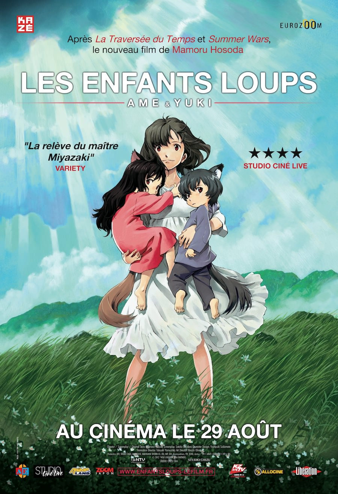
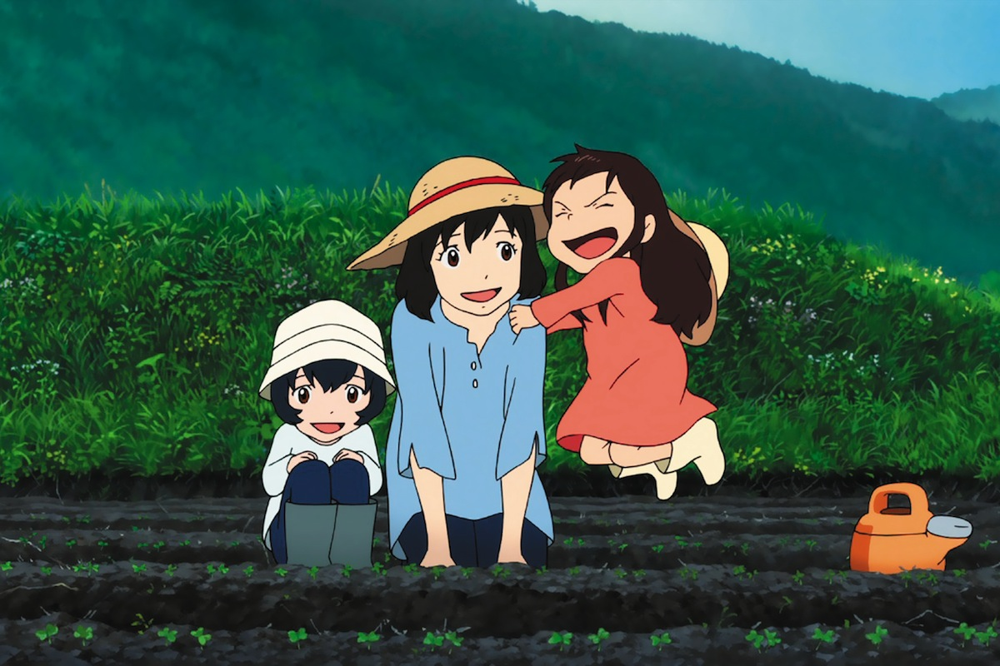
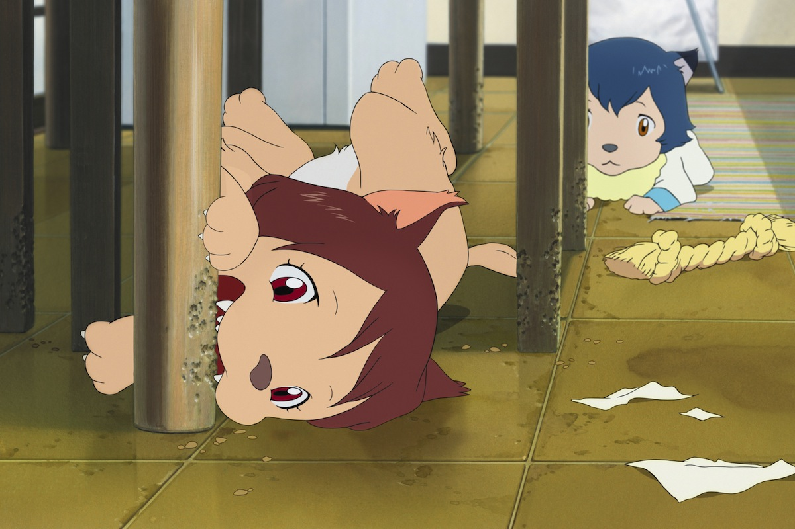

+++
type = "post"
titre = "<em>Les Enfants Loups, Ame & Yuki</em>, Mamoru Hosoda"
title = "Les Enfants Loups, Ame & Yuki, Mamoru Hosoda"
url = "/enfants-loups-ame-yuki-hosoda"
date = "2012-09-10T00:15:28"
Lastmod = "2014-12-17T12:35:44"
cover = "les-enfants-loups-ame-yuki.jpg"
categorie = [ "À voir" ]
tag = [ "Adolescence", "Animation", "Animaux", "Enfance", "Famille", "Fantastique", "Société" ]
createur = [ "Mamoru Hosoda" ]
annee = [ "2012" ]
weight = 2012
pays = [ "Japon" ]
original = "Okami kodomo no ame to yuki"

+++

Cette histoire d&rsquo;une femme qui aime un homme mi-humain mi-loup et qui a deux enfants suite à son histoire d&rsquo;amour avait de quoi faire peur. Comme souvent avec l&rsquo;animation japonaise, <em>Les Enfants Loups, Ame &amp; Yuki</em> est beaucoup moins naïf et niais qu&rsquo;il n&rsquo;y paraissait. Au contraire, Mamoru Hosoda compose une histoire extrêmement fine que la fin un peu décevante ne vient pas gâcher. Une belle surprise, à ne pas rater en salles…

Un jour, Hana rencontre un mystérieux garçon à la fac où elle suit ses cours. Ce garçon n&rsquo;est pas comme les autres, elle le sent et elle se sent attirée au point de persévérer face à ses premiers refus. Les deux jeunes gens sympathisent et il finit par emménager chez elle. Le couple a très vite un enfant, puis deux, mais la vie emporte le père pendant… une chasse. Hana a en effet rencontré un homme-loup, variante pacifique du loup-garou qui peut se changer quand il le souhaite en animal. La fille et le garçon issus de cette relation héritent également des gènes paternels et c&rsquo;est pour les cacher que leur mère décide de déménager à la campagne, le plus loin possible de la civilisation. C&rsquo;est dans cet écrin de verdure, loin de tout, que Yuki et son petit frère Ame vont pouvoir s&rsquo;épanouir et trouver leur voie, entre leurs parts d&rsquo;humanité et d&rsquo;animalité.

L&rsquo;histoire de <em>Les Enfants Loups, Ame &amp; Yuki</em> pourrait laisser à penser que le dernier film de Mamoru Hosoda est un film fantastique. Ce n&rsquo;est pourtant que très partiellement le cas : si le point de départ — un être humain qui peut se transformer en loup à volonté — est évidemment fantastique, il ne s&rsquo;agit nullement du sujet principal de ce long-métrage. La particularité est présentée assez tôt et de manière très abrupte : le cinéaste a choisi de montrer son personnage sous sa forme animale brutalement, à la surprise de Hana qui ne s&rsquo;y attend évidemment pas, mais aussi un peu du spectateur. Une fois cette première découverte passée, le reste du film n&rsquo;en reparle plus, du moins pas comme quelque chose de mystérieux, mais simplement comme une difficulté pour les deux enfants qui doivent grandir en se cachant. <em>Les Enfants Loups, Ame &amp; Yuki</em> n&rsquo;élude pas la question du regard des autres et le poids de la société est sans conteste particulièrement important, surtout en ville d&rsquo;ailleurs où la tolérance des voisins est nulle. À la campagne, Hana prend bien soin de protéger ses deux enfants des regards des autres en choisissant une maison isolée et en leur interdisant toute transformation en public. Elle trouvera toutefois beaucoup plus d&rsquo;aides dans ce nouvel environnement, tandis que la particularité physique de Yuki et d&rsquo;Ame sauve en quelque sorte le village en protégeant la récolte familiale. Encore une fois, Mamoru Hosoda ne se concentre pas sur l&rsquo;animalité de ses personnages, l&rsquo;élément important est plutôt qu&rsquo;ils sont différents et qu&rsquo;ils doivent vivre avec cette différence.

Hana emmène ses enfants à la campagne pour les protéger et les cacher, mais aussi pour leur offrir un choix. C&rsquo;est une idée à la fois très forte et très belle de <em>Les Enfants Loups, Ame &amp; Yuki</em> : l&rsquo;animalité n&rsquo;est pas vécue comme un problème qu&rsquo;il faut éliminer, mais plutôt une ouverture supplémentaire, une possibilité que tous les autres n&rsquo;ont pas. Le frère et la sœur ont un rapport très différent avec leur condition mi-humaine, mi-louve. Jeune, Yuki assume totalement son côté animal et l&rsquo;exploite en permanence pour demander quelque chose à sa mère, pour effrayer un animal ou simplement pour courir dans la nature. Ame, son petit frère, est beaucoup plus réservé, timide même : plus fragile physiquement, il a aussi lu dans les contes que le loup est toujours l&rsquo;ennemi, ce qui ne le rassure pas vraiment. <em>Les Enfants Loups, Ame &amp; Yuki</em> n&rsquo;en reste pas à cette situation de départ toutefois et Mamoru Hosoda déploie tout son talent de conteur pour présenter l&rsquo;évolution de deux personnages qui deviennent terriblement réalistes et attachants. Sans trop dévoiler de l&rsquo;intrigue, disons simplement que le parcours des deux enfants n&rsquo;est pas linéaire et qu&rsquo;ils réagissent vraiment différemment au passage à l&rsquo;adolescence. Toujours est-il que ces enfants ne sont pas niais, ils sont par contre émouvants et le spectateur s&rsquo;y attache sans trop de peine. Ce succès n&rsquo;est pas tant lié à l&rsquo;animation proprement dite qu&rsquo;à une écriture particulièrement fine qui s&rsquo;avère payante.

L&rsquo;animation n&rsquo;est sans doute pas le point fort de <em>Les Enfants Loups, Ame &amp; Yuki</em>. Assez simple, voire parfois simpliste, elle n&rsquo;impressionne ni par son réalisme, ni par sa beauté brute. On dirait même par moment de la mauvaise animation de dessins animés pour enfants, mais Mamoru Hosoda est astucieusement parvenu à en faire l&rsquo;élément qui renforce <em>in fine</em> le réalisme de son film. Paradoxalement, cette animation techniquement médiocre au regard de ce que l&rsquo;on peut faire aujourd&rsquo;hui contribue à crédibiliser l&rsquo;histoire de Hana et de ses deux enfants. Il faut dire que si l&rsquo;animation n&rsquo;est pas des plus modernes, l&rsquo;écriture est en revanche précise, convaincante et touchante, malgré une fin un peu décevante. Loin de la mièvrerie dont font parfois preuve les films d&rsquo;animation, <em>Les Enfants Loups, Ame &amp; Yuki</em> parvient à dépasser son point de départ un peu ridicule et à imposer une très belle histoire d&rsquo;amour et de choix. Mamoru Hosoda a parié sur ses personnages, un pari réussi !

Ne vous arrêtez pas à son point de départ, encore moins à sa bande-annonce : <em>Les Enfants Loups, Ame &amp; Yuki</em> mérite d&rsquo;être vu, même sans enfant. Mamoru Hosoda déploie une très belle histoire sur la différence, sur la famille et sur l&rsquo;apprentissage de la vie qui dépasse largement le statut d&rsquo;homme-loup de ses personnages. Un récit et un film très convaincants, à ne pas rater tant qu&rsquo;il est en salles (et en version originale de préférence, pour l&rsquo;ambiance).

<h3>Vous voulez <a href="/soutien/">m&rsquo;aider</a> ?</h3>
<ul>
<li><a href="http://www.amazon.fr/gp/product/B00C0VIQ9E/ref=as_li_ss_tl?ie=UTF8&amp;tag=leblogdenic07-21&amp;linkCode=as2&amp;camp=1642&amp;creative=19458&amp;creativeASIN=B00C0VIQ9E">Acheter le film en Blu-ray sur Amazon</a></li>
<li><a href="http://www.amazon.fr/gp/product/B00C0VIQC6/ref=as_li_ss_tl?ie=UTF8&amp;tag=leblogdenic07-21&amp;linkCode=as2&amp;camp=1642&amp;creative=19458&amp;creativeASIN=B00C0VIQC6">Acheter le film en DVD sur Amazon</a></li>
</ul>

