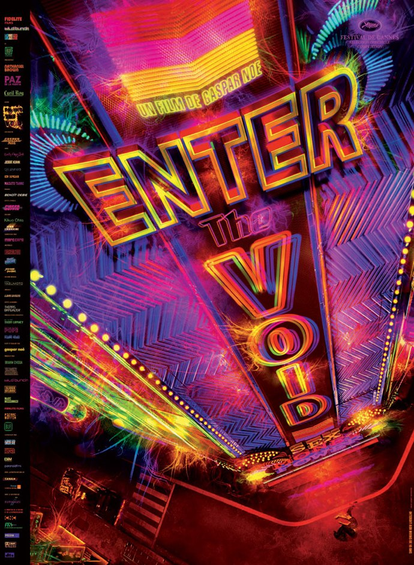
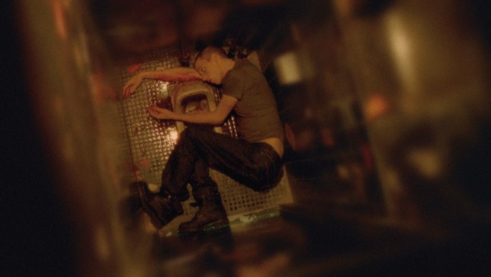

+++
type = "post"
titre = "Enter The Void, Gaspard Noé"
title = "Enter The Void, Gaspard Noé"
url = "/enter-the-void-noe"
date = "2010-05-04T00:23:27"
Lastmod = "2013-05-22T22:36:15"
cover = "enterthevoid.jpg"
categorie = [ "À voir" ]
tag = [ "Art", "Expérience", "Famille", "Mort", "Trip" ]
createur = [ "Gaspard Noé" ]
acteur = [ "Nathaniel Brown", "Paz de la Huerta" ]
annee = [ "2010" ]
weight = 2010
pays = [ "France" ]

+++

Gaspard Noé n&rsquo;a pas la réputation d&rsquo;être un réalisateur facile, auteur de films formatés pour le grand public selon des schémas prédéfinis. Le moins que l&rsquo;on puisse dire, c&rsquo;est qu&rsquo;il le prouve une nouvelle fois avec <em>Enter The Void</em>, son troisième long-métrage. Soit 2h35 (les cinq minutes importent) d&rsquo;un trip ininterrompu et alimenté à toutes les drogues possibles et imaginables. C&rsquo;est une expérience de cinéma, une expérience à faire sans doute, mais une expérience éprouvante.

<em>Enter The Void</em> commence à travers les yeux d&rsquo;Oscar, jeune occidental dealer de drogue à Tokyo. Il commence littéralement à travers ses yeux : la caméra est en position subjective et on voit ce qu&rsquo;il voit, la caméra titube et fait même le noir le temps d&rsquo;un clignement des yeux. Après avoir été assommés par un générique tonitruant, certainement le plus impressionnant et incompréhensible de toute l&rsquo;histoire du cinéma d&rsquo;ailleurs, puis un écran blanc éblouissant et assourdissant, cette entrée en matière paraît reposante. Mais cet Oscar que les spectateurs incarnent bien malgré eux se drogue et commence alors une séquence psychédélique qui n&rsquo;est pas sans évoquer les animations aléatoires qui accompagnent depuis longtemps déjà les lecteurs de musique sur ordinateur. Le récit avance néanmoins, Oscar doit apporter de la drogue à un certain Victor, rencontre sur le chemin un ami et se fait piéger par Victor dans un bar. La police veut l&rsquo;arrêter, l&rsquo;altercation se passe mal, il est tué d&rsquo;une balle.

Mort, Oscar n&rsquo;abandonne néanmoins pas totalement le monde des vivants. Sa sœur est avec lui à Tokyo et ils se sont promis mutuellement, à la mort de leurs parents suite à un accident de la route, de ne jamais se séparer. Oscar veille donc sur elle une fois mort, et après l&rsquo;avoir incarné de son vivant, la caméra suit désormais le spectre et ses souvenirs. Dorénavant, <em>Enter The Void</em> ne présente plus Oscar que de dos, à différentes étapes de sa vie dans un mélange temporel complet, mais néanmoins toujours compréhensible. Si le film est totalement déstabilisant sur tous les plans sensoriels, sa trame scénaristique reste néanmoins parfaitement compréhensible pour peu que l&rsquo;on reste concentré. L&rsquo;histoire est comme un puzzle où les différentes pièces sont apportées petit à petit pour former une image complète sur l&rsquo;histoire d&rsquo;Oscar et de sa sœur, puis sur la vie qui se poursuit après la mort, jusqu&rsquo;au bouclement final de la boucle.

Gaspard Noé a fait deux choix radicaux qui expliquent l&rsquo;extrême originalité de son film, un véritable OVNI cinématographique. <em>Enter The Void</em>, d&rsquo;une part, est un film à la fois sur la mort et le film qui épouse le point de vue d&rsquo;un mort, de bout en bout. Le thème n&rsquo;est en soi pas très original, et l&rsquo;on n’a certainement vu d&rsquo;autres films qui prenaient le point de vue d&rsquo;un mort, mais jamais à ce point, jamais sans faire la moindre concession par rapport à cette idée de départ. Le réalisateur ne reculant devant aucun obstacle a en outre décidé de doter son film d&rsquo;une forme inédite puisque le Tokyo qu&rsquo;il montre est constamment sous acide. Les néons sont omniprésents dans cet univers de la nuit permanente, tandis que les drogues ingérées par les personnages sont autant de prétextes aux expérimentations visuelles les plus folles, sachant que la mort est considérée comme le trip ultime. Je crois qu&rsquo;il ne doit pas y avoir plus de 10 minutes d&rsquo;image à peu près naturelles sur l&rsquo;ensemble du film : le reste est sérieusement trafiqué pour obtenir une image parfois très belle, d&rsquo;autres fois très kitsch, mais toujours fondamentalement originale. Certains plans tournoyants au-dessus de Tokyo sont vraiment impressionnants. <em>Enter The Void</em> réussit en tout cas bien son pari de plonger le spectateur dans un trip, comme s&rsquo;il avait lui-même pris de la drogue. On en ressort sonné, et c&rsquo;est plutôt réussi de ce côté.

J&rsquo;aime beaucoup l&rsquo;idée jusqu&rsquo;au-boutiste de faire un film sous acides à propos d&rsquo;un mort, et de le faire en tenant toujours sans céder le point de vue du mort. C&rsquo;est une idée originale et courageuse que Gaspard Noé propose ici, et en cela son film est intéressant. Visuellement, il l&rsquo;est aussi, avec un rendu qui m&rsquo;a rappelé certaines installations cinématographiques des musées d&rsquo;art moderne. Mais voilà, <em>Enter The Void</em> est long, très long — 2h35 et il n&rsquo;y a même pas de générique de fin — et il est beaucoup trop long. Le film répète inlassablement les mêmes images, par exemple l&rsquo;accident initial ou pire, les scènes de sexe qui sont aussi nombreuses (l&rsquo;interdiction au moins de 16 ans n&rsquo;est pas là pour rien) que répétitives. Si le film dépasse les deux heures trente, la quantité d&rsquo;images uniques présentées par Gaspard Noé est beaucoup plus faible. <em>Enter The Void</em> aurait gagné à être sérieusement raccourci, 1h30 suffiraient amplement. Sur la fin surtout, il y aurait de quoi enlever : à, cette fin interminable, où l&rsquo;on croit le film terminé alors qu&rsquo;il reprend et remontre encore et encore le même type d&rsquo;images. Si le début m&rsquo;a plutôt plu, je dois que j&rsquo;ai atteint les limites de ma patience, et je trépignais d&rsquo;impatience sur mon siège pendant au moins la dernière demi-heure. Le film n&rsquo;évite pas les images présentes uniquement pour choquer, comme ce gros plan sur un fœtus mort, ou l&rsquo;éjaculation vue depuis l&rsquo;intérieur du vagin de la femme qui, à n&rsquo;en pas douter, restera dans les annales des scènes ridicules.

Gaspard Noé est un malin. Toutes les critiques que je viens de formuler peuvent être retournées d&rsquo;un seul argument : le réalisateur veut nous choquer, veut nous pousser à bout, nous énerver. Et il est très bon pour cela, intransigeant, ne nous épargnant rien et choquant tous nos sens, la vue comme l&rsquo;ouïe. Dès lors, on comprend pourquoi <em>Enter The Void</em> dure aussi longtemps et se répète comme une boucle à l&rsquo;infini (le titre n&rsquo;est pas innocent évidemment), il s&rsquo;agit tout simplement de nous achever et en ce sens, c&rsquo;est réussi. Sauf que je trouve cet argument un peu court et limite, car il justifie potentiellement tout et n&rsquo;importe quoi. <em>Enter The Void</em> reste une expérience que le cinéphile de plus de 16 ans et ne souffrant pas d&rsquo;épilepsie (sans rire, cela devrait être clairement spécifié, je n&rsquo;ai jamais vu un film avec autant de flashs) peut vraiment aller voir. Je l&rsquo;ai vu, et je suis satisfait de l&rsquo;avoir fait. Mais, bon sang, qu&rsquo;est-ce qu&rsquo;on est content que le film s&rsquo;arrête !

En guise de contrepoint à ma critique en demi-teinte, je me contenterai de nommer les deux coupables responsables de mon intérêt pour le film : <a href="http://www.plan-c.fr/article-enter-the-void-l-art-de-noe-48794299.html">Alexandre de Plan-c</a> et <a href="http://www.filmosphere.com/2010/04/critique-enter-the-void-2009/">Nicolas de Filmosphère</a>.

<h3>Vous voulez m&rsquo;aider ?<a href="#footnote_0_3284" id="identifier_0_3284" class="footnote-link footnote-identifier-link" title="&Agrave; propos de la publicit&eacute;&hellip;">1</a></h3>
<ul>
<li><a href="http://www.amazon.fr/gp/product/B006LNABBS/ref=as_li_ss_tl?ie=UTF8&tag=leblogdenic07-21&linkCode=as2&camp=1642&creative=19458&creativeASIN=B006LNABBS">Acheter le film en Blu-Ray sur Amazon</a></li>
<li><a href="http://www.amazon.fr/gp/product/B006LNA7HG/ref=as_li_ss_tl?ie=UTF8&tag=leblogdenic07-21&linkCode=as2&camp=1642&creative=19458&creativeASIN=B006LNA7HG">Acheter le film en DVD sur Amazon</a></li>
<li><a href="https://itunes.apple.com/fr/movie/enter-the-void-vost/id413812570">Acheter ou louer le film sur l&rsquo;iTunes Store</a></li>
</ul>

<ol class="footnotes"><li id="footnote_0_3284" class="footnote"><a href="http://voiretmanger.fr/soutien/">À propos de la publicité…</a> [<a href="#identifier_0_3284" class="footnote-link footnote-back-link">&#8617;</a>]</li></ol>
