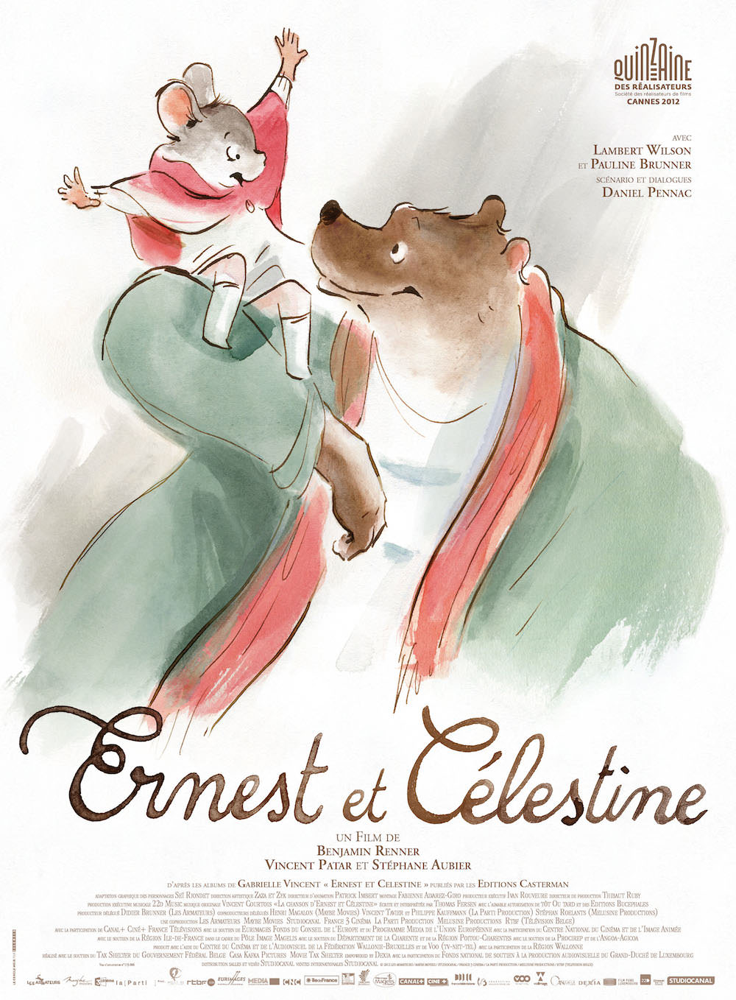
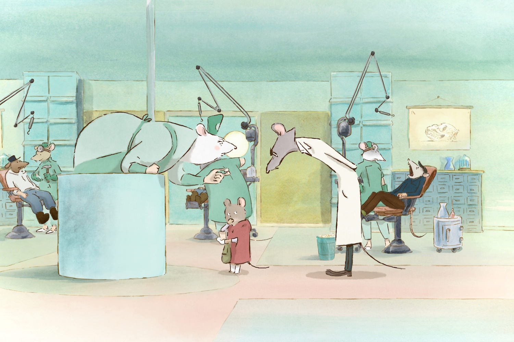
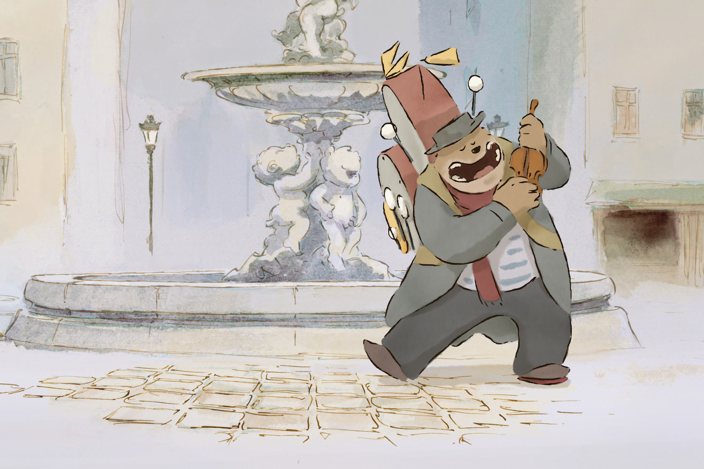

+++
type = "post"
titre = "<em>Ernest et Célestine</em>, Benjamin Renner, Vincent Patar et Stéphane Aubier"
title = "Ernest et Célestine, Benjamin Renner, Vincent Patar et Stéphane Aubier"
url = "/ernest-et-celestine-renner-patar-aubier"
date = "2013-07-07T23:47:01"
Lastmod = "2013-07-07T23:51:15"
cover = "ernest-et-celestine.jpg"
categorie = [ "À voir" ]
tag = [ "Amour", "Animation", "Animaux", "Clichés", "Enfance", "Société" ]
createur = [ "Benjamin Renner", "Stéphane Aubier", "Vincent Patar" ]
annee = [ "2012" ]
weight = 2012
pays = [ "France", "Luxembourg" ]

+++

À l’origine, <em>Ernest et Célestine</em> est une <a href="http://www.amazon.fr/Gabrielle-Vincent/e/B000APT3Q2/?_encoding=UTF8&camp=1642&creative=19458&linkCode=ur2&qid=1373231369&sr=8-11&tag=leblogdenic07-21">série de livres</a> illustrés pour les enfants. Cette amitié entre une souris et un ours a motivé un trio de réalisateurs pour le porter dans les salles de cinéma avec un film d’animation. Il aurait été facile de passer à côté de la finesse du style de Gabrielle Vincent et d’en faire un récit lourdaud, mais Benjamin Renner, Vincent Patar et Stéphane Aubier ont su respecter l’esprit de l’œuvre originale. <em>Ernest et Célestine</em>, c’est un concentré de bonne humeur, un style graphique similaire à celui des livres et surtout un récit toujours charmant, mais qui ne s’adresse pas aux enfants comme à des débiles. Un excellent film, à ne rater sous aucun prétexte.

Célestine est une souris, elle vit donc sous la terre et on lui apprend dès son plus jeune âge qu’il faut craindre absolument le grand méchant ours. Tous les autres enfants souris de son âge sont terrorisés à la simple évocation de ce mot, mais pas Célestine qui ne comprend pas pourquoi tous les ours devraient nécessairement être méchants. Au-dessus de la surface, Ernest un ours en marge de la société des ours : loin de la ville, il vit dans une cabane miteuse et il joue tous les jours de la musique pour gagner sa vie. Comme son titre l’indique d’emblée, <em>Ernest et Célestine</em> va rapprocher ces deux personnages que tout devrait opposer. Envoyée chercher les dents laissées par les oursons, Célestine finit dans une poubelle qui est fouillée au petit matin par Ernest, en quête de nourriture. Les deux se découvrent et apprennent à se connaître : l’ours pense d’abord à manger la souris, mais cette dernière ne prend pas peur et lui propose une alternative. Peu à peu, ils finissent par s’apprécier et ceux qui devaient être ennemis, se rassemblent dans l’amitié. Sans le dire ainsi, Benjamin Renner, Vincent Patar et Stéphane Aubier filment évidemment une histoire d’amour assez classique, en l’occurrence un amour impossible. Tels Roméo et Juliette, Ernest et Célestine appartiennent à deux clans que tout oppose : les souterrains aux uns, la ville en surface aux autres et de part et d’autre, une haine appuyée pour ceux qui sont si différents. La fin est attendue, mais elle importe assez peu : le récit d’<em>Ernest et Célestine</em> est suffisamment riche et touchant pour que le chemin soit ici aussi plus important que la destination.

Loin des récits niais que l’on impose trop souvent aux enfants, <em>Ernest et Célestine</em> est une sublime fable politique sur la différence et surtout sur l’acceptation de la différence. Benjamin Renner, Vincent Patar et Stéphane Aubier mettent en image deux mondes que tout oppose… parce que c’est ainsi. Le film montre très bien que la peur des souris pour les ours, et des ours pour les souris n’est pas fondée sur des arguments recevables, mais uniquement sur des clichés. D’un côté on a peur des ours qui ont la réputation de manger toutes les souris sans distinction ; de l’autre on a peur de ces souris qui sont réputées se multiplier et venir tout vous prendre. Certes, <em>Ernest et Célestine</em> emploie deux exceptions pour démonter ces arguments, mais le scénario n’est absolument pas bêta, bien au contraire même. Il avance avec la même finesse que les dessins peints à l’aquarelle pour montrer que oui, un ours et une souris peuvent très bien cohabiter. Ce n’est absolument pas simple, encore moins évident et le travail de ce dessin animé sur les animaux est à cet égard remarquable. Puisqu’ils parlent et se comportent comme des humains, les bêtes sont humanisées, mais elles ne sont pas dépourvues de leur caractère animal. Ernest utilise son nez et son museau pour chercher de la nourriture, quand Célestine se déplace à quatre pattes, par exemple. Cette façon de marier animalité et humanité est remarquable et elle traduit bien la méthode de Benjamin Renner, Vincent Patar et Stéphane Aubier : leur long-métrage s’adresse aux enfants, mais avec intelligents et le résultat est là. <em>Ernest et Célestine</em> sera tout autant apprécié des parents — qui reconnaîtront avec plaisir la voix de Lambert Wilson derrière Ernest ou celle de Pauline Brunner derrière Célestine —, mais on peut parier que les enfants, même jeunes, seront aux anges. C’est un petit bijou d’animation, tant sur le plan technique que sur l’histoire, une belle prouesse qui le distingue des productions internationales.

<em>Ernest et Célestine</em> a été récompensé d’un César et ce n’est absolument pas usurpé : Benjamin Renner, Vincent Patar et Stéphane Aubier ont indéniablement fait du beau travail sur ce film fin et extrêmement touchant. C’est beau à regarder, c’est aussi une belle histoire, mais en aucun cas ce n’est un film qui prend les plus jeunes pour moins intelligents qu’ils ne sont. Que vous ayez des enfants ou non, <em>Ernest et Célestine</em> est incontestablement un film à voir…

<h3>Vous voulez m’aider ?<a href="#footnote_0_9876" id="identifier_0_9876" class="footnote-link footnote-identifier-link" title="&Agrave; propos de la publicit&eacute;&hellip;">1</a></h3>
<ul>
<li><a href="http://www.amazon.fr/gp/product/B00AMYTZU0/ref=as_li_ss_tl?ie=UTF8&tag=leblogdenic07-21&linkCode=as2&camp=1642&creative=19458&creativeASIN=B00AMYTZU0">Acheter le film en Blu-Ray et DVD sur Amazon</a></li>
<li><a href="http://www.amazon.fr/gp/product/B00AMYTZOQ/ref=as_li_ss_tl?ie=UTF8&tag=leblogdenic07-21&linkCode=as2&camp=1642&creative=19458&creativeASIN=B00AMYTZOQ">Acheter le film en DVD sur Amazon</a></li>
<li><a href="https://itunes.apple.com/fr/movie/ernest-et-celestine/id597316344">Acheter ou louer le film sur l’iTunes Store</a></li>
</ul>

<ol class="footnotes"><li id="footnote_0_9876" class="footnote"><a href="http://voiretmanger.fr/soutien/">À propos de la publicité…</a> [<a href="#identifier_0_9876" class="footnote-link footnote-back-link">&#8617;</a>]</li></ol>
