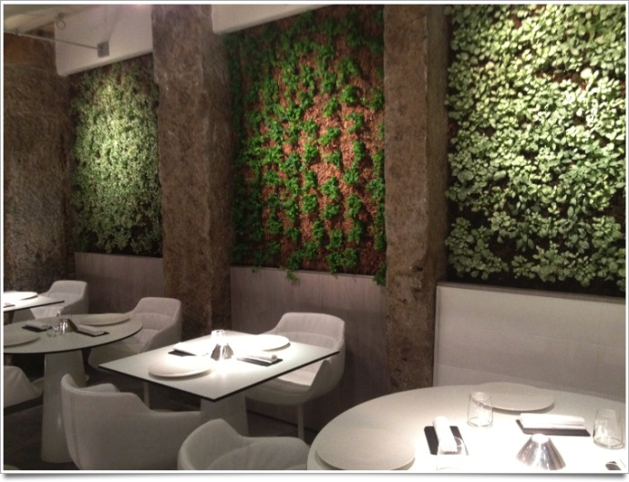
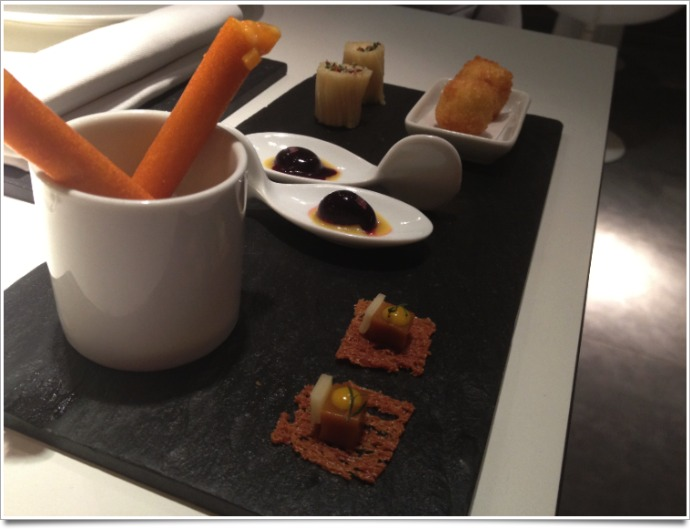
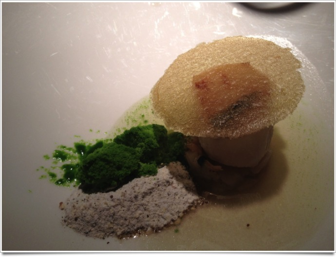
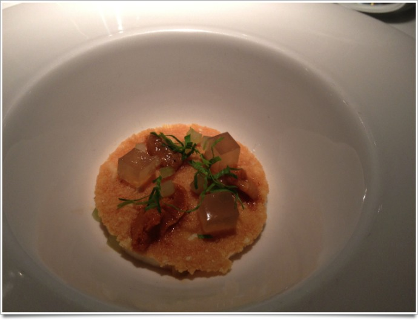
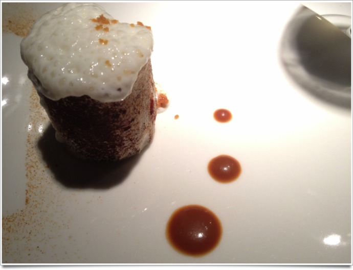

+++
titre = "Eskis à Lyon"
title = "Eskis à Lyon"
url = "/eskis-lyon"
date = "2012-01-21T11:06:51"
Lastmod = "2015-05-24T15:27:44"
cover = "restaurant-eskis-lyon.jpg"
categorie = [ "À manger" ]
tag = [ "69001", "Association plat/vin", "Cuisine moléculaire", "Expérience" ]

+++

La cuisine moléculaire m&rsquo;a toujours fasciné. Déconstruire un aliment pour le reconstruire ensuite sous une autre forme, jouer sur les textures, les formes, les couleurs avec une liberté totale… l&rsquo;expérience est tentante pour qui aime la cuisine. Cette cuisine si particulière est aussi rare et presque inaccessible. Certains restaurants, comme le fameux <strong>El Bulli</strong> en Espagne qui n&rsquo;accueille ses clients que pendant quelques mois d&rsquo;été et où il faut réserver des années à l&rsquo;avance. On peut pourtant la tester assez facilement à Lyon : le restaurant <strong><a href="http://eskis-restaurant.com/">Eskis</a></strong> situé au cœur du premier arrondissement, à deux pas des bouchons, propose une cuisine moléculaire accessible. Une véritable expérience à recommander à tous les gastronomes curieux.

La façade, sobre et classe, met dans l&rsquo;ambiance. Sur la porte, on lit &laquo;&nbsp;Samuel Desjobert, artisan culinaire&nbsp;&raquo; : la cuisine est ici pensée comme un art, mais aussi un savoir-faire complexe. La salle est à son image, minimaliste et très classieuse. Le blanc domine la pièce, rompu seulement par des murs végétaux sur un des deux côtés. La salle est petite et la trentaine de couverts du restaurant conduit à une disposition assez serrée. Ce vendredi soir, l&rsquo;<strong>Eskis</strong> était bien complet et c&rsquo;est sûrement ainsi tous les soirs de la semaine. Si vous cherchez à dîner en amoureux, ce n&rsquo;est pas forcément l&rsquo;idéal, quoique l&rsquo;acoustique de la salle est parfaite et nous n&rsquo;avons pas été trop gênés par le monde.

Une fois assis à votre table, on vous amène vite des amuses-bouches qui donnent le ton de ce qui va suivre. Sur la photo ci-dessus, saurez-vous reconnaître des spaghettis carbonara ? De la soupe de poisson ? Les premiers sont les rouleaux au fond, la dernière est en fait le petit cube au premier plan. La soupe a été congelée pour former ce cube : de la soupe chaude, on est passé à un cube de glace. Cette mise en bouche à elle seule résume l&rsquo;esprit de la cuisine moléculaire et dès cette entrée en matière, on sent la précision du travail et la complexité des plats. Le reste de la soirée confirmera cette impression : chaque assiette est un travail d&rsquo;orfèvre. Les aliments sont en petite quantité, ils sont posés dans l&rsquo;assiette avec beaucoup de soin pour former des constructions complexes à l&rsquo;image de cette noix de Saint-Jacques sur lit de topinambour surmontée d&rsquo;une fine galette de topinambour (ci-dessous). La cuisine moléculaire se remarque sur ce plat : autour de la Saint-Jacques, on trouve deux poudres, l&rsquo;une verte et l&rsquo;autre beige. La verte est une purée de cresson congelée, la brune une poudre de topinambours. Ce plat mêle de manière savante les goûts, le salé et le sucré, le chaud et le froid, les textures… J&rsquo;avais rarement mangé quelque chose d&rsquo;aussi sophistiqué.

Les plats proposés par l&rsquo;<strong>Eskis</strong> ne sont pas là simplement pour se nourrir, mais d&rsquo;abord pour déguster et découvrir. Nous avons eu huit assiettes, plus des amuses-bouges pour commencer et des mignardises pour finir, mais nous n&rsquo;étions pas gavés en sortant, loin de là. Les quantités sont vraiment mesurées et on prend son temps pour comprendre chaque plat, découvrir toutes ses saveurs et ne pas passer à côté. Le principe ici est en effet le même qu&rsquo;<strong><a href="http://voiretmanger.fr/2011/10/23/au-14-fevrier-lyon/">Au 14 février</a></strong> : nulle carte de plats ici, mais seulement le choix entre deux menus, ou plutôt deux découvertes comme le suggère le très jeune maître d&rsquo;hôtel. La seule différence entre les deux réside dans le nombre de plats et nous avons choisi la formule la plus complète pour profiter au maximum de notre expérience culinaire. Au programme, deux entrées, deux plats, un fromage et trois desserts que vous pourrez accompagner de verres de vin accordés : c&rsquo;est indéniablement la meilleure solution tant le vin ajoute encore une touche aux saveurs du plat. Vous pouvez ici aussi indiquer au maître d&rsquo;hôtel les ingrédients que vous n&rsquo;aimez pas dans la longue liste qui accompagne le menu. L&rsquo;ensemble reste à un tarif plutôt modéré puisqu&rsquo;il faut compter une centaine d&rsquo;euros par personne, vins compris, pour la version à huit plats. Comme <strong>Au 14 février</strong>, l&rsquo;<strong>Eskis</strong> propose des prestations dignes d&rsquo;un restaurant étoilé, à un prix relativement bon marché. Un regret toutefois : les mêmes plats sont servis à l&rsquo;ensemble de la table et j&rsquo;ai ainsi empêché F. de goûter l&rsquo;impressionnant plat construit autour du foie gras que nos voisins ont pu déguster.

La soirée passée dans ce restaurant a été assez magique. Nous sommes restés trois heures sans les voir passer et nous avons découvert une cuisine vraiment atypique qui vaut la peine de dépenser un peu plus qu&rsquo;à l&rsquo;ordinaire. Cette cuisine moléculaire est toutefois si complexe qu&rsquo;elle est exigeante : manger à l&rsquo;<strong>Eskis</strong> demande un peu de concentration sous peine de passer à côté et même de ne pas apprécier les plats. La poudre de topinambours évoquée plus haut ne doit pas se manger seule, il faut la mêler au reste pour l&rsquo;apprécier à sa juste valeur. Le reste demande également un peu d&rsquo;attention pour bien apprécier le taboulé au citron confit et olives surmonté d&rsquo;une mousse à l&rsquo;huile d&rsquo;olive, ou les oursins avec ses cubes de gelée de céleri et sa mousse de céleri, ou encore ce vacherin au caramel constitué d&rsquo;une meringue fourrée avec la glace (ci-dessous). Pour peu que l&rsquo;on se laisse embarquer, le plaisir est total, tant pour les papilles que pour les yeux. La soupe de potiron et coques a été présentée dans un bol sans la soupe : on y voyait les différents ingrédients, des cubes de courge notamment, et sur le dessus une plaque de noisette. Le serveur a ensuite ajouté la soupe chaude et la plaque de noisettes s&rsquo;est dissoute pour former une mousse : tout l&rsquo;art de la cuisine moléculaire est ici réuni et le résultat était vraiment plaisant… et excellent. Plus impressionnante encore était la cuisson à l&rsquo;azote d&rsquo;une meringue : effectuée directement dans la salle, elle assure le spectacle et apporte à ce dessert construit autour de la Piña colada une touche glacée très agréable. La reconstruction d&rsquo;un plat passe d&rsquo;abord par son aspect : impossible de deviner sans goûter que le cube de gelée à côté du succulent chevreuil était en fait une poire au sirop.

Cette soirée passée à l&rsquo;<strong>Eskis</strong> a été vraiment magique à goûter et à voir. Certains plats étaient franchement réussis et ont réussi à nous surprendre, à l&rsquo;image de ce dessert autour du vin chaud, d&rsquo;autres nous ont moins convaincus — le Mont-d&rsquo;or sur gelée de blettes —, mais l&rsquo;ensemble était un ravissement. La cuisine moléculaire est une cuisine exigeante toutefois et nous ne retournerons sans doute pas dans ce restaurant immédiatement. Sur le même concept de la découverte, <strong>Au 14 février</strong> est plus accessible : sa cuisine est moderne, mais reste plus classique et elle se comprend sans effort. À l&rsquo;<strong>Eskis</strong>, c&rsquo;est le client qui fournit l&rsquo;effort et même le verre de vin qui accompagne chaque plat n&rsquo;est expliqué qu&rsquo;après la dégustation. Le concept est passionnant, mais ce n&rsquo;est pas forcément l&rsquo;idéal pour un moment de détente. Si vous aimez la gastronomie toutefois, voici une adresse à ne pas manquer à Lyon !

