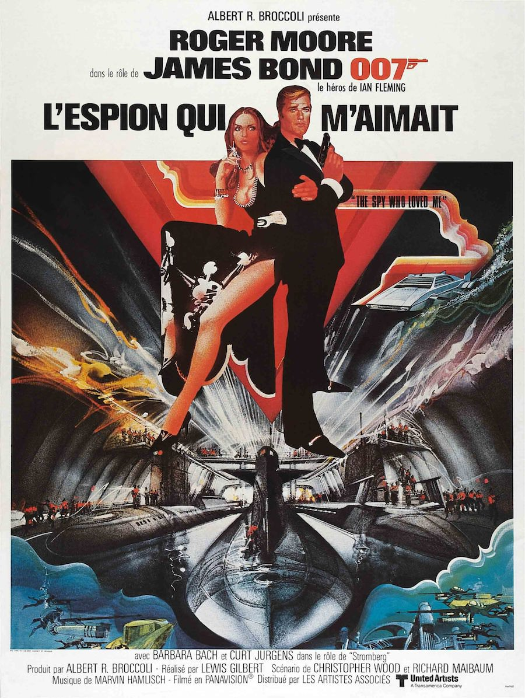
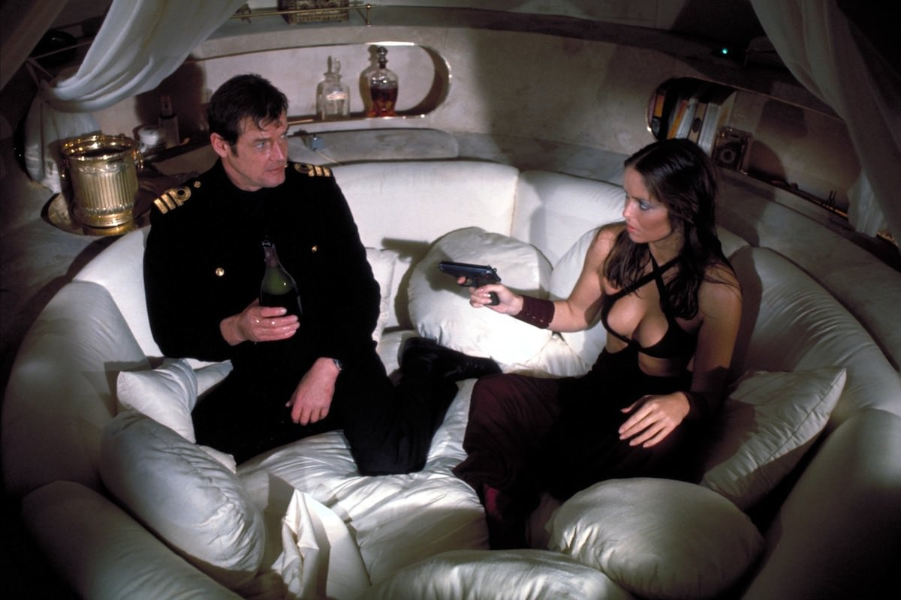

+++
type = "post"
titre = "<em>L&rsquo;espion qui m&rsquo;aimait</em>, Lewis Gilbert"
title = "L'espion qui m'aimait, Lewis Gilbert"
url = "/espion-aimait-gilbert"
date = "2013-02-24T08:38:12"
Lastmod = "2015-02-27T09:17:06"
cover = "l-espion-qui-m-aimait-roger-moore-barbara-bach.jpg"
categorie = [ "À voir" ]
tag = [ "Action", "Blockbuster", "Espionnage", "Guerre froide", "James Bond" ]
createur = [ "Lewis Gilbert" ]
acteur = [ "Barbara Bach", "Bernard Lee", "Curd Jürgens", "Desmond Llewelyn", "Richard Kiel", "Roger Moore" ]
annee = [ "1977" ]
weight = 1977
saga = [ "James Bond" ]
pays = [ "Grande-Bretagne" ]
original = "The Spy Who Loved Me"

+++

La période Roger Moore a commencé avec un nouveau style : plus sobre et plus réaliste, ce nouveau James Bond n’a pas réussi à rencontrer le public. La saga était peut-être trop en avance sur son temps, mais au milieu des années&nbsp;1970, les blockbusters qui fonctionnent viennent des États-Unis et <em>James Bond</em> commence à sembler bien vieillotte. S’il fallait une preuve supplémentaire, <a title="L'homme au pistolet d'or, Guy Hamilton - À voir et à manger" href="http://voiretmanger.fr/2013/02/17/homme-pistolet-or-hamilton/"><em>L’homme au pistolet d’or</em></a> n’a connu qu’un succès très mitigé et ce film est le signe que la saga doit évoluer pour survivre. Trois ans après, <em>L’espion qui m’aimait</em> oublie le minimalisme pour parier au contraire sur le gigantisme de la fin de la période Sean Connery. Guy Hamilton a fait son temps sur la saga, mais les producteurs font appel à un réalisateur qui a déjà fait ses preuves. Lewis Gilbert revient dix ans après <a title="On ne vit que deux fois, Lewis Gilbert - À voir et à manger" href="http://voiretmanger.fr/2013/01/20/on-ne-vit-que-deux-fois-gilbert/"><em>On ne vit que deux fois</em></a> avec lequel <em>L’espion qui m’aimait</em> partage d’ailleurs de nombreux points communs. Le dixième épisode de <em>James Bond</em> n’est pas le plus original, ni le plus fin, mais il offre un spectacle de haut niveau, il est divertissant et constitue peut-être le meilleur épisode de la période Roger Moore.

L’intrigue de <em>L’espion qui m’aimait</em> ne vise en rien l’originalité. Très vaguement inspirée par le roman éponyme de Ian Flemming, elle reprend en fait très précisément celle d’<em>On ne vit que deux fois</em>, à quelques légers détails près. On retrouve ainsi l’idée d’un intermédiaire qui essaie de provoquer l’anéantissement de la planète en dressant l’un contre l’autre Occident et monde soviétique. La Guerre froide est un élément toujours aussi important, mais signe des temps, elle n’est plus qu’un vague prétexte pour se faire rencontrer les deux personnages principaux. Après les satellites du cinquième épisode, place aux sous-marins : telle semble avoir été l’idée derrière le film de Lewis Gilbert. Dans <em>On ne vit que deux fois</em>, une fusée venait gober des satellites pour les ramener sur terre&nbsp;; ici, c’est un énorme navire qui emporte les sous-marins nucléaires en ouvrant sa coque. Dans les deux cas, les deux camps commencent à s’affronter, mais le conflit s’arrête vite cette fois. Comme son titre l’indique bien, il est question d’amour entre espions et de fait, James Bond est rapidement amené à travailler avec Anya Amasova, une espionne russe. On s’en doute, l’agent 007 va tout faire pour séduire son homologue et, on s’en doute, ce sera un succès. <em>L’espion qui m’aimait</em> est, au passage, l’occasion d’une nouvelle orientation pour le personnage fétiche de la saga. C’est la première fois que Roger Moore peut vraiment offrir sa propre vision du personnage et il abandonne tout à fait le côté rude et froid de Sean Connery au profit d’un nouveau personnage. Plus léger, n’hésitant pas à rire de la situation et préférant en tout cas toujours la considérer avec distance, comme si tout ce qui lui arrivait n’était, au fond, pas si grave. Ce côté léger a été souvent reproché à l’acteur, mais il fonctionne plutôt très bien ici et cette réussite est liée à l’esprit général du long-métrage.

Lewis Gilbert n’est pas un novice de la saga quand il débute le tournage de <em>L’espion qui m’aimait</em>. Le réalisateur britannique a déjà réalisé un épisode dix ans auparavant et son retour est sous le signe d’un seul impératif&nbsp;: faire revenir les spectateurs en salle. Pour cela tous les moyens sont bons et les producteurs décident en particulier de revenir à une formule qui a fait ses preuves : l’extravagance. Rien n’est trop beau, rien n’est trop grand pour ce dixième épisode, ni la séquence d’ouverture à ski impressionnante pour l’époque, ni la base sous-marine de Stormberg — le grand méchant —, ni même ce supertanker qui sert de base secrète et qui renferme pas moins de trois sous-marins nucléaires. Comme un concentré des moments les plus spectaculaires de la saga, <em>L’espion qui m’aimait</em> enchaîne les séquences d’anthologie, dans les airs, sur la terre et sous l’eau. La course-poursuite entre la voiture de l’agent et plusieurs poursuivants successifs fait partie des plus impressionnantes à ce stade et même s’il n’est pas question d’Aston Martin ici, l’étonnante <a href="http://en.wikipedia.org/wiki/Lotus_Esprit">Lotus Esprit</a> modifiée par Q pour se transformer en sous-marin est une réussite dans la série des voitures de James Bond. Après deux épisodes pauvres, <em>L’espion qui m’aimait</em> signe le retour des gadgets, même s’ils concernent surtout la voiture qui en regorge. Par rapport à <a title="Opération Tonnerre, Terence Young - À voir et à manger" href="http://voiretmanger.fr/2013/01/13/operation-tonerre-young/"><em>Opération Tonnerre</em></a>, les progrès techniques probablement ont permis de rendre les scènes sous-marines beaucoup plus dynamiques et le rythme est bien meilleur cette fois. On retrouvait dans <em>L’homme au pistolet d’or</em> les traditionnelles scènes entre 007, Moneypenny et M, mais elles sont cette fois déplacées dans des cadres exotiques. L’exotisme semble d’ailleurs être le maître mot de cet épisode : en ces temps de crise et de morosité, il faut faire rêver les spectateurs et Lewis Gilbert les emporte au cœur de l’Égypte touristique et dans les paysages ensoleillés de Sardaigne. Du soleil côté décors, de l’action permanente et un héros plus amusé qu’énervé : tels sont bien les ingrédients de la réussite de L&rsquo;<em>espion qui m’aimait</em>.

À défaut d’un scénario original, <em>L’espion qui m’aimait</em> propose la combinaison idéale des différentes composantes qui ont fait le succès de la saga. Lewis Gilbert n’innove pas en tournant un épisode assez similaire en apparence à celui qu’il avait tourné dix ans auparavant, mais il parvient cette fois à séduire avec un agent plus léger qui correspond parfaitement bien à l’ambiance du film. Ce n’est ni réaliste, ni très fin d’ailleurs, mais Roger Moore est convaincant et ce blockbuster est efficace et divertissant. On comprend l’intérêt renouvelé du public pour <em>James Bond</em>, même si <em>L’espion qui m’aimait</em> a été un peu éclipsé par <a title="Star Wars, Épisode IV : Un nouvel espoir, George Lucas - À voir et à manger" href="http://voiretmanger.fr/2012/06/03/star-wars-episode-4-nouvel-espoir-lucas/"><em>Star Wars, Épisode IV : Un nouvel espoir</em></a>, sorti la même année. Qu’importe, la saga repart sur les nouvelles bases qui lui manquaient et les producteurs peuvent réfléchir à la suite…

<strong>James Bond reviendra dans… <a href="http://voiretmanger.fr/2013/03/04/moonraker-gilbert/" title="Moonraker, Lewis Gilbert"><em>Moonraker</em></a></strong>

<h3>Vous voulez m’aider ?</h3>
<ul>
<li><a href="http://www.amazon.fr/gp/product/B00AOALWH6/ref=as_li_ss_tl?ie=UTF8&amp;tag=leblogdenic07-21&amp;linkCode=as2&amp;camp=1642&amp;creative=19458&amp;creativeASIN=B00AOALWH6">Acheter le film en Blu-Ray sur Amazon</a></li>
<li><a href="http://www.amazon.fr/gp/product/B000NJM5TM/ref=as_li_ss_tl?ie=UTF8&amp;tag=leblogdenic07-21&amp;linkCode=as2&amp;camp=1642&amp;creative=19458&amp;creativeASIN=B000NJM5TM">Acheter le film en DVD sur Amazon</a></li>
<li><a href="https://itunes.apple.com/fr/movie/lespion-qui-maimait-spy-who/id562202335">Acheter ou louer le film sur l’iTunes Store</a></li>
</ul>
<ul>
<li><a href="http://www.amazon.fr/gp/product/B008U6R9B4/ref=as_li_ss_tl?ie=UTF8&amp;tag=leblogdenic07-21&amp;linkCode=as2&amp;camp=1642&amp;creative=19458&amp;creativeASIN=B008U6R9B4">Acheter la trilogie complète en Blu-Ray sur Amazon</a></li>
<li><a href="http://www.amazon.fr/gp/product/B008U6R93C/ref=as_li_ss_tl?ie=UTF8&amp;tag=leblogdenic07-21&amp;linkCode=as2&amp;camp=1642&amp;creative=19458&amp;creativeASIN=B008U6R93C">Acheter la trilogie complète en DVD sur Amazon</a></li>
</ul>

