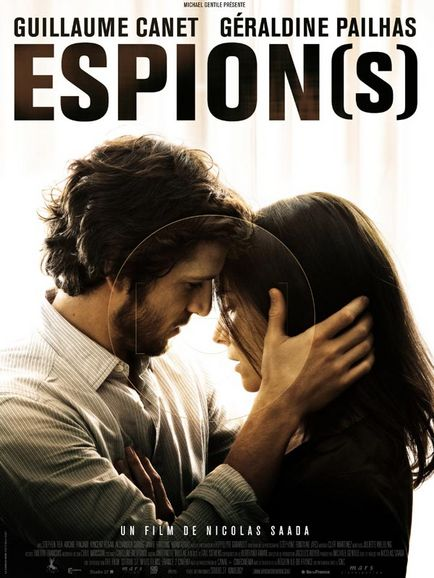

+++
titre = "Espion(s) de Nicolas Saada : le bon cinéma français existerait donc ?"
title = "Espion(s) de Nicolas Saada : le bon cinéma français existerait donc ?"
url = "/espions-nicolas-saada"
date = "2009-02-21T00:30:03"
Lastmod = "2013-03-31T23:26:43"
cover = "espions-nicolas-saada.jpg"
categorie = [ "À voir" ]
tag = [ "Espionnage", "Thriller" ]
createur = [ "Nicolas Saada" ]
annee = [ "2009" ]
weight = 2009
pays = [ "France" ]

+++

Quand un critique des <em>Cahiers du cinéma</em> passe derrière la caméra, on peut légitimement craindre le pire. Comprenons-nous bien : je suis un grand fan devant l&rsquo;éternel de la critique un peu intellectuelle, voire intellectualisante, façon <em>Télérama</em> ou <em>Inrockuptibles</em>. Mais les Cahiers, c&rsquo;est différent je trouve : ils sont apparemment incapables d&rsquo;apprécier simplement un film, il faut toujours l&rsquo;interroger plus ou moins métaphysiquement, en tout cas il faut une interrogation plus générale sur le cinéma, de quoi penser. Ils ne connaissent pas le premier degré et, pis encore, sont incapables de sortir de leur image d&rsquo;intellectuels pour, par exemple, &laquo;&nbsp;s&rsquo;abaisser&nbsp;&raquo;  à apprécier un <em>blockbuster</em> bien américain. Or moi, si j&rsquo;aime bien le cinéma intello, mais j&rsquo;aime aussi, de temps, un bon gros navet américain, <em>just for fun</em>.

Bref, je craignais un peu le pire, mais Nicolas Saada ne m&rsquo;a pas déçu. Son film est tout bonnement excellent, et cela me fait sincèrement plaisir de le dire alors qu&rsquo;il s&rsquo;agit d&rsquo;un cinéma français. Quand je vois, cette semaine, la sortie de l&rsquo;innommable bouse que constitue, sans aucun doute (il ne manquerait plus que je regarde les films avant de les descendre, tiens&#8230;), <em>Le code a changé</em>. Il existe bien un cinéma français digne d&rsquo;intérêt, mais il faut le chercher longtemps, et surtout ne pas le louper. <em>Espion(s)</em> en fait, en tout cas, indéniablement parti.

Le scénario est à la fois connu, prévisible et du genre &laquo;&nbsp;casse-gueule&nbsp;&raquo; : il eût été facile de rater complètement un film avec un tel scénario. Soit un jeune homme (Guillaume Canet, qui n&rsquo;a jamais été aussi bon qu&rsquo;ici) qui a fait plein d&rsquo;études, mais a mal tourné et se retrouve à la sécurité de Roissy où il vole de menus objets. Mais un jour, il ouvre une valise interdite, car diplomatique, et tombe sur un produit explosif. S&rsquo;ouvre alors une série d&rsquo;épisodes où la DST lui propose de se racheter en échange d&rsquo;une mission d&rsquo;information à Londres. Sa mission est simple : séduire la femme d&rsquo;un supposé brigand (Géraldine Pailhas, excellente) pour en apprendre plus. On s&rsquo;en doute, la limite entre travail et véritable amour va être ténue.

Si le film n&rsquo;échoue pas lamentablement, c&rsquo;est à la fois grâce au réalisateur et aux acteurs. Ces derniers sont vraiment excellents, notamment elle qui offre un jeu tout en précision et finesse où tous les sentiments passent successivement. Elle est vraiment convaincante, toute en retenue jusqu&rsquo;au moment où elle craque, puis bouillante de colère froide quand elle apprend la vérité. Lui excelle dans l&rsquo;art de mélanger les cartes, de sorte que l&rsquo;on ne sait jamais s&rsquo;il simule ou aime vraiment.

Mais des acteurs ne sont rien sans un réalisateur pour les diriger. Et pour un premier essai sur le grand écran, on peut dire que Nicolas Saada s&rsquo;en sort bien, très bien même. Il réussit, déjà, à cacher son manque de moyen qui ne m&rsquo;a jamais gêné et qui, avouons-le, m&rsquo;a semblé évident surtout après l&rsquo;avoir lu dans des critiques. Cela ne m&rsquo;a pas sauté aux yeux parce que Saada ne choisit pas le spectaculaire à l&rsquo;américaine (et à la française, quand on veut être plus américain qu&rsquo;Hollywood&#8230;), mais plutôt l&rsquo;émotion et l&rsquo;ambiance. Le film réussit à tisser une ambiance très particulière, mélange de paranoïa (en toile de fond, on retrouve en effet le terrorisme international et les attentats de Londres de 2005) et de désir. Autre mérite de la réalisation, sa légèreté : le film est court, mais intense (contrairement au <a href="http://voiretmanger.fr/2009/02/17/etrange-histoire-de-benjamin-button-david-fincher/"><em>blockbuster</em> de la semaine dernière</a>, tiens&#8230;) et le réalisateur a su manier l&rsquo;ellipse avec beaucoup de talent.

Nicolas Saada a, apparemment, beaucoup étudié la musique de film. Et cela s&rsquo;entend : la bande-son de ce premier film est excellente, mêlant morceaux originaux créés par le musicien de Soderbergh entre autres, rien que ça, et morceaux repris avec souvent de très bons choix (<em>Boys &amp; Girls</em> des Blur, par exemple). L&rsquo;idée a, apparemment, été de rassembler, par la musique, les deux pôles du film, espionnage et amour. Le résultat est convaincant, avec un thème principal à base de cordes, inquiétant et romantique à la fois.

Je pourrai encore parler longtemps de ce film, mais je vais plutôt respecter ce qu&rsquo;il fait d&rsquo;ailleurs très bien, à savoir ne pas tout dire, laisser des zones d&rsquo;ombre (à cet égard, j&rsquo;aime beaucoup la fin, que je ne révélerai pas histoire de conserver un peu de suspense&#8230;). Tout ce que je peux faire, c&rsquo;est vous recommander chaudement d&rsquo;aller voir ce film, histoire d&rsquo;encourager les donneurs de sous d&rsquo;en donner plus à des gens comme Nicolas Sadaa qu&rsquo;à des réalisateurs incapables de faire autre chose que l&rsquo;habituelle soupe française, comme Danièle Thompson tiens&#8230;<a href="#footnote_0_1228" id="identifier_0_1228" class="footnote-link footnote-identifier-link" title="Oula, je suis remont&eacute; moi ce soir&hellip; :D">1</a>

<strong>À lire aussi</strong> : les critiques positives, bien sûr, de <em><a href="http://www.telerama.fr/cinema/films/espion-s,370735,critique.php">Télérama</a></em> et des <em><a href="http://www.lesinrocks.com/cine/cinema-article/article/espions/">Inrockuptibles</a></em>. À ce propos, il est intéressant de constater, à nouveau, la différence de réception entre la critique et le public, si j&rsquo;en crois Allociné en tout cas.

Au fait, j&rsquo;ai oublié de le préciser, mais comme <a href="http://www.toujoursraison.com/2009/01/espions.html">le rappelle Rob Gordon</a> (avec qui je suis d&rsquo;ailleurs entièrement d&rsquo;accord), <strong>Espion(s)</strong> n&rsquo;est pas vraiment un film d&rsquo;espionnage et vous serez déçus si vous y allez pour ça. Il n&rsquo;a pas, non plus, tort<a href="#footnote_1_1228" id="identifier_1_1228" class="footnote-link footnote-identifier-link" title="En m&ecirc;me temps, il est suppos&eacute; avoir toujours raison&hellip;">2</a> quand il dit que le film, tout en gardant son identité française, est aussi &laquo;&nbsp;<em>so british</em>&nbsp;&raquo; : la majeure partie de l&rsquo;intrigue se passe à Londres, et les dialogues sont en grande partie en anglais.

<h3>Vous voulez m&rsquo;aider ?<a href="#footnote_2_1228" id="identifier_2_1228" class="footnote-link footnote-identifier-link" title="&Agrave; propos de la publicit&eacute;&hellip;">3</a></h3>
<ul>
<li><a href="http://www.amazon.fr/gp/product/B0029KH7E6/ref=as_li_ss_tl?ie=UTF8&#038;tag=leblogdenic07-21&#038;linkCode=as2&#038;camp=1642&#038;creative=19458&#038;creativeASIN=B0029KH7E6">Acheter le film en Blu-Ray sur Amazon</a></li>
<li><a href="http://www.amazon.fr/gp/product/B0029KH7E6/ref=as_li_ss_tl?ie=UTF8&#038;tag=leblogdenic07-21&#038;linkCode=as2&#038;camp=1642&#038;creative=19458&#038;creativeASIN=B0029KH7E6">Acheter le film en DVD sur Amazon</a></li>
</ul>

<ol class="footnotes"><li id="footnote_0_1228" class="footnote">Oula, je suis remonté moi ce soir&#8230; :D [<a href="#identifier_0_1228" class="footnote-link footnote-back-link">&#8617;</a>]</li><li id="footnote_1_1228" class="footnote">En même temps, il est supposé avoir toujours raison&#8230; [<a href="#identifier_1_1228" class="footnote-link footnote-back-link">&#8617;</a>]</li><li id="footnote_2_1228" class="footnote"><a href="http://voiretmanger.fr/soutien/">À propos de la publicité…</a> [<a href="#identifier_2_1228" class="footnote-link footnote-back-link">&#8617;</a>]</li></ol>
