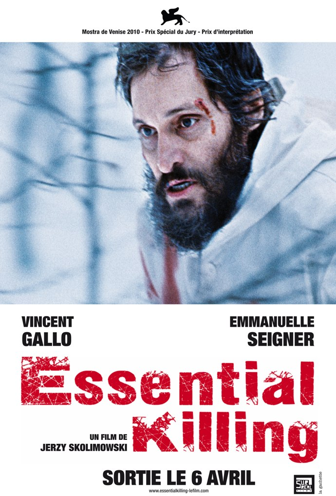
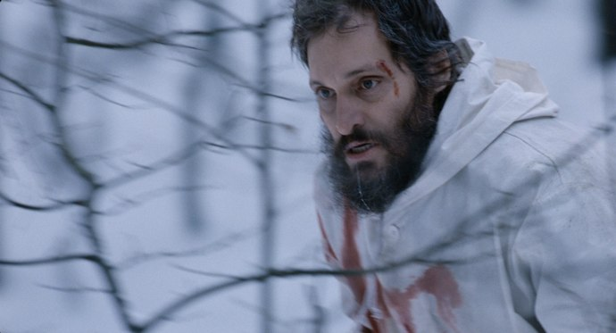
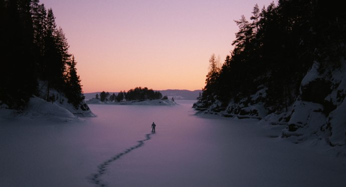

+++
titre = "Essential Killing, Jerzy Skolimowski"
title = "Essential Killing, Jerzy Skolimowski"
url = "/essential-killing-skolimowski"
date = "2010-12-13T01:15:31"
Lastmod = "2011-03-23T23:48:13"
cover = "essential-killing-skolimowski.jpg"
categorie = [ "À voir" ]
tag = [ "Arcs 2010", "Drame", "Expérience", "Festival", "Guerre", "Vite oublié" ]
createur = [ "Jerzy Skolimowski" ]
acteur = [ "Vincent Gallo" ]
annee = [ "2011" ]
weight = 2011
pays = [ "France", "Pologne" ]

+++

Rarement affiche aura été aussi éloignée d&rsquo;un film, au moins dans sa version originale. <em>Essential Killing</em> est, certes, l&rsquo;histoire d&rsquo;un terroriste musulman arrêté en Afghanistan, il y a bien des hélicoptères et Emmanuelle Seigner joue bien dans le film. Mais le dernier film de Jerzy Skolimowski n&rsquo;a rien d&rsquo;un film de guerre et tient bien plus de l&rsquo;expérience cinématographique tendance course dans la neige. Le réalisateur polonais compose un film sans dialogue, mais avec une bande-son riche, avec un seul acteur et avec extrêmement peu d&rsquo;explications ou justifications. Si le film n&rsquo;est pas totalement inintéressant, il paraît tout de même vite un peu gratuit.

&nbsp;

L&rsquo;action ouvre dans le désert afghan : trois soldats américains avancent pour une mission qui restera secrète. Au détour d&rsquo;une grotte, un homme les tue à la roquette. Commence alors une vaste et longue chasse à l&rsquo;homme : Mohammed, le terroriste est rapidement capturé sur le sol afghan, mais il parvient à se libérer pendant son transfert vers un pays européen censé être mystérieux où l&rsquo;on parle couramment polonais. Après le désert afghan, la traque se poursuit donc dans la neige polonaise. Aux trousses de Mohammed, des Américains, des Polonais, des chiens aussi. La traque est impitoyable et notre héros en est rendu à manger des fourmis, quand ce n&rsquo;est pas l&rsquo;écorce d&rsquo;un arbre ou même le lait d&rsquo;une femme enceinte qui passait par là. Plusieurs jours durant, il survit aux conditions difficiles, dort dans les mangeoires pleines de paille, se fait charcuter par un piège à loups ou par un arbre qui s&rsquo;abat sur lui. Ses forces faiblissent peu à peu et c&rsquo;est cette lente agonie que montre le film.

<em>Essential Killing</em> n&rsquo;est pas le genre de film qui explicite le moindre détail du récit pour ne rien laisser dans l&rsquo;ombre. C&rsquo;est au contraire un film parcouru par l&rsquo;ombre permanente, qui donne au spectateur très peu d&rsquo;éléments pour comprendre l&rsquo;histoire ou son personnage principal. L&rsquo;ouverture est pourtant assez réaliste et même si l&rsquo;on ignore la mission des trois soldats, la raison de la présence de Mohammed et son geste, on est néanmoins en terrain connu. Le contexte de la guerre en Afghanistan situe temporellement le récit, mais il se révèle vite une mauvaise piste pour la suite du film qui débarque brusquement en Europe. Les raisons ne sont pas explicitées, mais on <a href="http://fr.wikipedia.org/wiki/Prisons_secrètes_de_la_CIA">sait</a> que les Américains ont fait transiter des prisonniers notamment en Pologne. Mais le film devient ensuite très mystérieux quand commence cette course-poursuite incessante du fuyard. Les motivations de Mohammed restent largement inconnues, même si une série de flashbacks donnent quelques pistes. On comprend qu&rsquo;il a participé aux mouvements islamistes radicaux et on devine qu&rsquo;il est arrivé quelque chose de tragique à sa femme et son fils, mais c&rsquo;est à peu près tout. Qu&rsquo;est-ce qui motive cet homme blessé à fuir sans jamais s&rsquo;arrêter dans un pays qui lui est totalement étranger ? Il semble particulièrement adapté à la survie en conditions extrêmes, sans que l&rsquo;on n&rsquo;en connaisse pas plus les raisons. Et puis pourquoi les Américains tiennent absolument à le capturer vivant ? Tout semble concorder pour dire qu&rsquo;il s&rsquo;agit d&rsquo;un terroriste très important pour l&rsquo;armée américaine, mais le film ne prend pas la peine de l&rsquo;expliciter.

Un film n&rsquo;a pas à tout expliquer pour convaincre, au contraire même, le trop-plein d&rsquo;explications devient contre-productif et peut nuire à un film. Néanmoins, <em>Essential Killing</em> paraît bien gratuit : à force de ne rien dire, on finit par perdre tout intérêt pour l&rsquo;histoire ou pour son personnage. On en viendrait même à se demander si Jerzy Skolimowski n&rsquo;a pas surtout désiré filmer la rougeur du sang sur la blancheur de la neige, des vêtements ou encore d&rsquo;un cheval. C&rsquo;est faux bien entendu, il y a bien plus que cela dans <em>Essential Killing</em>, mais force est de constater que la vacuité du scénario lasse rapidement. On en finit par espérer que le personnage crève enfin et que le film se termine, preuve qu&rsquo;il y a bien un souci de ce côté. L&rsquo;expérience cinématographique a un intérêt en soi, mais un intérêt limité : certes, Jerzy Skolimowski parvient à filmer 1h30 de course dans les forêts enneigées avec quasiment un seul acteur et pas de dialogue, mais arrive un moment où l&rsquo;on se demande ce qui motive le réalisateur et son film. C&rsquo;est d&rsquo;autant plus gênant que le film n&rsquo;est pas totalement dénué de profondeur et apporte un contexte lourd de sens avec la guerre en Afghanistan. Comme dans le récent <em><a href="http://voiretmanger.fr/2010/11/07/buried-cortes/">Buried</a></em>, la guerre sert de cadre général, de prétexte même, au film qui n&rsquo;en fait pas nécessairement grand usage. Dans <em>Essential Killing</em>, la guerre afghane n&rsquo;a aucun intérêt par rapport à la traque qui aurait tout aussi bien pu se passer à une autre époque, à un autre endroit, et avec un autre homme qu&rsquo;un terroriste islamique. C&rsquo;est aussi sur ce contexte que le film est le moins convaincant. Les quelques flashbacks qui parcourent <em>Essential Killing</em> sont aussi mauvais sur la forme, caricaturale au possible, que sur le fond, composé d&rsquo;une série de clichés dignes d&rsquo;une discussion de comptoir. Fallait-il vraiment que le héros terroriste porte la barbe et s&rsquo;appelle comme le Prophète (le prénom est très courant, certes) ? <em>In fine</em>, on ne sait pas bien ce qu&rsquo;a voulu dire le réalisateur, mais on ne peut s&rsquo;empêcher de trouver cela un peu limite.

<em>Essential Killing</em> est une expérience de cinéma par sa forme particulière. Sans aller vers l&rsquo;expérimentation visuelle comme avait pu le faire Gaspard Noé dans <em><a href="http://voiretmanger.fr/2010/05/04/enter-the-void-noe/">Enter the Void</a></em>, ce film restant visuellement assez classique, Jerzy Skolimowski utilise beaucoup la bande-son. La musique y prend une part importante, mais pas autant que les bruitages, toujours très présents, que ce soit pour les bruits de pas ou de souffle du héros, ou pour pâles d&rsquo;hélicoptères, par exemple. À plusieurs reprises, le son était celui entendu par Mohammed pour une vision interne toujours très efficace. Le héros est toujours à la limite de la folie, comme en témoignent ses visions et c&rsquo;est aussi à la bande-son de retranscrire cet état de folie avec des sons forts, parfois stridents, souvent volontairement pénibles. <em>Essential Killing</em> est un film pratiquement sans dialogues et avec un acteur principal omniprésent et totalement muet. Vincent Gallo est un très bon acteur pour ce rôle que l&rsquo;on suppose difficile, mais qu&rsquo;il semble avoir déjà interprété. Cela étant, les émotions peinent à transpercer et au-delà de la prouesse physique, c&rsquo;est loin d&rsquo;être son plus intéressant rôle.

<em>Essential Killing</em> n&rsquo;est pas sans intérêt, ce serait idiot de le dire. Ne serait-ce que pour son côté expérience cinématographique un peu extrême, le dernier film de Jerzy Skolimowski mérite que l&rsquo;on s&rsquo;y intéresse. Reste que passé l&rsquo;intérêt purement technique, le film peine à convaincre. À force de ne jamais vouloir en dire trop, de supprimer toute explication, le film perd de son intérêt et on finit rapidement par s&rsquo;y désintéresser totalement. L&rsquo;expérience de cinéma paraît assez gratuite et si certains pourront y trouver des explications métaphysiques, on peut aussi trouver qu&rsquo;elle n&rsquo;apporte pas grand-chose au Septième art.

<em>Sortie en salles le 6 avril</em>

