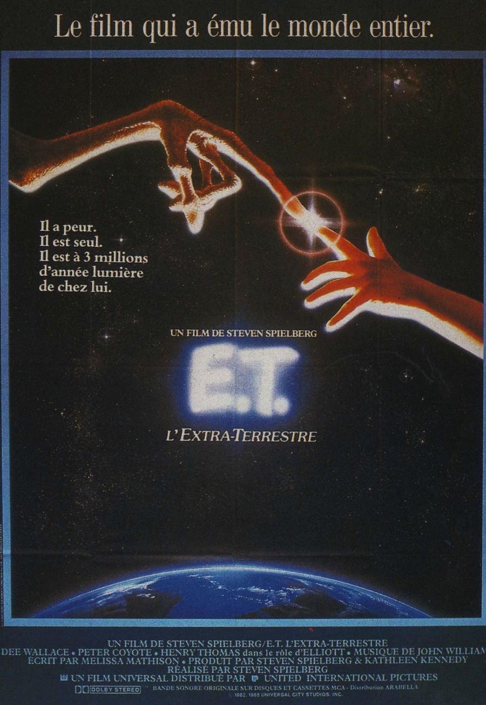
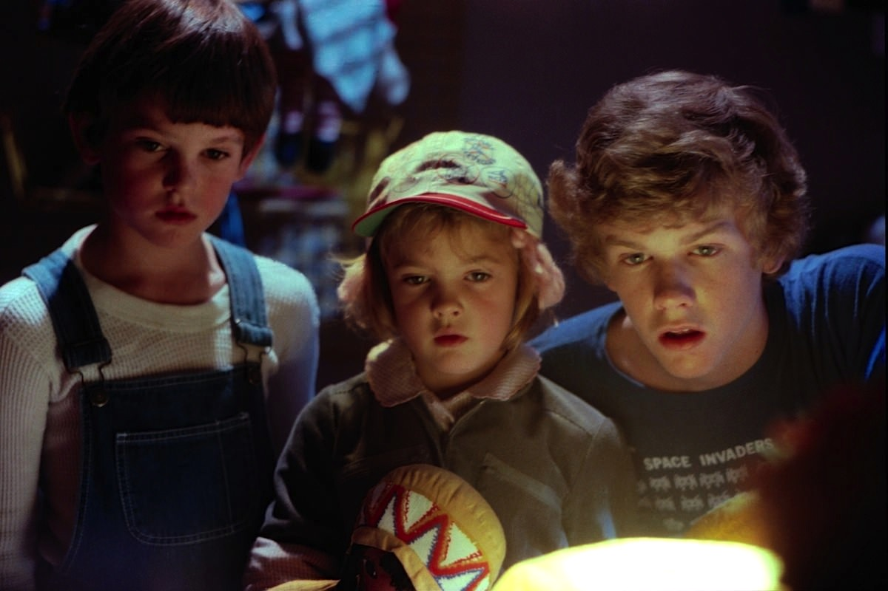
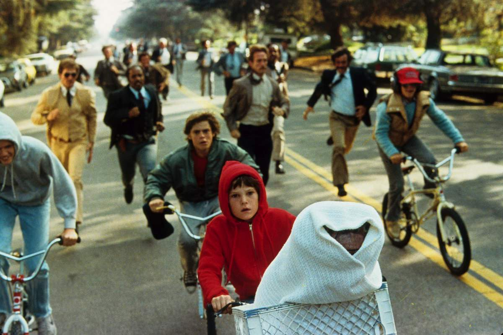

+++
type = "post"
titre = "<em>E.T. l&rsquo;extra-terrestre</em>, Steven Spielberg"
title = "E.T. l'extra-terrestre, Steven Spielberg"
url = "/et-extra-terrestre-spielberg"
date = "2013-02-19T00:10:08"
Lastmod = "2014-12-06T15:37:35"
cover = "et-extra-terrestre-spielberg.jpg"
categorie = [ "À voir" ]
tag = [ "Blockbuster", "Enfance", "Extra-terrestre", "Famille", "Science-Fiction", "Société" ]
createur = [ "Steven Spielberg" ]
acteur = [ "Dee Wallace", "Drew Barrymore", "Henry Thomas" ]
annee = [ "1982" ]
weight = 1982
pays = [ "États-Unis" ]
original = "E.T. The Extra-Terrestrial"

+++

Cinq Oscars et onze ans en tête du box-office dans le monde : quand <em>E.T. l’extra-terrestre</em> sort sur les écrans du monde entier en 1982, le dernier blockbuster de Steven Spielberg emporte tout sur son passage. En attendant la sortie de <em>Jurassic Park</em>, autre long-métrage du cinéaste, c’est cette histoire d’amitié entre un garçon et un extra-terrestre qui bat tous les records au cinéma, loin devant les précédents succès du réalisateur. Depuis <em>Les Dents de la mer</em>, Steven Spielberg est entré dans la cour des grands et il enchaîne les succès. Ce nouveau long-métrage signe son retour à la science-fiction, cinq ans après <a href="http://voiretmanger.fr/2013/02/15/rencontres-du-troisieme-type-spielberg/" title="Rencontres du troisième type, Steven Spielberg - À voir et à manger"><em>Rencontres du troisième type</em></a>, mais <em>E.T. l’extra-terrestre</em> est un film bien différent. Visant un public plus large, il embarque les enfants et leurs parents dans une formidable histoire d’amitié, avant d’être un film de science-fiction. Une très belle réussite, qui n’a quasiment pas pris une ride.

Alors que l’on devait attendre la toute fin de <em>Rencontres du troisième type</em> pour enfin découvrir les êtres venus de l’espace, <em>E.T. l’extra-terrestre</em> ouvre avec une soucoupe spatiale. On ne sait pas pourquoi ces petits extra-terrestres sont venus sur notre planète, ce n’est de toute façon pas le sujet du film, mais on les voit se poser dans une forêt et partir à la découverte des alentours. Alors que cette approche est pacifique et apaisée, Steven Spielberg filme l’arrivée d’humains de manière brutale et énervée. On ne connait pas plus leurs motivations, mais l’attitude de ce qui semble être le FBI ou un autre organe gouvernemental n’est pas agréable pour les nouveaux venus qui repartent aussi rapidement qu’ils sont venus. Si rapidement qu’ils oublient derrière eux l’un des leurs : poussée par les humains, la créature termine dans le petit cabanon au fond du jardin tout à fait banal, près d’une maison tout aussi banale d’un grand lotissement de la côte ouest des États-Unis. Cette maison absolument sans intérêt est pourtant celle d’Elliot, un garçon d’une dizaine d’années qui tombe par hasard sur la créature spatiale. Après une courte phase apeurée, les deux êtres qui font à peu près la même taille finissent par s’apprivoiser. Steven Spielberg fait le pari d’une science-fiction non seulement pacifique, mais aussi amicale : loin de la guerre de  <a href="http://voiretmanger.fr/archives/saga-star-wars/" title="La saga Star Wars - À voir et à manger">la saga <em>Star Wars</em></a> qui cartonne au cinéma à la même époque, <em>E.T. l’extra-terrestre</em> propose une lecture reposée, où ni la science, ni la fiction futuriste ne sont essentielles.

De fait, <em>E.T. l’extra-terrestre</em> est d’abord un film sur l’amitié et sur l’enfance, avant d’être une œuvre de science-fiction. Inspiré par son histoire personnelle, le scénario mis en image par Steven Spielberg fait la part belle à Elliot et sa relation amicale avec l’extra-terrestre renommé ET. Cette amitié n’est pas immédiate, elle nait et se développe tout au long du film en débutant sur une phase de découverte réciproque. La créature venue de l’espace ne sait pas parler l’anglais et elle n’a aucun moyen de communiquer avec le garçon, si ce n’est pas ses regards attendrissants qu’un chat n’aurait pas renié. Le garçon va très vite adopter le petit être, mais l’enjeu principal est d’abord de cacher ce dernier à sa mère. Commence une stratégie mise en œuvre avec le concours de Michael, son grand frère, et de Gertie, sa petite sœur, pour cacher E.T., quitte à se faire porter pale pour ne pas aller à l’école. <em>E.T. l’extra-terrestre</em> exploite des thèmes assez classiques dans cette catégorie de films pour les enfants, mais Steven Spielberg a l’excellente idée de ne jamais leur parler comme à des demeurés. Le cinéaste puise dans sa propre histoire pour évoquer celle d’Elliot et de son ami surnaturel : comme lui, le garçon a perdu symboliquement son père après le divorce de ses parents. Le réalisateur s’était alors créé un personnage imaginaire, un extra-terrestre justement, pour combler le vide. Le garçon de son film n’a pas à le faire, mais la thématique du père absent — figure centrale dans l’œuvre de Spielberg — est bien représentée.

<em>E.T. l’extra-terrestre</em> met en avant l’amitié d’Elliot et de l’extra-terrestre, mais le septième long-métrage de Steven Spielberg ne se contente pas de choisir un enfant pour des raisons marketing. Même si le choix d’un garçon de dix ans attire nécessairement les plus jeunes dans les salles, tout le film est placé sous le signe de l’opposition entre les enfants et le monde des adultes. Sans surprise, ce dernier est présenté de manière beaucoup plus négative, voire pas présenté du tout. Pendant toute la première partie du film, le cinéaste a choisi de ne jamais représenter de visage adulte, à l’exception de la mère de la famille. Tous les autres personnages, et en particulier ceux qui pourchassent les extra-terrestres dans la séquence d’ouverture, ne sont jamais filmés de plain-pied, mais uniquement d’en bas, comme s’ils étaient en permanence vus par un enfant. E.T. ayant la taille d’un enfant, ce point de vue permet de renforcer au passage le point de vue de la créature, mais ce choix est largement justifié dans <em>E.T. l’extra-terrestre</em>. Quand le monde des adultes prend le dessus dans la deuxième partie, ce n’est que pour des catastrophes : on sépare Elliot et son ami et tout va de travers. Il faudra l’astuce et la détermination du clan des enfants pour reprendre le dessus, au prix d’un affrontement d’autant plus terrible que les rapports de force sont totalement inégaux. À cet égard, on recommandera plutôt la version originale avec ses pistolets, plutôt que la version adoucie avec talkies-walkies réalisée pour le vingtième anniversaire du film, en 2002.

Steven Spielberg, de la même manière que George Lucas sur la saga <em>Star Wars</em>, a profité des innovations technologiques récentes en matière d’effets spéciaux pour retoucher ici ou là <em>E.T. l’extra-terrestre</em>. Le travail a été minime toutefois, tant le long-métrage tient la distance sur le plan formel. Certes, on fait mieux que les marionnettes aujourd’hui pour représenter une créature imaginaire, comme l’a montré ces dernières années la trilogie <em>Le Seigneur des Anneaux</em>. Reste que cette animation à l’ancienne conserve tout son charme et tout comme on peut préférer le Yoda en marionnette à son pendant numérique, on peut apprécier le travail réalisé ici sur E.T. Steven Spielberg a eu la bonne idée de créer une créature assez repoussante, bien éloignée des êtres lisses qu’il avait imaginé pour <em>Rencontres du troisième type</em>, mais au contraire pleine de rides et avec de gros yeux disgracieux. Si l’extra-terrestre n’est pas joli objectivement, il n’en est pas moins mignon et la force du film est justement de séduire le spectateur avec cette créature qui ne répond pas à nos standards de beauté. <em>E.T. l’extra-terrestre</em> bénéficie pour cela du travail sur la marionnette, mais aussi de la <a href="http://www.amazon.fr/gp/product/B0000639AI/ref=as_li_ss_tl?ie=UTF8&tag=leblogdenic07-21&linkCode=as2&camp=1642&creative=19458&creativeASIN=B0000639AI">musique de John Williams</a>, extrêmement classique bien entendu, mais tout aussi efficace. Le choix de tourner le film dans l’ordre de son scénario et non, comme c’est habituellement le cas, dans l’ordre le plus logique en terme de décors, a indéniablement contribué à son succès. Tous les jeunes acteurs sont épatants et on sent que leur surprise n’est pas totalement feinte, ce qui ne la rend que plus efficace.

Un film ne rencontre pas un aussi large public pour de mauvaises raisons. Si <em>E.T. l’extra-terrestre</em> a réussi à emporter l’adhésion au point de battre les records de fréquentation au cinéma pendant plus de dix ans, c’est que Steven Spielberg a trouvé la formule parfaite. S’adressant aux plus jeunes, il n’a pas oublié les parents et compose au total une œuvre universelle qui a largement dépassé son origine de science-fiction. Un classique, à voir et à revoir en famille !

<h3>Vous voulez m&rsquo;aider ?</h3>
<ul>
<li><a href="http://www.amazon.fr/gp/product/B0087OYKM0/ref=as_li_ss_tl?ie=UTF8&tag=leblogdenic07-21&linkCode=as2&camp=1642&creative=19458&creativeASIN=B0087OYKM0">Acheter le film en Blu-Ray et DVD sur Amazon</a></li>
<li><a href="http://www.amazon.fr/gp/product/B00006FWRW/ref=as_li_ss_tl?ie=UTF8&tag=leblogdenic07-21&linkCode=as2&camp=1642&creative=19458&creativeASIN=B00006FWRW">Acheter le film en DVD sur Amazon</a></li>
<li><a href="https://itunes.apple.com/fr/movie/e.t.-lextra-terrestre-e.t./id551129608">Acheter ou louer le film sur l&rsquo;iTunes Store</a></li>
</ul>

