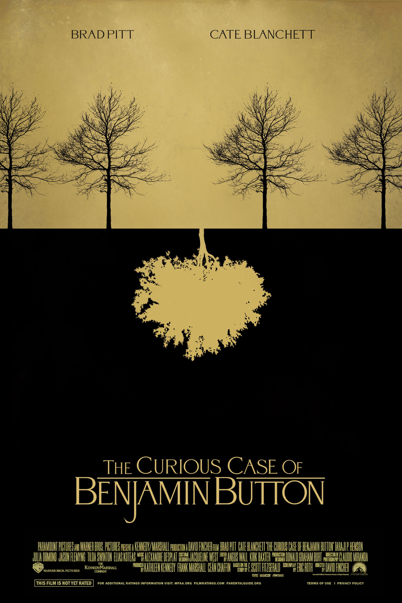
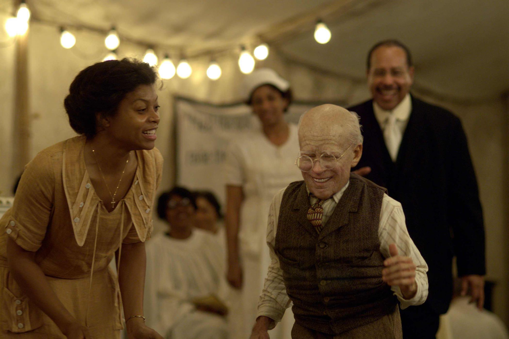

+++
titre = "<em>L&rsquo;Étrange Histoire de Benjamin Button</em>, David Fincher"
title = "L'Étrange Histoire de Benjamin Button, David Fincher"
url = "/etrange-histoire-benjamin-button-fincher"
date = "2015-02-16T22:45:47"
Lastmod = "2015-02-16T22:55:45"
cover = "etrange-histoire-benjamin-button-brad-pitt-cate-blanchett.jpg"
categorie = [ "À voir" ]
tag = [ "Adaptation littéraire", "Amour", "Drame", "Famille", "Fantastique", "Romance" ]
createur = [ "David Fincher" ]
acteur = [ "Brad Pitt", "Cate Blanchett", "Jared Harris", "Taraji P. Henson" ]
annee = [ "2009" ]
weight = 2009
pays = [ "États-Unis" ]
original = "The Curious Case of Benjamin Button"

+++

Adapté d&rsquo;une nouvelle de F. Scott Fitzgerald, <em>L&rsquo;Étrange Histoire de Benjamin Button</em> est d&rsquo;abord une idée non seulement très originale, mais qui plus est vraiment excellente. L&rsquo;écrivain américain a su dynamiter la romance qu&rsquo;il allait écrire en jouant sur l&rsquo;évolution du temps. Benjamin et Daisy s&rsquo;aiment pour toujours à partir d&rsquo;une rencontre d&rsquo;enfance qui était aussi un coup de foudre, mais ils évoluent en sens inverse. Né nourrisson de 80 ans, le héros de cette histoire rajeunit jusqu&rsquo;à mourir à nouveau comme un nourrisson. C&rsquo;est improbable, mais cette petite dose de fantastique au sein d&rsquo;une œuvre par ailleurs complètement réaliste renouvelle tout à fait le genre. L&rsquo;adaptation de David Fincher a parfaitement su rendre les enjeux soulevés par le film autour du temps et sa vision de <em>L&rsquo;Étrange Histoire de Benjamin Button</em> est une vraie réussite. Un film ample, qui sait prendre son temps, et qui s&rsquo;impose avec force et émotion par sa conclusion poignante.

David Fincher retarde au maximum la découverte de l&rsquo;étonnante réalité qui sert de colonne vertébrale à son récit. Le cinéaste n&rsquo;entre pas immédiatement dans le vif du sujet et ajoute une couche autour de son étrange histoire. Ainsi, le film ouvre en 2005, à la Nouvelle-Orléans, juste avant une tempête qui s&rsquo;annonce terrible et que l&rsquo;on associe vite à l&rsquo;<a href="https://fr.wikipedia.org/wiki/Ouragan_Katrina">ouragan Katrina</a>. Ce n&rsquo;est pas le sujet de <em>L&rsquo;Étrange Histoire de Benjamin Button</em>, mais cette tempête vient interrompre le récit de temps à autres, et le cinéaste pose ainsi l&rsquo;un des personnages au cœur de l&rsquo;histoire. On découvre ainsi Daisy, alors très âgée et manifestement sur le point de mourir ; à ses côtés, sa fille devenue adulte, qui l&rsquo;accompagne en attendant la mort. La mère demande de sortir un journal intime et on comprend assez vite que c&rsquo;est celui écrit par Benjamin de son vivant. C&rsquo;est d&rsquo;ailleurs lui qui est le narrateur principal de l&rsquo;histoire, et au-delà de cette enveloppe qui se déroule quasiment au présent, le long-métrage suit la chronologie de son récit. De fait, <em>L&rsquo;Étrange Histoire de Benjamin Button</em> débute avec la naissance du héros, mais comme on l&rsquo;évoquait plus tôt, son caractère étrange n&rsquo;est pas révélé immédiatement. En donnant naissance à Benjamin, sa mère ne survit pas, comme c&rsquo;est souvent le cas dans les années 1910 et son père, devenu veuf, se précipite pour abandonner le petit. C&rsquo;est que, comme on finit par le voir, ce bambin a les rides d&rsquo;un vieux de 80 ans. Abandonné près d&rsquo;un hospice pour vieux et alors que les médecins ne lui donnent que quelques jours pour vivre, il est recueilli par Queeny qui devient sa mère. Et en grandissant, ses traits de vieil homme s&rsquo;estompent progressivement : il ne faut pas longtemps pour comprendre qu&rsquo;il rajeunit. David Fincher ne remet pas en cause cette idée, pas plus qu&rsquo;aucun de ses personnages d&rsquo;ailleurs ; pas plus que cette pointe de fantastique n&rsquo;entache le reste du film. Comme son titre l&rsquo;indique assez bien, <em>L&rsquo;Étrange Histoire de Benjamin Button</em> est un récit curieux, mais ce n&rsquo;est pas, au fond, l&rsquo;enjeu principal.

Benjamin rencontre Daisy alors qu&rsquo;ils ne sont qu&rsquo;enfants, même si lui a toujours le corps d&rsquo;un vieillard. Pour autant, la jeune fille tombe immédiatement amoureuse de cet étonnant garçon et <em>L&rsquo;Étrange Histoire de Benjamin Button</em> est avant tout l&rsquo;histoire de leur amour. Sans cette progression inversée, elle aurait été très banale, mais l&rsquo;idée exploitée par David Fincher change tout. Les deux personnages se croisent à un moment donné, autour de leur quarantaine, mais pendant la majorité de leur vie, ils sont déphasés. Soit parce que lui est trop vieux pour elle, soit au contraire parce qu&rsquo;il devient trop jeune. Une belle idée, qui permet au long-métrage d&rsquo;embrasser d&rsquo;autres thématiques plus profondes, que ce soit sur le sens du destin ou sur la coïncidence, ou non, de deux amours. Le drame de cette étrange histoire, c&rsquo;est bien que deux êtres qui s&rsquo;aiment ne peuvent vivre leur amour que très peu d&rsquo;années dans leur vie. Et si F. Scott Fitzgerald a imaginé des raisons concrètes qui empêchent leur réunion avant ou après avec ce personnage qui remonte dans le temps, le récit peut être généralisé avec un message universel. <em>L&rsquo;Étrange Histoire de Benjamin Button</em> montrerait alors que l&rsquo;on n&rsquo;est vraiment sur la même longueur d&rsquo;ondes que sur une courte période, même quand il s&rsquo;agit de l&rsquo;histoire d&rsquo;une vie. David Fincher a parfaitement su exploiter cette piste, avec notamment une fin pleine d&rsquo;émotion qui prouve bien le succès de son adaptation. Il faut dire qu&rsquo;il peut compter sur des acteurs convaincants dans des rôles très difficiles. Certes, on pourrait critiquer certains maquillages un peu trop visibles, en particulier quand Benjamin est au début et à la fin de sa vie, force est de reconnaître toutefois que tous les acteurs s&rsquo;en sortent très bien. Brad Pitt et Cate Blanchett dans les deux rôles principaux sont excellents, mais le cinéaste peut aussi compter sur de très bons seconds rôles, de Taraji P. Henson à Tilda Swinton, en passant par Jared Harris. Au-delà du casting, la maîtrise formelle du cinéaste est incontestable et on peut très bien critiquer un goût un peu marqué pour le sépia, là encore, il est difficile de faire le difficile et de ne pas noter la très grande fluidité de la mise en scène pendant 2h40.

<em>L&rsquo;Étrange Histoire de Benjamin Button</em> est construit à partir d&rsquo;un point de départ vraiment bien trouvé, mais cela ne suffisait pas à en faire un bon film. Heureusement, David Fincher a su construire le long-métrage qu&rsquo;il fallait autour de cette idée et le résultat est réjouissant. Porté par la <a href="http://www.amazon.fr/gp/product/B001KZBKD0/ref=as_li_ss_tl?ie=UTF8&amp;tag=leblogdenic07-21&amp;linkCode=as2&amp;camp=1642&amp;creative=19458&amp;creativeASIN=B001KZBKD0">musique</a> très conventionnelle, mais totalement appropriée, d&rsquo;Alexandre Desplat, la septième réalisation de David Fincher est une vraie réussite, à (re)voir avec beaucoup de plaisir !

<h3>Vous voulez <a href="http://voiretmanger.fr/soutien/">m&rsquo;aider</a> ?</h3>
<ul>
<li><a href="http://www.amazon.fr/gp/product/B001Q9EKGO/ref=as_li_ss_tl?ie=UTF8&amp;tag=leblogdenic07-21&amp;linkCode=as2&amp;camp=1642&amp;creative=19458&amp;creativeASIN=B001Q9EKGO">Acheter le film en Blu-ray sur Amazon</a></li>
<li><a href="http://www.amazon.fr/gp/product/B001Q9EKGE/ref=as_li_ss_tl?ie=UTF8&amp;tag=leblogdenic07-21&amp;linkCode=as2&amp;camp=1642&amp;creative=19458&amp;creativeASIN=B001Q9EKGE">Acheter le film en DVD sur Amazon</a></li>
<li><a href="https://itunes.apple.com/fr/movie/letrange-histoire-benjamin/id368964139">Acheter ou louer le film sur l&rsquo;iTunes Store</a></li>
<li><a href="http://www.netflix.com/WiMovie/70100380?trkid=13462100">Regarder le film sur Netflix</a></li>
</ul>

