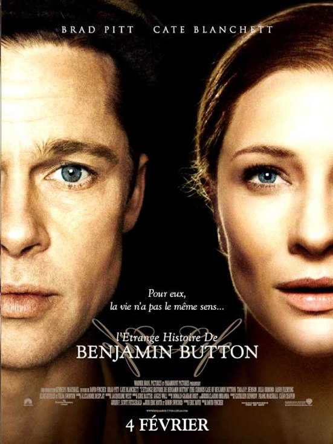

+++
type = "post"
titre = "L&rsquo;étrange histoire de Benjamin Button, David Fincher"
title = "L'étrange histoire de Benjamin Button, David Fincher"
url = "/etrange-histoire-de-benjamin-button-david-fincher"
date = "2009-02-17T00:56:05"
Lastmod = "2015-02-17T20:49:58"
cover = "etrange-histoire-benjamin-button-fincher.jpg"
categorie = [ "Archives du blog" ]

+++

<strong>Depuis la publication de cet article, j&rsquo;ai publié <a href="http://voiretmanger.fr/etrange-histoire-benjamin-button-fincher/" title="L’Étrange Histoire de Benjamin Button, David Fincher">une nouvelle critique du film</a>. Cet article est conservé à titre d&rsquo;archive.</strong>

Ce soir, j&rsquo;ai enfin vu <em>L&rsquo;étrange histoire de Benjamin Button</em> par David Fincher. Depuis l&rsquo;excellent <em>Zodiac</em>, ce dernier est devenu le réalisateur à la mode, et l&rsquo;accueil critique quasi unanime sur ce nouveau film ne laissait présager que du bon. Malheureusement, les espoirs sont un peu déçus&#8230;

<em>L&rsquo;étrange histoire de Benjamin Button</em>, adaptation très libre d&rsquo;une nouvelle de Fitzgerald, est d&rsquo;abord une idée géniale. Un nourrisson naît avec le corps d&rsquo;un nourrisson, mais l&rsquo;aspect d&rsquo;un vieillard de 80 ans, comme s&rsquo;il avait déjà vécu une vie. Puis il remonte le temps jusqu&rsquo;à mourir à 80 ans, mais avec l&rsquo;aspect d&rsquo;un nourrisson. Cet homme qui remonte le temps est une idée assez géniale, et elle l&rsquo;est d&rsquo;autant plus qu&rsquo;elle se croise avec la vie de la femme aimée qui, elle va, dans le bon sens.

Le film est ensuite une prouesse technique inimaginable il y a encore quelques années à peine. Les deux acteurs principaux, Cate Blanchett et Brad Pitt, sont rajeunis ou vieillis grâce aux joies des effets spéciaux numériques. Le film commence par une Cate Blanchett à l&rsquo;agonie et assez méconnaissable, si ce n&rsquo;est par la voix. Mais le plus impressionnant est, bien sûr, Brad Pitt qui, du vieillard au jeune homme en passant par son état actuel &laquo;&nbsp;normal&nbsp;&raquo; réussit la prouesse d&rsquo;être réaliste. Au début, on a du mal à le reconnaître, puis on retrouve ses traits habituels qui se précisent de plus en plus jusqu&rsquo;à atteindre l&rsquo;état actuel. Le rajeunissement est également très bien fait et réaliste, on a vraiment l&rsquo;impression d&rsquo;avoir un acteur d&rsquo;une vingtaine d&rsquo;années à l&rsquo;écran.

Malheureusement, ni cette idée de base, ni la prouesse technique ne font un bon film. Le problème vient, je pense, de la technique justement : si celle-ci se fait suffisamment discrète pour ne pas s&rsquo;imposer et écraser l&rsquo;histoire, elle prend paradoxalement le dessus, l&rsquo;air de rien, presque sans en avoir conscience. On a le sentiment que le réalisateur s&rsquo;est incliné face à la technique, n&rsquo;a pas su trop qu&rsquo;en faire et à finalement produit un film assez froid. La photographie est magnifique, pas de doutes à avoir sur ce point, mais quelque chose cloche. J&rsquo;ai passé beaucoup de temps à retrouver les traits du Brad Pitt actuel, au détriment de l&rsquo;histoire elle-même.

Par ailleurs, Brad Pitt n&rsquo;est pas très bon ici, et on l&rsquo;a vu bien meilleur (notamment dans le récent <em>Burn After Reading</em>). Il manque d&rsquo;expression et ne semble être touché par rien. Comme s’il avançait seul dans le film et se contentait de croiser la route de quelques personnages secondaires insignifiants, un peu à la manière d&rsquo;un Picaro. Le film se résume tout entier au personnage et à son étrange pathologie, tout le reste n&rsquo;est que secondaire. Dommage, car il y avait de très bonnes idées, comme celle de la maison de retraite en guise de maison d&rsquo;enfance, ou de l&rsquo;extravagant marin artiste.

D&rsquo;autre part, le film m&rsquo;a semblé vraiment lourd sur la symbolique. Au début du film, une horloge qui tourne à l&rsquo;envers est installée à la gare de la Nouvelle-Orléans et le héros vient au monde. À la fin du film, elle est décrochée pour être remplacée par une autre qui tourne dans le bon sens, tandis que l&rsquo;ancienne est coulée par Katrina et que notre héros meurt. Certes, on est dans un <em>blockbuster</em> et il ne faut pas s&rsquo;attendre à une finesse psychologique sur développée, mais quand même.

Tous ces problèmes sont renforcés par la longueur du film. Il dure 2h40 et si je n&rsquo;ai rien contre les films longs, cela pose un problème quand on en vient à trouver le temps long. Ce serait mentir de dire que je me suis ennuyé, mais il est vrai que je me suis impatienté à plusieurs reprises. Étant donné que l&rsquo;on sait précisément quand le personnage mourra, on sait que l&rsquo;on aura droit à toutes les étapes de la vie, et parfois, on trépigne un peu d&rsquo;impatience je dois dire. Heureusement, la fin sur l&rsquo;enfance est plus brève, sans doute parce que Brad Pitt ne jouait pas et qu&rsquo;au vu de son cachet, son temps à l&rsquo;écran  a été maximisé. Dommage que le film soit trop long, je suis persuadé qu&rsquo;il aurait gagné en étant plus court d&rsquo;au moins 40 minutes, voire une heure.

Je ne dirais pas que <em>L&rsquo;étrange histoire de Benjamin Button</em> est un mauvais film, non. Mais j&rsquo;en attendais beaucoup, et j&rsquo;ai été un peu déçu. Le film est, certes, magnifique, la réalisation très soignée (trop, peut-être ?), mais finalement, ça ne fonctionne pas vraiment et on est plus admiratif face à la prouesse technique que l&rsquo;histoire proprement dite.

Comme le suggère le critique de <a href="http://www.critikat.com/L-Etrange-Histoire-de-Benjamin.html">Critikat</a>, Kubrick a dit beaucoup plus et beaucoup mieux sur le temps dans la scène finale de <em>2001, odyssée de l&rsquo;espace</em> qui était beaucoup plus brève et dense, que David Fincher avec tout ce film. Je pense qu&rsquo;il aurait gagné à être plus dense et plus bref.

Pour le coup, je ne comprends pas bien <em><a href="http://www.telerama.fr/cinema/films/l-etrange-histoire-de-benjamin-button,372007,critique.php">Télérama</a></em> qui a vraiment aimé le film. Peut-être suis-je le seul responsable en étant resté insensible aux charmes du film ? À moins que ça ne soit eux qui se sont fait avoir, comme le suggère Critikat, par la &laquo;&nbsp;poudre numérique&nbsp;&raquo; du film ? En tout cas, sans aller forcément jusqu&rsquo;à la critique du cinéma en général qu&rsquo;ils font, je rejoins pour le coup l&rsquo;avis de ce site.

Et c&rsquo;est bien dommage, car j&rsquo;aurais adoré aimer ce film&#8230;

<h3>Vous voulez m&rsquo;aider ?<a href="#footnote_0_1208" id="identifier_0_1208" class="footnote-link footnote-identifier-link" title="&Agrave; propos de la publicit&eacute;&hellip;">1</a></h3>
<ul>
<li><a href="http://www.amazon.fr/gp/product/B001Q9EKGO/ref=as_li_ss_tl?ie=UTF8&#038;tag=leblogdenic07-21&#038;linkCode=as2&#038;camp=1642&#038;creative=19458&#038;creativeASIN=B001Q9EKGO">Acheter le film en Blu-Ray sur Amazon</a></li>
<li><a href="http://www.amazon.fr/gp/product/B001Q9EKGE/ref=as_li_ss_tl?ie=UTF8&#038;tag=leblogdenic07-21&#038;linkCode=as2&#038;camp=1642&#038;creative=19458&#038;creativeASIN=B001Q9EKGE">Acheter le film en DVD sur Amazon</a></li>
<li><a href="http://itunes.apple.com/fr/movie/letrange-histoire-benjamin/id384826485">Acheter le film sur l&rsquo;iTunes Store</a></li>
</ul>

<ol class="footnotes"><li id="footnote_0_1208" class="footnote"><a href="http://voiretmanger.fr/soutien/">À propos de la publicité…</a> [<a href="#identifier_0_1208" class="footnote-link footnote-back-link">&#8617;</a>]</li></ol>
