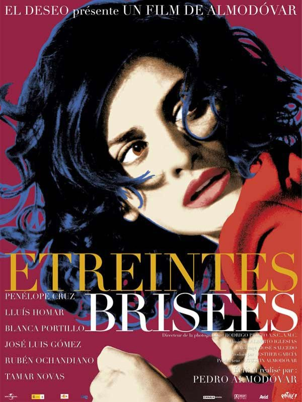
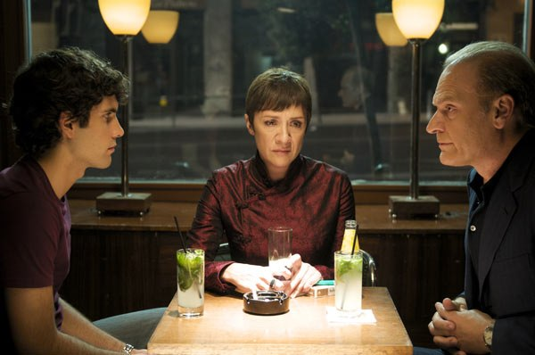
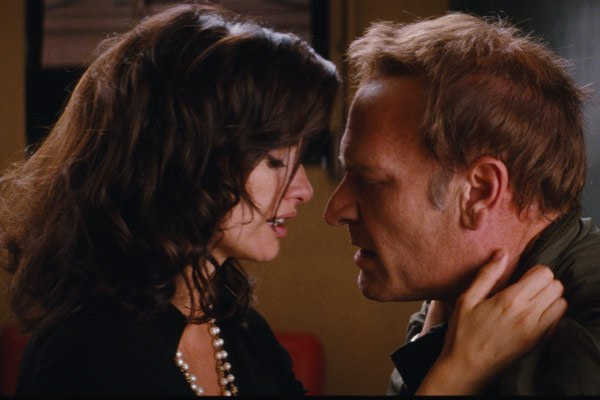

+++
type = "post"
titre = "Étreintes brisées, Almodóvar"
title = "Étreintes brisées, Almodóvar"
url = "/etreintes-brisees-almodovar"
date = "2009-05-22T22:01:25"
Lastmod = "2012-05-10T12:27:24"
cover = "almodovar-etreintes-brisees-e1265027051349.jpg"
categorie = [ "À voir" ]
tag = [ "Amour", "Drame", "Famille" ]
annee = [ "2009" ]
weight = 2009

+++

Pedro Almodóvar fait partie de ces quelques réalisateurs que je vais voir par principe, sans me demander de quoi parle leur dernier film, ou même chercher à savoir s&rsquo;il est bon. J&rsquo;ai donc vu cet après-midi <em>Étreintes brisées</em>, son dernier et dix-septième film, en compétition officielle à Cannes. Comme prévu, je n&rsquo;ai pas regretté, ce nouvel Almodóvar est un grand cru.

Pedro Almodóvar n&rsquo;est pas de ces réalisateurs imprévisibles qui changent radicalement de style à chaque film. Bien au contraire, le réalisateur espagnol semble suivre et creuser sa propre voie, de film en film, en améliorant sans cesse un style et un univers aisément reconnaissables. <em>Étreintes brisées</em> ne fait pas exception à la règle : on est ici en terrain connu, une impression que ne peut que renforcer la présence d&rsquo;acteurs déjà vus dans le cinéma Almodóvarien, et d&rsquo;abord celle de la penélopissime (© <em>Inrocks</em>) Penélope Cruz, qui jouait déjà dans <em>Volver</em>. Un mot, donc, à propos de l&rsquo;actrice qui est vraiment toujours aussi bien, calmée par rapport à sa dernière (?) prestation sur grand écran, <a href="http://voiretmanger.fr/2008/10/11/vicky-cristina-barcelona-woody-allen/">chez Woody Allen</a>. Elle joue ici une femme fatale, d&rsquo;abord secrétaire/amante d&rsquo;un homme vieux, mais riche, puis actrice débutante/amante d&rsquo;un réalisateur et à chaque fois elle est parfaite et transcrit toutes les émotions attendues, le film n&rsquo;en faisant pas tant une femme fatale qu&rsquo;une victime de ses charmes.

<em>Étreintes brisées</em> est d&rsquo;abord un film complexe par son scénario et sa construction. Tout le film se construit autour d&rsquo;un flashback, avec le récit d&rsquo;événements s&rsquo;étant déroulés une quinzaine d&rsquo;années avant l&rsquo;action principale. Mais contrairement à trop de récits en flashback, point de lourdeur ici et à aucun moment le spectateur ne se perd dans les méandres d&rsquo;un récit brouillé sur le plan temporel. On commence à Madrid en 2008, puis on passe à Madrid en 1994 sans que le lien entre les deux soit d&rsquo;abord évident, à la manière de nombreux romans qui développent deux histoires parallèles avant de les réunir. Le lien se fera par le biais de Lena, jouée par Penélope Cruz donc, qui rencontre le second personnage principal du film, Mateo, réalisateur.

L&rsquo;histoire est difficile à résumer en trois mots, d&rsquo;autant que, sans être un thriller évidemment, le scénario ménage quelques zones d&rsquo;ombre qu&rsquo;il serait malvenu de dévoiler. Bref soit Mateo, un ancien réalisateur devenu aveugle et qui s&rsquo;est reconverti en scénariste de films apparemment légers — la description du scénario d&rsquo;un film de vampires récupérant du sang lors de dons du sang étant d&rsquo;ailleurs l&rsquo;une des scènes les plus drôles du film — et qui se fait appeler Harry Caine. L&rsquo;entourent une mère et son fils, respectivement sa productrice et une aide pour écrire. Quinze ans auparavant, le réalisateur pas encore aveugle tourne un film et engage une jeune femme sublime pour le rôle principal. Cette femme est aussi l&rsquo;amante de son employeur, et ce dernier voit d&rsquo;un très mauvais œil les débuts au cinéma de sa protégée. Évidemment, Mateo et Lena tombent effectivement amoureux et la vengeance du cocu sera terrible.

Ce résumé partiel n&rsquo;est pas très satisfaisant et ne rend pas bien compte de la richesse du scénario. Outre le flashback, <em>Étreintes brisées</em> reprend le principe classique, mais efficace, du théâtre dans le théâtre, ou plutôt ici du film dans le film. Le personnage principal est en effet en train de tourner une comédie et des extraits de cette comédie parsèment le film lui-même. De fait, Le dernier Almodóvar est aussi un film sur le cinéma, et quelque part une déclaration d&rsquo;amour au septième art. Un amour du cinéma qui se traduit également par de nombreuses citations, à commencer par le titre tiré du <em>Voyage en Italie</em> de Rossellini. Les critiques citent de nombreuses autres références que je n&rsquo;ai pas forcément repérées, mais j&rsquo;ai bien senti que le réalisateur était dans la citation en permanence, comme si son film se construisait à partir de tout le cinéma. C&rsquo;est sans doute toujours le cas, mais à des degrés différents, et chez Almodóvar, on sent que ce principe fournit la base de son œuvre.

Le cinéma est en tout cas omniprésent ici, que ce soit par les métiers des personnages, par les images de films, par la caméra en permanence en présence et qui dénonce ou blanchit. Plus intéressant encore, la vengeance se fait par l&rsquo;objet cinématographique que ça soit la vengeance de l&rsquo;amant trompé, ou celle du fils envers son père. Le film se termine par ailleurs sur un message dans l&rsquo;esprit du &laquo;&nbsp;<em>Show must go on</em>&laquo;&nbsp;, mais en rapport direct avec le cinéma.

<em>Étreintes brisées</em> est difficile à situer génériquement. Si l&rsquo;histoire d&rsquo;amour tend au drame, le film n&rsquo;est pas sans humour et même un humour au premier degré lors des passages du film dans le film. Outre l&rsquo;humour, toujours présent derrière le drame, Almodóvar offre quelques scènes d&rsquo;anthologie qui feront sans doute date dans son cinéma, comme la dernière étreinte quasiment virtuelle d&rsquo;un aveugle avec l&rsquo;image d&rsquo;une morte, ou comme la rupture jouée à la fois par le vidéoprojecteur et par la femme présente dans la pièce, dans un dédoublement très intéressant par ailleurs.

Il y aurait encore beaucoup à dire pour un film beaucoup plus riche qu&rsquo;il peut en avoir l&rsquo;air sur le papier, sans jamais tomber dans la prise de tête intellectualiste. Néanmoins, je préfère m&rsquo;arrêter là, et vous encourager à voir le dernier film d&rsquo;Almodóvar et, si vous voulez en savoir plus, à lire la <a href="http://critikat.com/Etreintes-brisees.html">critique de <strong>Critikat</strong></a>. Comme d&rsquo;habitude, ils ont fait un travail admirable de critique cinématographique, mais c&rsquo;est particulièrement vrai sur ce film. Il y a notamment un décryptage des liens internes à l&rsquo;œuvre du réalisateur que je trouve très intéressant, mais que je ne saurais pas faire, n&rsquo;ayant pas tout vu d&rsquo;Almodóvar et de loin (oui, je sais, ma culture cinématographique laisse à désirer, mais j&rsquo;y travaille).

La critique est de toute manière globalement unanime. <em><a href="http://www.telerama.fr/cinema/films/etreintes-brisees,381507,critique.php">Télérama</a></em> et les <em><a href="http://www.lesinrocks.com/cine/cinema-article/article/etreintes-brisees/">Inrockuptibles</a></em> sont donc aussi enthousiastes que moi. On peut critiquer ces réalisateurs abonnés au Festival de Cannes et qui emportent systématiquement l&rsquo;adhésion des critiques, mais force est de constater que Pedro Almodóvar fait honneur à sa réputation en nous offrant là un excellent film.

<h3>Vous voulez m&rsquo;aider ?<a href="#footnote_0_1535" id="identifier_0_1535" class="footnote-link footnote-identifier-link" title="&Agrave; propos de la publicit&eacute;&hellip;">1</a></h3>
<ul>
<li><a href="http://www.amazon.fr/gp/product/B003Z421TQ/ref=as_li_ss_tl?ie=UTF8&#038;tag=leblogdenic07-21&#038;linkCode=as2&#038;camp=1642&#038;creative=19458&#038;creativeASIN=B003Z421TQ">Acheter le film en Blu-Ray sur Amazon</a></li>
<li><a href="http://www.amazon.fr/gp/product/B002P9KA0O/ref=as_li_ss_tl?ie=UTF8&#038;tag=leblogdenic07-21&#038;linkCode=as2&#038;camp=1642&#038;creative=19458&#038;creativeASIN=B002P9KA0O">Acheter le film en DVD sur Amazon</a></li>
<li><a href="http://itunes.apple.com/fr/movie/etreintes-brisees/id385241303">Acheter le film sur l&rsquo;iTunes Store</a></li>
</ul>

<ol class="footnotes"><li id="footnote_0_1535" class="footnote"><a href="http://voiretmanger.fr/a-propos/publicite/">À propos de la publicité…</a> [<a href="#identifier_0_1535" class="footnote-link footnote-back-link">&#8617;</a>]</li></ol>
