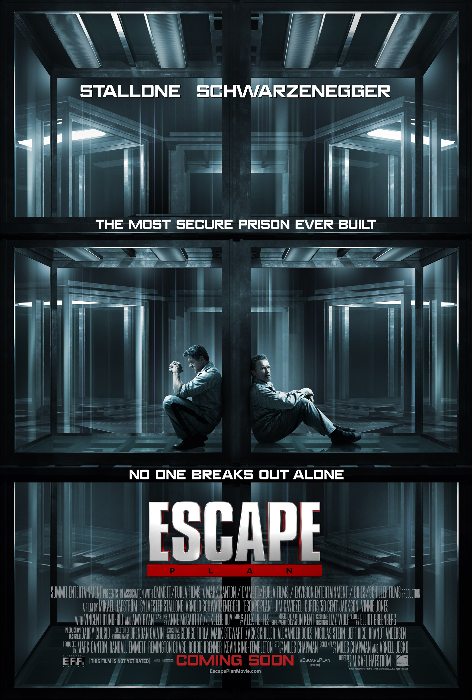

+++
titre = "<em>Évasion</em>, Mikael Håfström"
title = "Évasion, Mikael Håfström"
url = "/evasion-hafstrom"
date = "2015-01-24T18:23:52"
Lastmod = "2015-01-24T18:33:31"
cover = "evasion-arnold-schwarznegger-sylvester-stallone.jpg"
categorie = [ "À voir" ]
tag = [ "Action", "Blockbuster", "Prison", "Vite oublié" ]
createur = [ "Mikael Håfström" ]
acteur = [ "Arnold Schwarzenegger", "Jim Caviezel", "Sylvester Stallone" ]
annee = [ "2013" ]
weight = 2013
pays = [ "États-Unis" ]
original = "Escape Plan"

+++

Non content de se retrouver dans les <a href="http://voiretmanger.fr/saga/expendables/"><em>Expendables</em></a>, Sylvester Stallone et Arnold Schwarzenegger ont été rassemblés dans un autre long-métrage qui ressemble presque à un spin-off de la série de films. Dans un cas comme dans l&rsquo;autre, on retrouve cette ambition de restaurer une certaine idée du cinéma, celui des année 1980 et des films d&rsquo;action simples, mais efficaces. Comme son titre l&rsquo;indique bien, <em>Évasion</em> appartient à la grande catégorie des films carcéraux et son point de départ est simple : mettez les deux stars dans une prison réputée infaillible et faites-les sortir. À partir de cette base simple, pour ne pas dire simpliste, Mikael Håfström signe un film d&rsquo;action assez fun au début, mais qui devient beaucoup trop caricatural sur la fin. À moins d&rsquo;être vraiment fan des acteurs, on peut s&rsquo;en passer…

<em>Évasion</em> commence… avec une évasion précisément. En quelques minutes, Ray Breslin parvient à s&rsquo;échapper d&rsquo;une prison de haute sécurité avec une simplicité assez déconcertante. D&rsquo;ailleurs, on pourrait croire dans un premier temps que c&rsquo;est de cette prison que le héros va s&rsquo;évader pendant le film, mais la rapidité de cette séquence contredit vite les attentes du spectateur. De fait, cette scène ne sert qu&rsquo;à poser le personnage et nous montrer à quel point il est fort. Ray est en fait un spécialiste de la fuite, un homme qui s&rsquo;est échappé de plusieurs dizaines de prisons. Engagé par l&rsquo;administration américaine, il se fait passer pour un prisonnier et teste chaque établissement, l&rsquo;un après l&rsquo;autre. Ceci posé, Mikael Håfström déploie son intrigue principale : après ce premier boulot, une employée de la CIA vient lui en proposer un nouveau. Une prison d&rsquo;un nouveau genre est en train d&rsquo;être testée pour les prisonniers qui gênent tellement qu&rsquo;on veut uniquement les faire disparaître, sans passer par les prisons courantes. Plus encore que toutes les autres prisons du pays, celle-ci est réputée infaillible, mais ses concepteurs veulent s&rsquo;en assurer en envoyant Ray y faire une petite visite. D&rsquo;emblée, <em>Évasion</em> nous montre que c&rsquo;est louche : le personnage ne doit pas savoir où c&rsquo;est et il ne peut pas préparer son évasion avec ses associés. Qu&rsquo;importe, il accepte et comme on s&rsquo;y attendait, tout tourne mal.

Mikael Håfström ne déçoit pas en suivant son plan à la lettre, sans surprendre. <em>Évasion</em> ne brille pas par son originalité et tout se déroule comme on s&rsquo;y attendait. Arrivé dans la fameuse prison, Ray Breslin découvre qu&rsquo;il a été piégé et qu&rsquo;il a été emprisonné pour de vrai. Pour s&rsquo;évader, il peut compter sur l&rsquo;aide d&rsquo;un codétenu et ensemble, ils vont élaborer leur plan de sortie. Tout cela importe peu, on sait très bien d&rsquo;entrée de jeu comment le film se terminera et, comme dans les trois <em>Expendables</em>, l&rsquo;enjeu est plutôt de réunir deux stars des films d&rsquo;action. Sylvester Stallone rencontre donc en prison Arnold Schwarzenegger et on assiste aux retrouvailles de deux vieux amis. Il faut reconnaître que le duo fonctionne assez bien, surtout pour l&rsquo;ancien <em>Terminator</em> qui a bien vieilli. Avec sa barbe, il est plutôt sympathique et l&rsquo;acteur sait toujours prendre un peu de recul vis à vis de ses personnages, avec une ironie bienvenue. On n&rsquo;en dira pas autant de Stallone qui, lui, en reste malheureusement au premier degré, avec à la clé une interprétation trop stoïque et loin d&rsquo;être mémorable. Si on affectionne les deux acteurs, <em>Évasion</em> reste un divertissement efficace, mais il s&rsquo;enlise vite dans une évasion sans queue ni tête, pleine d&rsquo;invraisemblances. Et ce n&rsquo;est pas le twist final assez grossier qui vient sauver le film, trahi par un scénario un peu léger et par l&rsquo;absence cruelle de seconds rôles. Exception faite du directeur de la prison, un homme cruel incarné avec délice par un Jim Caviezel parfaitement dans le ton.

Sur le papier, <em>Évasion</em> était un hommage fun et divertissant aux films d&rsquo;action des années 1980, mais la réalisation ne suit pas tout à fait. Le début est pourtant plutôt réussi, mais Mikael Håfström perd vite de vue son scénario et se contente de filmer deux acteurs qu&rsquo;il affectionne probablement. Arnold Schwarzenegger et Sylvester Stallone font le boulot qu&rsquo;on leur demande, mais ils ne suffisent pas à faire d&rsquo;<em>Évasion</em> un bon film. Dommage.

<h3>Vous voulez <a href="http://voiretmanger.fr/soutien/">m&rsquo;aider</a> ?</h3>
<ul>
<li><a href="http://www.amazon.fr/gp/product/B00HENR9VY/ref=as_li_ss_tl?ie=UTF8&amp;tag=leblogdenic07-21&amp;linkCode=as2&amp;camp=1642&amp;creative=19458&amp;creativeASIN=B00HENR9VY">Acheter le film en Blu-ray sur Amazon</a></li>
<li><a href="http://www.amazon.fr/gp/product/B00GXDRFW4/ref=as_li_ss_tl?ie=UTF8&amp;tag=leblogdenic07-21&amp;linkCode=as2&amp;camp=1642&amp;creative=19458&amp;creativeASIN=B00GXDRFW4">Acheter le film en DVD sur Amazon</a></li>
<li><a href="https://itunes.apple.com/fr/movie/evasion-2013/id805677919">Acheter ou louer le film sur l&rsquo;iTunes Store</a></li>
</ul>

