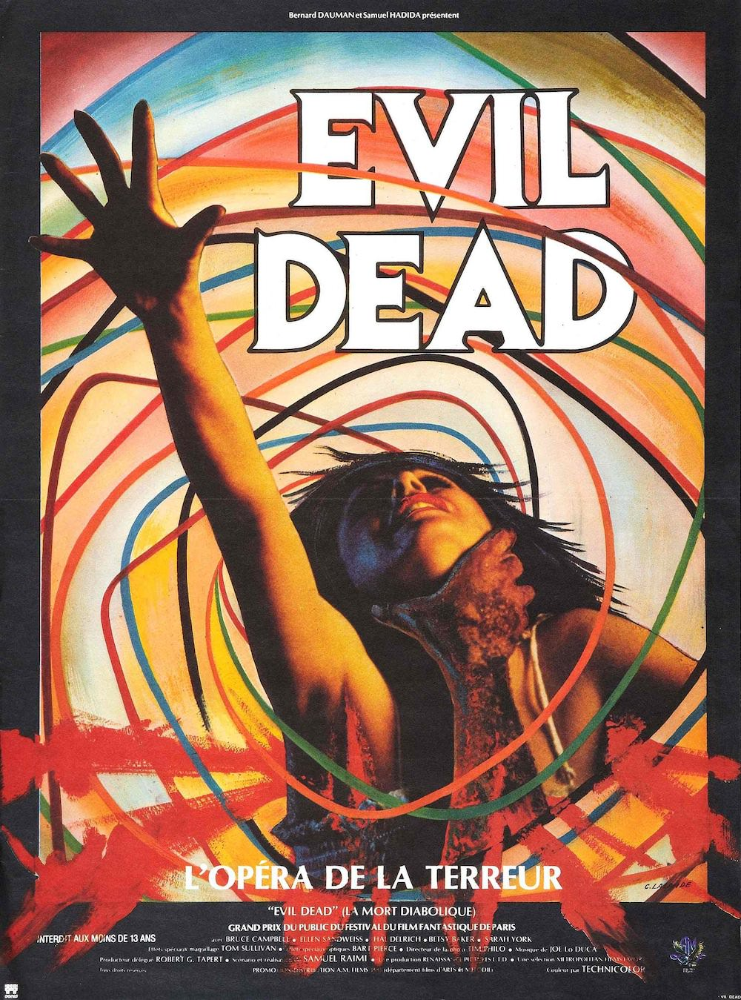
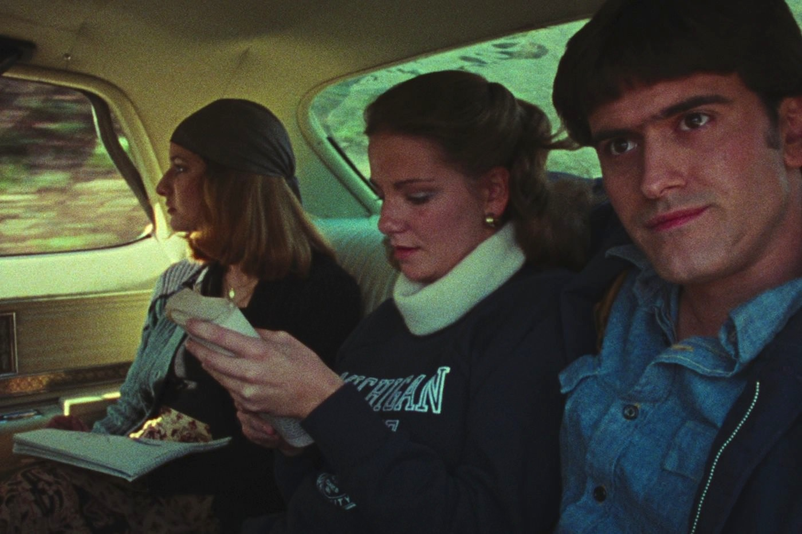

+++
titre = "Evil Dead, Sam Raimi"
title = "Evil Dead, Sam Raimi"
url = "/evil-dead-raimi"
date = "2013-05-12T10:16:21"
Lastmod = "2013-05-12T11:11:38"
cover = "evil-dead-sam-raimi.jpg"
categorie = [ "À voir" ]
tag = [ "Film de genre", "Gore", "Horreur", "Huis clos", "Humour", "Violence" ]
createur = [ "Sam Raimi" ]
acteur = [ "Bruce Campbell" ]
annee = [ "1983" ]
weight = 1983
pays = [ "États-Unis" ]
original = "The Evil Dead"

+++

Sam Raimi n’a que 22 ans quand son tout premier long-métrage est diffusé pour la première fois en public. <em>Evil Dead</em> est rapidement devenu culte et ce premier film totalement fauché a créé toute une saga avec plusieurs suites et des produits dérivés, mais il a aussi inspiré d’autres cinéastes et d’autres films d’horreur, tout en offrant au jeune réalisateur un formidable tremplin pour le reste de sa carrière. Trente ans après sa sortie, <em>Evil Dead</em> n’a, forcément, pas très bien vieilli, mais ce long-métrage bricolé faute de moyen conserve son charme initial et le choix du second degré permet de débloquer la plupart des critiques que l’on pourrait faire. Un film totalement barré, à défaut d’être vraiment effrayant…

Le scénario d’<em>Evil Dead</em> n’a aucun intérêt : prenez cinq jeunes, envoyez-les dans une cabane reculée dans des bois pas très nets et faites-leur découvrir une bande qui réveille une force maléfique qui va tous les tuer un par un. Sam Raimi n’innove pas sur ce point, l’histoire qu’il filme est extrêmement banale, même si elle l’est encore plus aujourd’hui, alors que plusieurs films ont repris depuis le même schéma narratif. Qu’importe, on sait à l’avance qu’il s’agit d’un film d’horreur et on sait que les cinq jeunes qui se rendent dans cette maison isolée vont avoir des problèmes. <em>Evil Dead</em> prend d’ailleurs un grand soin de nous mettre dans l’ambiance dès les premières images : on y découvre les protagonistes dans une voiture et la caméra se lie avec une bande sonore déjà inquiétante pour faire peser sur eux une menace qui reste encore assez floue, même si elle surgit à un moment sous la forme d’un camion qui déboule devant eux. Ils arrivent et s’installent dans cette maison qui paraît d’emblée suspecte : est-ce son air abandonné un peu glauque, ou ce banc suspendu qui frappe régulièrement contre le mur ? Sam Raimi ne nous laisse pas attendre trop longtemps et il commence les hostilités quelques minutes après leur arrivée : ses cinq personnages découvrent une cave encore plus inquiétante, dans laquelle ils retrouvent un enregistreur audio. Ils écoutent naturellement l’enregistrement laissé avec et entendent une histoire extraordinaire de morts vivants. Quand ils entendent des mots en langue étrangère, c’est trop tard : ils viennent de réveiller les morts et <em>Evil Dead</em> se transforme vite en formidable machine à tuer.

À défaut d’avoir de l’argent, le jeune Sam Raimi avait des idées. <em>Evil Dead</em> ne cherche absolument pas l’originalité dans son écriture, mais le film regorge d’idées de cinéma, il en est même totalement saturé. Il n’y a pas un plan sans un mouvement de caméra original, avec des déplacements parfaitement fluides entre les arbres de la forêt et ce fameux mouvement à 360° qui, étant donnés les faibles moyens du cinéaste, a sans doute été très compliqué à tourner. Le cinéaste multiplie aussi les angles et points de vue originaux, que ce soit au fond d’une tombe ou à l’intérieur d’un placard. Tout est fait pour effrayer, mais force est de constater qu’<em>Evil Dead</em> ne fait plus vraiment peur, surtout au regard de la production actuelle en matière d’horreur. On peut parfois sursauter légèrement, mais encore à condition de n’avoir vu aucun film du genre : les habitués sauront qu’il faut attendre un évènement à tel moment et Sam Raimi ne déçoit jamais ces attentes. C’est un peu dommage, mais si l’on n’a pas vraiment peur, le gore est au rendez-vous dans <em>Evil Dead</em>. Le faux sang ne coûte rien et le film en utilise des dizaines de litres, tout comme les maquillages qui sont souvent exagérés et font faux. Ce serait gênant si le long-métrage se prenait au sérieux, mais le jeune réalisateur a la bonne idée de jouer la carte du second degré, si bien que l’on rigole assez souvent. Quand ce n’est pas le maquillage exagéré, c’est la musique caricaturale qui amuse, ou alors des décors excessivement marqués pour l’horreur. Si la première partie d’<em>Evil Dead</em> est très conventionnelle, sur le fond comme sur la forme, le film se rattrape dans un final époustouflant de n’importe quoi. Sam Raimi se lâche, il use et abuse des postiches gores et s’essaie même à l’animation image par image, avec de la pâte à modeler et d’autres matières. Le rendu n’est absolument pas réaliste — et rappelle, par exemple, le <a href="http://www.youtube.com/watch?v=X0C3DHp36zc">clip de « <em>Digging in the Dirt</em> »</a> de Peter Gabriel —, mais ce n’est pas gênant. À ce stade, on sait à quoi s’attendre et <em>Evil Dead</em> ne déçoit pas avec une fin qui monte <em>crescendo</em> et tombe dans une forme de folie assez jouissive. 

<em>Evil Dead</em> ne fait pas vraiment peur et il est loin d’être à la pointe technologique, même quand il sort sur les écrans français en 1983. C’est un film complètement fauché, mais Sam Raimi exploite au maximum le peu de moyens à sa disposition et compose un film culte qui est, aujourd’hui encore, surprenant dans sa surenchère de gore et de n’importe quoi. C’est parfois drôle, souvent impressionnant et toujours inventif : <em>Evil Dead</em> n’a pas rapporté plusieurs millions et n’est pas entré dans la légende sans raison. 

<h3>Vous voulez m&rsquo;aider ?<a href="#footnote_0_9449" id="identifier_0_9449" class="footnote-link footnote-identifier-link" title="&Agrave; propos de la publicit&eacute;&hellip;">1</a></h3>
<ul>
<li><a href="http://www.amazon.fr/gp/product/B003V8ALX4/ref=as_li_ss_tl?ie=UTF8&#038;tag=leblogdenic07-21&#038;linkCode=as2&#038;camp=1642&#038;creative=19458&#038;creativeASIN=B003V8ALX4">Acheter le film en Blu-Ray sur Amazon</a></li>
<li><a href="http://www.amazon.fr/gp/product/B00BG1W1CM/ref=as_li_ss_tl?ie=UTF8&#038;tag=leblogdenic07-21&#038;linkCode=as2&#038;camp=1642&#038;creative=19458&#038;creativeASIN=B00BG1W1CM">Acheter le film en DVD sur Amazon</a></li>
<li><a href="https://itunes.apple.com/fr/movie/evil-dead/id510887539">Acheter ou louer le film sur l&rsquo;iTunes Store</a></li>
</ul>

<ol class="footnotes"><li id="footnote_0_9449" class="footnote"><a href="http://voiretmanger.fr/soutien/">À propos de la publicité…</a> [<a href="#identifier_0_9449" class="footnote-link footnote-back-link">&#8617;</a>]</li></ol>
