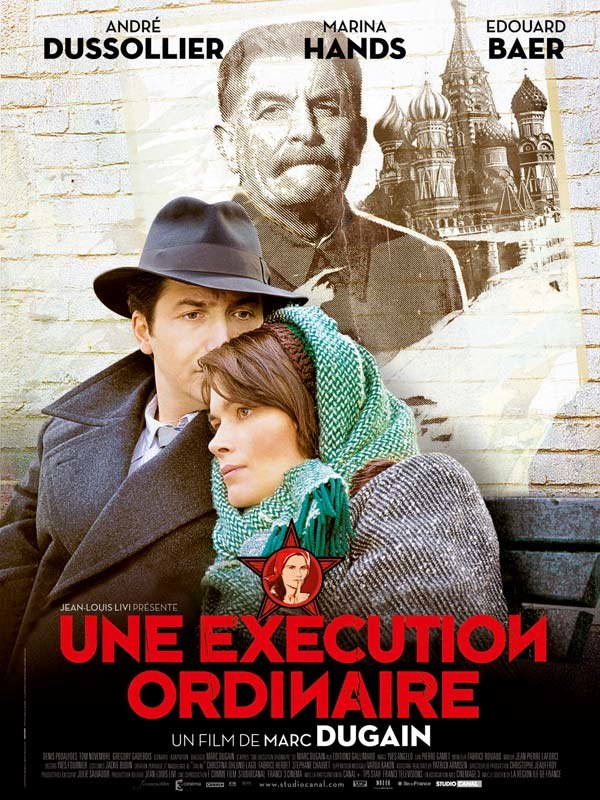
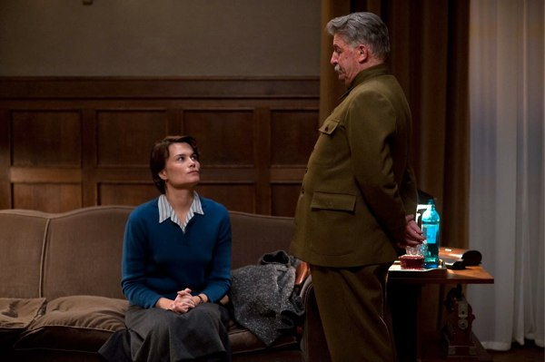
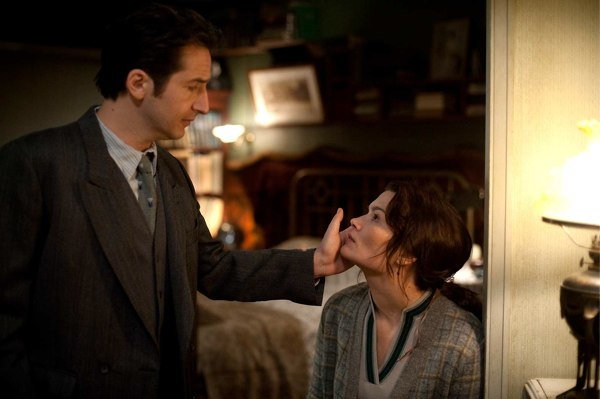
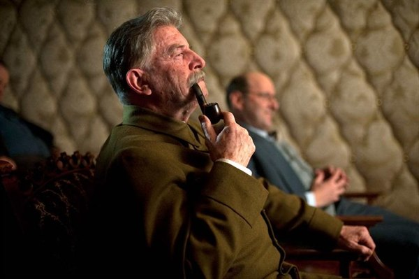

+++
type = "post"
titre = "Une exécution ordinaire, Marc Dugain"
title = "Une exécution ordinaire, Marc Dugain"
url = "/execution-ordinaire-dugain"
date = "2010-02-07T00:47:56"
Lastmod = "2013-03-22T08:57:15"
cover = "une-execution-ordinaire-marc-dugain.jpg"
categorie = [ "À voir" ]
tag = [ "Histoire", "Staline", "URSS" ]
createur = [ "Marc Dugain" ]
acteur = [ "André Dussollier", "Denis Podalydès", "Édouard Baer", "Marina Hands" ]
annee = [ "2010" ]
weight = 2010
pays = [ "France" ]

+++

Après deux blockbusters américains, il fallait marquer une pause et quoi de mieux qu&rsquo;un film français pour ça ? <em>Une exécution ordinaire</em> est l&rsquo;adaptation d&rsquo;un roman de Marc Dugain réalisée par lui-même. Un roman au sujet suffisamment passionnant pour me faire entrer dans la salle, mais malheureusement pas assez pour me faire aimer le film. Dommage…

<em>Une exécution ordinaire</em> se déroule dans l&rsquo;URSS de Staline, à la fin du règne du dictateur. Ce dernier souffre terriblement et se sent mourant. Pourtant, en bon tyran paranoïaque, il fait arrêter tous ses médecins sur un vague soupçon de complot juif. Pour ne pas mourir tout à fait, il fait alors appel à Anna, une jeune médecin douée de dons spéciaux puisqu&rsquo;elle est capable de soigner par le simple contact des mains<a href="#footnote_0_2748" id="identifier_0_2748" class="footnote-link footnote-identifier-link" title="Ce qui ne manque pas de sel, quand on pense qu&rsquo;elle est interpr&eacute;t&eacute;e par Marina Hands. Oui, bon, je suppose que quelqu&rsquo;un devait le faire.">1</a>. Un pouvoir bien peu politiquement correct dans un régime qui prône le rationalisme et rejette la religion ou le surnaturel. Ce que ses gentils collègues ne manquent de lui rappeler, tentant au passage de lui extorquer quelques avantages en nature. Elle finit par être dénoncée, et l&rsquo;information remonte comme il se doit au Kremlin et n&rsquo;atterrit pas dans les oreilles d&rsquo;un sourd. Staline se méfie des médecins traditionnels et fait appeler cette Anna pour qu&rsquo;elle le soigne.

Commence alors une relation complexe entre le monstre et la jeune femme. Anna est efficace, et Staline ne cesse de faire appel à elle. Bien vite, elle lui est absolument indispensable. On s&rsquo;en doute, l&rsquo;idée que le petit père du peuple se fasse soigner par magnétisme n&rsquo;entrait pas harmonieusement dans la propagande officielle du régime et c&rsquo;est à un silence absolu et dévastateur qu&rsquo;est soumise la jeune femme. Un silence qui impose vite qu&rsquo;elle se sépare de son mari qu&rsquo;elle tente en vain de protéger en demandant le divorce. La terreur est la base de toute l&rsquo;URSS et Staline trouve dans sa famille un bon moyen de maintenir la pression sur celle qui est aussi la seule à même de le soulager. Le film développe ainsi leurs relations jusqu&rsquo;à la mort de Staline.

L&rsquo;histoire est passionnante, même si apparemment elle n&rsquo;est pas vraie (réaliste, pourrait-on dire). La relation entre ces deux êtres qui ont désespérément besoin l&rsquo;un de l&rsquo;autre, mais que tout sépare et oppose est intéressante. Le courage d&rsquo;Anna qui continue à soigner l&rsquo;homme qui torture son mari et enferme sa famille est assez impressionnant à voir et on ne sait pas vraiment, au fond, ce qui la motive. Sans doute l&rsquo;espoir vain d&rsquo;amadouer Staline en faveur de sa famille. Peut-être aussi la conscience professionnelle, même si ses choix étaient pour le moins limités. Je pense que l&rsquo;on peut aussi y voir une admiration secrète pour l&rsquo;homme le plus puissant d&rsquo;URSS. Un homme que l&rsquo;on découvre aussi&#8230; humain, souffrant, conscient de l&rsquo;atrocité de ses actes et en même temps apparemment incapable de les regretter<a href="#footnote_1_2748" id="identifier_1_2748" class="footnote-link footnote-identifier-link" title="Le film se conclut d&rsquo;ailleurs sur une citation &eacute;difiante de Staline&nbsp;: &laquo;&nbsp;La mort d&rsquo;un homme est une trag&eacute;die. La mort d&rsquo;un million d&rsquo;hommes est une statistique.&nbsp;&raquo;">2</a>.

Interpréter quelqu&rsquo;un comme Staline n&rsquo;est jamais facile quand il s&rsquo;agit d&rsquo;être sérieux. Dans <em>Une exécution ordinaire</em>, c&rsquo;est un André Dussollier méconnaissable qui s&rsquo;en charge et il faut bien dire que c&rsquo;est visuellement bluffant. D&rsquo;une part, on ne reconnaît vraiment pas l&rsquo;acteur sérieusement grimé pour le film. Cela concerne son visage, mais aussi sa démarche… on sent le travail d&rsquo;un biopic derrière. Les problèmes commencent néanmoins quand il parle : ça n&rsquo;est, certes, pas de la faute de Dussollier, mais sa voix m&rsquo;est tellement familière que je vois alors l&rsquo;acteur, et je pers Staline. Le fait qu&rsquo;il parle français, alors que même son courrier est en russe, perturbe gravement au réalisme de la situation. Sur ce point, ceux qui ont l&rsquo;horrible habitude de voire les films en VF ne seront pas dépaysés. Ceux qui préfèrent les VO peineront sans doute à trouver réalistes des Russes qui parlent tous un français parfait.

Mais les problèmes du film dépassent le simple choix de tourner en français, un choix qui se justifie de toute façon par le fait que 100 % des acteurs sont Français. Le scénario pose vraiment problème par son côté théâtral et son manque régulier de réalisme. Les personnages déclament un texte, ils ne semblent pas y croire une seconde et du coup, nous non plus. Et puis franchement, je doute que Staline s&rsquo;exprimait à coup de citations qui, certes, font souvent sourire tant elles sont cyniques et décomplexées, mais qui cassent aussi souvent la réalité du dialogue. Dans le même ordre idée, l&rsquo;intégration de Poutine au beau milieu du film est vraiment grossière et aurait mérité une bonne suppression. Si l&rsquo;on est souvent mieux servi par soi-même, je crois que Marc Dugain aurait mieux fait de céder sa place à un autre pour adapter son roman. Il a manifestement une trop grande confiance en son écrit pour insérer la distance nécessaire au film.

<em>Une exécution ordinaire</em> souffre aussi de problèmes de réalisation, à mon avis. Le film est lent, très lent et l&rsquo;heure quarante-cinq qu&rsquo;il dure m&rsquo;a paru beaucoup plus longue. Le réalisateur a en outre fait le choix d&rsquo;une réalisation très simple, marquée notamment par des couleurs très fades qui correspondent bien à l&rsquo;idée qu&rsquo;on se fait de la grisaille soviétique, mais qui rendent aussi le film assez peu agréable à voir. Heureusement, les acteurs sauvent en partie les choses, Marina Hands est très bien, Édouard Bear pas mauvais et très sobre, ou encore Denis Podalydès, très bon dans un des rares rôles &laquo;&nbsp;comiques&nbsp;&raquo; du film avec un obséquieux gardien d&rsquo;immeuble.

Malgré une solide histoire et des acteurs convaincants, <em>Une exécution ordinaire</em> ne m&rsquo;a pas plu. Je n&rsquo;ai jamais cru à cette histoire, je n&rsquo;ai jamais vu Staline, mais Dussollier faisant une très belle performance d&rsquo;acteur. Sans doute est-ce un goût personnel, mais je crois que le cinéma français peine à réaliser des films historiques vraiment réalistes. En tout cas, celui-ci ne m&rsquo;a pas vraiment passionné…

Pas de critiques sur les blogs habituels, alors à la place signalons une critique positive chez <a href="http://www.telerama.fr/cinema/films/une-execution-ordinaire,401243,critique.php"><em>Télérama</em></a>. Cela ne m&rsquo;étonne pas…

<h3>Vous voulez m&rsquo;aider ?<a href="#footnote_2_2748" id="identifier_2_2748" class="footnote-link footnote-identifier-link" title="&Agrave; propos de la publicit&eacute;&hellip;">3</a></h3>
<ul>
<li><a href="http://www.amazon.fr/gp/product/B003BQROGS/ref=as_li_ss_tl?ie=UTF8&tag=leblogdenic07-21&linkCode=as2&camp=1642&creative=19458&creativeASIN=B003BQROGS">Acheter le film en DVD sur Amazon</a></li>
<li><a href="https://itunes.apple.com/fr/movie/une-execution-ordinaire/id375704442">Acheter ou louer le film sur l&rsquo;iTunes Store</a></li>
</ul>

<ol class="footnotes"><li id="footnote_0_2748" class="footnote">Ce qui ne manque pas de sel, quand on pense qu&rsquo;elle est interprétée par Marina Hands. Oui, bon, je suppose que quelqu&rsquo;un devait le faire. [<a href="#identifier_0_2748" class="footnote-link footnote-back-link">&#8617;</a>]</li><li id="footnote_1_2748" class="footnote">Le film se conclut d&rsquo;ailleurs sur une citation édifiante de Staline : &laquo;&nbsp;La mort d&rsquo;un homme est une tragédie. La mort d&rsquo;un million d&rsquo;hommes est une statistique.&nbsp;&raquo; [<a href="#identifier_1_2748" class="footnote-link footnote-back-link">&#8617;</a>]</li><li id="footnote_2_2748" class="footnote"><a href="/soutien/">À propos de la publicité…</a> [<a href="#identifier_2_2748" class="footnote-link footnote-back-link">&#8617;</a>]</li></ol>
