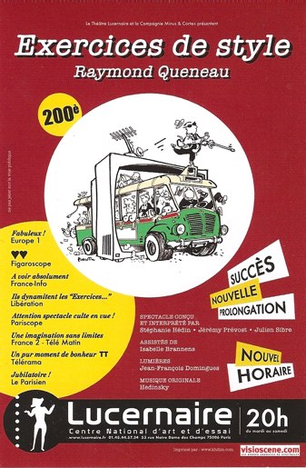

+++
titre = "Exercices de style, au Lucernaire"
title = "Exercices de style, au Lucernaire"
url = "/exercices-de-style-au-lucernaire"
date = "2009-01-16T23:23:06"
Lastmod = "2009-01-16T23:23:06"
cover = ""
categorie = [ "À voir… en live" ]
tag = [ "Lucernaire", "Oulipo", "Télévision", "Théâtre" ]
pays = [ "France" ]

+++

Une fois n&rsquo;est pas coutume, ce soir je suis allé au théâtre. Au <a href="http://www.lucernaire.fr/beta1/index.php">Lucernaire</a> très précisément, pour y voir <em>Exercices de Style</em> de Raymond Queneau. 

Les <em>Exercices de style</em> constituent un texte très étonnant où Raymond Queneau raconte 99 fois la même histoire banale (une altercation dans un bus). Travail d&rsquo;écriture sous la contrainte jouissif pour qui aime <a href="http://www.oulipo.net/">l&rsquo;Oulipo</a>. Mais ce texte ne semble pas vraiment théâtral : le plaisir vient d&rsquo;abord de l&rsquo;écriture, des modes d&rsquo;écriture très différents, souvent le jeu vient de la graphie même, quelque chose de non représentable au théâtre bien entendu.

Et pourtant, cette représentation fonctionne. Le succès est lié, à n&rsquo;en pas douter, à un détachement du texte. Partant du principe que le texte n&rsquo;est pas, en l&rsquo;état, représentable, les trois acteurs/concepteurs — Stéphanie Hédin, Jérémy Prévost et Julien Sibre — ont décidé de chambouler un peu le texte d&rsquo;origine. D&rsquo;une part, les 99 versions ne sont pas représentées, seule une trentaine (calcul pifométrique) a été conservée pour le spectacle. Ensuite, si les mots sont évidemment essentiels, l&rsquo;accent est clairement mis sur le jeu avec une place très importante accordée aux corps. Le mime est ainsi souvent présent, et on n&rsquo;est jamais très loin du théâtre d&rsquo;improvisation, voire de la farce.

Le patri pris le plus visible cependant, annoncé dès le départ par l&rsquo;affiche, c&rsquo;est la télévision. L&rsquo;ensemble du spectacle se veut une sorte de zapping de la télé d&rsquo;aujourd&rsquo;hui, et d&rsquo;hier. Entre chaque &laquo;&nbsp;sketches&nbsp;&raquo;, on a ainsi des extraits de télévision, des plus classiques — le bruit et l&rsquo;odeur de Chichi, la bravitude de Ségo, les engueulades de Sarko avec les pêcheurs — aux inconnus à mourir de rire — comme cette histoire de noix de coco (je n&rsquo;en dis pas plus), ou les extraits de Questions pour un champion. La télévision est bien plus qu&rsquo;un remplissage cependant : quasiment tous les exercices utilisent et parodient la télévision, ou les médias au sens large, avec une grande place accordée aux imitations. Imitations musicales souvent (Grands Corps Malade, un chanteur de reggae sous narcotique, Johnny&#8230;) mais pas seulement. Des émissions ou séries sont aussi imitées : un jeu de questions à mourir de rire où les candidats qui répondent mal sont jetés dans une fosse aux lions, des séries cultes comme les Feux de l&rsquo;Amour (même le doublage raté y est) ou Friends (et ses rires préenregistrés). Parfois aussi, c&rsquo;est le théâtre lui-même qui est caricaturé avec un passage de tragédie très réussi&#8230;

Mais tout cela se fait en n&rsquo;utilisant que le texte de Queneau, ou presque (il y a quelques ajouts). C&rsquo;est assez intéressant, d&rsquo;ailleurs, de voir que le texte a plutôt bien résisté au temps et à l&rsquo;étrangeté oulipienne. Même si, bien sûr, le style ne fait pas moderne, ce qui n&rsquo;est pas forcément un point négatif d&rsquo;ailleurs&#8230;

 

Certes, <em>Exercices de style</em> n&rsquo;est pas la grande pièce qui révolutionne le genre. Il ne s&rsquo;agit pas d&rsquo;une pièce sérieuse, mais d&rsquo;un exercice, plutôt brillant d&rsquo;ailleurs, où une histoire à l&rsquo;intérêt très proche du néant sert à tous les délires les plus fous. Il ne faudrait pas prendre cette pièce pour autre chose qu&rsquo;un délire à voir en famille, mais elle est déjà cela, et c&rsquo;est vraiment très bien.

Manifestement, le succès est au rendez-vous puisque la représentation de ce soir était la&#8230; 250e ! La pièce est prolongée jusqu&rsquo;au 21 février, ce qui vous laisse un bon mois pour la voir. C&rsquo;est au Lucernaire, du mardi au samedi à 20 heures pour 1 heure 30 de bonheur. Moi qui n&rsquo;aime pas devoir prendre des places de théâtre des mois à l&rsquo;avance pour des sommes folles, je dois dire que la formule me convient bien : places réservées la veille pour le lendemain (un vendredi soir qui plus est !) et à 15 euros (pour les étudiants) !

