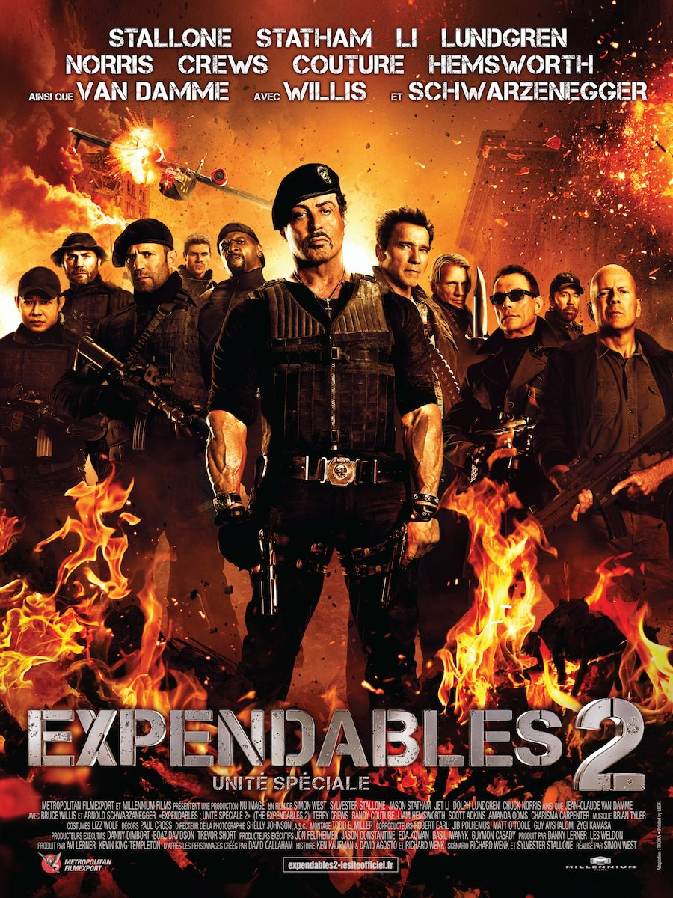
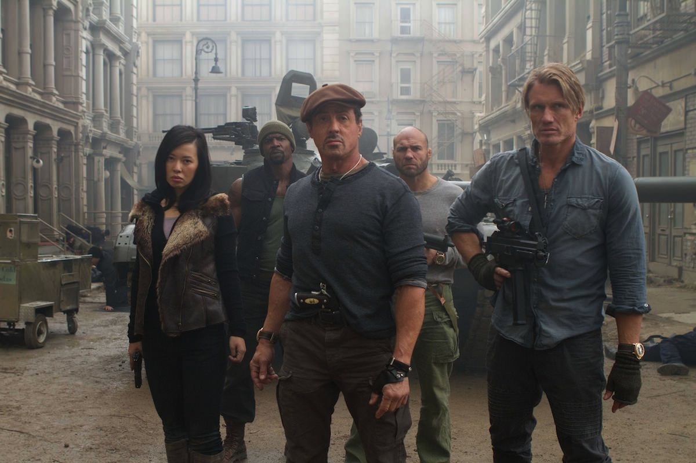
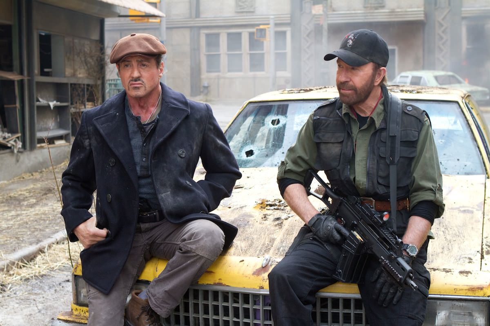

+++
type = "post"
titre = "<em>Expendables 2 : unité spéciale</em>, Simon West"
title = "Expendables 2 : unité spéciale, Simon West"
url = "/expendables-2-unite-speciale-west"
date = "2012-08-22T00:07:55"
Lastmod = "2014-05-28T23:04:52"
cover = "expendables-2-stallone-schwarznegger.jpg"
categorie = [ "À voir" ]
tag = [ "Action", "Blockbuster", "Clichés", "Humour", "Violence", "Vite oublié" ]
createur = [ "Simon West" ]
acteur = [ "Arnold Schwarzenegger", "Bruce Willis", "Chuck Norris", "Jason Statham", "Jean-Claude Van Damme", "Liam Hemsworth", "Sylvester Stallone" ]
annee = [ "2012" ]
weight = 2012
saga = [ "Expendables" ]
pays = [ "États-Unis" ]

+++

Avec <a title="Expendables : unité spéciale, Sylvester Stallone" href="http://voiretmanger.fr/2010/08/06/expendables-stallone/"><em>Expendables : unité spéciale</em></a> Sylvester Stallone réunissait autour de lui quelques stars des blockbusters d&rsquo;action de la grande époque pour un film à l&rsquo;ancienne, bourrin, mais contre toutes attentes plutôt réussi, pour peu que l&rsquo;on accepte son principe de base. Le succès aidant, une suite a été préparée et <em>Expendables 2 : unité spéciale</em> sort deux ans après le premier opus. La recette est identique, même si Sylvester Stallone a laissé la caméra à un autre réalisateur cette fois. Simon West n&rsquo;a manifestement pas eu beaucoup de pouvoirs de toute manière et le résultat est vraiment très proche de la formule originale, à tel point que l&rsquo;on se lasse un peu…

Peu importe que vous ayez vu ou non le premier, <em>Expendables 2 : unité spéciale</em> n&rsquo;a absolument aucun rapport avec son prédécesseur dont il ne semble conserver que les personnages principaux. Le principe est toujours le même : le film doit ménager un peu de place à chacun des acteurs qui se partagent la tête d&rsquo;affichage et lier le tout avec une histoire suffisamment réaliste pour maintenir l&rsquo;intérêt du spectateur éveillé pendant 1h45. Barney dirige un groupe de mercenaires embauchés pour des missions toujours plus dangereuses. Le film ouvre d&rsquo;ailleurs sur l&rsquo;une d&rsquo;entre elles : l&rsquo;unité spéciale du titre doit sauver un homme manifestement très riche, capturé par un sale type, quelque part au Népal. La mission est extrêmement risquée, mais elle est un succès, non pas sans quelques centaines de morts du côté des ennemis et quelques explosions dignes de ce nom. Le schéma narratif de cette suite suit très exactement celui du précédent et après cette mise en bouche viennent les choses sérieuses. Le même Church qui avait envoyé Barney et ses hommes sur une île tropicale confie une nouvelle mission à l&rsquo;équipe. Il s&rsquo;agit d&rsquo;aller récupérer un élément caché dans le coffre d&rsquo;un avion qui s&rsquo;est écrasé quelque part en Asie, une opération de routine… en apparence. On ne dévoilera rien en disant que cette promenade de santé s&rsquo;avère finalement plus compliquée que prévu.

L&rsquo;intrigue d&rsquo;<em>Expendables 2 : unité spéciale</em> importe assez peu, elle est de toute manière parcourue de ficelles énormes qui évitent de surprendre le spectateur pour peu qu&rsquo;il ait vu au moins un blockbuster d&rsquo;action. Oui, Barney et ses hommes gagnent à la fin, mais cela n&rsquo;a aucune importance. Simon West, un habitué du genre, a bien compris que ce n&rsquo;est pas la fin qui compte, mais les moyens et il a mis le paquet sur les scènes d&rsquo;action. Le spectacle est indéniablement au rendez-vous et on prend plein la vue, même si ce n&rsquo;est pas très original. Qu&rsquo;importe, le plaisir du film d&rsquo;action simple et efficace est bien là, ça pète dans tous les sens, les explosions sont gigantesques et les héros sont toujours super puissants. La séquence d&rsquo;ouverture est peut-être la plus impressionnante du film — sans doute parce qu&rsquo;elle ouvre le long-métrage —, mais la suite n&rsquo;est pas en reste avec notamment une scène de massacre très prenante dans un village infesté de vilains. <em>Expendables 2 : unité spéciale</em> est un blockbuster d&rsquo;action à l&rsquo;ancienne, ce qui est le minimum pour un film qui entend rendre hommage au cinéma de genre des années 1980. Il faut bien avouer que Simon West remplit le contrat de ce côté, le spectateur en a pour son argent.

Si <em>Expendables 2 : unité spéciale</em> s&rsquo;était contenté d&rsquo;être un film d&rsquo;action décérébré, le bilan serait globalement positif, même si on ne peut se défaire du sentiment de déjà-vu lancinant. Las, Simon West a voulu en faire plus et ajouter une épaisseur psychologique à des personnages qui n&rsquo;avaient rien demandé. Le film multiplie ainsi les scènes de dialogue et les &laquo;&nbsp;questions de société&nbsp;&raquo; : non, les héros ne peuvent pas abandonner à leur triste sort les pauvres femmes restées dans le village. Le premier opus de la série ménageait déjà un peu de place pour ces sujets annexes à l&rsquo;action, mais ils étaient réduits au strict minimum, alors qu&rsquo;ils prennent ici une place importante. Cela ne serait pas gênant, si ces tentatives de s&rsquo;éloigner de l&rsquo;action brute ne conduisaient pas d&rsquo;abord à décrédibiliser tout le film. <em>Expendables 2 : unité spéciale</em> ne rechigne pas à tuer à la pelle, avec projections sanguines fournies, tant qu&rsquo;il s&rsquo;agit du camp ennemi, mais ses héros deviennent des anges quand il s&rsquo;agit de sauver la veuve et l&rsquo;orphelin. Ajoutons que le film multiplie les clichés, avec notamment l&rsquo;embarrassante question de la place des femmes, et l&rsquo;ensemble devient un peu trop lourd. C&rsquo;est d&rsquo;autant plus vrai que Silverster Stallone prend à nouveau une place bien trop importante par rapport aux autres acteurs. Il est sur quasiment tous les plans, il parle beaucoup trop souvent et le film semble avoir été conçu tout entier pour glorifier le vieil acteur qui n&rsquo;a jamais aussi bien fait la gueule qu&rsquo;ici.

Fort heureusement, <em>Expendables 2 : unité spéciale</em> a su conserver l&rsquo;humour et la dérision de son prédécesseur. Simon West a bien su exploiter l&rsquo;âge avancé de ses personnages, notamment en les confrontant au petit jeune &laquo;&nbsp;Billy The Kid&nbsp;&raquo;, interprété par un Liam Hemsworth croisé cette année dans <a title="Hunger Games, Gary Ross" href="http://voiretmanger.fr/2012/04/09/hunger-games-ross/"><em>Hunger Games</em></a>. Autour de lui, les vieilles stars défilent, multipliant les clins d&rsquo;œil à leur glorieux passé : Arnold Schwarzenegger est impeccable dans ce rôle de Terminator sur le retour, Bruce Willis égal à lui-même, tout comme Jason Stantham, tandis que Chuck Norris fait un retour remarqué et que Jean-Claude Van Damme est parfait en vilain très méchant. Chacun d&rsquo;entre eux a droit à sa phrase fétiche, &laquo;&nbsp;Je reviendrai&nbsp;&raquo; pour l&rsquo;un, la mort du Cobra pour l&rsquo;autre… <em>Expendables 2 : unité spéciale</em> multiplie ainsi les clins d&rsquo;œil dans un joyeux florilège qui sauvera le film pour tous ceux qui sauront les comprendre. Pour les autres, ce n&rsquo;est pas une mise en scène à l&rsquo;image du scénario, clichée, qui sauvera le dernier long-métrage de Simon West. Il faut bien reconnaître que l&rsquo;ensemble manque cruellement de finesse et si le côté nostalgique et parodique l&rsquo;emportait la première fois, il peine ici à sauver le film.

Difficile au total de recommander absolument <em>Expendables 2 : unité spéciale</em>. La réalisation de Simon West intéressera tous ceux qui reconnaîtront les personnages des blockbusters des années 1980 et 1990 et les multiples clins d&rsquo;œil combinés à des acteurs qui oublient heureusement de se prendre au sérieux sont assez réussis. Reste que cette suite semble un peu superflue et la motivation financière paraît avoir pris le dessus. Un troisième opus est d&rsquo;ores et déjà prévu : autant dire que l&rsquo;on ne l&rsquo;attendra pas de pied ferme, tant la lassitude risque d&rsquo;emporter la série… En attendant, <em>Expendables 2 : unité spéciale</em> est un blockbuster bien vite oublié.

<h3>Vous voulez m&rsquo;aider ?<a href="#footnote_0_7329" id="identifier_0_7329" class="footnote-link footnote-identifier-link" title="&Agrave; propos de la publicit&eacute;&hellip;">1</a></h3>
<ul>
<li><a href="http://www.amazon.fr/gp/product/B0092PB0MQ/ref=as_li_ss_tl?ie=UTF8&tag=leblogdenic07-21&linkCode=as2&camp=1642&creative=19458&creativeASIN=B0092PB0MQ">Acheter le film en Blu-Ray et DVD sur Amazon</a></li>
<li><a href="http://www.amazon.fr/gp/product/B0092PB0IU/ref=as_li_ss_tl?ie=UTF8&tag=leblogdenic07-21&linkCode=as2&camp=1642&creative=19458&creativeASIN=B0092PB0IU">Acheter le film en DVD sur Amazon</a></li>
<li><a href="https://itunes.apple.com/fr/movie/expendables-2-unite-speciale/id580354092">Acheter ou louer le film sur l&rsquo;iTunes Store</a></li>
</ul>
<ul>
<li><a href="http://www.amazon.fr/gp/product/B009G6W3OK/ref=as_li_ss_tl?ie=UTF8&tag=leblogdenic07-21&linkCode=as2&camp=1642&creative=19458&creativeASIN=B009G6W3OK">Acheter les deux films en Blu-Ray sur Amazon</a></li>
<li><a href="http://www.amazon.fr/gp/product/B009G6W3QI/ref=as_li_ss_tl?ie=UTF8&tag=leblogdenic07-21&linkCode=as2&camp=1642&creative=19458&creativeASIN=B009G6W3QI">Acheter les deux films en DVD sur Amazon</a></li>
</ul>

<ol class="footnotes"><li id="footnote_0_7329" class="footnote"><a href="http://voiretmanger.fr/soutien/">À propos de la publicité…</a> [<a href="#identifier_0_7329" class="footnote-link footnote-back-link">&#8617;</a>]</li></ol>
