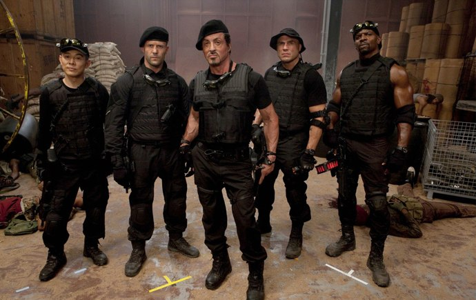
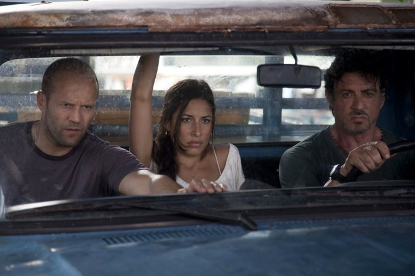

+++
type = "post"
titre = "<em>Expendables : unité spéciale</em>, Sylvester Stallone"
title = "Expendables : unité spéciale, Sylvester Stallone"
url = "/expendables-stallone"
date = "2010-08-06T01:31:30"
Lastmod = "2014-05-28T23:05:22"
cover = "stallone-expendables.jpg"
categorie = [ "À voir" ]
tag = [ "Action", "Blockbuster", "Humour", "Vite oublié" ]
createur = [ "Sylvester Stallone" ]
acteur = [ "Arnold Schwarzenegger", "Bruce Willis", "Jason Statham", "Jet Li", "Sylvester Stallone" ]
annee = [ "2010" ]
weight = 2010
saga = [ "Expendables" ]
pays = [ "États-Unis" ]

+++

Quand Sylverster Stallone, acteur d&rsquo;un nombre considérable de blockbusters musclés, décide de réaliser un film, il peut faire appel à un carnet d&rsquo;adresses très bien rempli. C&rsquo;est un peu le principe de base de son dernier film, <em>Expendables : unité spéciale</em>. Une bande de potes assez ahurissante, de l&rsquo;action en veux-tu en voilà et roule. Simple, lourd, mais efficace. Un film très vite oublié, mais qui permet quand même de passer un bon moment. Un blockbuster estival, en somme.

Le scénario n&rsquo;est sans doute pas l&rsquo;attrait principal de <em>Expendables : unité spéciale</em>. Son cahier des charges était simple : trouver un rôle pour caser tout le monde, et tenir le spectateur éveillé avec une histoire vaguement réaliste. De ce point de vue, le film est plutôt une réussite, à condition de ne pas manquer le &laquo;&nbsp;vaguement&nbsp;&raquo; de la phrase précédente. Soit une bande de potes, six ou sept mercenaires qui étaient sans doute d&rsquo;anciens soldats de l&rsquo;armée américaine. Ils ont fait des guerres ensemble, ils sont excellents pour tuer et on les emploie désormais pour faire des tâches variées, mais toujours extrêmement dangereuses et explosives. Le film ouvre d&rsquo;ailleurs sur l&rsquo;une de ces missions, sur un bateau de pirates africains, quelque part au large du continent noir (le lieu exact n&rsquo;a en fait aucun intérêt). Ces vilains pirates ont pris des otages et veulent en tuer un devant la caméra pour motiver ceux qui doivent payer la rançon. Des lasers apparaissent alors, et c&rsquo;est une explosion de coups de feux et de coups tout court, quand les couteaux ne sont pas de la partie. On découvre alors cette unité spéciale, d&rsquo;anciens soldats que le poids des âges commence sérieusement à marquer, mais qui n&rsquo;ont manifestement pas perdu de leur vitalité. Cette mission terminée, chacun rentre chez soi, jusqu&rsquo;à la prochaine mission.

Cette mission occupe l&rsquo;essentiel du film. Il s&rsquo;agit bien sûr d&rsquo;une mission à haut risque où il faut assassiner un général qui règne en despote sur une petite île paumée (là aussi, la localisation exacte n&rsquo;a aucune importance). Un mystérieux employeur, &laquo;&nbsp;Mr Church&nbsp;&raquo; offre la mission à Barney qui fait office de leader dans l&rsquo;unité. Ce dernier refuse dans un premier temps l&rsquo;offre pourtant financièrement alléchante après avoir effectué une visite de courtoisie sur l&rsquo;île et jugé que c&rsquo;était un piège à base de CIA. Passons les détails, il finit finalement par accepter pour sauver son âme (sic) en sauvant une jolie demoiselle. L&rsquo;unité au grand complet se rend sur l&rsquo;île pour le bouquet final à haute teneur en explosions et avec une quantité de morts totalement invraisemblable. On découvre au passage que c&rsquo;est un ancien de la CIA qui tient en fait les cordes pour gagner un max de fric grâce à la drogue, mais en fait cette intrigue n&rsquo;a vraiment aucune utilité, si ce n&rsquo;est d&rsquo;offrir au film un grand méchant, car il faut toujours un grand méchant. En face, les mercenaires bourrus tuent les soldats locaux à une vitesse folle, souvent à coup de fusil ou d&rsquo;explosions, mais parfois aussi en leur tranchant des membres ou en les décapitant, c&rsquo;est tout de même plus classe. Bien évidemment, ils gagnent à la fin, mais on s&rsquo;en fiche royalement puisque l&rsquo;essentiel de <em>Expendables : unité spéciale</em> a déjà été montré.

L&rsquo;essentiel, c&rsquo;est-à-dire l&rsquo;action. Sur ce plan, on en a pour son argent, c&rsquo;est le moins que l&rsquo;on puisse dire. Si la scène introductive en met déjà plein la vue, elle n&rsquo;est qu&rsquo;un amuse-bouche en attendant de passer aux multiples plats de résistance. Parmi les temps forts, on retiendra cette attaque surréaliste en hydravion transformé pour l&rsquo;occasion en véritable forteresse volante qui vient à bout d&rsquo;une cinquantaine d&rsquo;hommes surarmés et d&rsquo;un ponton qui n&rsquo;avait rien demandé en une poignée de secondes. Le combat final ressemble vraiment au bouquet final d&rsquo;un gros feu d&rsquo;artifice, un bouquet soigneusement préparé par les membres de l&rsquo;unité qui ont disposé sur un palais entier des petites charges qui ne payaient pas de mine au premier abord, mais qui rappellent que l&rsquo;habit ne fait jamais le moine. Quand Barney appuie sur le bouton, cela fait vraiment mal, à tel point que l&rsquo;écran devient tout jaune à plusieurs reprises. De la pyrotechnie à l&rsquo;ancienne qui choisit bien ses victimes puisque seuls les soldats ennemis sont touchés par ces explosions, le miracle de la technologie sans doute. Entre deux explosions de violence, <em>Expendables : unité spéciale</em> se déroule plus ou moins calmement, encore que le calme y soit tout relatif. Qu&rsquo;un mercenaire veuille défendre sa chérie en massacrant à main nue une petite dizaine de gars baraques dans la rue, ou qu&rsquo;un ancien membre du groupe passé à l&rsquo;ennemi se pointe sur leur route, ils n&rsquo;ont pas une vie de tout repos ! Combats à main nue, cascades en tout genre… on sent que c&rsquo;est un acteur spécialisé dans les films d&rsquo;action qui est derrière la caméra ! À tel point que le film devient franchement moyen dès qu&rsquo;il ne se passe rien de violent : que ce soit la vague histoire d&rsquo;amour esquissée sur l&rsquo;île ou les souvenirs de guerre racontés avec émotion, Stallone n&rsquo;est clairement pas à l&rsquo;aise et en fait des tonnes pour susciter quoi que ce soit chez ses spectateurs.

Le plaisir de <em>Expendables : unité spéciale</em> vient aussi de sa brochette d&rsquo;acteurs. On a rarement l&rsquo;occasion de voir autant de stars en un seul film, même si une partie des rôles ne sont là que pour permettre à untel ou untel d&rsquo;apparaître à l&rsquo;écran. C&rsquo;est flagrant pour Bruce Willis ou Arnold Schwarzenegger qui apparaissent quelques minutes dans une église, juste pour le fun apparemment et le temps de faire quelques clins d&rsquo;œil. Pas sûr que ce soit bien nécessaire, tout de même. Le rôle de Mikey Rourke est un peu plus développé, mais là encore, il s&rsquo;agissait de caser quelque part l&rsquo;acteur, plus que d&rsquo;un rôle vraiment utile au film. Avec tant d&rsquo;acteurs sur l&rsquo;affiche, le film ne pouvait proposer autant de place à tous et cela se sent. Sortis des deux, peut-être trois, rôles principaux, les autres sont tous sacrifiés à des degrés différents et ne servent essentiellement que de décor. Là où <em><a href="http://voiretmanger.fr/2010/06/16/agence-tous-risques-carnahan/">L&rsquo;Agence Tous Risques</a></em> — film auquel on pense forcément tant il est proche par le sujet de celui de Stallone — réussissait à présenter un groupe à peu près équilibré où chacun avait un rôle bien défini, plusieurs membres de cette unité spéciale n&rsquo;ont aucun rôle bien défini. Au milieu de tout ce monde, Stallone tranche nettement, avec son charisme bourru et ses muscles saillants. Il est à l&rsquo;image du film, bourrin, efficace et plutôt fun. L&rsquo;acteur assume totalement son âge et en joue, ce qui est plutôt bien vu. L&rsquo;acteur a su se filmer, ce qui est déjà pas mal, mais c&rsquo;est dommage que cela se soit fait au détriment de tous les autres. En même temps, pour un film où seule l&rsquo;action importe, est-ce si important ?

<em>Expendables : unité spéciale</em> est à l&rsquo;image de son réalisateur. Musclé, bourrin même, il fait la part belle à l&rsquo;action et au spectacle, au détriment de tout scénario, sans même parler de psychologie. Filmé de manière énergique, souvent trop même, le film se révèle malgré tout très efficace et plutôt fun. Les quelques touches d&rsquo;humour sont bienvenues, à défaut d&rsquo;avoir un scénario digne de ce nom. L&rsquo;impressionnante brochette d&rsquo;acteurs n&rsquo;est pas très utilisée, contrairement à la musique omniprésente et envahissante. Le bilan est globalement positif à condition de ne pas attendre plus que ce que le film a offrir : un blockbuster musclé, fun sur l&rsquo;instant, très vite oublié…

Un mot s&rsquo;impose sur les conditions dans lesquelles j&rsquo;ai vu le film. Invité à une avant-première en grande pompe au Grand Rex en présence d&rsquo;une partie des acteurs, dont Stallone, j&rsquo;étais néanmoins loin de m&rsquo;attendre à ça. Ça, c&rsquo;étaient 3000 fans absolument déchaînés dans la salle qui ont hurlé leur joie <a href="http://www.facebook.com/video/video.php?v=1493494691589">à l&rsquo;apparition des stars</a>, venues une poignée de minutes dire deux mots inaudibles, mais aussi pendant tout le film, à chaque fois qu&rsquo;il y avait un peu d&rsquo;action. Tout le temps, donc. Une expérience impressionnante, que je ne regrette pas d&rsquo;avoir fait une fois, mais que je ne suis pas prêt de recommencer (d&rsquo;autant que le Grand Rex est une salle bien jolie, avec des sièges en cuir sympa, mais salle de cinéma médiocre sur le plan technique).

<h3>Vous voulez m&rsquo;aider ?<a href="#footnote_0_3774" id="identifier_0_3774" class="footnote-link footnote-identifier-link" title="&Agrave; propos de la publicit&eacute;&hellip;">1</a></h3>
<ul>
<li><a href="http://www.amazon.fr/gp/product/B003ZYD9P6/ref=as_li_ss_tl?ie=UTF8&#038;tag=leblogdenic07-21&#038;linkCode=as2&#038;camp=1642&#038;creative=19458&#038;creativeASIN=B003ZYD9P6">Acheter le film en Blu-Ray sur Amazon</a></li>
<li><a href="http://www.amazon.fr/gp/product/B003ZYD9OW/ref=as_li_ss_tl?ie=UTF8&#038;tag=leblogdenic07-21&#038;linkCode=as2&#038;camp=1642&#038;creative=19458&#038;creativeASIN=B003ZYD9OW">Acheter le film en DVD sur Amazon</a></li>
<li><a href="http://itunes.apple.com/fr/movie/expendables-unite-speciale/id440921424">Acheter ou louer le film sur l&rsquo;iTunes Store</a></li>
</ul>

<ol class="footnotes"><li id="footnote_0_3774" class="footnote"><a href="http://nicolinux.fr/soutien/">À propos de la publicité…</a> [<a href="#identifier_0_3774" class="footnote-link footnote-back-link">&#8617;</a>]</li></ol>
