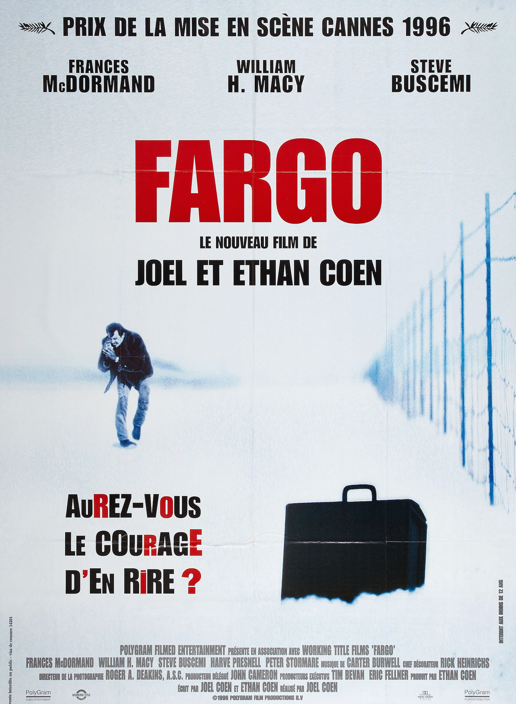
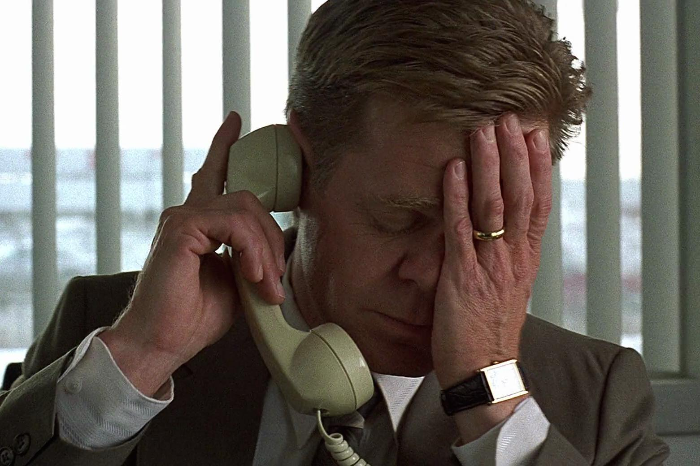
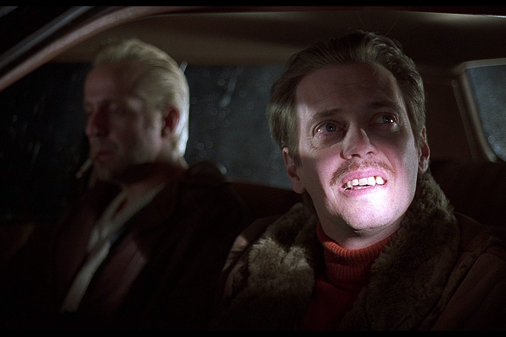

+++
type = "post"
titre = "<em>Fargo</em>, Joel et Ethan Coen"
title = "Fargo, Joel et Ethan Coen"
url = "/fargo-coen"
date = "2014-09-04T23:22:31"
Lastmod = "2014-09-06T10:16:46"
cover = "fargo-frances-mcdormand.jpg"
categorie = [ "À voir" ]
tag = [ "Comédie", "Drame", "Famille", "Humour", "Humour noir", "Mort", "Police" ]
createur = [ "Joel et Ethan Coen" ]
acteur = [ "Frances McDormand", "Peter Stormare", "Steve Buscemi", "William H. Macy" ]
annee = [ "1996" ]
weight = 1996
pays = [ "États-Unis" ]

+++

« Inspiré d&rsquo;une histoire vraie » et même tourné « dans le plus grand respect des faits » : avant même son générique, <em>Fargo</em> impose une solennité extrême. Le spectateur qui ignorerait tout du film pourrait ainsi se laisser abuser par les deux frères Coen qui font preuve d&rsquo;une astucieuse malice. En nous conditionnant à croire qu&rsquo;il s&rsquo;agit d&rsquo;une histoire vraie, en nous indiquant en outre dès le départ qu&rsquo;il y a eu des survivants, on s&rsquo;attend à un drame terrible, voire à une tragédie impitoyable. Joel et Ethan Coen parviennent ainsi à créer un horizon d&rsquo;attente… qu&rsquo;ils vont d&rsquo;autant mieux détruire par la suite. <em>Fargo</em> n&rsquo;est pas le drame larmoyant que l&rsquo;on pouvait attendre, mais une comédie noire extrêmement drôle où il n&rsquo;y a aucun personnage pour rattraper l&rsquo;autre, ni les criminels minables, ni la police incapable. Un classique, à (re)voir avec plaisir !

Fargo, petite bourgade dans le Dakota du Nord, une nuit d&rsquo;hiver. Jerry, responsables des ventes dans une concession automobile, rencontre deux types louches dans un bar miteux de la ville. Il amène avec lui une voiture flambant neuve et on comprend vite qu&rsquo;il veut embaucher ces deux voyou. L&rsquo;objectif est pour le moins original : endetté à l&rsquo;insu de sa famille, il veut extorquer de l&rsquo;argent à son beau-père fortuné, mais qui le déteste. À cette fin, il n&rsquo;a pas trouvé mieux que de demander à deux voyous de kidnapper sa femme et demander une rançon que le père paiera. <em>Fargo</em> se construit autour de cette idée un peu folle, et on peut sentir dès la rencontre dans le bar que c&rsquo;est une mauvaise idée. Dès lors, une sorte de machine infernale se met en action et rien de ce qui était prévu ne se déroule comme prévu. Les deux hommes embauchés pour le job sont des criminels assez grossiers qui mettent la maison sans dessus dessous, en passant. Et puis un policier les arrête et c&rsquo;est un bain de sang qui commence : Joel et Ethan Coen filment une descente aux enfers, avec une accumulation de cadavres qui semble inexorable. C&rsquo;est une tragédie, en quelque sorte, mais le film ne tombe jamais dans le tragique. Bien au contraire, plus les cadavres s&rsquo;accumulent, plus <em>Fargo</em> augmente la dose d&rsquo;humour noir.

De fait, à condition naturellement d&rsquo;adhérer à ce genre d&rsquo;humour, <em>Fargo</em> est vraiment drôle. On retrouve ici quelques thèmes forts qui traversent toute la filmographie des deux frères Coen, mais l&rsquo;élément le plus sensible dans ce film, c&rsquo;est peut-être la galerie de personnages ratés rassemblés en une heure et demi. C&rsquo;est bien simple, il n&rsquo;y a ici personne au-dessus de la médiocrité : Jerry a besoin d&rsquo;une somme ridicule d&rsquo;argent et il imagine le plan le plus stupide qui soit pour extorquer de l&rsquo;argent à son beau-père. Les deux voyous qu&rsquo;il embauche sont les pires qu&rsquo;il pouvait embaucher, ils ne sont jamais discrets, oublient les éléments les plus élémentaires et laissent derrière eux un bain de sang toujours plus profond. Ce n&rsquo;est pas Marge, la policière qui se charge de l&rsquo;enquête, qui va relever le niveau : même si elle comprend finalement ce qui s&rsquo;est déroulé, <em>Fargo</em> se moque gentiment de ce personnage insensible aux meurtres sur lesquels elle doit enquêter, et qui se plait dans une vie monotone sans intérêt. Le portrait n&rsquo;est pas toujours flatteur, mais Joel et Ethan Coen ne tombent jamais dans la farce ou dans la caricature sociale. Ce n&rsquo;est même pas leur sujet et les deux cinéastes ont un regard ironique, mais aussi tendre, sur leurs personnages. Ils peuvent compter sur le talent des acteurs rassemblés dans <em>Fargo</em> pour éviter de tomber dans la surenchère : William H. Macy est génial dans son rôle d&rsquo;époux lâche, Steve Buscemi est parfait en « type bizarre », voyou de la petite semaine qui paye les 4 $ de parking quand on le lui demande, mais on retiendra surtout la prestation de Frances McDormand. L&rsquo;actrice n&rsquo;a pas obtenu l&rsquo;Oscar pour ce rôle sans raison, elle est brillante dans ce rôle de policière qui semble si fragile, mais qui est au fond le personnage le plus solide du lot.

<em>Fargo</em> ouvre avec un tel aplomb et un tel sérieux, que l&rsquo;on a du mal à oser en rire, comme l&rsquo;affiche française défiait les spectateurs de l&rsquo;époque. Certes, Joel et Ethan Coen s&rsquo;en donnent à cœur joie à coups de bains de sang et de meurtres parfois très glauques — l&rsquo;interdiction aux moins de 12 ans n&rsquo;est pas usurpée —, mais leur sixième long-métrage est d&rsquo;abord et avant tout une comédie. Une comédie noire, c&rsquo;est vrai, mais si vous appréciez cet humour, <em>Fargo</em> est une très belle réussite, à voir et à revoir !

<h3>Vous voulez <a href="/soutien/">m&rsquo;aider</a> ?</h3>
<ul>
<li><a href="http://www.amazon.fr/gp/product/B0052OSMWC/ref=as_li_ss_tl?ie=UTF8&amp;tag=leblogdenic07-21&amp;linkCode=as2&amp;camp=1642&amp;creative=19458&amp;creativeASIN=B0052OSMWC">Acheter le film en Blu-ray sur Amazon</a></li>
<li><a href="http://www.amazon.fr/gp/product/B0002KVEV2/ref=as_li_ss_tl?ie=UTF8&amp;tag=leblogdenic07-21&amp;linkCode=as2&amp;camp=1642&amp;creative=19458&amp;creativeASIN=B0002KVEV2">Acheter le film en DVD sur Amazon</a></li>
<li><a href="https://itunes.apple.com/fr/movie/fargo/id341289724">Acheter ou louer le film sur l&rsquo;iTunes Store</a></li>
</ul>

