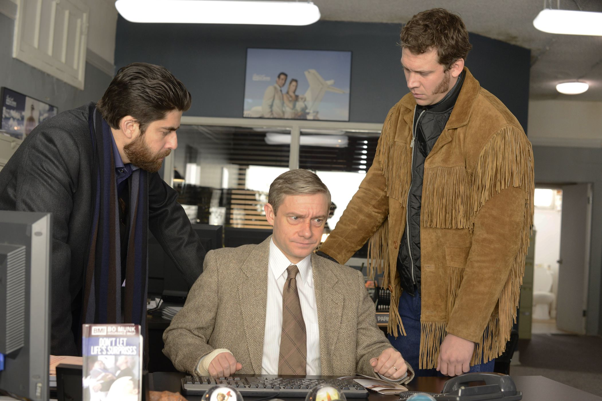
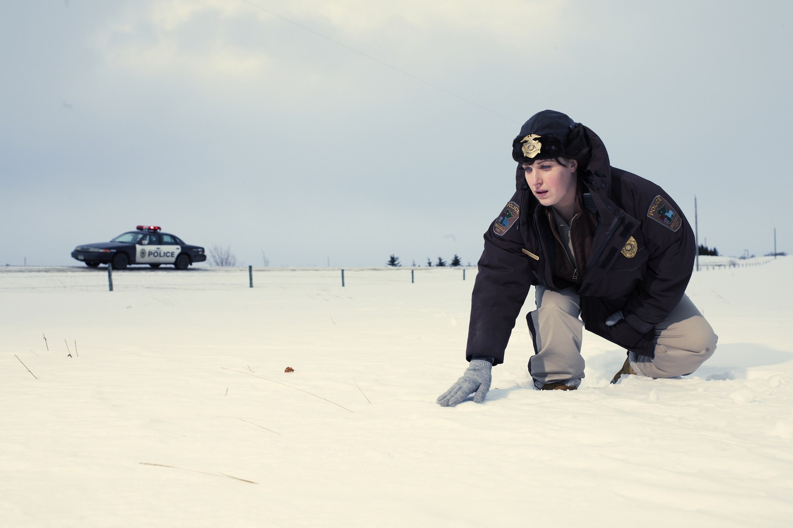
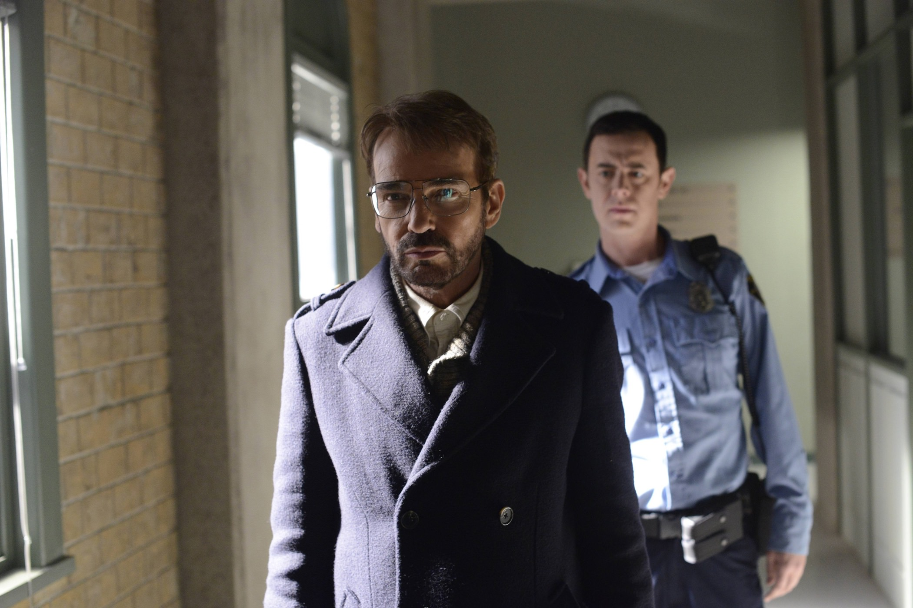

+++
type = "post"
titre = "<em>Fargo</em>, Noah Hawley (FX)"
title = "Fargo, Noah Hawley (FX)"
url = "/fargo-hawley-fx"
date = "2014-10-06T11:07:02"
Lastmod = "2014-10-05T11:15:40"
cover = "fargo-billy-bob-thornton.jpg"
categorie = [ "À voir" ]
tag = [ "Amour", "Drame", "Enquête", "Humour noir", "Mensonge", "Mort", "Police", "Remake", "Série" ]
createur = [ "FX", "Noah Hawley" ]
acteur = [ "Allison Tolman", "Billy Bob Thornton", "Bob Odenkirk", "Colin Hanks", "Martin Freeman" ]
annee = [ "2014" ]
weight = 2014
pays = [ "États-Unis" ]

+++

En 1996, Joel et Ethan Coen sortent <a href="http://voiretmanger.fr/fargo-coen/" title="Fargo, Joel et Ethan Coen"><em>Fargo</em></a>, une comédie à l&rsquo;humour noir sanglant, une plongée jouissive dans l&rsquo;Amérique profonde et une galerie de personnages tous plus ratés les uns que les autres. Autant dire que l&rsquo;on pouvait être sceptique face au projet de faire une série à partir du long-métrage. Que pouvait bien ajouter <em>Fargo</em>, série commandée par la chaîne FX et créée par Noah Hawley, à un excellent film, une œuvre culte qui se suffit largement à elle-même ? Contre toute attente, les dix épisodes de la première saison apportent une réponse très claire : elle apporte beaucoup. Commençant comme un banal remake de l&rsquo;original, la série dévie rapidement et déploie son propre scénario, tout en préservant l&rsquo;esprit imaginé par les frères Coen. Ces derniers produisent d&rsquo;ailleurs sur ce projet et ce n&rsquo;est pas un hasard. L&rsquo;intérêt de <em>Fargo</em> n&rsquo;était pas évident au premier abord, mais c&rsquo;est une vraie réussite, à ne pas rater !

<em>Fargo</em>, la série, se suffit également à elle-même et il n&rsquo;est pas nécessaire d&rsquo;avoir vu <em>Fargo</em>, le film, avant de commencer. Ceci étant dit, vous perdrez beaucoup si vous ne connaissez pas l&rsquo;original. Et pour cause, Noah Hawley ne se contente pas de reprendre l&rsquo;histoire originale en l&rsquo;étendant pour passer de une heure et demi à neuf ou dix heures, mais le film des frères Coen plane en permanence au-dessus de la série. Il en reprend le cadre — le Minnesota, autour de la ville de Fargo —, il conserve la météo neigeuse, les grands espaces blancs et va jusqu&rsquo;à reprendre l&rsquo;idée de base d&rsquo;un homme tout à fait normal qui dérape et déclenche une série de crimes qu&rsquo;il ne maîtrise pas. Mais avant même tout cela, <em>Fargo</em> est plein de références et de clins d&rsquo;œil à l&rsquo;œuvre originale, et une partie du plaisir de la série consiste à les dénicher. Il y en a d&rsquo;évidentes, comme ce message qui ouvre chaque épisode pour indiquer que tout ce qui va suivre est vrai… ce qui est totalement faux. Dans leur film, Joel et Ethan Coen créaient ainsi une attente en se moquant aussi des œuvres inspirées d&rsquo;histoires vraies, et ce ton très sérieux tranchait nettement avec la suite, beaucoup plus loufoque. Ici, l&rsquo;effet n&rsquo;est pas aussi intense, puisqu&rsquo;il s&rsquo;étale sur dix épisodes, mais c&rsquo;est un clin d&rsquo;œil qui fixe le contexte. Les références sont souvent plus subtiles, mais elles sont omniprésentes : il y a le mari qui n&rsquo;est pas très riche alors que sa famille l&rsquo;est — dans le film, son beau-père, dans la série c&rsquo;est son frère —, il y a le couple de malfrats, il y a la police locale avec une femme à la tête de l&rsquo;enquête, il y a la mafia et il y a même un million de dollars enterrés dans la neige. De ce fait, même si <em>Fargo</em> n&rsquo;est pas tout à fait une suite, il s&rsquo;établit dans la continuité du film. Cela ne change rien pour comprendre la série, mais c&rsquo;est perdre un élément important que de l&rsquo;ignorer totalement…

Noah Hawley déploie une autre histoire dans <em>Fargo</em>, tout en préservant les grandes idées de base des frères Coen. Comme toutes les bonnes séries, celle-ci se distingue par des personnages dessinés avec beaucoup de précision et ils sont tous ici très réussis. Il y a d&rsquo;abord le mari, Lester Nygaard (Martin Freeman, très bon dans ce rôle), qui est au départ un type un peu minable qui n&rsquo;a rien fait dans sa vie et qui se fait mener à la baguette par tout le monde. Alors qu&rsquo;il vient de se faire casser le nez par un ancien camarade de lycée, il rencontre par hasard Lorne Malvo (Billy Bob Thornton, glacial et brillant !), tueur à gages employé par la mafia du coin. Sans le savoir, il demande à ce dernier de tuer le camarade en question et ce premier crime entraîne, avec un effet boule de neige que rien ne semble arrêter, toute une série d&rsquo;autres meurtres. Il ne faut pas dévoiler ce qui suit pour conserver le plaisir de la découverte, mais disons simplement que <em>Fargo</em> va rapidement déborder du cadre de la petite bourgade de Bemidji et impliquer d&rsquo;autres villes des alentours, mais aussi le FBI. L&rsquo;enquête est menée par Molly Solverson (Allison Tolman, très convaincante) qui se doute immédiatement que Lester n&rsquo;est pas aussi innocent qu&rsquo;il l&rsquo;affirme. Noah Hawley n&rsquo;a pas oublié l&rsquo;humour noir du premier film et dans la série, il provient surtout de Lorne Malvo. Tueur implacable, il est aussi un excellent acteur qui se met dans la peau des personnages les plus improbables, tantôt un prêtre, tantôt un dentiste. Il ment avec un calme implacable et se permet tout et n&rsquo;importe quoi, aidé il faut dire par l&rsquo;incompétence générale qui l&rsquo;entoure. Dans <em>Fargo</em>, ce psychopathe qui tue une vingtaine de personnes simplement parce qu&rsquo;on l&rsquo;a trahi est le seul personnage vraiment compétent. Tous les autres, que ce soit les policiers de Bemidji ou ceux d&rsquo;à côté, sont tous aussi incapables les uns que les autres… et ne parlons même pas des deux agents du FBI. Sur ce point aussi, la série est très fidèle au film original et même si on perd un peu le fameux tic de langage « <em>Oh yeah !</em> » — ceux qui ont vu <em>Fargo</em> comprendront —, l&rsquo;esprit est toujours là, et c&rsquo;est un plaisir à suivre.

<em>Fargo</em> est une série surprenante : sur le papier, on voyait mal comment un remake de l&rsquo;excellent film de Joel et Ethan Coen pouvait produire quelque chose d&rsquo;intéressant, pour ne pas dire de bon. Le long-métrage se suffisait à lui-même et il n&rsquo;avait pas besoin d&rsquo;ajouter quelque chose pour être meilleur. Au contraire même, on pouvait craindre que l&rsquo;esprit du film se perde en étant dilué sur la longueur. Il n&rsquo;en est rien : la série créée par Noah Hawley a l&rsquo;intelligence de se construire à partir du film, sans le copier, ni même le suivre précisément. L&rsquo;histoire est différente et elle justifie le format sur dix épisodes, on ne s&rsquo;ennuie d&rsquo;ailleurs jamais et si la série multiplie les clins d&rsquo;œil, elle constitue aussi une œuvre indépendante. Ce qui permettra d&rsquo;ailleurs à <em>Fargo</em> de continuer avec une deuxième saison. Sur le modèle de <a href="http://voiretmanger.fr/true-detective-pizzolatto-hbo/" title="True Detective, Nic Pizzolatto (HBO)"><em>True Detective</em></a>, cette saison n&rsquo;aura plus rien à voir : autres personnages, autre époque, seul le cadre sera conservé. Et, on l&rsquo;espère, l&rsquo;esprit de cette saison qui mérite en tout cas d&rsquo;être vue !

<h3>Vous voulez <a href="http://voiretmanger.fr/soutien/">m&rsquo;aider</a> ?</h3>
<ul>
<li><a href="http://www.netflix.com/WiMovie/70285785?trkid=13462100">Regarder la série sur Netflix</a></li>
</ul>

