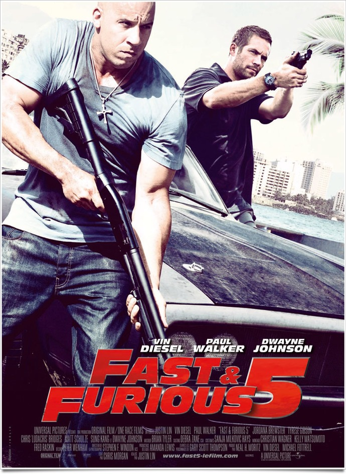
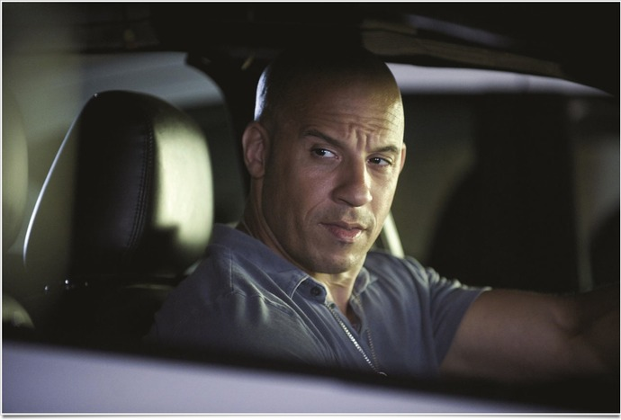

+++
type = "post"
titre = "<em>Fast and Furious 5</em>, Justin Lin"
title = "Fast and Furious 5, Justin Lin"
url = "/fast-and-furious-5-lin"
date = "2011-05-06T23:43:37"
Lastmod = "2015-04-12T10:29:31"
cover = "fast-and-furious-5.jpg"
categorie = [ "À voir" ]
tag = [ "Action", "Blockbuster", "Famille", "Thriller", "Vite oublié" ]
createur = [ "Justin Lin" ]
acteur = [ "Dwayne Johnson", "Paul Walker", "Vin Diesel" ]
annee = [ "2011" ]
weight = 2011
saga = [ "Fast and Furious" ]
pays = [ "États-Unis" ]
original = "Fast Five"

+++

&laquo;&nbsp;Oublie la finesse&nbsp;&raquo; : ce conseil adressé par son héros à l&rsquo;un des protagonistes est aussi celui qu&rsquo;il faut absolument s&rsquo;adresser avant d&rsquo;entrer en salles pour voir <em>Fast and Furious 5</em>. Qu&rsquo;on se le dise, on est ici dans le domaine du prévisible grossier, un blockbuster gonflé aux testostérones et millimétré pour plaire à sa cible. Ce qui n&rsquo;est pas forcément un problème : à condition de le savoir d&rsquo;emblée, le dernier film de Justin Lin s&rsquo;avère assez efficace et plutôt plaisant, même s&rsquo;il sera aussi extrêmement vite oublié…

Le film commence sur un petit rappel pour ceux qui n&rsquo;auraient pas suivi les épisodes précédents – rassurez-vous d&rsquo;ailleurs, on peut voir <em>Fast and Furious 5</em> sans jamais avoir vu la saga qui précède. Dom, le <em>bad guy</em> qui conduit (vraiment) très bien a été condamné à 25 ans de prison. Brian, prisonnier qui a contribué à le faire tomber, culpabilise un peu et pour cause : sa copine s&rsquo;avère aussi être la sœur de Dom. Pris de remords, il décide de faire évader son beau-frère dans une très spectaculaire scène de course avec un bus et trois voitures (forcément) belles et puissantes. Le rythme baisse alors d&rsquo;un coup et l&rsquo;on se retrouve à Rio, où Brian et sa Mia vivent paisiblement, mais sans le sou. C&rsquo;est d&rsquo;ailleurs pour renflouer les caisses qu&rsquo;ils décident de participer à un vol de voiture qui est censé être tranquille, si tranquille que ce plan devient suspect. De fait, tout le monde risque la mort au cours d&rsquo;une (encore) spectaculaire scène avec un train et quelques voitures. S&rsquo;enclenche alors une véritable course entre, d&rsquo;une part, le trio de gentils devenus méchants, mais qui sont en fait gentils ; le grand méchant patron de la mafia de Rio qui n&rsquo;est pas content du tout parce que son fric est en danger ; un gros mec extrêmement (beaucoup trop) musclé qui a l&rsquo;air bien décidé à tout faire pour arrêter Dom et ses potes.

Tout est là pour poser une bonne intrigue de base, rien ne manque dans l&rsquo;équation, <em>Fast and Furious 5</em> peut commencer. Pourtant, quelque chose a changé dans ce nouvel épisode. Comme l&rsquo;affiche le montre bien, les voitures sont toujours là, indéniablement, mais elles sont en retrait. Inutile de le nier, les amateurs de belles voitures en auront pour leur argent et si vous aimez entendre le rugissement d&rsquo;un moteur, vous aimerez incontestablement ce film. De manière surprenante, le scénario ne met pas vraiment les courses en avant. Il n&rsquo;y a pour ainsi dire qu&rsquo;une seule course en bonne et due forme et même s&rsquo;il contient des courses-poursuites plus classiques, <em>Fast and Furious 5</em> n&rsquo;est plus un film de courses où l&rsquo;enjeu se résume à l&rsquo;affrontement de pilotes. Le plus significatif à cet égard est certainement une ellipse que l&rsquo;on aurait juré impossible : à un moment du film, les deux héros cherchent une voiture et ils doivent faire une course pour la gagner. Alors que l&rsquo;ambiance des quatre premiers films s&rsquo;était à nouveau installée (plein de belles voitures et filles, la musique…), ce film-là passe directement à la conclusion qui est sans surprise, ils ont gagné la voiture, et donc la course. Ce cinquième épisode donne ainsi l&rsquo;impression d&rsquo;être passé à autre chose, de ne plus s&rsquo;intéresser aux courses, mais à autre chose, et en l&rsquo;occurrence à ce qui ressemblerait presque à un thriller. Thriller, le mot est peut-être un peu fort, mais disons que l&rsquo;action prédomine ici, une action musclée, parfois violente. La trilogie Jason Bourne est passée par là, c&rsquo;est flagrant lors de la course-poursuite sur les toits des favélas de Rio, et c&rsquo;est globalement assez réussi.

Malheureusement, <em>Fast and Furious 5</em> est tellement dans les clichés que le film ne dépasse pas le simple plaisir de voir des scènes impressionnantes. La série a toujours été marquée par les clichés sur les voitures. Ils sont ici toujours aussi présents et toujours aussi machistes, même si les femmes ont parfois le droit de passer derrière le volant. La gent féminine reste quand même globalement cantonnée à son rôle de faire-valoir pour les hommes qui peuvent ainsi étaler leur niveau de richesse. La conception de la réussite selon les personnages de ce film est d&rsquo;ailleurs assez affligeante : récupérer 10 millions de dollars et vous pourrez vous offrir les plus belles voitures et femmes. Certes, le trait est un peu exagéré et nos deux héros sont un petit peu plus intelligents que cela, mais c&rsquo;est quand même le message global. La cible du film est très bien définie et Justin Lin ne la rate absolument pas, mais son film s&rsquo;en cache tellement peu que cela devient vraiment gênant pour tous ceux qui ne sont pas dedans. Pour le reste, on est sur de l&rsquo;ultra-classique hollywoodien. Le groupe qui se constitue est composé de toutes les minorités visibles qu&rsquo;il faut avoir dans son film pour réussir, avec au passage quelques clichés à la limite du racisme (la grande gueule est un noir, le gars discret est asiatique…). La fin est sans surprise dégoulinante de bonheur, mais aussi grande ouverte (pas d&rsquo;inquiétude, une suite est prévue dès l&rsquo;année prochaine), tandis que le Rio de carte postale est vraiment pénible<a href="#fn-4791-1" rel="footnote">1</a>. Tous ces clichés font partie sans doute du plaisir coupable de regarder un blockbuster fun, tout simplement, mais ils s&rsquo;avèrent aussi gênants, d&rsquo;autant que <em>Fast and Furious 5</em> fait preuve d&rsquo;une belle constance dans les incohérences et le grand n&rsquo;importe quoi. Dom peut prendre tous les coups qu&rsquo;il veut, il s&rsquo;en ressort sans une seule marque. Les voitures ont droit au même traitement : elles font des bonds de 10 mètres et survivent miraculeusement, enfin sauf si ce n&rsquo;est pas un gentil qui la conduisait évidemment. De ce point de vue, on est bien loin du réalisme de <a href="/saga/jason-bourne/"><em>Jason Bourne</em></a>…

Ces incohérences et clichés sont passés sur le plan technique également. On a déjà évoqué le Rio de carte postale, évoquons aussi la caméra incapable de rester statique plus d&rsquo;une seconde, de peur d&rsquo;ennuyer le spectateur sans doute. Elle bouge tout le temps et chaque plan ne dure pas plus d&rsquo;une poignée de secondes. Inutile de le nier, Justin Lin sait filmer des scènes d&rsquo;action impressionnantes et <em>Fast and Furious 5</em> n&rsquo;est pas avare en scènes époustouflantes. Le clou du spectacle est bien sûr cette longue course-poursuite où les voitures se battent… à coup de coffre fort, mais dès la scène d&rsquo;introduction, on comprend que le film frappe fort. Si vous aimez l&rsquo;action, vous serez comblés et c&rsquo;est un film à voir en salles, sur grand écran, pour cette raison. Ce n&rsquo;est pas un film à voir pour ses acteurs par contre. Vin Diesel est à l&rsquo;image du film, il n&rsquo;est bon que dans les scènes d&rsquo;action, il est médiocre dans les moments calmes et au mieux mauvais quand il doit parler. Paul Walker s&rsquo;en sort un peu mieux, mais ce n&rsquo;était pas très dur et autour d&rsquo;eux, ce n&rsquo;est vraiment pas glorieux non plus. Sur ce point, <em>Fast and Furious 5</em> est bien dans l&rsquo;esprit de la série : les meilleurs acteurs sont indéniablement les voitures…

<em>Fast and Furious 5</em> est un film à voir en salles pour en prendre plein la vue, mais c&rsquo;est à peu près tout. Bourré de clichés, le dernier film de Justin Lin pourrait être drôle tant il s&rsquo;approche de la parodie, mais on ne peut malheureusement jamais remettre en cause son sérieux. Dommage, les quelques pointes d&rsquo;humour que l&rsquo;on relevait dans <em><a href="/2010/08/06/expendables-stallone/">Expendables : Unité spéciale</a></em> de Sylvester Stalone permettaient de (très légèrement) sauver le film. Ici, on s&rsquo;amuse pendant la séance, on s&rsquo;agace un peu devant l&rsquo;accumulation de clichés et on est bien content de sortir de la salle l&rsquo;esprit vidé. Ce n’est pas si mal, mais ce n&rsquo;est quand même pas grand-chose.

<h3>Vous voulez m&rsquo;aider ?</h3>
<ul>
<li><a href="http://www.amazon.fr/gp/product/B004ZCUFPY/ref=as_li_ss_tl?ie=UTF8&tag=leblogdenic07-21&linkCode=as2&camp=1642&creative=19458&creativeASIN=B004ZCUFPY">Acheter le film en Blu-Ray et DVD sur Amazon</a></li>
<li><a href="http://www.amazon.fr/gp/product/B004ZCUFHW/ref=as_li_ss_tl?ie=UTF8&tag=leblogdenic07-21&linkCode=as2&camp=1642&creative=19458&creativeASIN=B004ZCUFHW">Acheter le film en DVD sur Amazon</a></li>
<li><a href="https://itunes.apple.com/fr/movie/fast-furious-5/id448847906">Acheter ou louer le film sur l&rsquo;iTunes Store</a></li>
</ul>

<ol>
<li id="fn-4791-1">
C&rsquo;est peut-être d&rsquo;avoir vu <em><a href="/2011/04/18/rio-saldanha/">Rio</a></em> récemment, mais vraiment, les plans en hélicoptère autour de la statue de Jésus, on n&rsquo;en peut plus. Alors quand en plus on l&rsquo;a 4 ou 5 fois dans un seul film…&#160;<a href="#fnref-4791-1" rev="footnote">&#8617;</a>
</li>
</ol>

