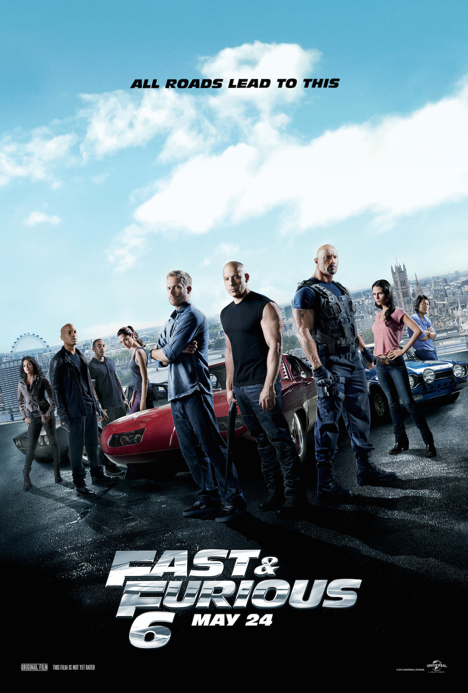

+++
titre = "<em>Fast and Furious 6</em>, Justin Lin"
title = "Fast and Furious 6, Justin Lin"
url = "/fast-and-furious-6-lin"
date = "2014-05-28T23:36:24"
Lastmod = "2015-04-12T10:26:21"
cover = "fast-furious-6-jusin-lin.jpg"
categorie = [ "À voir" ]
tag = [ "Action", "Blockbuster", "Vite oublié", "Voiture" ]
createur = [ "Justin Lin" ]
acteur = [ "Dwayne Johnson", "Michelle Rodriguez", "Paul Walker", "Vin Diesel" ]
annee = [ "2013" ]
weight = 2013
saga = [ "Fast and Furious" ]
pays = [ "États-Unis" ]

+++

Une autoroute, quelque part — à ce niveau, ce n’est absolument pas cela qui compte. Une poignée de bolides, des classiques américaines au moteur vrombissant, naturellement, poursuivent un gros camion. Les poursuivants tendent un câble extrêmement solide au milieu de l’autoroute pour les arrêter. Suffisant ? Partout ailleurs, oui, mais pas dans <em>Fast and Furious 6</em>. Le camion est éventré, peut-être, mais c’est alors un tank qui en sort et qui participe à la course-poursuite à plus de 150 km/h. Une piste de décollage, la plus longue piste du monde même — il faudrait faire le calcul, mais on est sûrement aux alentours de 100 km de longueur. Nouvelle course-poursuite, d’abord entre bolides, jusqu’au moment où un avion s’en mêle. Il atterrit devant les voitures, l’une monte, les autres font tout pour l’empêcher de décoller, quitte à lancer un câble depuis une petite voiture citadine pour bloquer le fonctionnement de l’avion. Deux scènes aussi stupides qu’époustouflantes : rien n’est réaliste, rien n’est crédible même, mais <em>Fast and Furious 6</em> va plus loin encore que ses prédécesseurs et il faut bien reconnaître que ça pète.

Malheureusement, Justin Lin a la mauvaise idée d’avoir des prétentions. Si <em>Fast and Furious 6</em> se résumait à ces deux scènes explosives, plus quelques courses-poursuites secondaires qui sont parfaitement maîtrisées, on aurait un film d’action décérébré, mais qui assumerait sa stupidité et pourrait ainsi être très fun. C’est tellement gros, que cela en devient comique et, à la manière des <a href="http://voiretmanger.fr/saga/expendables/"><em>Expendables</em></a>, on pourrait même trouver cela assez drôle. Malheureusement (bis), il a fallu absolument enrichir le film avec un scénario qui, pire encore, se veut sérieux. Et envoyez les clichés à base de retour à la vie normale et de retraite interrompue par l’ancien méchant flic, devenu gentil ici. Rassemblez l’équipe habituelle, avec son quota de femmes, de noirs et d’asiatiques. Regroupez les voitures les plus bruyantes et faites les rouler très vite, en particulier de nuit et en ville. Tous les clichés sont réunis et après tout, c’est bien normal, ils sont à la base de la saga. Fallait-il vraiment essayer d’imaginer une histoire autour de l’ancienne copine de l’un qui était censée être morte, mais qui a perdu la mémoire ? Devait-on vraiment s’encombrer des délires d’un méchant qui veut plonger le pays dans le chaos, mais qui fait tout pour être pris ?

<iframe class="aligncenter" src="https://www.youtube.com/embed/2VZnMa_sNXQ" frameborder="0" allowfullscreen></iframe>

C’est le souci de <em>Fast and Furious 6</em>, le même que pour <a href="http://voiretmanger.fr/fast-and-furious-5-lin/">son prédécesseur</a> : il n’assume pas assez son côté débile et au lieu de se contenter de scènes spectaculaires, il nous assomme avec un scénario invraisemblable et sans intérêt. Résultat, le film est trop long (2h10) et on s’ennuie ferme assez souvent. Le mieux, en attendant un septième volet qui, on peut l’espérer, ira encore plus loin, c’est encore de se contenter de la scène du tank et celle de l’avion. On voit le meilleur du film, et on gagne pas mal de temps…

<h3>Vous voulez <a href="http://voiretmanger.fr/soutien/">m’aider</a> ?</h3>
<ul>
<li><a href="http://www.amazon.fr/gp/product/B00CXLKI4C/ref=as_li_ss_tl?ie=UTF8&amp;tag=leblogdenic07-21&amp;linkCode=as2&amp;camp=1642&amp;creative=19458&amp;creativeASIN=B00CXLKI4C">Acheter le film en Blu-ray et DVD sur Amazon</a></li>
<li><a href="http://www.amazon.fr/gp/product/B00CXLKHNO/ref=as_li_ss_tl?ie=UTF8&amp;tag=leblogdenic07-21&amp;linkCode=as2&amp;camp=1642&amp;creative=19458&amp;creativeASIN=B00CXLKHNO">Acheter le film en DVD sur Amazon</a></li>
<li><a href="https://itunes.apple.com/fr/movie/fast-furious-6/id664571799">Acheter ou louer le film sur l’iTunes Store</a></li>
</ul>

