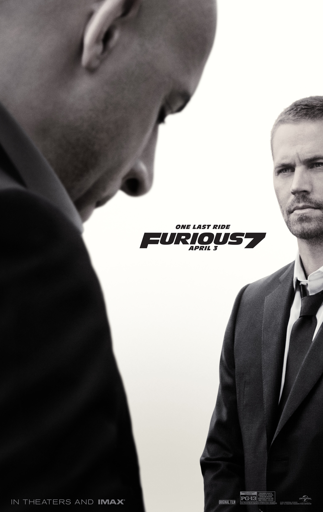
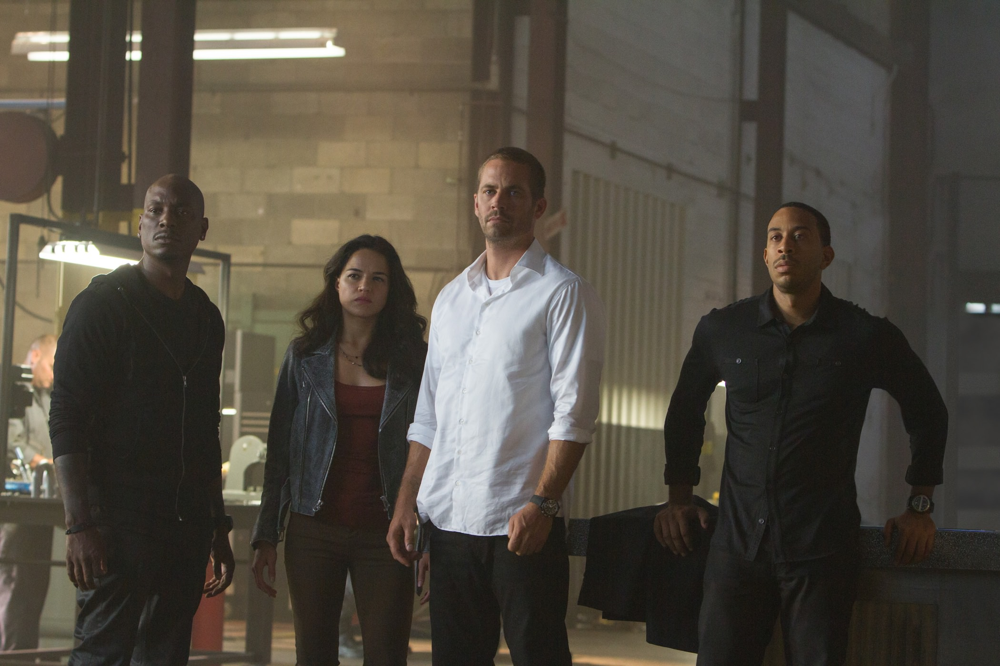
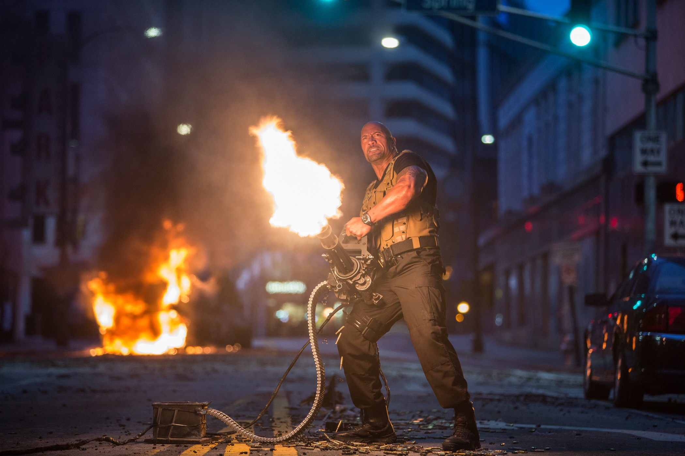

+++
titre = "<em>Fast &#038; Furious 7</em>, James Wan"
title = "Fast &#038; Furious 7, James Wan"
url = "/fast-furious-7-wan"
date = "2015-04-14T23:57:58"
Lastmod = "2015-04-15T00:01:02"
cover = "fast-furious-7-wan.jpg"
categorie = [ "À voir" ]
tag = [ "Action", "Amour", "Blockbuster", "Hommage", "Informatique", "Sorties du mois", "Voiture" ]
createur = [ "James Wan" ]
acteur = [ "Dwayne Johnson", "Jason Statham", "Jordana Brewster", "Michelle Rodriguez", "Paul Walker", "Vin Diesel" ]
pays = [ "États-Unis", "Japon" ]
original = "Furious 7"

+++

Septième volet dans la <a href="http://voiretmanger.fr/saga/fast-and-furious/">saga <em>Fast &amp; Furious</em></a>, cet épisode se distingue de tous les autres par la mort de l&rsquo;un de ses acteurs principaux, mais le projet était déjà différent de ses prédécesseurs à la conception. Après avoir signé quatre des sept films, Justin Lin s&rsquo;est retiré et c&rsquo;est le réalisateur malaisien James Wan qui a pris le relai. Un choix surprenant quand on sait qu&rsquo;il s&rsquo;était spécialisé jusque-là dans les films d&rsquo;horreur, mais un choix qui témoigne sans doute de cette volonté de renouvellement. De fait, après deux épisodes un peu trop sérieux, <em>Fast &amp; Furious 7</em> assume enfin sa débilité et promet du grand spectacle souvent bluffant, des pneus qui crissent et pas mal de nanas dénudées pendant plus de deux heures. C&rsquo;est complètement stupide, mais c&rsquo;est très bien réalisé et le divertissement est bien au rendez-vous. Si vous aimez le genre, ne passez pas à côté !

« <em>Bon, ça commence à devenir un peu trop mièvre !</em> », s&rsquo;exclame à un moment donné Hobbs, le flic bodybuildé — en fait, un catcheur toujours en activité et Dwayne Johnson interprète son personnage avec un bonheur manifeste qui fait plaisir. Cette prise de conscience soudaine écourte une scène qui devenait effectivement pénible et elle est la bienvenue. Contrairement à son prédécesseur, James Wan a semble-t-il compris que cette saga ne pouvait pas être sérieuse, et il ne cherche pas à nous tromper sur la marchandise. Contrairement à <a href="http://voiretmanger.fr/fast-and-furious-6-lin/" title="Fast and Furious 6, Justin Lin"><em>Fast and Furious 6</em></a> qui gâchait ses bons moments par un enrobage ridicule et ennuyeux, le scénario va ici à l&rsquo;essentiel et quand il se perd à tenter une incursion dans la mesure des sentiments, il est vite rappelé à l&rsquo;ordre d&rsquo;une manière ou d&rsquo;une autre. De ce fait, <em>Fast &amp; Furious 7</em> compte bien quelques scènes de romance entre les personnages censés s&rsquo;aimer, ainsi que quelques discours pompeux de Dominic Torretto, le personnage principal — incarné par un Vin Diesel égal à lui-même —, sur l&rsquo;importance de la famille. Mais ces scènes ont toujours le bon goût de rester courtes, si bien que l&rsquo;on profite mieux de l&rsquo;action qui est, il faut bien le reconnaître, la seule vraie réussite du film. Malgré tout, James Wan n&rsquo;a pas réussi à faire aussi court que l&rsquo;on aurait aimé et son film est un petit peu trop long. On ne s&rsquo;ennuie jamais vraiment, mais on a parfois le sentiment que le montage aurait pu être plus strict encore et que <em>Fast &amp; Furious 7</em> aurait gagné à être écourté de quelques dizaines de minutes.

Malgré ces réserves, il faut aussi bien reconnaître que le long-métrage frappe fort, très fort même dans toutes ses scènes d&rsquo;action. On pensait avoir tout vu avec cette saga riche en spectaculaire tendance grand n&rsquo;importe quoi, mais ce n&rsquo;était rien en comparaison de ce qu&rsquo;offre ce <em>Fast &amp; Furious 7</em>. Jugez plutôt : la première course-poursuite majeure commence dans un avion, d&rsquo;où sont larguées toutes les voitures de nos héros. Elles tombent en chute libre, sont ralenties par un parachute et finissent par atterrir sur la route, juste derrière la cible. Cette séquence justifie probablement à elle seule de voir le film, et le fait qu&rsquo;elle ait été réalisée avec de vraies voitures dans un vrai avion, à quelques milliers de mètres d&rsquo;altitude, ne la rend que plus impressionnante encore. James Wan a limité au maximum l&rsquo;utilisation du numérique, et c&rsquo;est une excellente chose : force est de constater que la réussite, sur le plan technique, est incroyable. On est toujours à des kilomètres du réalisme, mais on s&rsquo;y croirait et c&rsquo;est encore plus important : si vous avez la chance de regarder <em>Fast &amp; Furious 7</em> sur un grand écran, vous en prendrez plein la vue. Plus loin, une voiture saute d&rsquo;un gratte-ciel à l&rsquo;autre à deux reprises et plus tard encore, le héros accroche un sac de grenades à un hélicoptère depuis sa voiture, après avoir sauté d&rsquo;un garage en train de s&rsquo;effondrer, naturellement. Et il n&rsquo;y a pas que les séquences d&rsquo;action qui sont impressionnantes, James Wan joue avec sa caméra d&rsquo;une main de maître. Certaines séquences sont bluffantes, notamment les courses avec un montage alterné extrêmement rapide de la pédale d&rsquo;accélération à une vue d&rsquo;ensemble, en passant par le volant, le visage du conducteur ou ses mains sur le volant. C&rsquo;est très bien fichu et toujours parfaitement lisible, ce qui était loin d&rsquo;être gagné d&rsquo;avance.

Comme ses prédécesseurs, <em>Fast &amp; Furious 7</em> est ridicule par beaucoup d&rsquo;aspects. Ne parlons même pas de son traitement des femmes — on est tellement dans le cliché dans ce domaine que cela en devient presque sociologiquement intéressant —, mais tout est prévisible et souvent risible, notamment dès que la famille entre en jeu. Pourtant, quand le film se termine et qu&rsquo;il se transforme en hommage à Paul Walker, l&rsquo;acteur fétiche de la saga tué ironiquement d&rsquo;un accident de voiture pendant le tournage, les critiques s&rsquo;estompent. Et d&rsquo;un coup, tout ces discours sur la famille prennent une autre saveur : après tout, ce sont les mêmes acteurs qui travaillent ensemble depuis près de quinze ans et on peut concevoir qu&rsquo;ils soient assez proches. <em>Fast &amp; Furious 7</em> se termine ainsi sur une note touchante et qui semble sincère, mais on retiendra surtout le déchainement de mécaniques qui n&rsquo;a jamais été aussi loin. James Wan monte encore la barre d&rsquo;un cran et on imagine que les épisodes suivants, déjà prévus, feront encore mieux. Et à condition que la saga ne retombe dans ce délire de justifier sa bêtise, on a plutôt hâte de voir cette suite…

