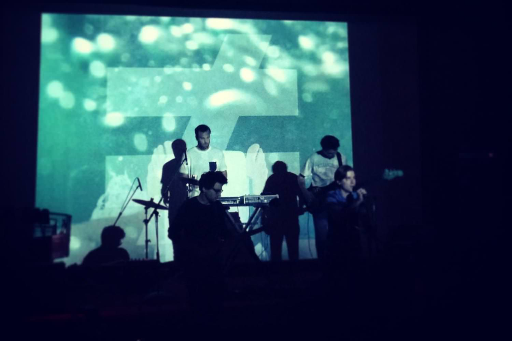

+++
type = "post"
titre = "FAUVE"
title = "FAUVE"
url = "/fauve"
date = "2013-11-07T14:23:45"
Lastmod = "2015-04-03T00:09:08"
cover = "fauve-blizzard.jpg"
categorie = [ "Musique" ]
tag = [ "Amour", "Chanson", "Électronique", "Musique", "Rap", "Spoken Words" ]
createur = [ "FAUVE" ]
annee = [ "2013" ]
weight = 2013
pays = [ "France" ]

+++

Véritable phénomène né sur internet et ses réseaux sociaux en 2011, FAUVE a explosé cette année avec un premier EP et des concerts qui affichaient systématiquement complets. Pourtant, je suis complètement passé à côté de ce mystérieux groupe parisien. Je n’en avais jamais entendu parler, jamais écouté leur musique, vu leur clip et il a fallu l’insistance d’un ami virtuel (merci <a href="https://twitter.com/JegnuX/">Jérome</a>) pour que je m’y intéresse. Problème d’emblée : on me parle surtout des textes, des paroles censées être profondes, touchantes, riches… or moi, les paroles ne m’intéressent que très rarement quand j’écoute quelque chose. La musique avant tout et cette présentation m’a refroidi, mais j’écoute, d’abord par politesse, d’une oreille distraite. Et puis une deuxième fois, d’une oreille moins distraite, une troisième, une quatrième… J’aurais aimé détester, écrire que ce groupe de jeunes Parisiens qui entretiennent avec soin le mystère qui les entoure m’a gonflé, que je n’ai pas accroché, mais ce serait un mensonge. La musique de FAUVE m’a happé, surtout ce chanteur au style parlé si particulier et même, c’est vrai, des paroles souvent maladroites, toujours touchantes. Une belle découverte, incontestablement…

FAUVE ne se définit pas comme un groupe, mais comme un collectif. Sur scène, ils ne sont que cinq, mais derrière, ils peuvent être plus nombreux en fonction des besoins. Il faut dire qu’ils ne font pas que des morceaux et des concerts : ils ont tous conçu en interne, de leur logo en forme de différence à leurs clips, souvent très travaillés, en passant par leurs t-shirts et même dernièrement une <a href="https://itunes.apple.com/fr/app/fauve/id724662946?mt=8" title="FAUVE pour iPhone">application pour iPhone</a> qui applique les symboles du groupe sur les photos des utilisateurs. Histoire de renforcer le mystère, ils ne veulent rester anonymes : sur <a href="https://www.facebook.com/FAUVEcorp">leur compte Facebook</a>, on peut voir des centaines de photos, mais rarement d’eux et quand c’est le cas, toujours de dos. Dans les interviews, ils refusent de donner leurs noms, préfèrent parler au nom de leur collectif plutôt que de leurs personnes. Ils veulent éviter que la médiatisation à outrance dont ils font l’objet depuis le début de l’année, c’est louable. C’est aussi une manière de renforcer le mystère, de faire parler d’eux, et ça marche, comme pour Daft Punk qui entretient le même mystère depuis leurs origines. Ce mystère savamment entretenu leur vaut de nombreuses critiques contre ce qui peut passer pour de la prétention mal placée. Au fond, on ne sait rien de FAUVE et au fond, ce n’est pas bien grave. Leur musique parle pour eux et elle devrait se suffire à elle-même.

<blockquote class="pull-quote">
Arrête

Qu’est-ce qui te prend de faire des trucs pareils? 
Pourquoi tu te fais du mal comme ça? 
Qu’est-ce qui va pas? Parle-moi Tu sais que tu peux tout me dire

C’est des conneries tout ça 
Regarde-moi dans les yeux Regarde-moi 
On s’en branle c’est pas important 
Moi je te trouve magnifique Depuis la première fois que je t’ai vu 
D’ailleurs je m’en suis toujours pas remis 
Et puis comment je ferais sans toi? 
Et puis comment l’Univers il ferait sans toi? 
Ça pourra jamais fonctionner c’est impossible<cite class="author"> — FAUVE, « Blizzard », </cite>

</blockquote>

<iframe class="aligncenter" src="//www.youtube.com/embed/HMpmedi_pH4" frameborder="0" allowfullscreen></iframe>

Ce titre, « <em>Blizzard</em> » est sans doute le plus célèbre, leur vrai tube, celui qui a donné son nom au premier album du groupe, mais aussi une note d’intention, une identification. Ce blizzard, c’est ce qui envahit la vie des trentenaires qu’ils sont presque, c’est une façon de parler de la routine, de l’ennui du quotidien, des difficultés du quotidien peut-être. Le morceau se termine par ces quelques mots scandés en boucle : « <em>Nique sa mère le Blizzard.</em> ». Combattre ce blizzard, tel est en quelque sorte, l’objectif du groupe. Quand on parle de FAUVE, difficile de ne pas parler des paroles. Il faut dire que le choix de ne pas chanter, mais de parler en musique, contribue à cette valorisation des paroles. Ce n’est pas du rap, ce n’est pas tout à fait du slam, c’est autre chose, un genre à part entière inspiré par des dizaines d’autres artistes et groupes avant eux, une symbiose originale. Sur certains titres — « <a href="http://www.youtube.com/watch?v=WDGMXjUMSKg"><em>Saint-Anne</em></a> » surtout —, on pense à Tanger. Sur d’autres, on pense plus au rap d’Abd al Malik ou d’autres — « <em>Cock Music Smart Music</em> » ou « <a href="https://www.youtube.com/watch?v=xcv0EN3TMZ0"><em>Voyou</em></a> » —, mais là encore, qu’importe le genre au fond. Il suffit de dire que cette voix s’impose dès les premières écoutes par sa puissance et même si le collectif n’a composé qu’une petite dizaine de titres pour le moment, on a incontestablement affaire à un excellent chanteur qui, paraît-il, ressemble fort au regretté Ian Curtis sur scène.

<iframe class="aligncenter" src="//www.youtube.com/embed/kb1Nu75l1vA" frameborder="0" allowfullscreen></iframe>

Des paroles donc, souvent pleines de désespoir et qui frappent par leur sincérité. Elles évoquent souvent l’amour, les désillusions, la difficulté de vivre à deux ou de trouver sa place Même si le groupe s’amuse à brouiller les cartes avec des évocations tantôt homosexuelles (« <em>Blizzard</em> » et « <em>Kané</em> ») tantôt hétérosexuelles (« <em>Voyou</em> » et plus encore « <a href="https://www.youtube.com/watch?v=oHvQUGD2a0I"><em>Nuits Fauves</em></a> » et son clip très sexe) ou tantôt d&rsquo;une neutralité travaillée (« <em>Rub A Dub</em> » ou « <em>Haut les cœurs</em> »), l’amour est au cœur des titres et il faut reconnaître que l’écriture est extrêmement efficace et atteint l’universel. Après tout, il s’agit d’un collectif qui entend parler d’amour sans se limiter à un amour en particulier. Les paroles sont souvent touchantes et elles ont fini par me convaincre, un peu malgré moi, mais elles ne sont pas sans défaut. Le chanteur parle plus qu’il ne chante et les mots sont aussi ceux du quotidien : FAUVE entend éviter des textes trop écrits et cela s’entend. Parfois cela fonctionne, parfois les textes accrochent un peu. On pourrait aussi leur reprocher un côté niais, un côté assumé en quelque sorte en se présentant comme « désespérément optimiste ». Quoi que l’on pense de leurs paroles, n’oublions pas la musique qui n’est pas en reste. Une guitare très présente, quelques béats de hip-hop, une batterie, des semples parfois… elle est tout aussi atypique que l’est ce groupe qui refuse les cases. Mélancolique, soignée, elle n’est pas qu’un faire valoir pour le flow du chanteur comme dans trop de rap. Elle compte vraiment et elle est réussie, avec de belles mélodies et une simplicité plutôt agréable, comme un contrepoint à des paroles et à une voix torturées. Le groupe est apparemment aussi très efficace sur scène, un bon point, même si le dispositif assez lourd — les images des clips sont omniprésentes — ne peut pas laisser toute la liberté nécessaire dans un concert.

<blockquote class="pull-quote">
Parce que t’es beau 
Comme une planète 
Je t’ai dans la peau, je t’ai dans la tête 
Je te le répèterai 
Tant qu’il faudra 
Tu peux pas t’en aller comme ça

Et puis tu feras quoi, cané, dis-moi ? 
T’auras l’air fin 
Ça sert à quoi, caner, dis-moi ? 
Ça sert à rien.<cite class="author"> — FAUVE, « Kané », </cite>

</blockquote>

Refusant le système, FAUVE n’a <em>a priori</em> toujours pas signé de contrat avec une maison de disque et le groupe continue obstinément de proposer gratuitement ses titres, même si on les trouve tous sur les plateformes de téléchargement légales. Cette différence appuyée jusqu’à leur logo les rend éminemment sympathiques, mais on retiendra surtout leur musique. FAUVE n’a pas encore signé d’album complet, seulement quelques morceaux sur un EP et une poignée d’autres disponibles sur leur site. C’est peu, et c’est déjà prometteur. Le groupe cristallise les critiques autant qu’il rassemble des fans, mais ne laisse personne indifférent. On peut adhérer ou non à cette musique parlée, à ces paroles touchantes et parfois un peu niaises. Le plus gros risque maintenant pour FAUVE désormais, c’est la redite : les quelques morceaux créés jusque-là ne suffiront pas à tenir sur la distance, mais le collectif saura-t-il se renouveler ? Quoi qu’il en soit, <em>Blizzard</em> et les quelques titres autour méritent d’être écoutés et qui sait, vous tomberez peut-être aussi sous le charme…

<h3>Vous voulez m&rsquo;aider ? </h3>
<ul>
<li><a href="http://www.amazon.fr/gp/product/B00DRFQAG8/ref=as_li_ss_tl?ie=UTF8&#038;tag=leblogdenic07-21&#038;linkCode=as2&#038;camp=1642&#038;creative=19458&#038;creativeASIN=B00DRFQAG8">Acheter <em>Blizzard</em> en CD sur Amazon</a></li>
<li><a href="https://itunes.apple.com/fr/album/blizzard/id632722469">Acheter <em>Blizzard</em> sur l&rsquo;iTunes Store</a></li>
<li><a href="http://fauvecorp.com">Découvrir et écouter FAUVE sur leur site</a></li>
</ul>

