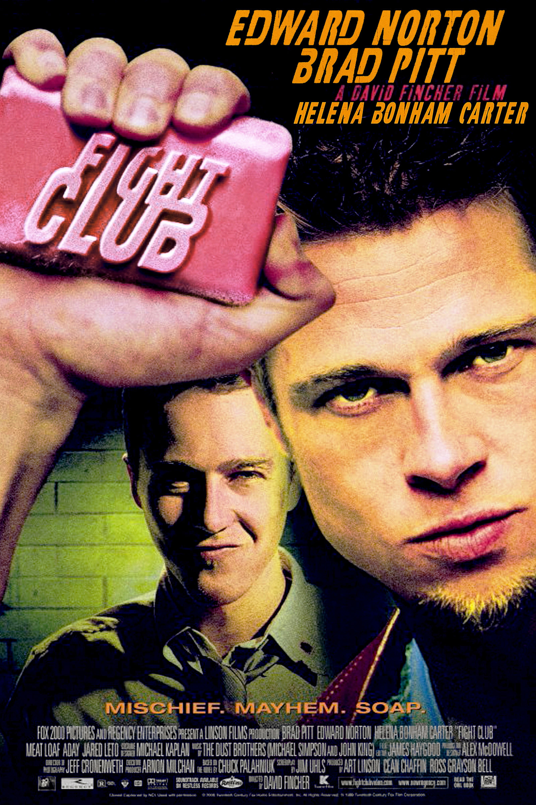
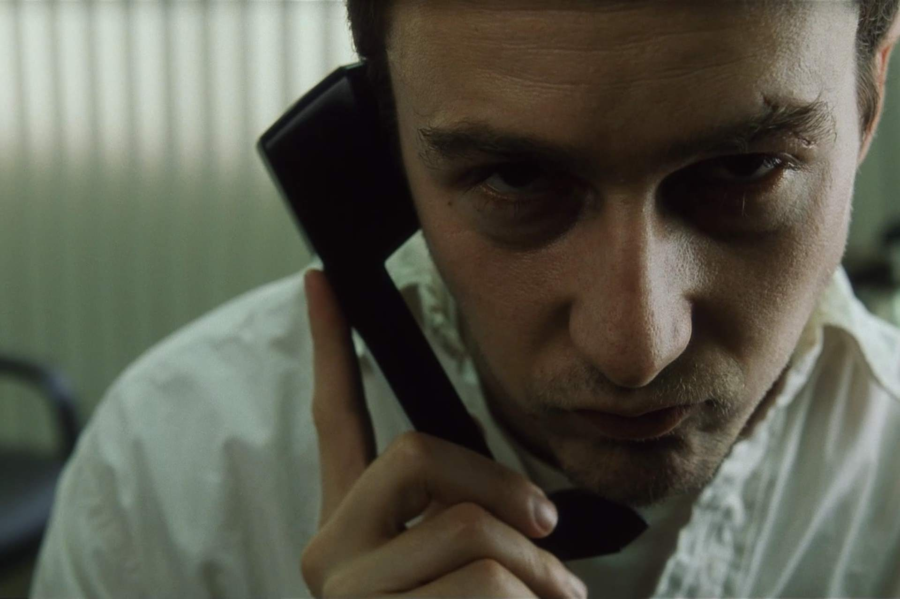
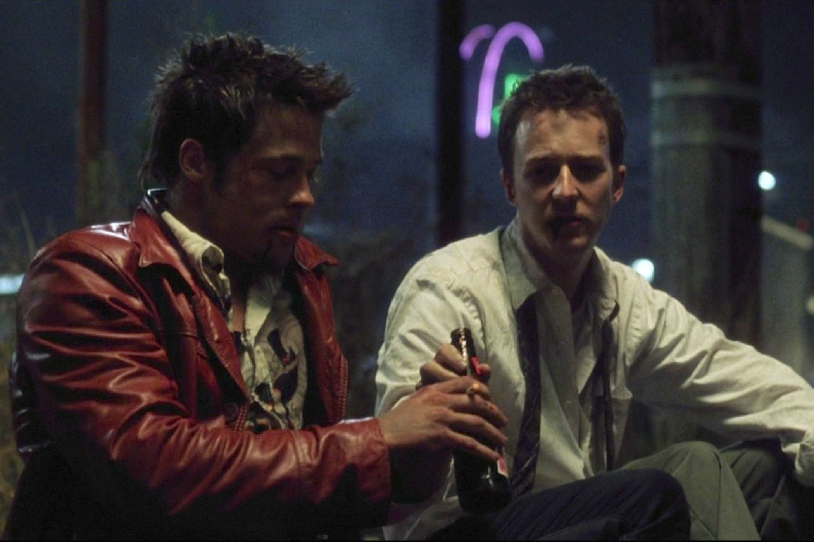

+++
type = "post"
titre = "<em>Fight Club</em>, David Fincher"
title = "Fight Club, David Fincher"
url = "/fight-club-fincher"
date = "2015-03-28T19:20:33"
Lastmod = "2015-03-28T19:23:39"
cover = "ficht-club-brad-pitt.jpg"
categorie = [ "À voir" ]
tag = [ "Adaptation littéraire", "Anarchie", "Folie", "Liberté", "Société", "Terrorisme", "Violence" ]
createur = [ "David Fincher" ]
acteur = [ "Brad Pitt", "Edward Norton", "Helena Bonham Carter", "Jared Leto", "Meat Loaf" ]
annee = [ "1999" ]
weight = 1999
pays = [ "États-Unis" ]

+++

<strong>Règle n°1 : ne rien lire sur <em>Fight Club</em> avant de voir <em>Fight Club</em>.</strong>

Boudé par la critique et le public à sa sortie, <em>Fight Club</em> a pourtant rapidement gagné une sacré réputation dans les années qui ont suivi sa sortie en salle. Le long-métrage est devenu culte, à tel point que des clubs de combats ont été créés un peu partout sur son modèle. Il faut dire que la quatrième réalisation de David Fincher frappe par sa violence extrême, son nihilisme et par sa représentation d&rsquo;une noirceur totale de la société. Adapté du roman éponyme de Chuck Palahniuk, <em>Fight Club</em> n&rsquo;est pas toujours agréable à regarder, mais il n&rsquo;en est pas moins brillant. De la mise en scène aux acteurs, tout est parfaitement maîtrisé et réalisé et on a incontestablement affaire à un grand film. À découvrir au moins une fois sans rien avoir lu à son sujet, pour ne pas gâcher la grande surprise qu&rsquo;il promet, et puis à voir et à revoir.

<em>Fight Club</em> est raconté par un narrateur qui est privé de prénom jusqu&rsquo;à la fin. On le découvre d&rsquo;abord par son travail, un emploi de bureau qui ne l&rsquo;intéresse absolument pas, mais aussi par son appartement, meublé des dernières nouveautés Ikea et qui ressemble plus à un catalogue qu&rsquo;à un lieu de vie. David Fincher n&rsquo;entretient aucun mystère sur son personnage principal : c&rsquo;est un homme malheureux, qui souffre d&rsquo;insomnies permanentes et qui n&rsquo;a pas vraiment de sens à donner à sa vie. Pour contrer les insomnies, il se rend dans tous les groupes de soutien qu&rsquo;il trouve et c&rsquo;est en pleurant avec ceux qui souffrent vraiment, qu&rsquo;il parvient à trouver le sommeil, pour un temps au moins. Après avoir perdu sa valise à l&rsquo;aéroport, puis son appartement emporté par une explosion de gaz, le narrateur contacte Tyler Durden, un fabricant de savon un peu excentrique qu&rsquo;il venait de rencontrer dans l&rsquo;avion. Anarchiste, Tyler l&rsquo;entraîne dans une idée un peu folle : créer des clubs de combats pour se défouler sans limite et ainsi permettre à la violence contenue en chacun de s&rsquo;exprimer pleinement. <em>Fight Club</em> dérive toutefois rapidement, alors que Tyler a des ambitions de plus en plus grandes pour faire tomber la société de consommation et lancer une sorte de révolution nihiliste à base d&rsquo;immenses explosions. Le narrateur n&rsquo;aime pas cette nouvelle tendance et tente de la combattre par tous les moyens, mais David Fincher avait ouvert son film en donnant une idée assez claire de la fin. Le générique d&rsquo;ouverture, entièrement en image de synthèse, reconstituait le cerveau du narrateur et sa peur, alors que Tyler pointait un revolver dans sa bouche, le forçant à accepter son plan. On pense ainsi comment l&rsquo;histoire se termine, du moins quand c&rsquo;est la première fois que l&rsquo;on regarde le film…

En effet, le coup de force de <em>Fight Club</em> est son twist final qui change tout. Alors que le film était jusque-là assez cohérent, avec le narrateur qui s&rsquo;associe à Tyler, un anarchiste violent qui le pousse à l&rsquo;aider dans sa démarche, le scénario révèle qu&rsquo;il ne s&rsquo;agissait en fait que d&rsquo;une seule et même personne. C&rsquo;est le narrateur qui a créé un double avec Tyler, un autre lui fourni par son inconscient et qui correspond exactement à ce qu&rsquo;il rêverait de devenir. Rétrospectivement, on réalise que certains points n&rsquo;étaient pas possibles, comme le fait que Tyler soit responsable de l&rsquo;explosion de l&rsquo;appartement alors qu&rsquo;il n&rsquo;en connaissait pas l&rsquo;adresse, ou bien encore que l&rsquo;on ne voit jamais Tyler en même temps que la femme avec qui il est et le narrateur. Mais c&rsquo;est là tout la réussite de la mise en scène de David Fincher : certes, on comprend la deuxième fois que des éléments ne sont pas normaux, mais tout est fait pour que l&rsquo;on adhère au premier degré à ce que l&rsquo;on voit, la première fois qu&rsquo;on regarde le film. <em>Fight Club</em> s&rsquo;apprécie encore plus en le revoyant, mais le long-métrage est toujours excellent. Sa réussite tient autant en la mise en scène très soignée du réalisateur, avec notamment sa photographie si typique qui est une vraie signature pour tous ses films, qu&rsquo;aux prestations de tous ses acteurs. Pour incarner le duo du narrateur et de Tyler, le cinéaste ne pouvait guère mieux tomber qu&rsquo;avec respectivement Edward Norton et Brad Pitt. Les deux acteurs sont, dans des registres différents, vraiment excellents et leur couple est toujours parfaitement crédible. Helena Bonham Carter est la seule femme au casting, mais elle assure dans son rôle.

On comprend sans peine pourquoi <em>Fight Club</em> était interdit aux moins de 16 ans à sa sortie en salles, beaucoup moins pourquoi la presse l&rsquo;a si unanimement boudé. Certes, David Fincher signe un film très sombre et violent, mais fait-il vraiment l&rsquo;apologie de cette violence, comme certains le lui ont reproché ? Le long-métrage est plus complexe que cela, notamment parce que le narrateur lutte contre Tyler dès lors que l&rsquo;on dépasse le stade des clubs de combats. <em>Fight Club</em> pose des questions gênantes sur notre société et les solutions proposées par son personnage ne le sont pas moins, mais ce n&rsquo;est pas une raison pour passer à côté. Bien au contraire, David Fincher trouve le ton juste et son film n&rsquo;est pas devenu culte pour rien. Une œuvre puissante et fascinante, que l&rsquo;on aurait vraiment tort d&rsquo;ignorer. À voir et à revoir, sans jamais oublier la toute première règle du club…

<h3>Vous voulez <a href="http://voiretmanger.fr/soutien/">m&rsquo;aider</a> ?</h3>
<ul>
<li><a href="http://www.amazon.fr/gp/product/B005H3HXYQ/ref=as_li_ss_tl?ie=UTF8&amp;tag=leblogdenic07-21&amp;linkCode=as2&amp;camp=1642&amp;creative=19458&amp;creativeASIN=B005H3HXYQ">Acheter le film en Blu-ray sur Amazon</a></li>
<li><a href="http://www.amazon.fr/gp/product/B00005AV4N/ref=as_li_ss_tl?ie=UTF8&amp;tag=leblogdenic07-21&amp;linkCode=as2&amp;camp=1642&amp;creative=19458&amp;creativeASIN=B00005AV4N">Acheter le film en DVD sur Amazon</a></li>
<li><a href="https://itunes.apple.com/fr/movie/fight-club/id455990300">Acheter ou louer le film sur l&rsquo;iTunes Store</a></li>
</ul>

