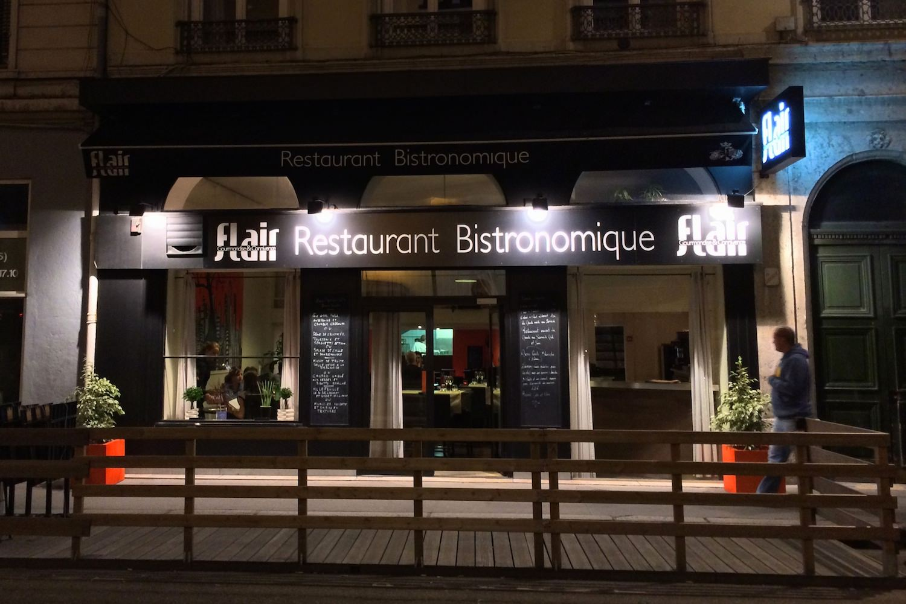
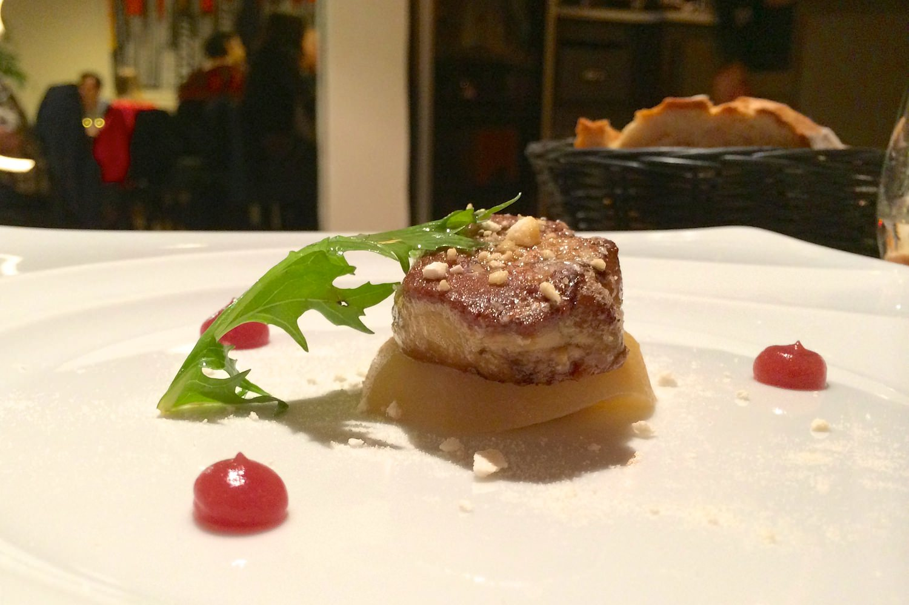
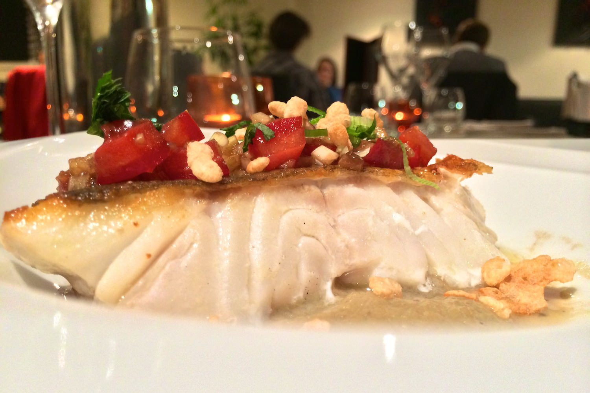
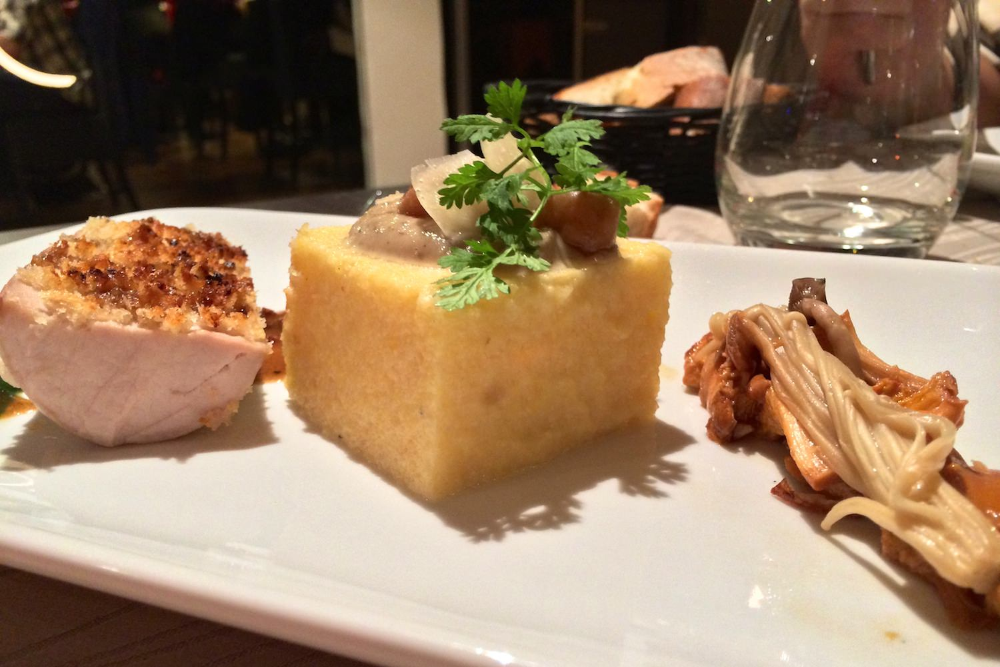
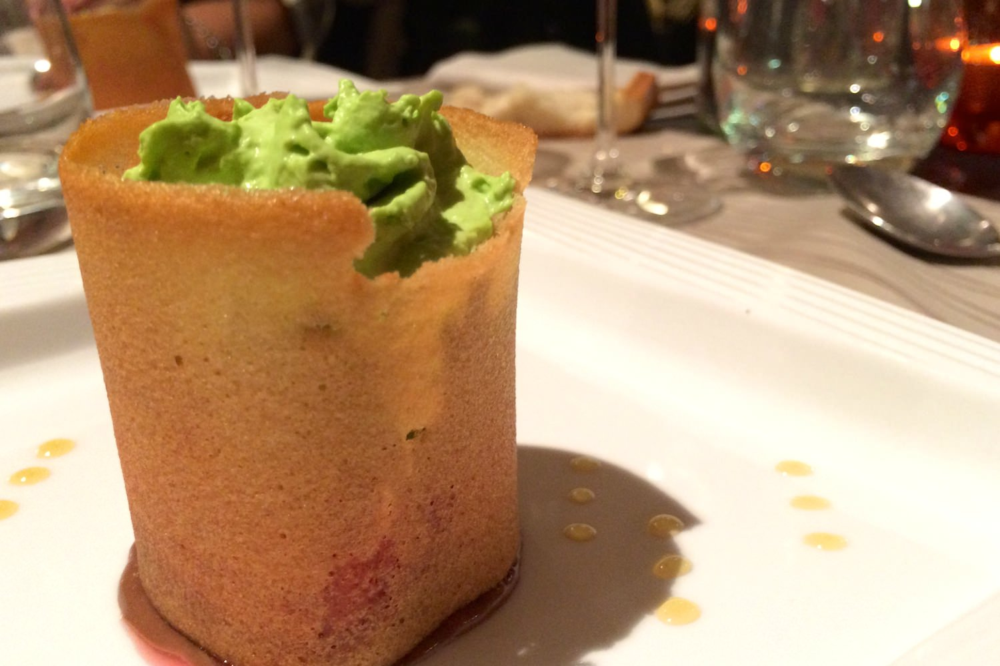

+++
type = "post"
titre = "Le FLAIR à Lyon"
title = "Le FLAIR à Lyon"
url = "/flair-lyon"
date = "2013-09-21T23:18:47"
Lastmod = "2013-09-21T23:23:10"
cover = "flair-bistronomique-lyon.jpg"
categorie = [ "À manger" ]
tag = [ "Bistronomique", "Cuisine française", "Cuisine moderne" ]

+++

À deux pas de la gare de Perrache, sur la presque-ile lyonnaise, les restaurants ne manquent pas. Sur sa devanture noire et assez classe, le <a href="http://www.restaurantflair.com"><strong>FLAIR</strong></a> se revendique « restaurant bistronomique », terme à la mode qui désigne souvent une cuisine simple à la base, mais retravaillée. À cette adresse, c’est un chef japonais qui révise la cuisine française : un classique à Lyon, qui peut faire des étincelles quand il est bien exécuté. Dans le même genre que l’excellent <a href="/au-14-fevrier-lyon/" title="Au 14 février, Lyon"><strong>Au 14 février</strong></a>, mais plus accessible, ce <strong>FLAIR</strong> est une excellente adresse, tout simplement.

À l’image de sa façade, très distinguée avec ses pans noirs relevés de grosses lettres blanches, la salle du <strong>FLAIR</strong> ne fait pas dans les fioritures, mais elle est efficace et assez classe. Plutôt réduite, elle rassemble une quarantaine de personnes lorsque le service est complet, dans une ambiance chaleureuse et assez discrète. On n’est pas trop les uns sur les autres, et l’ambiance bistrot est bien difficile à retrouver, si ce n’est peut-être pour le bar dans un coin de la salle et la banquette de l’autre côté. On est quand même plus du côté du restaurant et de la gastronomie que du bistrot et ce n’est pas plus mal. Ce samedi soir là, de nombreux couples se sont donné rendez-vous dans le restaurant pour une soirée en tête à tête, mais l’ambiance est certainement très différente un midi de semaine, dans ce quartier où les entreprises ne manquent pas.

En temps normal, le <strong>FLAIR</strong> propose une cuisine qui change très régulièrement et elle se déguste autour de <a href="http://www.restaurantflair.com/menu.html">formules</a> qui varient entre 15 et 18 € le midi, et 28 € le soir pour une entrée, un plat et un dessert. On peut aussi faire confiance au chef et se laisser porter par un menu composé de quatre assiettes que vous découvrirez pendant le repas, une formule toujours très plaisante pour les amateurs de bonne cuisine et de surprises. Pour cette version, comptez 42 € par personne pour toute la table, ou 55 € avec des accords en vin. Le soir où nous avons testé le restaurant était toutefois exceptionnel : dans le cadre du programme <a href="http://www.tousaurestaurant.com">Tous au restaurant</a>, un menu unique était proposé. Pour 50 €, on avait une sélection de <a href="/wp-content/2013/09/flair-menu-tous-au-restaurant.jpg">quatre plats</a> issus de la carte habituelle, mais sans possibilité d’en changer. En contrepartie et à condition de réserver sur internet, on ne payait qu’un menu sur deux : inutile de dire que l’on en sort gagnant, malgré les contraintes. Il faut dire que la cuisine proposée par le chef mérite le détour.

Le repas commence avec deux amuse-bouches qui mettent en appétit et donnent une idée assez précise de ce qui va suivre. Les rillettes de lieu noir sont fraiches et bien assaisonnées, le flan japonais au curry vert accompagné d’une crevette est très fin. On est d’emblée séduit par la recherche, le travail mené sur les saveurs et leur équilibre, une impression qui va se poursuivre. Le menu proposé par le <strong>FLAIR</strong> continue justement avec un foie gras poêlé servi avec un peu de compote de pommes, une poire légèrement compotée et quelques éclats de meringue. Un mélange sucré/salé qui a fait ses preuves et qui est parfaitement exécuté. Cette entrée est suffisamment légère pour ne pas peser sur la suite du repas, le foie n’est pas trop gros et surtout il est cuit à la perfection : craquant sur chaque face, fondant au cœur. Les fruits viennent apporter un contrepoint au gras du produit et la meringue ajoute une pincée de croquant à l’assiette qui est, au total, parfaitement équilibrée. Même sensation avec la belle pièce de cabillaud là encore cuite exactement comme il faut, sur une peau devenue craquante et sans surcuire la chair sensible du poisson. Pour l’accompagner, une purée d’aubergine en fond d’assiette et surtout un condiment à base de tomates, de basilic ciselé, de riz soufflé et un peu de vinaigre. En bouche, c’est une explosion de saveur, tous les éléments composent un ensemble qui se tient extrêmement bien… un bonheur pour le palais.

Le <strong>FLAIR</strong> poursuit le repas avec un morceau de porc cette fois. Plus classique, l’assiette se mange avec gourmandise : la chapelure à l’ail évite le côté plat que peut avoir parfois cette viande, la poêlée de champignons qui mêle giroles et enokitake japonais — un beau symbole de la cuisine mixte du restaurant — est savoureuse à souhait et la polenta crémeuse vient ajouter la rondeur à ce plat simple et très efficace. C’est peut-être celui qui s’approche le plus de la cuisine de bistrot, mais là encore largement retravaillée. Le dessert n’avait en revanche rien de traditionnel : dans une tuile arrondie pour former un cylindre, une couche de crème au chocolat, une brunoise de prunes rouge et surtout une mousse de thé matcha pour rappeler les origines japonaises du chef. Cette mousse, bien verte, est corsée, ce qui vient apporter un contrepoint astucieux aux prunes et au chocolat assez sucrés. Le biscuit tout autour est suffisamment fin pour rester discret, mais il apporte à l’assiette toute sa structure. Un dessert parfaitement exécuté, savoureux et gourmand, sans terminer le repas sur une note trop lourde.   

Difficile de ne pas être enthousiaste : le <strong>FLAIR</strong> est une excellente adresse pour déguster une cuisine moderne, raffinée et plutôt bon marché à Lyon. Ne vous fiez pas au terme « bistronomique », le chef japonais compose des assiettes raffinées dignes, sans conteste, des restaurants gastronomiques. Pour une soirée agréable ou pour un repas d’affaires, c’est un excellent choix autour de Perrache. 

