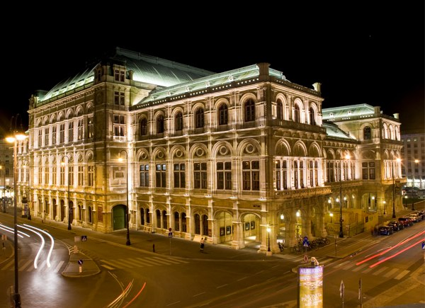
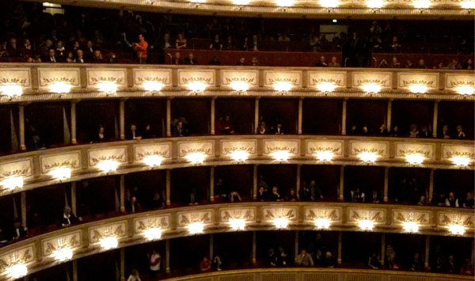
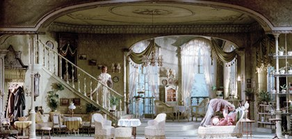
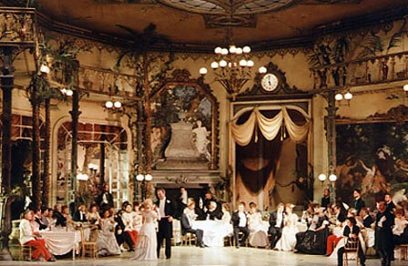

+++
type = "post"
titre = "Die Fledermaus, Johan Strauss (Wiener Staatsoper, 1 janvier 2010)"
title = "Die Fledermaus, Johan Strauss (Wiener Staatsoper, 1 janvier 2010)"
url = "/fledermaus-strauss-wiener-staatsoper"
date = "2010-01-03T19:07:19"
Lastmod = "2010-11-14T22:24:08"
cover = "fledermaus-strauss.jpg"
categorie = [ "À voir… en live" ]
tag = [ "Classique", "Opérette", "Vienne" ]
createur = [ "Johann Strauss" ]
annee = [ "2010" ]
weight = 2010
lieu = [ "Wiener Staatsoper" ]
chef = [ "Bertrand de Billy" ]

+++

<em>Die Fledermaus</em>, <em>La chauve-souris</em> en VF, est une opérette de Johan Strauss fils que l&rsquo;on connaît mieux pour ses valses (le <em>Beau Danube bleu</em>, c&rsquo;est lui), genre qu&rsquo;il a popularisé auprès de la cour et qu&rsquo;il a fait définitivement entrer dans les grands genres de la musique classique. Écrite en 1874, elle fut créée à Vienne la même année et passe depuis régulièrement. Lors d&rsquo;un séjour viennois, nous ne pouvions éviter le concert viennois, aussi légendaire que la <em>Sachertorte</em> ou Sisi<a href="#footnote_0_2382" id="identifier_0_2382" class="footnote-link footnote-identifier-link" title="Un sujet d&eacute;di&eacute; &agrave; ce jour devrait suivre dans les prochains jours&hellip;">1</a>. Faute de pouvoir assister au traditionnel concert du Nouvel-An, c&rsquo;est donc <em>La chauve-souris</em> de Strauss que nous avons vu au Staatsoper de Vienne, une opérette légère et fort agréable sous <a href="http://www.wiener-staatsoper.at/Content.Node2/home/spielplan/spielplan_detail_mitwirkende.php?eventid=713140">la direction</a> de Bertrand de Billy.

La programmation du Wiener Staatsoper a une philosophie très différente de celle des deux opéras parisiens. Le programme fait alterner plusieurs œuvres de manière régulière, sans la notion de saison. Ainsi, le lendemain se jouait <em>Les Noces de Figaro</em> de Mozart. De nouvelles œuvres sont évidemment ajoutées de manière régulière, mais l&rsquo;opéra fait aussi tourner un certain nombre de grands classiques bien rodés. Cela a plusieurs conséquences, mais d&rsquo;abord celle d&rsquo;éviter les scandales qui secouent régulièrement les scènes disons plus audacieuses, capables des relectures les plus folles d&rsquo;oeuvres classiques. Aller à l&rsquo;opéra de Vienne est la garantie de voir un spectacle mise en scène de manière plus conventionnelle et bien rodé.

Ce choix a des conséquences aussi sur le public. Bien sur on trouve dans l&rsquo;assemblée et surtout dans les premiers rangs du parterre et dans les loges des premiers étages, toute la haute société viennoise, et sans doute en partie la noblesse viennoise. Ce n&rsquo;est pas étonnant quand on voit que le prix des places atteint les 200 € dans ces zones. L&rsquo;opéra conserve sa fonction première de se montrer (le spectacle proprement dit ayant longtemps été secondaire), mais malgré tout, on peut penser que l&rsquo;on ne va pas voir 10 fois le même opéra à 200 € la place sur une année. Et de fait, une grande partie du public est composé d&rsquo;étrangers, a notre image d&rsquo;ailleurs. Certes, la période du Nouvel-An s&rsquo;y prêtait particulièrement bien, mais je crois que le phénomène est régulier. Ce soir-là, on n&rsquo;entendait peu d&rsquo;Allemand dans les couloirs de l&rsquo;opéra, mais de l&rsquo;Anglais, des langues venues d&rsquo;Asie et d&rsquo;autres encore. Les tour opérateurs intègrent manifestement tous une soirée à l&rsquo;opéra de Vienne dans leur programme…

Le système semble en tout cas bien fonctionner si j&rsquo;en crois la salle pleine en ce premier janvier 2010. Outre la haute société et les touristes, le public se compose aussi d&rsquo;étudiants attires par le tarif de 3 € pour les places de dernière minute (et contrairement a Paris, on peut vraiment avoir des places a la dernière minute&#8230;). On sent que l&rsquo;opéra est ici une institution, un élément du patrimoine même. Les soirs sans représentation sont très rares dans l&rsquo;année, et je pense que les soirs vides le sont encore plus.

<em>Die Fledermaus</em> est une opérette en trois actes qui reprend le schéma traditionnel des comédies &laquo;&nbsp;à l&rsquo;ancienne&nbsp;&raquo;. Le premier acte se passe dans un appartement bourgeois (ci-dessous<a href="#footnote_1_2382" id="identifier_1_2382" class="footnote-link footnote-identifier-link" title="D&eacute;sol&eacute; pour la tr&egrave;s m&eacute;diocre qualit&eacute; des photos, l&rsquo;op&eacute;ra national viennois est tr&egrave;s tr&egrave;s chiche de ce c&ocirc;t&eacute;&hellip;">2</a>) et présente les personnages et l&rsquo;intrigue. On comprend ainsi que tout le monde souhaite aller à une fête donnée le soir même. On sait peu de choses de cette fête-là, sinon qu&rsquo;elle est apparemment fabuleuse. La servante de la maison a reçu une lettre l&rsquo;y invitant et essaie de convoquer le traditionnel argument de la tante très malade pour obtenir sa soirée. Le maître de maison doit purger une peine de huit jours de prison pour insulte à la police, mais aimerait bien ne s&rsquo;y rendre que le lendemain et profiter de la fête. On apprendra au second acte que la maîtresse de maison doit, elle aussi s&rsquo;y rendre. À la fin de cet acte, tout le monde peut se rendre à la fête, l&rsquo;intrigue est posée.

Le second acte correspond à la fête et noue toute l&rsquo;intrigue. On apprend ainsi que si toute la maison s&rsquo;est retrouvée à la fête, c&rsquo;est parce qu&rsquo;un autre personnage voulait se venger du maître de maison qui l&rsquo;avait, quelques années auparavant, ridiculisé alors qu&rsquo;il portait un costume de chauve-souris. Les ressorts classiques de la comédie sont ainsi appelés, l&rsquo;homme séduisant tour à tour sa servante transformée en actrice et sa femme masquée et dévoilant par ce biais son infidélité. Il est le seul à ne pas être au courant de l&rsquo;intrigue, ce qui permet au reste de la nombreuse assemblée de se moquer abondamment de lui. L&rsquo;acte se déroule entièrement chez le jeune prince qui organise la fête, dans un décor là encore très intérieur bourgeois dans la version que nous avons vu (ci-dessous).

Le dernier acte se déroule dans un décor très différent, puisqu&rsquo;il s&rsquo;agit de la fameuse prison qui devient le théâtre du dénouement de l&rsquo;intrigue. Enfin, si on peut parler de dénouement. Sur la fin en effet, on ne sait pas trop ce qui est passé par la tête de Strauss, mais c&rsquo;est un peu n&rsquo;importe quoi. La supercherie est démasquée, la revanche est consommée, mais à la toute fin, sans que l&rsquo;on sache très bien pourquoi, comme si cela n&rsquo;importait pas le moins du monde. À la fin, tout le monde sans exception se retrouve dans cette prison et reprend un des thèmes musicaux du second acte, sans que cela pose apparemment le moindre problème. On sent qu&rsquo;une intrigue complexe ou crédible était le cadet des soucis de Strauss et du livret adapté d&rsquo;une pièce autrichienne des années 1850. Ceci étant, si l&rsquo;on se laisse porter par l&rsquo;intrigue, cet acte est aussi très agréable et drôle.

Dans <em>Die Fledermaus</em>, les éléments parlés abondent, mais c&rsquo;est au cours de ce troisième acte qu&rsquo;ils sont le plus nombreux, à tel point que l&rsquo;on peut se demander si l&rsquo;on n&rsquo;a pas été téléporté dans un théâtre. Le garde de prison se lance ainsi dans un long rôle en partie improvisé, en tout cas mis à jour pour tenir compte de l&rsquo;actualité (on a ainsi eu droit au &laquo;&nbsp;<em>Yes we can</em>&nbsp;&raquo; et les allusions moqueuses au Volksoper, l&rsquo;autre opéra de Vienne, ont fusé). Le comédien (je ne crois pas qu&rsquo;on l&rsquo;ait entendu chanter) s&rsquo;exprimait dans un Autrichien très marqué et incompréhensible, ce qui est fort dommage quand les sous-titres (en anglais) ne traduisent pas sa partie. Nous n&rsquo;avons donc pas compris grand-chose, ce qui a un peu gâché le plaisir de ce troisième acte, même si le comique de situation ou celui de geste sont heureusement universels.

<em>La chauve-souris</em> de Johann Strauss est une opérette fort sympathique, parcourue d&rsquo;airs légers et agréables (dont une étonnante apologie du champagne…), mais aussi de longs moments parlés proches du théâtre, voire de la farce et de la <em>commedia dell&rsquo;arte</em>. Un spectacle réjouissant, qui plaira aux amateurs d&rsquo;opéra et à ceux qui préfèrent le théâtre. La grande salle de l&rsquo;opéra de Vienne a bien ri pendant le troisième acte, donc je crois que l&rsquo;on peut dire que c&rsquo;est efficace. Si vous aimez les opérettes d&rsquo;Offenbach (qui aurait <a href="http://fr.wikipedia.org/wiki/Johann_Strauss_II#Son_.C5.93uvre">conseillé à Strauss d&rsquo;en écrire</a>, d&rsquo;ailleurs), vous devriez aimer celle de Johann Strauss.

<em>Crédit photo couverture : <a href="http://www.musik-theater-schoenbrunn.at/english/fotos_1.htm">Charlotte Oswald &#8211; Musik Theater Schönbrunn</a></em>

<ol class="footnotes"><li id="footnote_0_2382" class="footnote">Un sujet dédié à ce jour devrait suivre dans les prochains jours&#8230; [<a href="#identifier_0_2382" class="footnote-link footnote-back-link">&#8617;</a>]</li><li id="footnote_1_2382" class="footnote">Désolé pour la très médiocre qualité des photos, l&rsquo;opéra national viennois est très très chiche de ce côté… [<a href="#identifier_1_2382" class="footnote-link footnote-back-link">&#8617;</a>]</li></ol>
