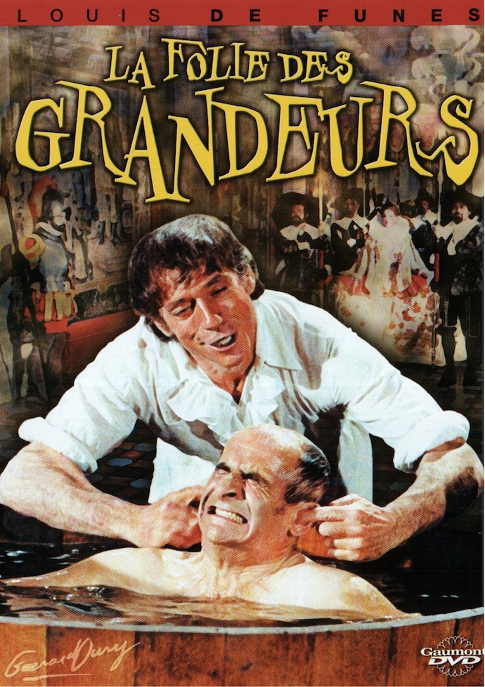
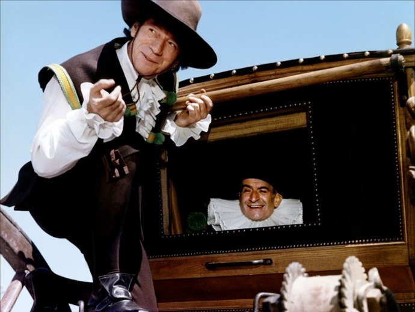
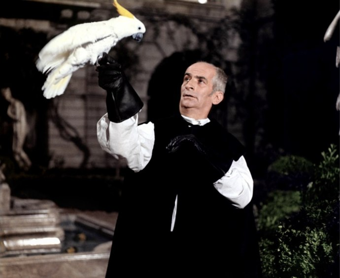

+++
type = "post"
titre = "<em>La Folie des Grandeurs</em>, Gérard Oury"
title = "La Folie des Grandeurs, Gérard Oury"
url = "/folie-grandeurs-oury"
date = "2010-07-25T01:34:55"
Lastmod = "2013-12-29T15:36:53"
cover = "louis-de-funes.jpg"
categorie = [ "À voir" ]
tag = [ "Caricature", "Cinéma classique", "Histoire", "Humour" ]
createur = [ "Gérard Oury" ]
acteur = [ "Alice Sapritch", "Louis de Funès", "Yves Montand" ]
annee = [ "1971" ]
weight = 1971
pays = [ "France" ]

+++

<em>La Folie des Grandeurs</em>, troisième collaboration entre Gérard Oury et l&rsquo;immense Louis de Funès après le succès énorme de <em>La Grande Vadrouille</em> et avant les mémorables <em>Aventures de Rabbi Jacob</em>. Les deux hommes ont finalement peu travaillé ensemble, surtout si l&rsquo;on regarde l&rsquo;ensemble de leurs imposantes filmographies. Et pourtant, ils ont durablement marqué de leur style le cinéma français. Un humour qui n&rsquo;a pas pris une ride au sein d&rsquo;un film toujours aussi drôle.

Comme l&rsquo;indique malicieusement le film en ouverture, <em>La Folie des Grandeurs</em> s&rsquo;inspire du <em>Ruy Blas</em> de Victor Hugo, magistral drame de l&rsquo;écrivain français. L&rsquo;inspiration est néanmoins très libre : les scénaristes ont conservé le cadre espagnol, les principaux personnages, de Ruy Blas bien sûr à Don Salluste, en passant par la Reine d&rsquo;Espagne et Don Cesar. Le valet Blas aime secrètement la Reine dans le film comme dans la pièce, Don Salluste est aussi exclu de la cour pour un enfant illégitime et Don Cesar refuse de venir en aide à son oncle Don Salluste qui fomente alors une machination qui fait passer son valet (Ruy Blas) pour Don Cesar. Toute cette trame générale de la pièce a été conservée, mais le film dérive complètement sur la fin et évite totalement le drame créé par Victor Hugo en faisant au contraire une fin bouffonne où tous les prétextes sont bons pour susciter les grimaces de Louis de Funès. <em>La Folie des Grandeurs</em> quitte alors le registre du drame pour la comédie, voire même la farce tant le comique de situation le plus grossier y est exploité avec beaucoup de succès d&rsquo;ailleurs.

Le cadre se veut historique, mais n&rsquo;a d&rsquo;historique que le nom. <em>La Folie des Grandeurs</em> est une caricature tout entière de l&rsquo;Espagne du XVIIe siècle qu&rsquo;il est censé montrer. On y trouve tous les attributs de l&rsquo;Espagne, de la cour à l&rsquo;étiquette extrêmement rigide jusqu&rsquo;à la corrida, en passant par la danse (claquettes de circonstance), des oranges ou encore le style maure des palais espagnols. Tout y est, mais tout sonne évidemment faux : c&rsquo;est évidemment une caricature et le film est finalement intéressant parce qu&rsquo;il caricature une époque et une culture. Le film prend des libertés par rapport à l&rsquo;histoire, avec quelques anachronismes comme ce chapeau qui se transforme en <a href="http://fr.wikipedia.org/wiki/Chapeau_de_Napoléon">bicome de Napoléon</a>. La Folie des Grandeurs remixe l&rsquo;histoire de Victor Hugo et l&rsquo;Histoire tout court avec la littérature et l&rsquo;Histoire de manière générale. La culture française est très présente et le film multiplie les clins d&rsquo;œil à l&rsquo;image de la référence aux Trois Mousquetaires de la part des conspirateurs qui s&rsquo;exclament : &laquo;&nbsp;Un pour tous, chacun pour soi !&nbsp;&raquo;

Comédie culte, <em>La Folie des Grandeurs</em> l&rsquo;est devenue par ses citations célèbres. La majeure partie tourne autour de la richesse et du pouvoir et prend parfois un écho contemporain étonnant. Bien sûr, on pense au célèbre adage de Don Salluste qui explique : &laquo;&nbsp;<em>Les pauvres, c&rsquo;est fait pour être très pauvre et les riches, c&rsquo;est fait pour être très riche</em>.&nbsp;&raquo; C&rsquo;est le même qui, en toute naïveté, s&rsquo;exclame : &laquo;&nbsp;<em>Je suis ministre, je ne sais rien faire !</em>&nbsp;&raquo; ou explique à son valet que &laquo;&nbsp;<em>ce sont les pauvres qui s&rsquo;excusent. Les riches sont désagréables.</em>&nbsp;&raquo; On pourrait ainsi multiplier les exemples de ces citations qui sont vraiment la marque de fabrique de ce cinéma et qui contribuent indéniablement au succès du film. Au centre du dispositif, on trouve bien évidemment un Louis de Funès alors en pleine forme, cabotin comme lui seul savait l&rsquo;être, mais néanmoins canalisé par une histoire qui a tant manqué à certains de ses films (on pense ici à la série des gendarmes, entre autres). Ses grimaces font une nouvelle fois des merveilles et ce rôle si typique d&rsquo;homme puissant et très lâche lui va à merveille. Il est à son meilleur niveau quand il est un Don Salluste puissant, doublant pour un rien les impôts et volant la majeure partie de ce qui est censé revenir au roi. Louis de Funès a un style mainte fois imité, jamais égalé et s&rsquo;il a eu un jeu d&rsquo;acteurs finalement assez limité, il est vraiment parfait dans ce type de rôle.

Le film de Gérard Oury a un peu vieilli sur le plan technique. Le choix de confier la bande-son à Michel Polnareff n&rsquo;est certainement pas étranger à ce sentiment. Ce contre-emploi est plutôt amusant d&rsquo;ailleurs, tant la musique du film est étrangère à l&rsquo;époque ou à la culture montrée par <em>La Folie des Grandeurs</em>. L&rsquo;anachronisme dans le film provient finalement d&rsquo;abord de cette musique qui reste marquée par les années 1970. Les scènes d&rsquo;action paraissent aujourd&rsquo;hui bien lentes et banales, mais l&rsquo;ensemble n&rsquo;a finalement pas si mal vieilli que cela. Il faut dire que dans cette comédie, l&rsquo;essentiel repose sur des jeux d&rsquo;acteur et des dialogues. Et sur ce plan, il n&rsquo;y a vraiment rien à redire.

<em>La Folie des Grandeurs</em> fait indéniablement partie des plus grands films avec Louis de Funès, qui constitue presque à lui tout seul un genre dans le cinéma français. Doté de dialogues extrêmement efficaces et d&rsquo;un acteur au meilleur de sa forme, le film réussit toujours à faire rire aujourd&rsquo;hui. La preuve, sans aucun doute, que l&rsquo;on a affaire là à un film culte. À (re)voir, encore et encore.

<h3>Vous voulez m&rsquo;aider ?<a href="#footnote_0_3706" id="identifier_0_3706" class="footnote-link footnote-identifier-link" title="&Agrave; propos de la publicit&eacute;&hellip;">1</a></h3>
<ul>
<li><a href="http://www.amazon.fr/gp/product/B003EN2SN2/ref=as_li_ss_tl?ie=UTF8&tag=leblogdenic07-21&linkCode=as2&camp=1642&creative=19458&creativeASIN=B003EN2SN2">Acheter le film en Blu-Ray sur Amazon</a></li>
<li><a href="http://www.amazon.fr/gp/product/B0014JKMBI/ref=as_li_ss_tl?ie=UTF8&tag=leblogdenic07-21&linkCode=as2&camp=1642&creative=19458&creativeASIN=B0014JKMBI">Acheter le film en DVD sur Amazon</a></li>
<li><a href="https://itunes.apple.com/fr/movie/la-folie-des-grandeurs/id389109905">Acheter ou louer le film sur l&rsquo;iTunes Store</a></li>
</ul>

<ol class="footnotes"><li id="footnote_0_3706" class="footnote"><a href="http://voiretmanger.fr/a-propos/publicite/">À propos de la publicité…</a> [<a href="#identifier_0_3706" class="footnote-link footnote-back-link">&#8617;</a>]</li></ol>
