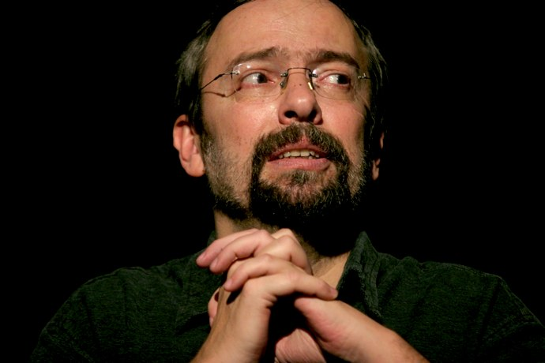

+++
type = "post"
titre = "France Inter : la fin d&rsquo;une époque"
title = "France Inter : la fin d'une époque"
url = "/france-inter-fin-epoque"
date = "2010-06-23T23:12:22"
Lastmod = "2010-06-26T10:43:47"
cover = "france-inter-independance.jpg"
categorie = [ "En bref" ]
tag = [ "Censure", "Comique", "Humour", "Politique", "Société" ]

+++

J&rsquo;ai appris en fin de matinée, comme beaucoup sans doute, le licenciement de France Inter de Didier Porte ET de Stéphane Guillon. Depuis l&rsquo;affaire DSK/Aubry provoquée par Guillon, les deux humoristes étaient pointés du doigt par le pouvoir. On sait que Nicolas Sarkozy en avait personnellement contre eux, et les nominations successives de Jean-Luc Hess et Philipe Val avaient sonné comme des formes de condamnations. Quand ce dernier a déclaré que Radio France coûtait cher et rapportait peu à l&rsquo;actionnaire, le message était très clair. Si Didier Porte était moins directement menacé, sa fameuse chronique où il mettait en scène Dominique de Villepin enculant Nicolas Sarkosy l&rsquo;a remis sur le devant de la scène avec un blâme de la direction.

Mais voilà, naïvement je pensais ces deux humoristes trop exposés pour être touchés. Je pensais que le pouvoir se rappellerait la grande leçon des cours d&rsquo;Ancien Régime : le fou du Roi est la soupape indispensable de tout système. Le soutien indéfectible et affiché tous les jours de Stéphane Bern dans son émission intelligemment nommée &laquo;&nbsp;Fou du roi&nbsp;&raquo; me rassurait. Je me disais que les dirigeants n&rsquo;allaient pas oser toucher à cette émission qui rassemblait tant de Français derrière leur poste, que cette émission servirait de caution humoristique et libre à la station.

Las, on a appris aujourd&rsquo;hui de la bouche des deux concernés, Stéphane Guillon dans sa chronique de ce matin (ci-dessous) et Didier Porte dans sa chronique de midi, qu&rsquo;ils étaient licenciés sans autre forme de procès. Une décision brutale, manifestement inattendue dans un climat qui semblait s&rsquo;être apaisé, et qui n&rsquo;est pas sans rappeler l&rsquo;arbitraire royal et une basse vengeance digne d&rsquo;un petit garçon vexé, pas d&rsquo;un homme d&rsquo;État.

<object classid="clsid:d27cdb6e-ae6d-11cf-96b8-444553540000" width="690" height="594" codebase="http://download.macromedia.com/pub/shockwave/cabs/flash/swflash.cab#version=6,0,40,0"><param name="allowFullScreen" value="true" /><param name="allowScriptAccess" value="always" /><param name="src" value="http://www.dailymotion.com/swf/video/xdscy9_france-inter-en-burqa_fun" /><param name="allowfullscreen" value="true" /><embed type="application/x-shockwave-flash" width="690" height="594" src="http://www.dailymotion.com/swf/video/xdscy9_france-inter-en-burqa_fun" allowscriptaccess="always" allowfullscreen="true"></embed></object>

&laquo;&nbsp;<em>France Inter, écoutez l&rsquo;indifférence</em>&nbsp;&raquo; (Stéphane Guillon)

La dernière chronique de Stéphane Guillon était ce matin. On doit encore entendre Didier Porte demain matin, puis dans les deux derniers &laquo;&nbsp;Fou du roi&nbsp;&raquo; de la saison. Tous deux ont été très dignes aujourd&rsquo;hui, Guillon retrouvant pour l&rsquo;occasion un humour qu&rsquo;il avait souvent perdu ces derniers temps, faisant un parallèle astucieux et très drôle avec la toile qui recouvre actuellement (et jusqu&rsquo;en 2012 !) la Maison de la radio pour travaux.

Cette purge, car il faut bien parler de purge, est vraiment insupportable. Quoi que l&rsquo;on pense des deux humoristes, que l&rsquo;on apprécie ou non leur humour ne change rien : leur éviction d&rsquo;une chaîne publique alors que l&rsquo;audience assurait tous les jours ou toutes les semaines leur légitimité, est un vrai scandale qui ne devrait pas exister dans une vraie démocratie. On se moque souvent de la situation catastrophique des médias italiens, mais je ne vois plus la différence. C&rsquo;est même pire dans le cas de France Inter, car beaucoup plus discret. Au moins, Berlusconi ne se cache pas.

J&rsquo;avais déjà eu l&rsquo;occasion de <a href="/2009/03/22/sauvons-les-humoristes/">défendre les humoristes</a> à l&rsquo;époque de &laquo;&nbsp;l&rsquo;affaire DSK&nbsp;&raquo;. Ma position n&rsquo;a pas changé d&rsquo;un <em>iota</em> : &laquo;&nbsp;<em>Il faut sauver les humoristes et j’encourage tous ceux pour qui la notion de liberté d’expression fait sens à soutenir tous les humoristes, quel que soit votre opinion à leur propos, même si vous trouvez qu’ils exagèrent, qu’ils vont trop loin, car n’oublions jamais que les dictatures se sont toujours instaurées en enlevant un bout de liberté, parfois totalement insignifiant.</em>&nbsp;&raquo; Je suggérais alors de les écouter en direct ou par podcast, ce qui sera évidemment difficile maintenant. Les deux ont aussi des spectacles que je vous encourage à voir si vous voulez les soutenir : Guillon tourne toujours à guichets fermés je crois, par contre Didier Porte aura besoin de nous. Son spectacle, présenté tous les mois au <a href="/2009/04/14/didier-porte-cafe-de-la-gare/">Café de la gare</a>, est à voir.

De mon côté, je ne sais pas que faire exactement. C&rsquo;est agaçant de se dire que l&rsquo;on a finalement que très peu de pouvoir sur une radio de service public qui est censé nous appartenir collectivement, et non appartenir au pouvoir en place. J&rsquo;aime bien France Inter, cela me fait de la peine de la boycotter&#8230; et puis pour écouter quoi à la place ? Je tolère Fogiel autour de Canteloup sur Europe 1, mais je serais incapable de l&rsquo;entendre plus de 10 secondes de suite. Je sens que je vais encore réduire mon (déjà très faible) temps d&rsquo;écoute de la radio. Voilà qui ne fait, en tout cas, que confirmer mon opinion sur les médias traditionnels.

Tout ce que l&rsquo;on peut souhaiter aux dirigeants de France Inter désormais, c&rsquo;est une chute libre des audiences aux heures où les humoristes avaient droit à la parole. Stéphane Bern a renouvelé aujourd&rsquo;hui son soutien à Didier Porte : est-cele signe d&rsquo;une démission ? Ce serait à n&rsquo;en pas douter un signe fort…

Ajout du 26 juin : la dernière chronique de François Morel conclut de manière remarquable cette semaine un peu folle. À la manière de <a href="http://jamaisdaccord.com/2010/06/24/inter-minables/" target="_blank">Violette</a>, il évoque France Inter comme &laquo;&nbsp;[sa] radio&nbsp;&raquo;, celle de son enfance, celle qui l&rsquo;a toujours accompagné et celle qu&rsquo;il ne retrouve plus aujourd&rsquo;hui. Une chronique amère, pas drôle du tout (logique, Hess ne veut pas d&rsquo;humour le matin), mais très juste. Morel a un talent fou pour trouver les bons mots et attaquer avec virulence, mais calme, sa direction (il compare Jean-Luc Hess avec Domenech).

<object classid="clsid:d27cdb6e-ae6d-11cf-96b8-444553540000" width="690" height="594" codebase="http://download.macromedia.com/pub/shockwave/cabs/flash/swflash.cab#version=6,0,40,0"><param name="allowFullScreen" value="true" /><param name="allowScriptAccess" value="always" /><param name="src" value="http://www.dailymotion.com/swf/video/xdtar0_fini-de-rire_fun" /><param name="allowfullscreen" value="true" /><embed type="application/x-shockwave-flash" width="690" height="594" src="http://www.dailymotion.com/swf/video/xdtar0_fini-de-rire_fun" allowscriptaccess="always" allowfullscreen="true"></embed></object>

<em>Crédit image couverture : </em><a href="http://www.flickr.com/photos/lhirlimann/2938029987/" target="_blank"><em>lhirlimann @ FlickR</em></a>

