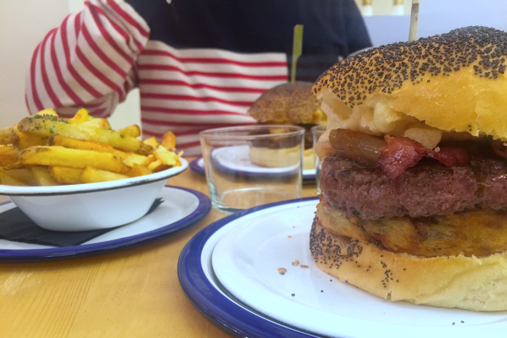
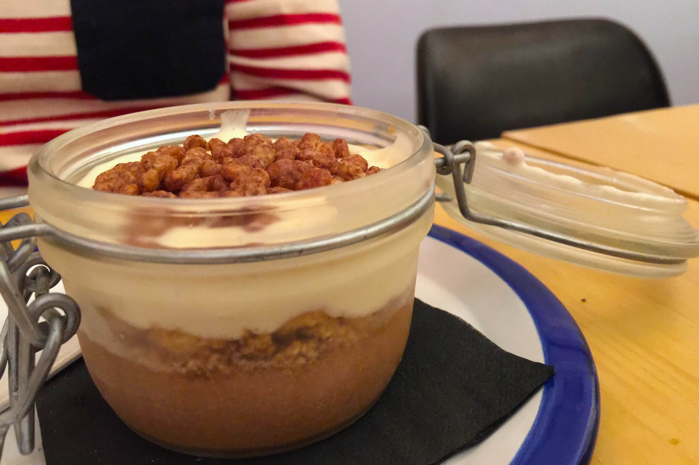

+++
type = "post"
titre = "Les Frangins à Lyon"
title = "Les Frangins à Lyon"
url = "/frangins-lyon"
date = "2015-01-31T22:42:06"
Lastmod = "2015-03-15T00:30:05"
cover = "les-frangins.jpg"
categorie = [ "À manger" ]
tag = [ "69002", "Cuisine américaine", "Hamburger" ]

+++

Les burgers sont à la mode, c&rsquo;est incontestable et on trouve à Lyon quelques excellents établissements pour qui veut sortir des chaînes de fast-food traditionnelles. Il faudra dorénavant compter sur <a href="https://www.facebook.com/lesfranginsJR"><strong>Les Frangins</strong></a>, nouvelle adresse au cœur de la Presqu&rsquo;île. Au fond d&rsquo;une toute petite salle tout en longueur, les cuistots y préparent des burgers gourmands et surtout exclusivement maisons. Certes, c&rsquo;est plus cher qu&rsquo;un fast-food en chaîne, mais c&rsquo;est aussi bien meilleur : avis aux amateurs…

Comme la majorité des adresses spécialisées dans le burger, <strong>Les Frangins</strong> ne brille pas par la taille de sa salle. Coincé entre deux bouchons de la rue des Marronniers, à deux pas de la place Bellecour, ce restaurant est tout petit et il faudra faire de la place pour ses voisins de table s&rsquo;il se remplit trop vite. C&rsquo;est convivial et l&rsquo;un des frangins qui y officie a le bon goût d&rsquo;écarter au maximum ses clients, quitte à leur proposer de monter à l&rsquo;étage alors que le rez-de-chaussée n&rsquo;est pas plein. Contrairement à bon nombre de lieux spécialisés dans les hamburgers, on ne peut pas emporter son sandwich ici. Il faut nécessairement manger sur place, mais il faut dire qu&rsquo;on nous promet de la vraie cuisine, pas de la restauration rapide. Pour preuve, <a href="/wp-content/2015/01/les-frangins-menus.jpg">la carte</a> change régulièrement et pour pousser le concept au maximum, il n&rsquo;y a même pas de congélateur chez <strong>Les Frangins</strong>. Tout est fait maison et tout est frais, même les frites et même le ketchup et la mayonnaise qui les accompagnent. Sans surprise, les tarifs sont ainsi plus élevés que pour des burgers industriels, mais on peut manger pour 12 € et les frites sont non seulement offertes, mais en plus on peut en redemander autant que l&rsquo;on veut.

À la commande, le frangin prend bien soin de vous demander la cuisson de la viande si vous choisissez un burger à base de bœuf, un excellent point. Et quand l&rsquo;assiette arrive, on est d&rsquo;abord agréablement surpris par la générosité de la portion : on comprend mieux pourquoi la vente à emporter n&rsquo;est pas une option chez <strong>Les Frangins</strong>, les couverts sont indispensables pour venir à bout de leurs sandwichs. La viande est cuite à la perfection, exactement comme on l&rsquo;avait demandée, et le bœuf label rouge est généreux. Ce n&rsquo;est pas un steak semelle que l&rsquo;on a, mais bien une belle pièce de viande que les plus carnassiers sauront apprécier à sa juste valeur. L&rsquo;essentiel de la carte se concentre sur le bœuf, c&rsquo;est logique, mais on peut aussi sortir des sentiers battus avec une variante au veau ou un hamburger au porc, et cela devrait encore changer. Le cuissot a déjà expérimenté une <a href="https://www.facebook.com/lesfranginsJR/photos/a.319953398199029.1073741829.318716384989397/338313789696323/?type=1">étonnante version au saumon</a> et on espère bien qu&rsquo;ils chercheront ainsi d&rsquo;autres idées. Même quand on s&rsquo;en tient au bœuf, il y a des idées originales, à l&rsquo;image de ce steak mariné dans le Jack Daniel&rsquo;s, ou encore de ces buns au curry <a href="#fn-13018-1" rel="footnote">1</a>. Nous avons testé le « <em>Captain Jack</em> » et le burger du moment : le premier était celui avec un arrière goût de whisky et il était vraiment excellent. L&rsquo;alcool était bien présent sans être envahissant, une excellente sauce barbecue faite maison, du bacon et un très bon cheddar fumé. L&rsquo;autre hamburger était plus conventionnel, mais parfaitement exécuté : un rösti sous la viande, du bacon et du reblochon pour la touche locale et un fond de moutarde pour un peu relever l&rsquo;ensemble. Deux réussites, que viennent compléter les excellentes frites maisons, soit la version nature, soit la variante avec du fromage et une persillade, encore meilleure. Et si vous avez encore faim après tout ça, vous pourrez reprendre des frites, car elles sont à volonté. Voire vous aventurer du côté des desserts, avec le classique cheesecake très bien exécuté, ou ce dessert à base de Nutella et de mascarpone, délicieusement régressif.

<strong>Les Frangins</strong> a vu tout juste en pariant sur du 100 % fait maison et surtout du 100 % frais. Les burgers ne manquent pas et tout le monde peut en faire de corrects, mais ceux de cette nouvelle adresse sont meilleurs que cela. En choisissant de ne faire aucun compromis sur les produits et en pariant sur la fraicheur au point de bannir tout congélateur, ce restaurant peut se permettre de proposer des prix plus élevés qu&rsquo;ailleurs. Certes, on sort en payant 25 € par personne — un burger, un dessert et une bonne bière chacun —, mais on n&rsquo;a pas du tout eu le sentiment de manger du fast-food. On n&rsquo;a plus qu&rsquo;une envie en sortant : digérer, et revenir tester les autres burgers à la carte !

<ol>
<li id="fn-13018-1">
Au passage, ces buns produits par un boulanger croix-roussien méritent à eux seuls le détours. Ils soutiennent le burger, mais ils sont si aériens qu&rsquo;ils fondent instantanément sous le palais… un délice !&#160;<a href="#fnref-13018-1" rev="footnote">&#8617;</a>
</li>
</ol>

