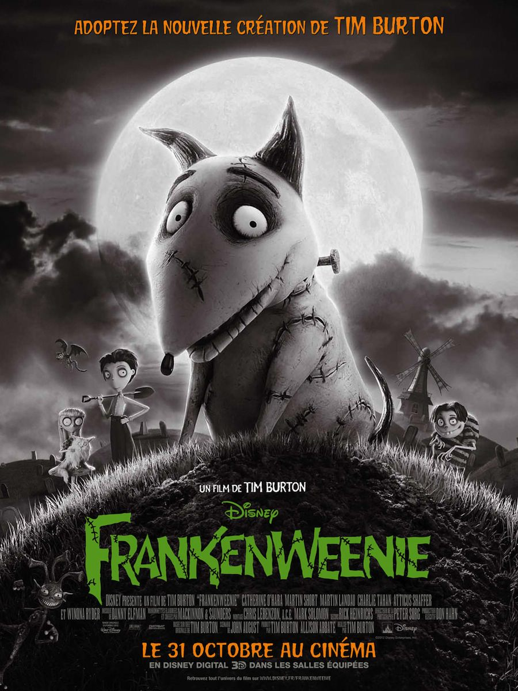
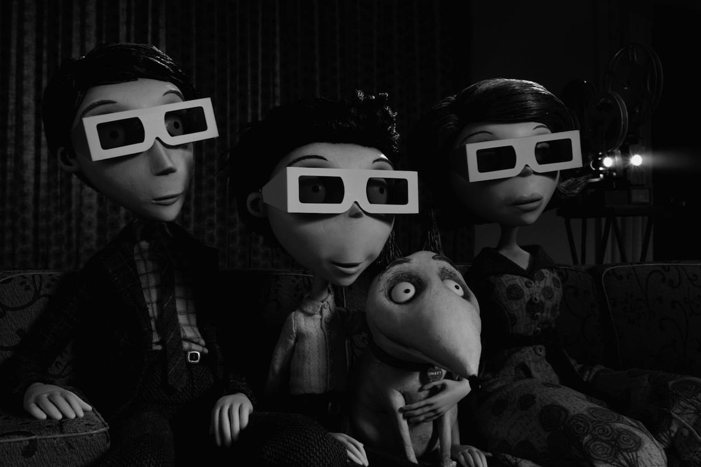
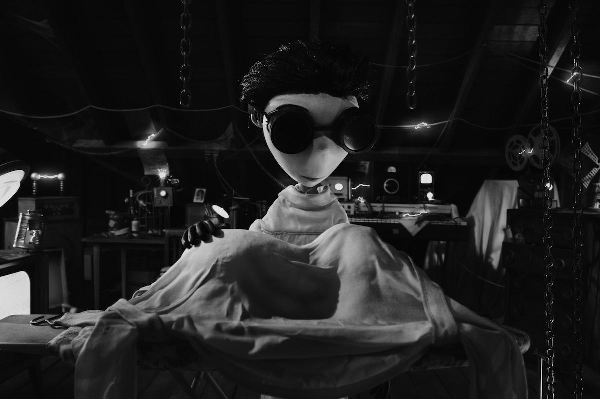

+++
titre = "<em>Frankenweenie</em>, Tim Burton"
title = "Frankenweenie, Tim Burton"
url = "/frankenweenie-burton"
date = "2012-11-06T23:36:51"
Lastmod = "2014-02-22T10:13:55"
cover = "frankenweenie-tim-burton.jpg"
categorie = [ "À voir" ]
tag = [ "Adolescence", "Animation", "Animaux", "Drame", "Horreur", "Humour", "Société" ]
createur = [ "Tim Burton" ]
acteur = [ "Charlie Tahan", "Martin Short", "Winona Ryder" ]
annee = [ "2012" ]
weight = 2012
pays = [ "États-Unis" ]

+++

C&rsquo;est un fait, Tim Burton n&rsquo;innove plus. <em>Frankenweenie</em> est le deuxième film du réalisateur à sortir cette année et celui qui a eu le génie à ses débuts d&rsquo;imaginer des histoires toujours loufoques et visuellement marquantes se répète désormais ou reprend des classiques. <a href="http://voiretmanger.fr/2012/05/09/dark-shadows-burton/" title="Dark Shadows, Tim Burton - À voir et à manger"><em>Dark Shadows</em></a> était le remake d&rsquo;une série des années 1970, ce nouveau long-métrage d&rsquo;animation est le remake d&rsquo;un court qu&rsquo;il a réalisé… en 1984. Après sa très médiocre réécriture d&rsquo;<a href="http://voiretmanger.fr/2010/03/25/alice-au-pays-des-merveilles-burton/" title="Alice au Pays des Merveilles, Tim Burton - À voir et à manger"><em>Alice au Pays des Merveilles</em></a>, ces retours vers ses débuts sont plutôt bénéfiques pour le cinéaste. Ce nouveau film n&rsquo;est pas original, on retrouve les thématiques et l&rsquo;univers de Tim Burton, mais il est aussi très efficace. Rire et émotion sont au rendez-vous et on passe un très bon moment, ce qui n&rsquo;est déjà pas si mal.

Victor est un garçon à part : plutôt que de jouer avec d&rsquo;autres garçons de son âge, il préfère passer tout son temps libre dans le grenier de la maison familiale avec Sparky, son chien et son seul ami. Ensemble, ils créent des petits films d&rsquo;animation en 3D qui sont ensuite regardés en famille, avec ses deux parents. Ces derniers s&rsquo;inquiètent un peu toutefois : et si leur garçon ne devenait jamais un garçon sociable, ouvert sur les autres, bref, normal ? Pour l&rsquo;inciter à se normaliser, son père le force à jouer au baseball. Victor accepte en contrepartie de sa participation à un concours de science qui l&rsquo;excite beaucoup, mais Sparky meurt dans un accident de voiture en essayant de ramener la balle. C&rsquo;est le drame et Victor perd tout sens à la vie, jusqu&rsquo;au jour où son prof de science montre qu&rsquo;il est possible de bouger les pattes d&rsquo;une grenouille morte avec de l&rsquo;électricité. Le garçon se met alors en tête de ressusciter son chien qu&rsquo;il va déterrer, recoudre et le placer au cœur de l&rsquo;orage. L&rsquo;expérience est un succès, on s&rsquo;en doute, mais le retour du chien d&rsquo;entre les morts va avoir de nombreuses conséquences fâcheuses et inattendues…

Les amateurs de la filmographie de Tim Burton seront en terrain connu avec <em>Frankenweenie</em>, c&rsquo;est le moins que l&rsquo;on puisse dire. Dès les premières images du film, on retrouve l&rsquo;ambiance un peu gothique de ses films et ses personnages si caractéristiques, à commencer par le héros, un garçon différent de la norme. Victor est un héros burtonien, à la limite de la caricature même, tandis que son passe-temps favori — la réalisation de petits films d&rsquo;animation — le rattache très directement au réalisateur de ce long-métrage. Il y a sans doute une pointe d&rsquo;autobiographie dans ce personnage, mais la suite de <em>Frankenweenie</em> est plutôt un hommage aux grands classiques de l&rsquo;horreur, à commencer bien sûr par <em>Frankenstein</em> qui est ici en quelque sorte parodié. Plus encore que Victor, c&rsquo;est finalement Sparky la vedette du film, comme son affiche l&rsquo;indiquait bien : ce chien déterré et ressuscité après avoir été bricolé évoque immanquablement le personnage inventé par Mary Shelley. On retrouve le rejet de la société pour cette créature surnaturelle, mais l&rsquo;animal ignore au départ sa vraie nature et Tim Burton s&rsquo;éloigne vite du matériel original au profit d&rsquo;une histoire beaucoup plus traditionnelle, plus proche aussi de Disney qui distribue <em>Frankenweenie</em>. Ce n&rsquo;est pas nécessairement une critique d&rsquo;ailleurs : le film s&rsquo;avère conventionnel, certes, mais il ne  manque pas de charme avec ce récit à l&rsquo;ancienne qui entremêle à merveille humour et émotion.

L&rsquo;animation est rarement sérieuse et ce <em>Frankenweenie</em> ne fait pas exception. Le film manie un humour là aussi très burtonien à base de personnages caricaturaux et de situations loufoques. Si Victor et ses parents ont droit à une représentation assez normale, sans extravagance, ce sont bien les seuls dans le film. Tous les autres personnages sont dessinés de manière caricaturale, à l&rsquo;image de ce pauvre Edgar, un camarade de classe de Victor difforme et édenté à la fois. Le professeur a un visage allongé à l&rsquo;infini avec sa petite bouche tout en bas, le maire a de toutes petites jambes et un ventre énorme, etc. La galerie établie par <em>Frankenweenie</em> est haute en couleur — façon de parler — et elle est à l&rsquo;origine d&rsquo;une partie du décalage humoristique du film. De manière plus générale, la ville de New Holland qui sert de décor représente tout ce que Tim Burton déteste le plus, un certain <em>American way of life</em> qu&rsquo;il fustigeait déjà dans <em>Edward aux mains d&rsquo;argent</em>, entre autres. On retrouve ainsi ces pavillons de banlieue tous identiques, ces femmes au foyer, la bien-pensante qui rejette la différence comme une tare et valorise une image caricaturale à base de trottoirs propres et de jardins bien entretenus. L&rsquo;humour est aussi plus gothique, avec un cimetière d&rsquo;animaux assez loufoque, tandis que les camarades de classe de Victor sont tous ridicules, sans exception. <em>Frankenweenie</em> est assez drôle et on sourit souvent, mais la mélancolie n&rsquo;est jamais loin et le film est aussi assez émouvant. Sans chercher à tirer les larmes à tout prix, le long-métrage parvient à toucher avec la relation très fusionnelle entre Victor et son chien, mais c&rsquo;est peut-être la découverte de sa propre nature par Sparky qui émeut le plus. L&rsquo;animal rafistolé parvient à toucher les spectateurs, une performance rare que les meilleurs Pixar parviennent également à atteindre. L&rsquo;ensemble paraît très équilibré et efficace et <em>Frankenweenie</em> est incontestablement l&rsquo;occasion d&rsquo;une séance plaisante, pour les petits (pas avant 10 ans tout de même) et les grands. 

<em>Frankenweenie</em> est si proche du cinéma de Tim Burton qu&rsquo;il est comme l&rsquo;énième variation d&rsquo;un même film. À l&rsquo;image de certains artistes qui peignent inlassablement un même sujet toute leur vie, le cinéaste semble filmer toujours la même chose depuis des années et il atteint ici en quelque sorte la meilleure version. Ce long-métrage n&rsquo;a pas la fulgurante des débuts, mais il est techniquement proche de la perfection, tant sur l&rsquo;animation que sur le récit, son rythme ou ses personnages. Vous serez déçu si vous cherchez de l&rsquo;originalité, mais il faut reconnaître que le cinéaste n&rsquo;avait pas atteint ce niveau depuis bien longtemps. Le stop-motion (animation image par image) combiné à un noir et blanc très contrasté fait des merveilles et il faut à nouveau saluer le travail de Danny Elfman côté musique, sans originalité bien sûr, mais avec une efficacité vraiment remarquable. L&rsquo;ensemble est très réussi, même si on a déjà vu ces effets et ce style chez Tim Burton et ailleurs. 

Revenir à ses thèmes et ses histoires fétiches, serait-ce la seule chose que Tim Burton sache encore faire aujourd&rsquo;hui ? Peut-être, mais le cinéaste le fait bien, ce qui excuse en partie son manque d&rsquo;innovation et <em>Frankenweenie</em> est un film très plaisant à regarder. De l&rsquo;animation à l&rsquo;ancienne et en noir et blanc sublime jusqu&rsquo;à l&rsquo;histoire bien menée, tout est réussi ici, si bien que le spectacle est de qualité. Un film divertissant qui ne fera certainement pas date, mais qu&rsquo;importe, surtout que l&rsquo;on n&rsquo;en tiendrait pas rigueur à un autre cinéaste.

<h3>Vous voulez m&rsquo;aider ?<a href="#footnote_0_7680" id="identifier_0_7680" class="footnote-link footnote-identifier-link" title="&Agrave; propos de la publicit&eacute;&hellip;">1</a></h3>
<ul>
<li><a href="http://www.amazon.fr/gp/product/B008X6M6MS/ref=as_li_ss_tl?ie=UTF8&#038;tag=leblogdenic07-21&#038;linkCode=as2&#038;camp=1642&#038;creative=19458&#038;creativeASIN=B008X6M6MS">Acheter le film en Blu-Ray sur Amazon</a></li>
<li><a href="http://www.amazon.fr/gp/product/B008X6M6A0/ref=as_li_ss_tl?ie=UTF8&#038;tag=leblogdenic07-21&#038;linkCode=as2&#038;camp=1642&#038;creative=19458&#038;creativeASIN=B008X6M6A0">Acheter le film en DVD sur Amazon</a></li>
<li><a href="https://itunes.apple.com/fr/movie/frankenweenie-vf/id582620409">Acheter ou louer le film sur l&rsquo;iTunes Store</a></li>
</ul>

<ol class="footnotes"><li id="footnote_0_7680" class="footnote"><a href="http://voiretmanger.fr/soutien/">À propos de la publicité…</a> [<a href="#identifier_0_7680" class="footnote-link footnote-back-link">&#8617;</a>]</li></ol>
