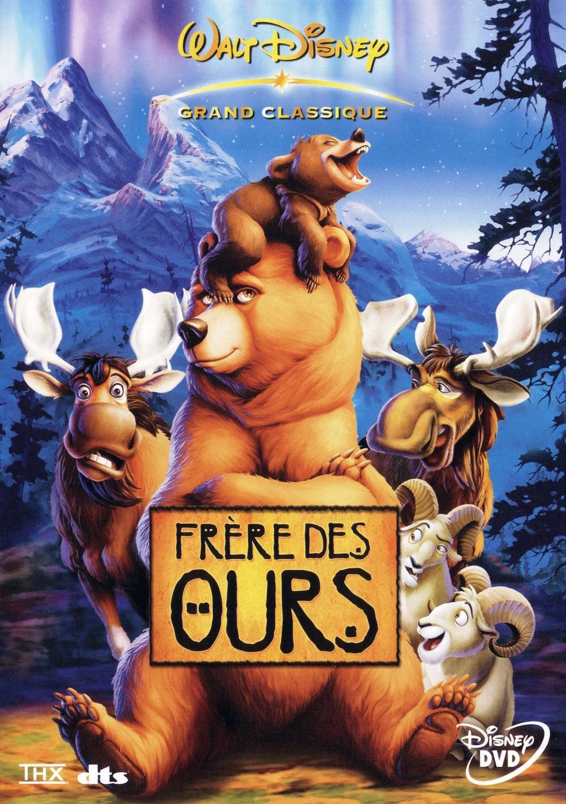
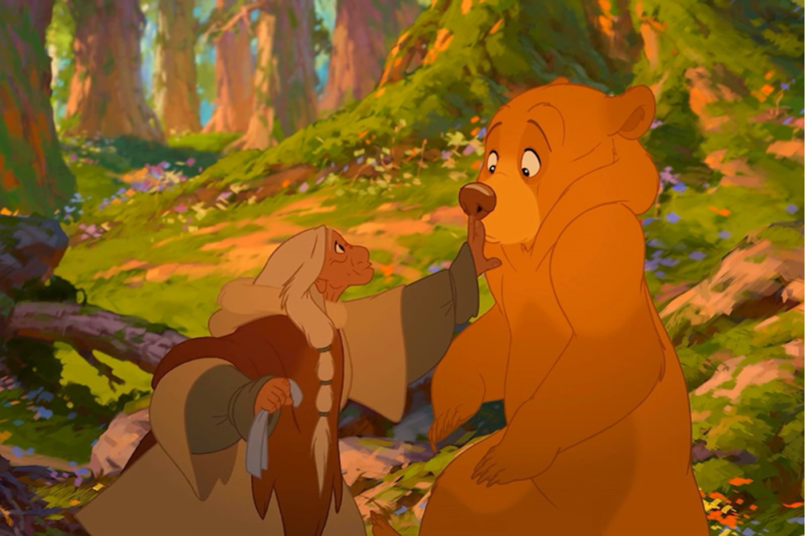
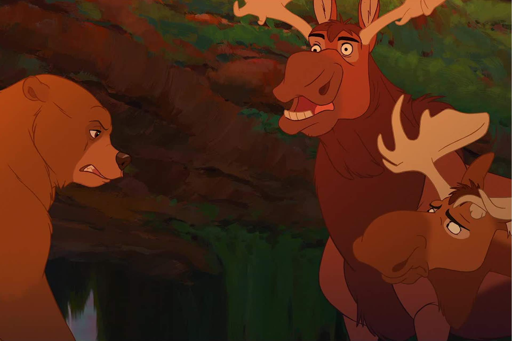

+++
titre = "<em>Frère des Ours</em>, Aaron Blaise et Robert Walker"
title = "Frère des Ours, Aaron Blaise et Robert Walker"
url = "/frere-ours-blaise-walker"
date = "2014-08-03T18:11:10"
Lastmod = "2014-08-03T18:16:06"
cover = "frere-des-ours.jpg"
categorie = [ "À voir" ]
tag = [ "Animation", "Animaux", "Drame", "Famille", "Mort", "Nature" ]
createur = [ "Aaron Blaise", "Robert Walker" ]
annee = [ "2004" ]
weight = 2004
saga = [ "Classiques d'animation Disney" ]
pays = [ "États-Unis" ]
original = "Brother Bear"

+++

Sorti aux États-Unis la même année que <em>Le Monde de Nemo</em>, <em>Frère des Ours</em> symbolise bien le manque d&rsquo;inspiration et d&rsquo;ambition des studios Disney au milieu des années 2000. Le quarante-quatrième <a href="http://voiretmanger.fr/saga/classiques-danimation-disney/">classique</a> du studio n&rsquo;est pas l&rsquo;adaptation d&rsquo;une œuvre existante, mais une création originale. Et si l&rsquo;idée originale d&rsquo;un Inuit qui tue un ours pour venger la mort de son frère, ce qui lui vaut la punition originale d&rsquo;être transformé à son tour en ours, si cette idée est plutôt bien vue, la réalisation ne suit pas. Visant ouvertement les plus jeunes, le long-métrage réalisé par Aaron Blaise et Robert Walker n&rsquo;est pas très drôle, pas très original, pas particulièrement joli et pas très intéressant. Le divertissement attendrira les plus jeunes, mais c&rsquo;est bien tout.

Comme Disney l&rsquo;a fait à de nombreuses reprises déjà, <em>Frère des Ours</em> confronte le monde animal et humain. On découvre d&rsquo;abord un camp d&rsquo;Inuits et en particulier trois frères, dont le petit dernier doit devenir un homme avec la révélation de son totem par la chamade du village. C&rsquo;est ce personnage que l&rsquo;on suit tout particulièrement et on apprend ainsi que son totem est un ours et que sa force est l&rsquo;amour, ce qui ne plait pas du tout à l&rsquo;adolescent qui déteste les ours et préférerait une valeur plus virile, comme la force ou le courage. Comme pour prouver sa valeur justement, il poursuit une ours qui a volé les poissons pêchés par le village. Pendant la poursuite, son grand frère meurt et il se venge en tuant l&rsquo;ours. Un acte inutile qui lui vaut, dans cet univers où la nature est une force active et magique, d&rsquo;être transformé en ours en guise de punition. Sa seule solution, pour retrouver forme humaine, est de chercher une montagne si haute qu&rsquo;elle touche le monde des esprits dans l&rsquo;espoir que son frère tué par l&rsquo;ours accepte de lui rendre son humanité. L&rsquo;idée n&rsquo;est pas mauvaise et, même si elle n&rsquo;est pas originale, la confrontation d&rsquo;un homme qui détestait les ours à l&rsquo;univers des animaux, est plutôt bien trouvée. D&rsquo;ailleurs, <em>Frère des Ours</em> propose quelques séquences réussies, notamment lorsque le personnage au contact d&rsquo;un ourson, découvre que les monstres sont relatifs et que le monstre de l&rsquo;un n&rsquo;est pas le monstre de l&rsquo;autre. Par moments, le long-métrage offre une vision assez fine et plutôt bien pensée de l&rsquo;altérité et la progression du personnage est assez bien menée.

Malheureusement, ces bons points sont gâchés par un style très enfantin et surtout trop niais. Au fond, le problème central de <em>Frère des Ours</em> est assez commun dans les films d&rsquo;animation à base d&rsquo;animaux. Aaron Blaise et Robert Walker commencent par représenter de manière assez fidèle l&rsquo;animalité des ours, et la séquence de combats entre le jeune Inuit et la bête au début du film est très impressionnante. Le réalisme est au rendez-vous et le sacrifice du frère ainé pour sauver les deux autres hommes est surprenant pour un Disney. Cette entrée en matière d&rsquo;une noirceur inattendue laisse espérer le meilleur, mais le film revient vite sur les rails habituels quand la transformation est faite. Que les ours parlent entre eux et se comprennent, c&rsquo;est assez logique, et le scénario mêle habilement les scènes avec des humains et des ours : selon le point de vue, on a des hurlements, ou bien un message clair. Pourquoi, toutefois, est-ce que les ours devraient comprendre et parler avec tous les autres animaux ? <em>Frère des Ours</em> aurait pu se contenter de faire parler les humains d&rsquo;un côté, les ours de l&rsquo;autre, mais pas les autres animaux. En l&rsquo;état, on a la distinction simpliste habituelle entre les hommes d&rsquo;une part, les animaux d&rsquo;autre part. C&rsquo;est dommage, mais c&rsquo;était sans doute obligatoire pour introduire les sempiternels personnages secondaires comiques. Ici, quelques années avant le renne de <a href="http://voiretmanger.fr/la-reine-des-neiges-buck-lee/" title="La Reine des neiges, Chris Buck et Jennifer Lee"><em>La Reine des neiges</em></a>, on a déjà des élans, un couple — enfin, des frères — avec Truk et Muche. C&rsquo;est dire le niveau…

Animation paresseuse, même si on peut apprécier le changement de format et de style quand le personnage change de nature, et musiques niaises portées par la voix de Phil Collins, rien ne vient sauver <em>Frère des Ours</em>. Sans être un film honteux, ce classique peine à décoller et il ne devrait plus passionner personne passé un certain âge. C&rsquo;est dommage, car l&rsquo;idée de base d&rsquo;aaron Blaise et Robert Walker était assez bonne, mais le studio ne parvient pas à reproduire ses grands succès. Certes, le public est au rendez-vous, mais ce n&rsquo;est pas le meilleur classique, loin de là.

<h3>Vous voulez <a href="http://voiretmanger.fr/soutien/">m&rsquo;aider</a> ?</h3>
<ul>
<li><a href="http://www.amazon.fr/gp/product/B00AHDVHOI/ref=as_li_ss_tl?ie=UTF8&amp;tag=leblogdenic07-21&amp;linkCode=as2&amp;camp=1642&amp;creative=19458&amp;creativeASIN=B00AHDVHOI">Acheter le film en Blu-ray sur Amazon</a></li>
<li><a href="http://www.amazon.fr/gp/product/B0002IE4C0/ref=as_li_ss_tl?ie=UTF8&amp;tag=leblogdenic07-21&amp;linkCode=as2&amp;camp=1642&amp;creative=19458&amp;creativeASIN=B0002IE4C0">Acheter le film en DVD sur Amazon</a></li>
<li><a href="https://itunes.apple.com/fr/movie/frere-des-ours/id369240198">Acheter ou louer le film sur l&rsquo;iTunes Store</a></li>
</ul>

