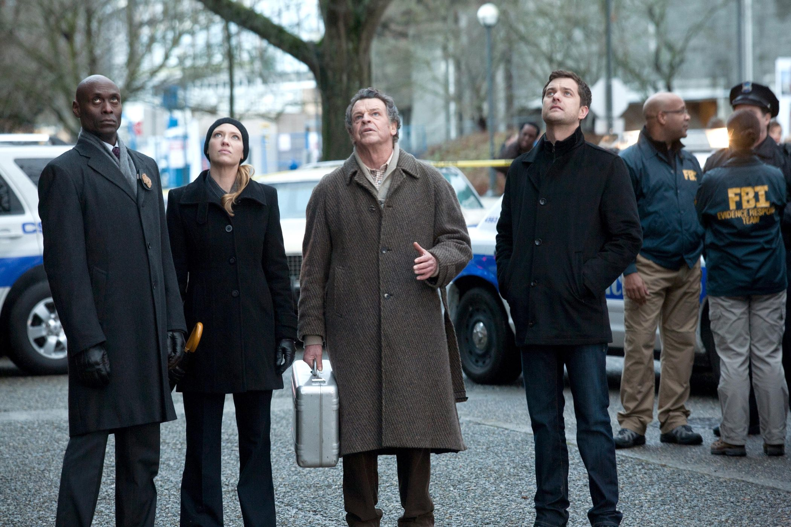
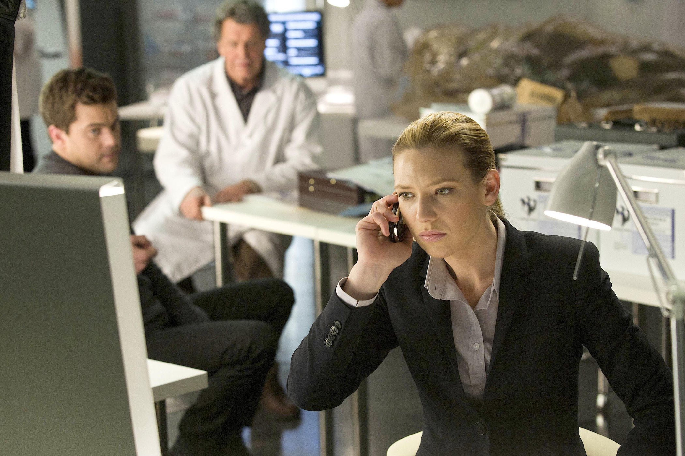
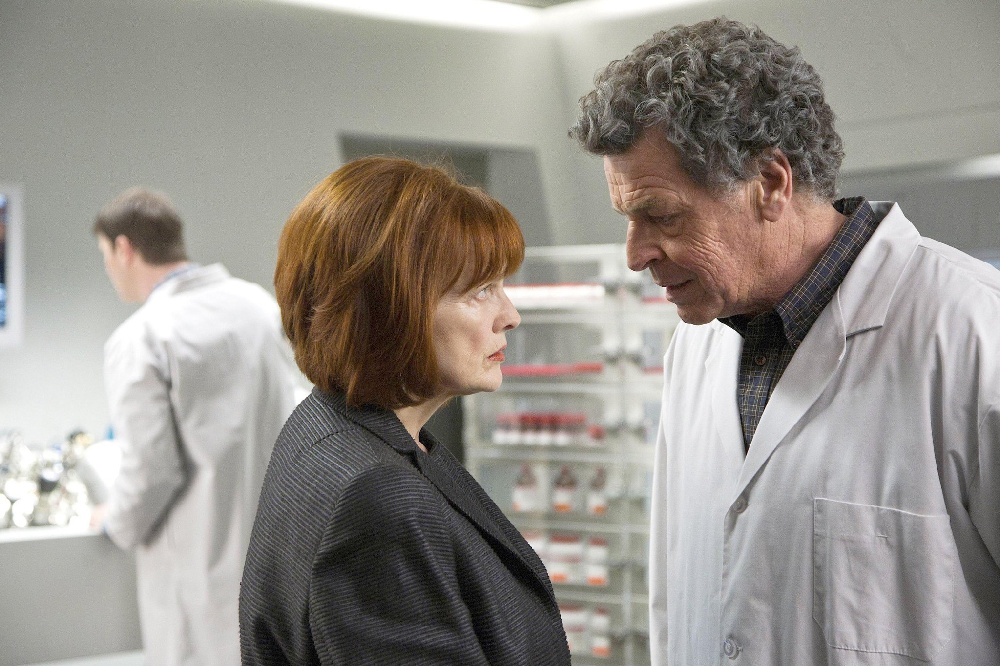
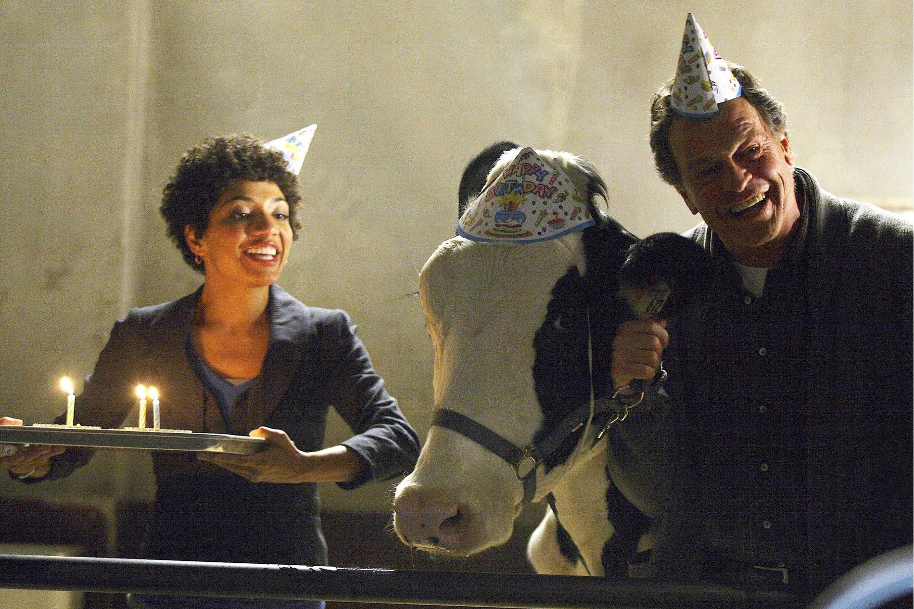

+++
titre = "<em>Fringe</em>, J. J. Abrams, Alex Kurtzman et Roberto Orci (FOX)"
title = "Fringe, J. J. Abrams, Alex Kurtzman et Roberto Orci (FOX)"
url = "/fringe-abrams-kurtzman-orci-fox"
date = "2014-08-22T19:28:56"
Lastmod = "2014-08-22T19:33:52"
cover = "fringe-abrams-kurtzman-orci.jpg"
categorie = [ "À voir" ]
tag = [ "Action", "Dystopie", "Fantastique", "Futur", "Paranormal", "Science-Fiction", "Série", "Voyage temporel" ]
createur = [ "Alex Kurtzman", "FOX", "J.J. Abrams", "Roberto Orci" ]
acteur = [ "Anna Torv", "Blair Brown", "Jasika Nicole", "John Noble", "Joshua Jackson", "Kirk Acevedo", "Lance Reddick", "Leonard Nimoy", "Seth Gabel" ]
annee = [ "2008" ]
weight = 2008
pays = [ "États-Unis" ]

+++

Troisième série créée par <a href="http://voiretmanger.fr/createur/j-j-abrams/">J.J. Abrams</a>, <em>Fringe</em> explore quelques idées typiques de la science-fiction. Du paranormal aux univers multiples, en passant par le voyage temporel, les cent épisodes brassent de nombreuses thématiques, pour un résultat aussi passionnant que frustrant. Après une première saison très cadrée, où chaque épisode indépendant est une enquête surprenante à résoudre, la série s&rsquo;envole avec une histoire qui prend le dessus jusqu&rsquo;à devenir prédominante. <em>Fringe</em> manipule avec brio ses spectateurs et la série n&rsquo;est jamais aussi bonne que lorsqu&rsquo;elle exploite ses idées un peu folles jusqu&rsquo;au bout. À côté d&rsquo;épisodes vraiment excellents qui justifient à eux seuls de la regarder, la série peine parfois à avancer et se plante sur des incohérences parfois pénibles. Pour autant, J.J. Abrams, Alex Kurtzman et Roberto Orci ont créé un formidable terrain de jeux et d&rsquo;expérimentations pour leurs idées les plus dingues et <em>Fringe</em> reste une série que tout amateur de science-fiction et de paranormal se doit de découvrir. Et mieux vaut la regarder sans préjugé et sans rien connaître de l&rsquo;histoire, la surprise n&rsquo;en sera que plus grande…

<em>Fringe</em> commence de façon assez banale et pour un peu, son pilote pourrait ressembler à n&rsquo;importe quel épisode de n&rsquo;importe quelle série policière. L&rsquo;action se déroule au sein du FBI et tous les personnages appartiennent à l&rsquo;agence américaine, ou travaillent pour elle. Pourtant, la scène d&rsquo;ouverture intègre déjà un élément bizarre qui distingue l&rsquo;épisode de la production habituelle. Tout commence avec un homme, dans un avion : son nez saigne, ce qui est somme toute très banal, mais cet homme se lève paniqué et tente de prévenir l&rsquo;équipage de l&rsquo;avion qu&rsquo;il lui faut des tranquillisants. Il s&rsquo;enferme dans les toilettes et on n&rsquo;entend plus que des hurlements, jusqu&rsquo;au moment où on le voit sortir… transformé en une sorte de porc-épic qui tue une bonne partie des passagers, avant de s&rsquo;en prendre au pilote et de faire écraser l&rsquo;avion. <em>Fringe</em> nous présente alors ses héros, en commençant par Olivia Dunhman, agent du FBI chargée de participer à l&rsquo;enquête sur l&rsquo;accident. Très vite, elle comprend que quelque chose de louche s&rsquo;est passé et c&rsquo;est au cours de cet épisode qu&rsquo;elle entre au sein de la division Fringe, un groupe du FBI qui enquête sur des évènements étranges. Depuis quelques mois avant le début de la série, le FBI a recensé une série d&rsquo;évènements paranormaux et l&rsquo;agence a mis en place une division spéciale pour les traquer. C&rsquo;est au sein de cette division que la série se développe et la première saison est chargée, en quelques sortes, de faire les présentations.

Toutes les séries ont besoin de personnages, et les meilleures sont celles qui parviennent à créer d&rsquo;excellents personnages. Dans le cas de <em>Fringe</em>, c&rsquo;est une réussite et on peut saluer tous les acteurs principaux, sans exception. Leur talent n&rsquo;est pas forcément visible dès le départ, mais il finit par éclater au grand-jour quand on découvre l&rsquo;existence de l&rsquo;univers parallèle. La série se construit en effet autour de l&rsquo;idée qu&rsquo;il n&rsquo;y a non pas un seul univers, mais deux, qui sont quasiment identiques. À partir de la deuxième saison, la série se déroule d&rsquo;un côté ou de l&rsquo;autre et on peut ainsi découvrir ce que les scénaristes ont imaginé pour dupliquer notre univers, mais avec suffisamment de différences pour qu&rsquo;on les reconnaisse immédiatement. Ainsi, dans l&rsquo;univers alternatif, le 11 Septembre n&rsquo;a jamais eu lieu et le World Trade Center est toujours là. La Statue de la Liberté existe des deux côtés, mais elle n&rsquo;est pas verte de l&rsquo;autre côté, elle est en cuivre et donc orangée. Au-delà de ces différences de décors, le coup de génie de J.J. Abrams et des deux autres créateurs de <em>Fringe</em>, c&rsquo;est d&rsquo;avoir imaginé que de chaque côté, il y a aussi les mêmes personnages, mais avec des personnalités différentes. Et c&rsquo;est là que tout le talent des acteurs est révélé : Anna Torv par exemple compose deux Olivia tout à fait différente, et même quand l&rsquo;une se teint les cheveux pour ressembler à l&rsquo;autre, on peut immédiatement savoir qui est qui. C&rsquo;est un travail vraiment remarquable et tous les acteurs se sont prêtés au jeu avec beaucoup de succès. On pourrait citer le cas d&rsquo;Astrid, interprétée par Jasika Nicole, qui est radicalement différente, ou Broyles (Lance Reddick) qui a une voix aisément reconnaissable, mais qui parvient quand même à moduler son jeu. Dans le casting, on retient surtout le rôle de Walter Bishop : ce scientifique sorti de son asile au début de la série est exceptionnel par sa folie communicative et <em>Fringe</em> perdrait beaucoup sans ce personnage. John Noble, acteur australien qui l&rsquo;incarne, gagnerait à être sur plus d&rsquo;écrans, il est vraiment excellent.

Grâce à ses personnages, <em>Fringe</em> est une série qui reste toujours plaisante à regarder, même quand son scénario n&rsquo;est pas à la hauteur. Ses trois concepteurs étaient très ambitieux et on peut apprécier la cohérence du projet dans son ensemble. En effet, même si la première saison semble très différente du reste avec sa structure en épisodes indépendants, elle contient plusieurs éléments qui ne peuvent pas être totalement compris qu&rsquo;après la cinquième et dernière saison. C&rsquo;est très impressionnant quand on y pense et il est finalement assez rare de trouver une série qui se tient non seulement au sein d&rsquo;une saison, mais aussi à travers toutes les saisons. On peut aussi reconnaître que certains épisodes sont vraiment excellents : la mythologie déployée par <em>Fringe</em> autour de l&rsquo;idée de plusieurs univers est si bien conçue, elle est si cohérente que les passages de l&rsquo;un à l&rsquo;autre permettent quelques idées vraiment réussies. Le scénario sait par ailleurs entretenir le suspense sur les rôles réels de Walter Bishop et de son fils et quand on comprend enfin, la révélation est spectaculaire. L&rsquo;ensemble est très plaisant, mais un peu gâché par le format de la série, ou plutôt sa longueur. J.J. Abrams, Alex Kurtzman et Roberto Orci auraient sans doute fait un bien meilleur travail en produisant beaucoup moins que 100 épisodes. En en supprimant la moitié, mettons, ils auraient pu se concentrer sur une histoire excellente, au lieu de multiplier les épisodes un peu à côté de l&rsquo;intrigue principale — même si la première saison est plaisante, elle reste inférieure au reste pour cette raison — et surtout d&rsquo;essayer un peu vainement de toujours réinitialiser l&rsquo;intrigue. À plusieurs reprises en effet, <em>Fringe</em> fait table rase de ce qui précède pour changer d&rsquo;époque, ou de dimension. C&rsquo;est souvent un petit peu gratuit et ces changements radicaux bloquent le processus d&rsquo;identification que l&rsquo;on ressent normalement grâce à la longueur d&rsquo;une série.

D&rsquo;une première saison à épisodes indépendants à une cinquième saison qui ressemble à un jeu d&rsquo;aventures et qui sert aussi à expliquer en grande partie ce qui précède, <em>Fringe</em> est incontestablement une série atypique. À l&rsquo;image du personnage de Walter Bishop, les trois créateurs de la série sont un peu des expérimentateurs fous qui n&rsquo;ont pas peur d&rsquo;essayer des choses, qui parfois fonctionnent, et parfois non. On regrette certains épisodes faciles qui n&rsquo;existent que pour remplir des saisons de plus de vingt épisodes. On aurait aussi aimé une idée plus originale que l&rsquo;Allemagne nazie pour représenter une dystopie. <em>Fringe</em> n&rsquo;est pas une série parfaite, on l&rsquo;aura compris, mais cela ne veut pas dire qu&rsquo;elle ne mérite pas d&rsquo;être vue. Bien au contraire, c&rsquo;est justement dans ses imperfections qu&rsquo;elle se révèle souvent passionnantes. J.J. Abrams, Alex Kurtzman et Roberto Orci ont expérimenté dans tous les sens et même s&rsquo;ils sont parfois mal tombés, ce qu&rsquo;ils ont réussi à faire est exceptionnellement bon. Ainsi, <em>Fringe</em> a peut-être des défauts, mais les bons moments qu&rsquo;elle propose compensent largement pour ces défauts. Autant le dire, quand on commence à regarder la série, on a du mal à s&rsquo;arrêter avant les dernières révélations…

<h3>Vous voulez <a href="http://voiretmanger.fr/soutien/">m&rsquo;aider</a> ?</h3>
<ul>
<li><a href="http://www.amazon.fr/gp/product/B00CAWF4RU/ref=as_li_ss_tl?ie=UTF8&amp;tag=leblogdenic07-21&amp;linkCode=as2&amp;camp=1642&amp;creative=19458&amp;creativeASIN=B00CAWF4RU">Acheter la série en Blu-ray sur Amazon</a></li>
<li><a href="http://www.amazon.fr/gp/product/B00CAWF5H4/ref=as_li_ss_tl?ie=UTF8&amp;tag=leblogdenic07-21&amp;linkCode=as2&amp;camp=1642&amp;creative=19458&amp;creativeASIN=B00CAWF5H4">Acheter la série en DVD sur Amazon</a></li>
<li><a href="https://itunes.apple.com/fr/tv-show/fringe/id290783668">Acheter ou louer la série sur l&rsquo;iTunes Store</a></li>
</ul>

