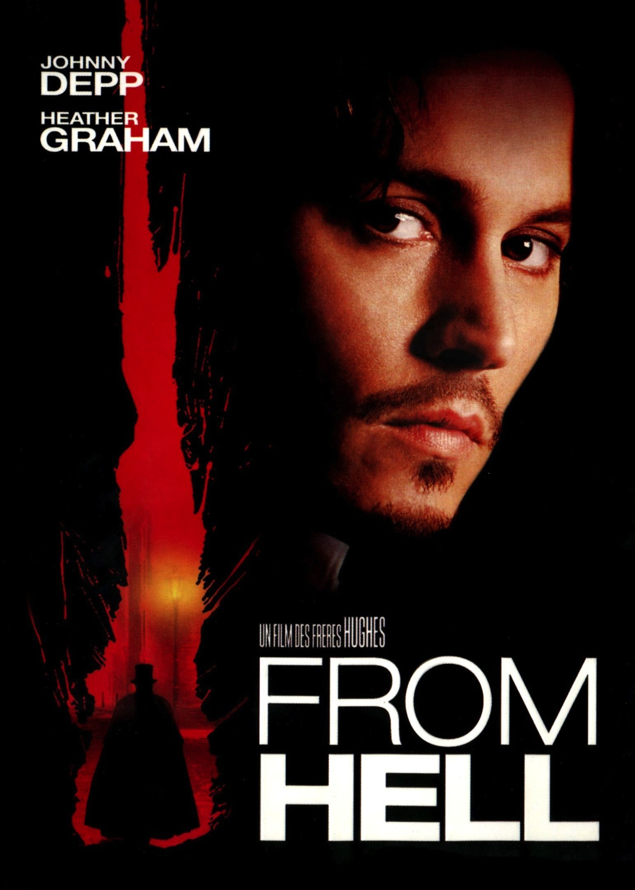
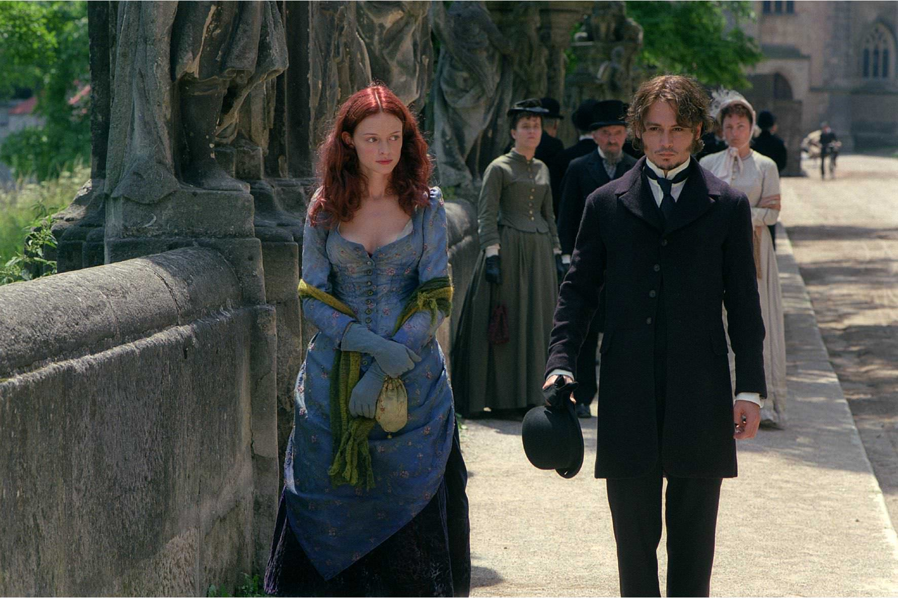

+++
type = "post"
titre = "<em>From Hell</em>, Albert et Allen Hughes"
title = "From Hell, Albert et Allen Hughes"
url = "/from-hell-hughes"
date = "2014-12-29T10:46:45"
Lastmod = "2014-12-28T23:51:40"
cover = "from-hell-freres-hughes.jpg"
categorie = [ "À voir" ]
tag = [ "Adaptation bande-dessinée", "Enquête", "Fantastique", "Histoire", "Horreur", "Police", "Serial-killer" ]
createur = [ "Albert et Allen Hughes" ]
acteur = [ "Heather Graham", "Ian Holm", "Johnny Depp", "Robbie Coltrane" ]
annee = [ "2002" ]
weight = 2002
pays = [ "États-Unis" ]

+++

La légende de Jack l&rsquo;Éventreur fascine depuis des générations, et le cinéma n&rsquo;y est pas resté insensible. Parmi tous les films qui se sont inspirés du premier tueur en série médiatique, <em>From Hell</em> ne cherche pas la réalité historique, et pour cause. Les frères Hughes ont adapté une bande-dessinée d&rsquo;Alan Moore et Eddie Campbell et leur adaptation, comme l&rsquo;œuvre originale, ne se soucie guère du fait que l&rsquo;on n&rsquo;a jamais retrouvé le coupable et que l&rsquo;on ne sait toujours pas qui était Jack l&rsquo;Éventreur. <em>From Hell</em> est une enquête menée jusqu&rsquo;au bout, avec un coupable désigné à la fin du film, mais au fond, l&rsquo;identité du meurtrier n&rsquo;est peut-être pas ce qu&rsquo;il y a de plus important. La vraie réussite du film, c&rsquo;est son ambiance particulièrement glauque du Londres de la fin du XIXe siècle. Rien que pour elle, le long-métrage mérite d&rsquo;être (re)vu…

<em>From Hell</em> a le mérite de nous plonger dès les premières minutes dans un Londres fin de XIXe siècle suffoquant et étonnamment réaliste, du moins dès lors que l&rsquo;on abandonne les plans larges qui évoquent plus des peintures pour se perdre dans les rues sombres de la capitale britannique. Albert et Allen Hughes ont su exploiter toute la noirceur qui était déjà présente dans la bande-dessinée originale, pour l&rsquo;adapter au cinéma et c&rsquo;est vraiment efficace. On ne voit pas grand-chose, mais on en voit assez pour prendre la mesure de la crasse ambiante et même si on ne peut pas respirer à travers l&rsquo;écran, l&rsquo;imagination fait le reste. C&rsquo;est dans ce contexte qu&rsquo;un premier meurtre sauvage est commis : une prostituée est retrouvée morte, ce qui n&rsquo;a rien d&rsquo;anormal apparemment à cette époque, surtout dans le quartier pauvre de Whitechapel où il a eu lieu. En revanche, le crime commis est si abominable que l&rsquo;on fait appel à l&rsquo;inspecteur Frederick Abberline — un personnage historique d&rsquo;ailleurs — connu à l&rsquo;époque pour ses intuitions brillantes. En fait, l&rsquo;homme est un opiomane qui a des visions quand il se drogue, mais il est effectivement très bon pour trouver un meurtrier. Et dans cette affaire, il sent que ce n&rsquo;est pas un ouvrier ou un boucher étranger, comme ses supérieurs le souhaiteraient, qui est à l&rsquo;origine du crime. <em>From Hell</em> ouvre ainsi une enquête qui mène l&rsquo;inspecteur jusqu&rsquo;au sommet de l&rsquo;État : le film se concentre sur le mystère de l&rsquo;identité du tueur, même si on a assez vite une idée, au moins sur son statut. Les frères Hughes mêlent plutôt habilement la Franc-Maçonnerie à tout cela et on ne sait pas vraiment qui est responsable avant le grand dévoilement. L&rsquo;ensemble tient la route, mais on retiendra surtout l&rsquo;ambiance et l&rsquo;univers, ainsi que la performance de Johnny Depp. Pas encore encombré des tics développés dans la <a href="http://voiretmanger.fr/saga/pirates-des-caraibes/">saga <em>Pirates des Caraïbes</em></a>, l&rsquo;acteur exploite remarquablement bien ce grain de folie qui fait sa réputation et il est parfait pour ce rôle.

À défaut d&rsquo;être la vision la plus fidèle du mythe de Jack l&rsquo;Éventreur, <em>From Hell</em> offre une plongée particulièrement réussie dans la vie londonienne de la fin du XIXe siècle. Les frères Hughes y déploient une enquête bien ficelée, mais on retient surtout l&rsquo;ambiance et ces rues si sombres que la mort y semble presque normale. Ce n&rsquo;est pas un grand film, mais c&rsquo;est un divertissement plaisant, à condition d&rsquo;accepter un peu d&rsquo;hémoglobine et de chairs sanguinolentes : l&rsquo;interdiction au moins de 12 ans n&rsquo;est pas usurpée.

<h3>Vous voulez <a href="http://voiretmanger.fr/soutien/">m&rsquo;aider</a> ?</h3>
<ul>
<li><a href="http://www.amazon.fr/gp/product/B000MR8SVY/ref=as_li_ss_tl?ie=UTF8&amp;tag=leblogdenic07-21&amp;linkCode=as2&amp;camp=1642&amp;creative=19458&amp;creativeASIN=B000MR8SVY">Acheter le film en Blu-ray sur Amazon</a></li>
<li><a href="http://www.amazon.fr/gp/product/B00008LSQI/ref=as_li_ss_tl?ie=UTF8&amp;tag=leblogdenic07-21&amp;linkCode=as2&amp;camp=1642&amp;creative=19458&amp;creativeASIN=B00008LSQI">Acheter le film en DVD sur Amazon</a></li>
<li><a href="https://itunes.apple.com/fr/movie/from-hell/id369057984">Acheter ou louer le film sur l&rsquo;iTunes Store</a></li>
<li><a href="http://www.netflix.com/WiMovie/60021642">Regarder le film sur Netflix</a></li>
</ul>

