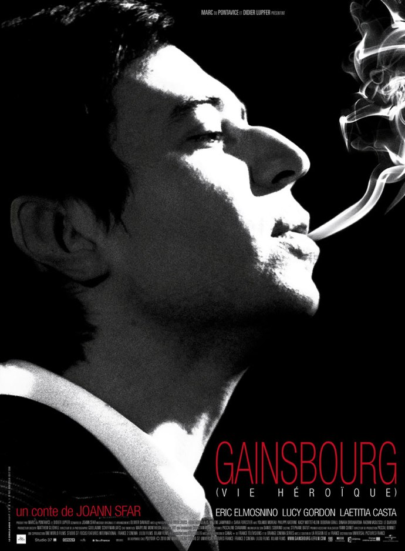
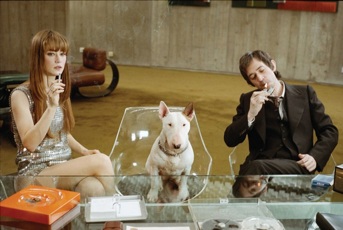

+++
type = "post"
titre = "Gainsbourg (vie héroïque), Joann Sfar"
title = "Gainsbourg (vie héroïque), Joann Sfar"
url = "/gainsbourg-vie-heroique-sfar"
date = "2010-08-15T10:09:13"
Lastmod = "2010-08-15T10:09:13"
cover = "sfar-gainsbourg-casta-elmosnino.jpg"
categorie = [ "À voir" ]
tag = [ "Biopic", "Fantastique", "Musique" ]
createur = [ "Joann Sfar" ]
acteur = [ "Éric Elmosnino", "Laetitia Casta" ]
annee = [ "2010" ]
weight = 2010
pays = [ "France" ]

+++

<strong>À lire : Universal Pictures m&rsquo;a envoyé  <em>Gainsbourg (vie héroïque) </em>pour en faire un article. Je n’ai reçu aucun paiement pour cette critique, et je ne pense pas que mon jugement a été influencé. Si cela vous dérange, votre navigateur Internet dispose d’une fonction « Fermer la fenêtre ». Sinon, je vous remercie pour votre confiance et vous propose de continuer votre lecture.</strong>

L&rsquo;affiche le met nettement en avant, <em>Gainsbourg (vie héroïque)</em> ne se veut  pas un biopic, mais un &laquo;&nbsp;conte&nbsp;&raquo; de Joann Sfar. Un film ambitieux censé ne pas tant raconter la vie de l&rsquo;artiste, mais entremêler biographie et le travail de Joann Sfar, dessinateur à l&rsquo;original. Le résultat à l&rsquo;écran n&rsquo;est, certes, pas sans intérêt, mais conte ou pas, le film reste un biopic par de nombreux aspects et n&rsquo;a pas réussi à intéresser l&rsquo;ignorant complet de Gainsbourg que je suis.

Serge Gainsbourg est né Lucien Ginsburg, fils de Russes juifs réfugiés en France après la Révolution de 1919. Le film ouvre pendant la Seconde Guerre mondiale, époque où il ne faisait pas bon être Juif en France. Le père de Lucien essaie de transmettre à son fils l&rsquo;amour de la musique et du piano, mais le futur Gainsbourg préfère le dessin et la peinture. Son imagination débordante le conduit à créer des univers fantastiques, tandis qu&rsquo;il apprend le dessin à l&rsquo;école des Beaux-Arts où il préfère largement les nus aux natures mortes. Déjà séducteur hors-pair, fait preuve d&rsquo;une maturité étonnante pour son âge et semble déjà provoquer la société en allant chercher son étoile jaune tout en provoquant la police française. Quelques années plus tard, on retrouve un Lucien Ginsburg jeune adulte. Il veut toujours peindre, mais il gagne sa vie en jouant du piano dans un bar. Un job alimentaire qui le conduit néanmoins à affirmer son désir de musique et plus particulièrement de chansons. Plusieurs rencontres, et en particulier celle de Boris Vian, confirment cette orientation transcendée par les femmes. Lucien devenu Serge Gainsbourg faisait craquer toutes les femmes, sans vraiment faire d&rsquo;effort dans ce sens. Alors qu&rsquo;il n&rsquo;était pas particulièrement bel homme avec ses larges oreilles décollées, son nez imposant et son air négligé, il a conquis un grand nombre de femmes, dont certaines très célèbres (Brigitte Bardot ou Jane Birkin notamment). Gainsbourg a beaucoup écrit et chanté pour, et souvent avec, ces femmes. La fameuse &laquo;&nbsp;Je t&rsquo;aime… moi non plus&nbsp;&raquo; a ainsi été écrite à l&rsquo;origine pour Bardot, avant d&rsquo;être chantée avec Birkin. Les femmes sont essentielles dans la vie de l&rsquo;artiste et il est alors logique que <em>Gainsbourg (vie héroïque)</em> leur consacre une part importante.

À l&rsquo;image de tout biopic, le film de Joann Sfar s&rsquo;attarde sur quelques éléments marquant de la vie de Gainsbourg. Comme souvent, l&rsquo;essentiel provient de l&rsquo;enfance et en l&rsquo;occurrence de la guerre et de l&rsquo;occupation allemande quand on vit au sein d&rsquo;une famille d&rsquo;artistes russes et juifs, ennemis à la fois des occupants et de Français qui, sans même collaborer, voyaient d&rsquo;un mauvais œil le communisme soviétique. <em>Gainsbourg (vie héroïque)</em> montre ainsi l&rsquo;impact de la guerre sur le jeune Lucien, obligé de fuir Paris pour se réfugier dans un internat d&rsquo;où il devra aussi fuir pour se réfugier dans les bois. Cela dit, le jeune garçon ne semble pas vraiment indisposé par la guerre, qui l&rsquo;indiffère plutôt. Le film fait de cette période le fondement de quelques principes, notamment une opposition générale à la société que l&rsquo;on qualifiait alors de bourgeoise, une opposition qui ne le quittera plus. On voit aussi l&rsquo;importance de l&rsquo;hymne national, hymne qui reviendra à la toute fin de sa vie. Le film saute quelques années et revient après la guerre, dans les années 1950. Sfar présente alors de manière assez traditionnelle les débuts difficiles, et les réussites, mais aussi les difficultés que connaît l&rsquo;artiste, essentiellement avec des femmes qui ne s&rsquo;attardent pas avec cet homme qui se noie dans l&rsquo;alcool et le tabac (ou autre substance qui se fume). <em>Gainsbourg (vie héroïque)</em> insiste beaucoup sur ses aspects sombres, montrant très peu de scènes de succès ou même de réjouissances, même si le film se termine sur une note positive avec la naissance de son fils, Lucien. Le film se fait d&rsquo;ailleurs très discret sur les dernières années et évite, par exemple, la scène du billet brulé à la télévision qui aurait sans doute été catastrophique au cinéma.

Le &laquo;&nbsp;conte&nbsp;&raquo; revendiqué par le réalisateur n&rsquo;est donc pas injustifié tant <em>Gainsbourg (vie héroïque)</em> s&rsquo;éloigne par de nombreux aspects du biopic. Le film est ainsi très loin de l&rsquo;exhaustivité attendue pour un tel genre, même s&rsquo;il est toujours illusoire de rassembler une vie entière en un seul film. Néanmoins, les biopics essaient en général de conserver suffisamment de matière pour ne rien oublier de la vie de l&rsquo;homme ou de la femme. Sfar ne s&rsquo;embarrasse pas de telles consignes et choisit au contraire de s&rsquo;attarder sur quelques instants qui lui semblent intéressants. Plus que la vie d&rsquo;un homme, ce serait des fragments de la vie de Gainsbourg. Les choix sont forcément arbitraires et sont clairement dédiés à la vie privée, à l&rsquo;homme et à ses amours. On ne voit ainsi qu&rsquo;une seule scène d&rsquo;enregistrement en studio, pour &laquo;&nbsp;Aux armes, etc.&nbsp;&raquo; et une seule scène avec un producteur. On ne voit à aucun moment une scène de composition, topos pourtant d&rsquo;un biopic musical, ni aucun concert, même si on voit Serge chanter en public. N&rsquo;espérez donc pas en savoir plus sur Gainsbourg en regardant <em>Gainsbourg (vie héroïque)</em> ; à dire vrai, si vous connaissez mal l&rsquo;homme ou l&rsquo;œuvre, vous ne comprendrez sans doute pas grand chose. Certaines chansons ne sont qu&rsquo;évoquées à travers quelques notes au piano, il n&rsquo;y a jamais d&rsquo;indications temporelles, même si on devine que le film suit la chronologie. Les noms mêmes ne sont pas forcément explicités, comme si Joann Sfar avait voulu nous jeter dans la vie d&rsquo;un homme sans autre forme de procès, sans expliquer, juste en montrant.

Un conte est par définition fantastique et c&rsquo;est tout l&rsquo;univers de l&rsquo;auteur de bande-dessinées Sfar qui fait des apparitions dans son film. Cet univers prend essentiellement la forme d&rsquo;une marionnette qui est le double de Gainsbourg, reprenant le fameux principe de Gainsbarre que l&rsquo;artiste aura lui-même contribué à créer. Ainsi, <em>Gainsbourg (vie héroïque)</em> est plus qu&rsquo;un simple biopic, genre par nature très impersonnel où le réalisateur a peu de latitudes. Ici, il s&rsquo;agit tout autant d&rsquo;un film sur Serge Gainsbourg, que d&rsquo;un film de Joann Sfar. Ce dernier a d&rsquo;ailleurs revendiqué avoir placé dans le film beaucoup de lui, et on sent bien que le projet lui tenait à cœur. Plus que Gainsbourg, c&rsquo;est le Gainsbourg de Sfar que l&rsquo;on regarde et l&rsquo;auteur a sans doute pris quelques libertés avec les faits, même si le film est plutôt fidèle. L&rsquo;univers visuel de Sfar est en tout cas très présent, avec ces marionnettes qui m&rsquo;ont semblé assez étranges, très décalées et sans vraiment de rapport avec le film qui est toujours stylisé d&rsquo;ailleurs. Le Paris de Sfar est assez peu réaliste et évoque plutôt le travail de Jeunet, dans un tout autre genre. <em>Gainsbourg (vie héroïque)</em> doit beaucoup au travail de ses acteurs et évidemment d&rsquo;Éric Elmosnino qui met son corps au profit de la réincarnation de Gainsbourg et son mimétisme est assez troublant, il est vrai. Plusieurs biopics, ces dernières années, ont constitué de belles performances d&rsquo;acteurs et on peut indéniablement parler de performance ici.

<em>Gainsbourg (vie héroïque)</em> m&rsquo;a laissé mitigé. Je ne suis vraiment pas fan des biopics et le film de Joann Sfar n&rsquo;évite pas certains de ses écueils, notamment certaines scènes de l&rsquo;enfance qui paraissent un peu lourdes et inutiles. Pourtant, ce serait de la mauvaise foi que de réduire ce film à un biopic. Son réalisateur affichait des ambitions plus importantes et il est vrai qu&rsquo;il a réussi son pari, offrant non pas un film sur le Gainsbourg tel qu&rsquo;il a été, mais sur le Gainsbourg tel que Joann Sfar le concevait. Projet passionnant, au moins sur le papier. Dans les faits, les inclusions fantastiques m&rsquo;ont paru assez laides tandis que tout ce qui concernait directement l&rsquo;artiste ne m&rsquo;a pas passionné. Je dois confesser une ignorance quasiment totale de Gainsbourg, œuvre comme homme. Dès lors, ce film elliptique m&rsquo;a laissé en général dans l&rsquo;indifférence. Pourtant j&rsquo;aurais aimé en savoir plus, notamment sur les scandales de ces paroles iconoclastes, mais à peine voit-on des militaires mécontents que la Marseillaise ait été parodiée par des Jamaïcains. J&rsquo;ai été frustré de ne pas en savoir plus, mais il est vrai que l&rsquo;on aurait alors eu un biopic traditionnel. Je crois qu&rsquo;il faut s&rsquo;intéresser à Gainsbourg, le connaître, connaître sa musique, pour vraiment apprécier <em>Gainsbourg (vie héroïque)</em>. Faute de ces prérequis, je suis resté à l&rsquo;extérieur du film de Joann Sfar.

Je crois que ma théorie se tient. <a href="http://www.plan-c.fr/article-gainsbourg-vie-heroique-requiem-pour-un-bon-43341137.html">Alexandre</a> a beaucoup aimé <em>Gainsbourg (vie héroïque)</em> et il fait aussi de Gainsbourg une &laquo;&nbsp;<em>une icône adorée</em>.&nbsp;&raquo; <a href="http://www.filmosphere.com/2010/01/critique-gainsbourg-vie-heroique-2010/">Nicolas</a> a aussi apprécié, tandis que je rejoins l&rsquo;avis de <a href="http://www.toujoursraison.com/2010/01/gainsbourg-vie-heroique.html">Thomas</a> qui a su mettre mieux que moi les mots sur le problème du film, qui hésite trop entre le conte fantastique et le biopic traditionnel. Il est vrai qu&rsquo;un choix plus franc vers le conte aurait été sans doute plus intéressant et moins frustrant pour qui ne connaît pas par cœur la vie de Gainsbourg.

