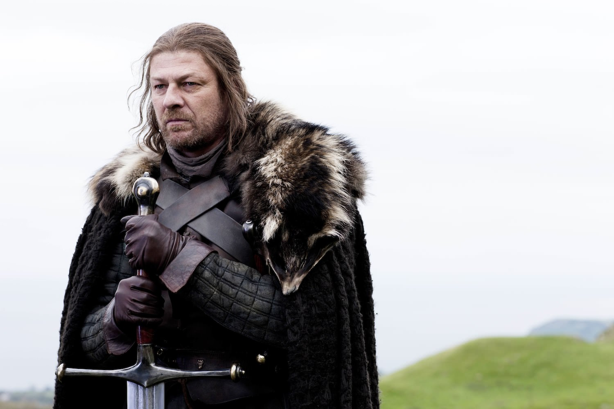
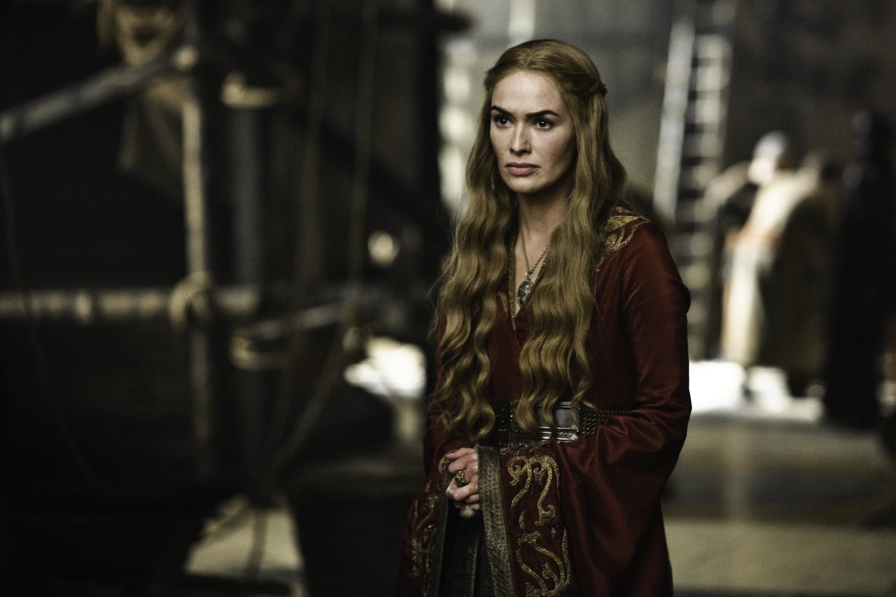
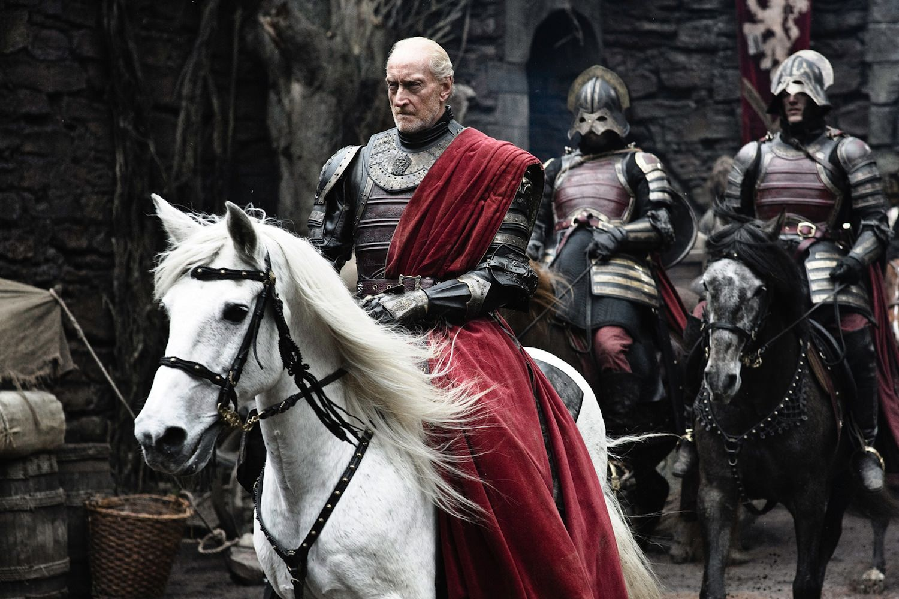
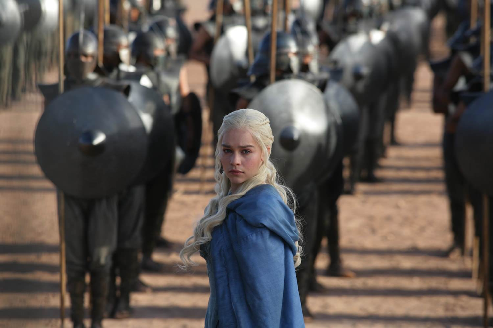
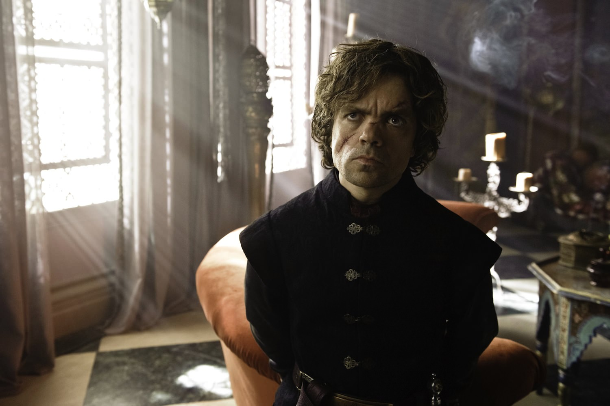
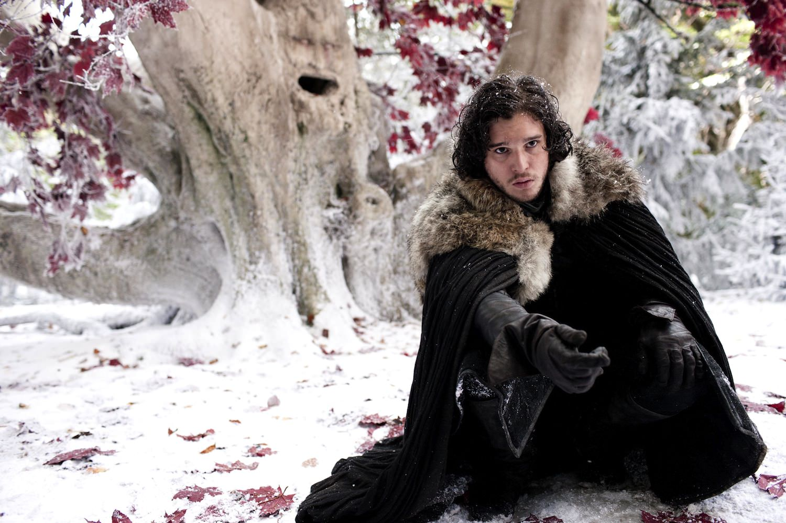
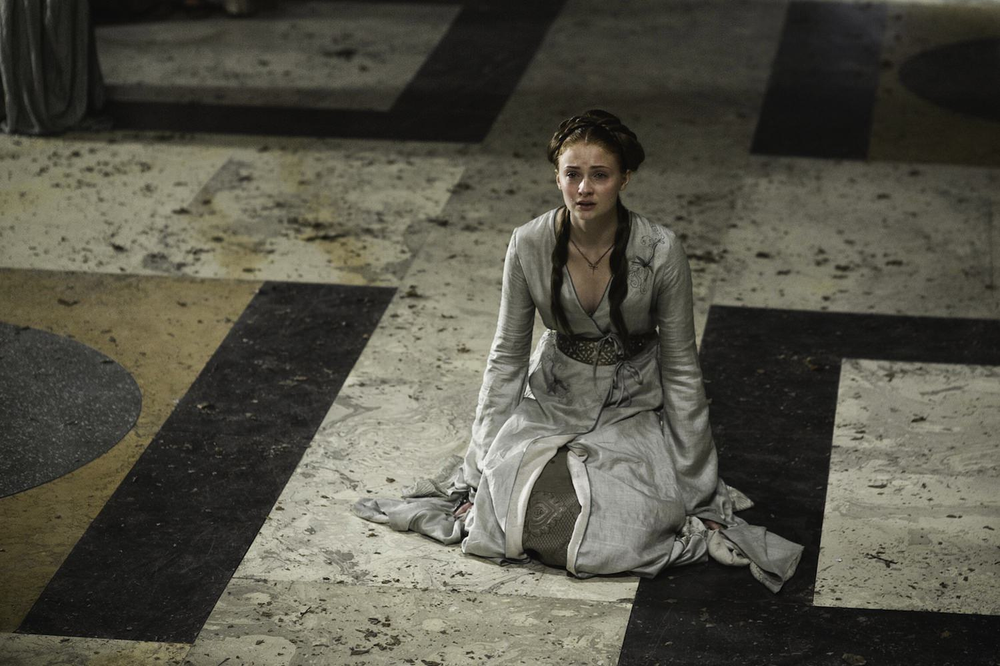

+++
titre = "<em>Game of Thrones</em>, D. B. Weiss et David Benioff (HBO)"
title = "Game of Thrones, D. B. Weiss et David Benioff (HBO)"
url = "/game-of-thrones-weiss-benioff-hbo"
date = "2013-06-15T11:50:13"
Lastmod = "2014-11-29T18:06:15"
cover = "game-of-thrones-hbo-weiss-benioff.jpg"
categorie = [ "À voir" ]
tag = [ "Adaptation littéraire", "Famille", "Fantastique", "Guerre", "Heroïc-Fantasy", "Moyen Âge", "Série", "Violence" ]
createur = [ "D.B. Weiss", "David Benioff", "HBO" ]
acteur = [ "Charles Dance", "Emilia Clarke", "Jack Gleeson", "Kit Harington", "Lena Headey", "Maisie Williams", "Nikolaj Coster-Waldau", "Peter Dinklage", "Richard Madden", "Sean Bean", "Sophie Turner" ]
annee = [ "2011" ]
weight = 2011
pays = [ "États-Unis" ]

+++

Trois saisons, trente épisodes et déjà culte : la chaîne américaine HBO a réussi l’exploit de créer une série d’excellente qualité et extrêmement populaire. Difficile de parler de <em>Game of Thrones</em> sans nécessairement faire long, tant l’univers mis en place par la série est d’une richesse rare. Difficile toutefois d’en parler sans dévoiler des informations essentielles, tant la série aime bouleverser les ordres établis et surprendre. Adaptée d’une saga de George R. R. Martin, la série se déroule dans un univers fantastique et sur deux continents imaginés. On y suit jusqu’à une dizaine de petites intrigues en parallèle, mais le cœur du problème est le trône du titre que de nombreux personnages convoitent. Comme dans toutes les meilleures séries, les personnages sont essentiels et la qualité de l’écriture qui fait la renommée de HBO n’est pas usurpée. D.B. Weiss et David Benioff ont signé une grande série épique, à ne rater sous aucun prétexte si vous appréciez l’heroïc-fantasy.

Les trois saisons diffusées pour le moment par HBO ne représentent même pas la moitié de l’immense récit qu’écrit toujours George R. R. Martin. Trois saisons, c’est peu, mais c’est en même temps énorme dans cet univers : <em>Game of Thrones</em> vous emporte dans un tourbillon narratif assez grisant, mais aussi déconcertant dans un premier temps. Jugez plutôt : on commence par suivre l’histoire de la famille des Stark, des nobles qui règnent sur le nord du continent fictif de la série. En parallèle, on découvre Port-Réal, la capitale située plus au sud où le roi vit avec sa cour. Dans le même temps, on suit les pas des deux héritiers légitimes du trône, les enfants de celui qui a été détrôné par le roi actuel dix-sept ans avant l’ouverture de la série. Ces deux-là agissent sur le deuxième continent de <em>Game of Thrones</em>, mais il y a encore une troisième zone géographique. Plus au nord que chez les Stark, au-delà d’un haut mur de glace, une vaste région sauvage qui menace le royaume de Westeros, c’est son nom. Ces personnages et lieux géographiques sont ceux du début de la première saison, mais très vite <em>Game of Thrones</em> multiplie les intrigues. Eddard Stark suit le roi à la cour avec ses deux filles, pendant que Jon Snow, son fils illégitime, s’engage à protéger le mur de glace. En parallèle, les Lannister — une famille rivale des Stark — agit pour récupérer son pouvoir et on découvre ainsi cinq ou six personnages qui vivent des aventures différentes. Le grand jeu pour le trône pour commencer, sachant qu’il reste encore plusieurs prétendants que l’on découvrira au fur et à mesure.

Autant le dire, on est un peu perdu dans cet univers touffu pendant quelques épisodes. Le pilote de la première saison est à cet égard saisissant : D.B. Weiss et David Benioff nous emportent dans un pays que l’on ne connaît pas, pour découvrir en même temps des intrigues strictement parallèles dans un premier temps. L’une des bonnes idées de HBO, c’est de faire du générique de <em>Game of Thrones</em> — un des points forts des séries de la chaîne — une carte qui représente l’intégralité du territoire où se déroule l’action. En regardant avant chaque épisode <a href="http://voiretmanger.fr/wp-content/2013/06/game-of-thrones-carte.jpg" title="Carte Game of Thrones">cette carte</a>, on finit par prendre des points de repère géographiques et par visualiser la zone au-delà du mur tout au nord, puis Winterfell et la région dominée par les Stark. Plus au sud, on trouve d’autres maisons : les Tully au milieu, les Lannister à l’ouest,  les Greyjoy sur des îles encore plus à l’ouest, mais aussi vers le sud les Baratheon, les Tyrell… et on en oublie encore un bon nombre. Les <a href="http://fr.wikipedia.org/wiki/Personnages_du_Trône_de_fer">personnages</a> de la série sont bien trop nombreux pour les évoquer tous, mais ne vous inquiétez pas si vous pensez être totalement perdus. Le scénario est suffisamment bien ficelé pour que l’on s’y retrouve toujours et on s’attache malgré tout à une poignée de personnages clés, une petite dizaine qui fait office de « héros », ou du moins de guides dans le récit. On suit d’abord surtout les Stark, puis les Lannister, tandis qu’à l’autre bout de cet univers, le frère et la sœur Targaryen, seuls rescapés de leur famille autrefois si puissante, tentent de récupérer le trône.

S’il y a bien un aspect particulièrement réussi dans <em>Game of Thrones</em>, c’est bien ce sentiment de réalisme. Dès les premières images, on sent que l’univers est parfaitement crédible, notamment parce qu’il a une histoire derrière lui. Les personnages font constamment référence à des évènements que l’on n’a pas vu et que l’on ne verra jamais dans la série, mais c’est tout à fait normal. D.B. Weiss et David Benioff ont réussi à rendre les deux continents parfaitement crédibles grâce à cette présence de l’histoire, mais aussi une richesse jamais vue à la télévision. Jamais, une telle ampleur avait été filmée : suivre en parallèle des personnages aussi différents et aussi éloignés sur le plan géographique est déjà une belle performance, mais il y a mieux. Au cours des épisodes, <em>Game of Thrones</em> nous fait découvrir d’autres personnages secondaires, mais qui assoient la crédibilité de l’ensemble. Parfois même, on a un décor qui montre une ville ou un château, exactement ce qu’il faut pour donner du corps à la carte imaginée par HBO pour ouvrir chaque épisode. Ce n’est pas une simple carte, c’est un véritable univers qui semble avoir son indépendance et vivre de lui-même. Seule la série télévisée sans doute permettait un tel rendu : même <a href="http://voiretmanger.fr/saga/le-seigneur-des-anneaux/"><em>Le Seigneur des Anneaux</em></a>, une référence du genre pourtant, n’était pas allé aussi loin dans ce sentiment de réalisme.

Un sentiment renforcé par le style de la série : très réaliste, <em>Game of Thrones</em> n’hésite pas à filmer des scènes parfois très violentes, que ce soit sur le plan physique ou psychologique. Les personnages sont battus, voire parfois torturés, ils perdent des êtres qui leur sont chers et l’histoire de George R. R. Martin ne les épargne pas, bien au contraire. HBO a su garder cet aspect et la série donne très bien le sentiment d’une menace permanente qui plane sur chaque personnage. Contrairement à d’autres œuvres où l’on est sûr que les personnages principaux survivront quoiqu’il arrive, D.B. Weiss et David Benioff doivent régulièrement tuer des personnages importants, voire de premier plan. On est un peu surpris quand cela arrive, mais c’est une leçon que l’on découvre vite : dans <em>Game of Thrones</em>, personne n’est éternel, personne n’est irremplaçable. Les raconteurs d’histoire ont parfois tendance à l’oublier, mais cette dure réalité est indispensable à un récit réaliste et c’est tout particulièrement le cas ici. Nul n’est à l’abri et la menace plane sur tout le monde, à la fois depuis le nord et depuis le deuxième continent à l’est. Sans entrer trop dans les détails, on peut quand même évoquer le principe général qui est que dans cet univers, il n’y a que deux saisons et que l’hiver comme l’été peuvent durer plusieurs années. Quand la série ouvre, l’été dure depuis une dizaine d’années et tout le monde attend l’hiver et avec lui des menaces très directes. C’est une menace, mais <em>Game of Thrones</em> n’oublie pas celle qui vient de l’ouest et des descendants des Targaryen, mais mieux vaut ne pas trop en dire…

Adulte donc, <em>Game of Thrones</em> montre constamment la violence et parfois la violence sexuelle. L’adaptation menée par HBO est très sombre, l’univers étant apparenté au Moyen-Âge et à une société où la mort est très présente et normale. À cet égard, D.B. Weiss et David Benioff ont fait un beau travail de reconstitution avec des villes notamment très réalistes, mais aussi des châteaux impressionnants et souvent en ruines — là encore, l’histoire est passée par là. Les batailles et les combats sont eux aussi crédibles, quoique toujours un peu exagérés, mais ce n’est pas gênant, d’autant que la magie joue aussi un rôle ici. L’ensemble n’est pas très joyeux, mais on est happé par ce que l’on voit et par la justesse des décors. <em>Game of Thrones</em> n’est certainement pas une série pour les enfants et c’est précisément pourquoi elle est aussi réussie. Fidèle à son habitude, la chaîne a demandé à plusieurs réalisateurs de tourner les épisodes, mais l’ensemble est d’une grande cohérence et il faut saluer la qualité de la série. Il est loin le temps où série télévisée était synonyme de pauvreté de la mise en scène ou de faibles moyens. Chaque épisode est un petit film et la série dans l’ensemble fait bien mieux que de nombreux longs-métrages qui bénéficient d’une sortie au cinéma. Les effets numériques restent assez rares, mais ils sont bien faits ; l’essentiel est du cinéma à l’ancienne, tourné en studio ou en décors naturels en Grande-Bretagne. Encore une fois, on ne peut être qu’impressionné par la qualité des reconstitutions et leur cohérence, un point indispensable pour la crédibilité du tout.

On le disait en ouverture, une bonne série tient d’abord en de bons personnages. Il fallait donc aussi de bons acteurs et sur ce point, <em>Game of Thrones</em> fait un sans-faute. Difficile de tous les énumérer ici, mais disons simplement qu’ils sont tous précis et naturels, certains sont attachants, d’autres repoussants et on est régulièrement bluffé par le travail de l’un ou d’un autre dans certains épisodes. La liste de récompenses obtenues est longue et impressionnante, mais il faut bien avouer qu’aidés par des dialogues très bien écrits — et très proches de ceux de George R. R. Martin, d’ailleurs —, il sont vraiment bons. Leurs personnages sont eux aussi extrêmement bien écrits et fascinants. Il y en a de naïfs, mais surtout beaucoup de cyniques prêts à tout pour survivre. Certains ne veulent que se sauver ou sauver leurs proches dans l’immense guerre qui se met en place, d’autres sont au contraire plus actifs et tentent de récupérer le trône. On apprécie aussi les personnalités très différentes et les dizaines de conflits, le plus souvent personnels, entre frères et sœurs, entre maisons rivales ou bien encore entre amoureux déçus. Les alliances se font et se défont, les batailles se mènent entre armées ou à l’intérieur de la cour : la dimension politique est centrale dans <em>Game of Thrones</em> et c’est incontestablement un facteur explicatif de sa réussite.

Difficile de parler de <em>Game of Thrones</em> sans en dire trop, sans raconter tout simplement toute l’histoire. Les romans de George R. R. Martin sont encore plus riches, mais la série diffusée par HBO est d’une richesse rare et l’adaptation d’excellente qualité en fait une série à ne rater sous aucun prétexte. Même si l’héroïc-fantasy n’est pas votre genre de prédilection, laissez une chance à cette guerre de pouvoir où les références médiévales et la magie ne sont, au fond, que des prétextes pour évoquer notre société. Avec ses personnages parfaitement dessinés et particulièrement riches, <em>Game of Thrones</em> s’est rapidement imposée comme une grande série, un titre qui n’est en rien usurpé.

<h3>Vous voulez m&rsquo;aider ?</h3>
<ul>
<li><a href="http://www.amazon.fr/gp/product/B00605DI6C/ref=as_li_ss_tl?ie=UTF8&#038;tag=leblogdenic07-21&#038;linkCode=as2&#038;camp=1642&#038;creative=19458&#038;creativeASIN=B00605DI6C">Acheter la première saison en Blu-Ray sur Amazon</a></li>
<li><a href="http://www.amazon.fr/gp/product/B008HFH5DA/ref=as_li_ss_tl?ie=UTF8&#038;tag=leblogdenic07-21&#038;linkCode=as2&#038;camp=1642&#038;creative=19458&#038;creativeASIN=B008HFH5DA">Acheter la première saison en DVD sur Amazon</a></li>
<li><a href="https://itunes.apple.com/fr/tv-season/game-of-thrones-saison-1-vost/id460088620">Acheter ou louer la première saison sur l&rsquo;iTunes Store</a></li>
</ul>
<ul>
<li><a href="http://www.amazon.fr/gp/product/B00AAZ9F6K/ref=as_li_ss_tl?ie=UTF8&#038;tag=leblogdenic07-21&#038;linkCode=as2&#038;camp=1642&#038;creative=19458&#038;creativeASIN=B00AAZ9F6K">Acheter la deuxième saison en Blu-Ray sur Amazon</a></li>
<li><a href="http://www.amazon.fr/gp/product/B00AAZ9ER0/ref=as_li_ss_tl?ie=UTF8&#038;tag=leblogdenic07-21&#038;linkCode=as2&#038;camp=1642&#038;creative=19458&#038;creativeASIN=B00AAZ9ER0">Acheter la deuxième saison en DVD sur Amazon</a></li>
<li><a href="https://itunes.apple.com/fr/tv-season/game-of-thrones-saison-2-vost/id557165512">Acheter ou louer la deuxième saison sur l&rsquo;iTunes Store</a></li>
</ul>
<ul>
<li><a href="http://www.amazon.fr/gp/product/B00GS0X9UO/ref=as_li_ss_tl?ie=UTF8&#038;tag=leblogdenic07-21&#038;linkCode=as2&#038;camp=1642&#038;creative=19458&#038;creativeASIN=B00GS0X9UO">Acheter la troisième saison en Blu-Ray sur Amazon</a></li>
<li><a href="http://www.amazon.fr/gp/product/B00GS0X9I6/ref=as_li_ss_tl?ie=UTF8&#038;tag=leblogdenic07-21&#038;linkCode=as2&#038;camp=1642&#038;creative=19458&#038;creativeASIN=B00GS0X9I6">Acheter la troisième saison en DVD sur Amazon</a></li>
<li><a href="https://itunes.apple.com/fr/tv-season/game-of-thrones-saison-3-vost/id765697540">Acheter ou louer la troisième saison sur l&rsquo;iTunes Store</a></li>
</ul>
<ul>
<li><a href="http://www.amazon.fr/gp/product/B00L1B60LA/ref=as_li_ss_tl?ie=UTF8&#038;tag=leblogdenic07-21&#038;linkCode=as2&#038;camp=1642&#038;creative=19458&#038;creativeASIN=B00L1B60LA">Acheter la quatrième saison en Blu-Ray sur Amazon</a></li>
<li><a href="http://www.amazon.fr/gp/product/B00L1B5ZB6/ref=as_li_ss_tl?ie=UTF8&#038;tag=leblogdenic07-21&#038;linkCode=as2&#038;camp=1642&#038;creative=19458&#038;creativeASIN=B00L1B5ZB6">Acheter la quatrième saison en DVD sur Amazon</a></li>
<li><a href="https://itunes.apple.com/fr/tv-season/game-of-thrones-saison-4-vost/id898268114">Acheter ou louer la quatrième saison sur l&rsquo;iTunes Store</a></li>
</ul>

