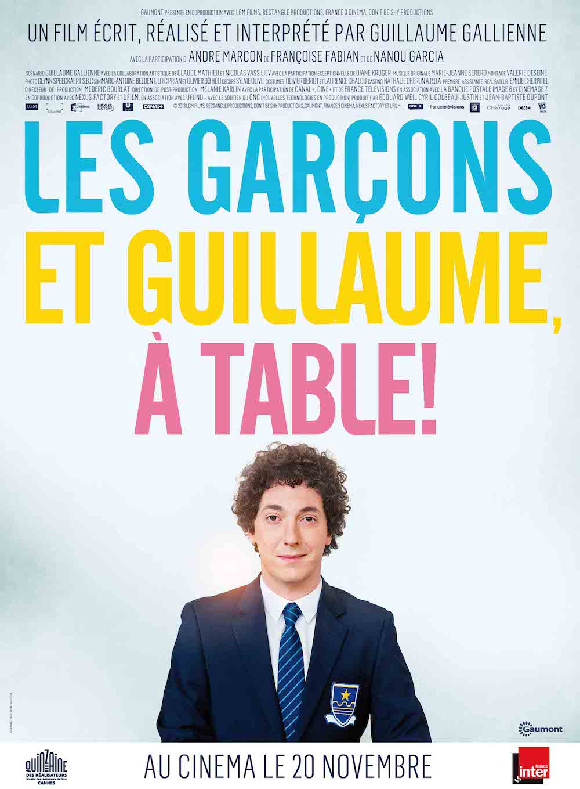
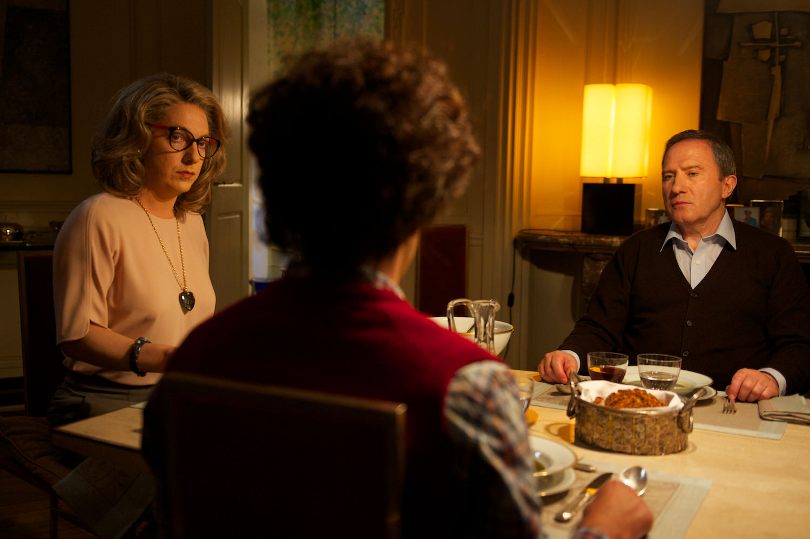
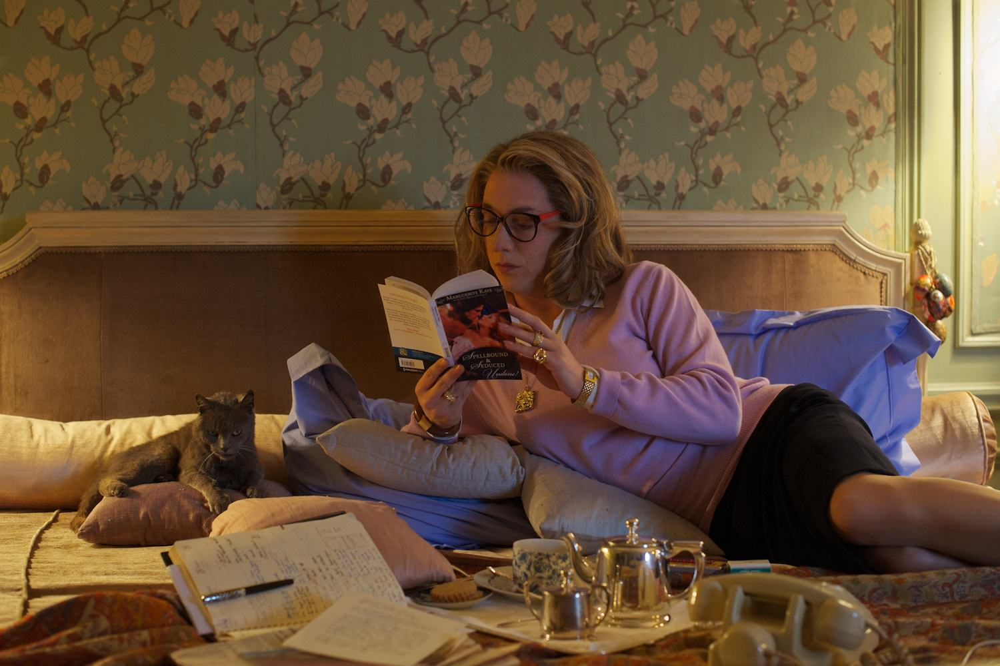

+++
type = "post"
titre = "<em>Les Garçons et Guillaume, à table !</em>, Guillaume Gallienne"
title = "Les Garçons et Guillaume, à table !, Guillaume Gallienne"
url = "/garcons-guillaume-table-gallienne"
date = "2013-11-21T07:57:01"
Lastmod = "2014-02-28T18:13:19"
cover = "garcons-guillaume-table-guillaume-gallienne.jpg"
categorie = [ "À voir" ]
tag = [ "Adaptation théâtrale", "Adolescence", "Autobiographie", "Enfance", "Famille", "Homosexualité", "Humour", "Identité" ]
createur = [ "Guillaume Gallienne" ]
acteur = [ "André Marcon", "Françoise Fabian", "Guillaume Gallienne", "Nanou Garcia" ]
annee = [ "2013" ]
weight = 2013
pays = [ "France" ]

+++

Acteur de la Comédie française depuis 2005, Guillaume Gallienne passe pour la première fois derrière la caméra. On l’a déjà croisé à de nombreuses reprises au cinéma, souvent dans des seconds rôles mineurs, mais toujours remarqués. Passer à la réalisation n’est jamais facile quand on est acteur et c’est d’autant plus compliqué quand on choisit, en plus, de le faire sur une œuvre autobiographique. Écrit à l’origine pour le théâtre, <em>Les Garçons et Guillaume, à table !</em> raconte en effet l’histoire de Guillaume, le petit dernier d’une famille bourgeoise qui idolâtre sa mère au point de se faire passer pour une fille uniquement pour lui faire plaisir. Le résultat est surprenant : très personnel, le long-métrage finit paradoxalement par atteindre une forme d’universel. Il est aussi étonnamment drôle, très drôle même, tout en ménageant une bonne part d’émotion. Bref, <em>Les Garçons et Guillaume, à table !</em> joue les équilibristes et constitue une vraie réussite, à ne rater sous aucun prétexte.

Guillaume nait dans une famille qui avait déjà deux garçons. Ses parents, issus de la grande bourgeoisie, espéraient une fille, sa mère en particulier qui est de mauvaise humeur depuis sa naissance. Guillaume adore sa mère : il l’admire sans limites et passe son temps à l’imiter. Pour lui faire plaisir, il décide de devenir une fille, puisque c’est cela qu’elle désirait avant sa naissance. Le point de départ de <em>Les Garçons et Guillaume, à table !</em> est à la fois extrêmement drôle et assez cruel. Entre la mère et le fils, un jeu un peu pervers se met en place : elle ne le considère pas comme un garçon et le distingue toujours de ses deux frères, comme le titre particulièrement bien trouvé le met en valeur. Guillaume accepte volontiers ce statut à part et l’accentue même au maximum : le garçon prend des manières de filles, il se travestit et voudrait bien s’habiller comme ces filles qu’il admire éperdument, mais pour les imiter, pas pour les aimer. On le sait, ce récit est hautement autobiographique et Guillaume Gallienne, tout à la fois derrière et devant la caméra, mais aussi sur le scénario, raconte sa propre histoire avec une distance comique troublante. On a rarement l’occasion de découvrir une histoire racontée à la première personne avec autant de distance et de mépris même, parfois. À un moment, un psy consulté par le héros s’étonne que le jeune homme puisse se détester autant. C’est effectivement la force de <em>Les Garçons et Guillaume, à table !</em> : si le film est vraiment très drôle, avec quelques scènes à mourir de rire, il est aussi plein d’émotion et traite de sujets finalement assez graves. Au fond, le film évoque l’histoire d’un garçon puis d’un adolescent persuadé d’être une fille, puis d’être homosexuel parce que sa famille entière en est aussi persuadée. Guillaume Gallienne suit une thérapie qui le conduit à un <em>coming-out</em> inversé qui est drôle, certes, mais aussi très proche de la situation inverse, bien plus courante.

<em>Les Garçons et Guillaume, à table !</em> n’a rien d’un film militant, c’est au contraire une comédie aussi brève — moins d’une heure et demie — que réjouissante. Le long-métrage varie les tons, beaucoup plus que ce que laisse espérer la bande annonce qui en montre d’ailleurs beaucoup trop : si vous avez pu l’éviter, la surprise n’en sera que plus grande et certaines scènes devraient vraiment vous faire rire. Guillaume Gallienne se débrouille en tout cas très bien avec sa caméra et pour un premier film, on ne peut qu’être impressionné par sa maîtrise. Sans être techniquement compliquée, la réalisation est très propre et le montage est souvent virtuose et provoque l’hilarité. Dans la scène où la mère révèle à son fils qu’il aime les hommes et que ce n’est pas grave, le découpage après la première déception amoureuse de Guillaume est assez brillant et sans parler d’effet de surprise, on peut reconnaître un beau sens des transitions. Guillaume Gallienne, cinéaste, mérite déjà nos éloges, mais c’est surtout l’acteur que l’on retiendra à nouveau. <em>Les Garçons et Guillaume, à table !</em> se concentre essentiellement sur la mère et son fils et l’acteur a réussi à interpréter les deux avec un naturel vraiment troublant. Il est assez à l’aise avec son propre personnage, ce qui n’était pas déjà évident, puisqu’il s’interprète de l’enfance à l’âge adule, en passant par l’adolescence. Par son simple jeu d’acteur, il parvient à nous donner une idée de l’âge de son personnage et même si on n’a aucune idée précise, on comprend instinctivement qu’il a une dizaine d’années dans telle scène, 17 ou 18 dans une autre, etc. S’il est déjà naturel ainsi, Guillaume Gallienne joue sa mère avec encore plus de naturel : c’est bien simple, on pourrait parfois jurer qu’il s’agit d’une actrice ou de sa vraie mère. L’acteur n’est pourtant qu’à peine grimé, mais il lui suffit d’une perruque, de lunettes et d’une poitrine féminine pour entrer dans le personnage et nous le rendre parfaitement crédible. Ce naturel est vraiment troublant et c’est incontestablement la plus grande réussite de <em>Les Garçons et Guillaume, à table !</em>… Il faudrait encore parler de la musique et des excellents choix de la <a href="https://itunes.apple.com/fr/album/les-garcons-et-guillaume-table/id736221324">bande originale</a> qui va jusqu’à remixer du Verdi pour une scène de discothèque endiablée. 

La réussite est totale pour ce film autobiographique. <em>Les Garçons et Guillaume, à table !</em> parle d’un cas personnel et très particulier — rares sont ceux qui pourront comparer directement leur enfance à celle de l’acteur —, mais qui touche en même temps de façon universelle. C’est sans doute la marque de fabrique des grandes œuvres et Guillaume Gallienne a très bien su parler à tout le monde en parlant de lui. Son portrait est drôle, vraiment très drôle, mais il est aussi émouvant. Le film se termine sur une scène de théâtre où l’acteur ne joue plus sa mère et c’est une scène très touchante. Avec ce premier long-métrage, Guillaumme Gallienne a, en quelque sorte, réalisé sa propre thérapie, mais on espère que ce ne sera pas son dernier film en tant que réalisateur. Si <em>Les Garçons et Guillaume, à table !</em> prouve une chose, c’est bien que l’acteur a aussi son mot à dire derrière la caméra. 

<h3>Vous voulez m&rsquo;aider ?<a href="#footnote_0_10596" id="identifier_0_10596" class="footnote-link footnote-identifier-link" title="&Agrave; propos de la publicit&eacute;&hellip;">1</a></h3>
<ul>
<li><a href="http://www.amazon.fr/gp/product/B00H1YZHQA/ref=as_li_ss_tl?ie=UTF8&tag=leblogdenic07-21&linkCode=as2&camp=1642&creative=19458&creativeASIN=B00H1YZHQA">Acheter le film en Blu-Ray sur Amazon</a></li>
<li><a href="http://www.amazon.fr/gp/product/B00H1YZH92/ref=as_li_ss_tl?ie=UTF8&tag=leblogdenic07-21&linkCode=as2&camp=1642&creative=19458&creativeASIN=B00H1YZH92">Acheter le film en DVD sur Amazon</a></li>
<li><a href="https://itunes.apple.com/fr/movie/les-garcons-et-guillaume-table!/id809815041">Acheter ou louer le film sur l&rsquo;iTunes Store</a></li>
</ul>

<ol class="footnotes"><li id="footnote_0_10596" class="footnote"><a href="http://voiretmanger.fr/soutien/">À propos de la publicité…</a> [<a href="#identifier_0_10596" class="footnote-link footnote-back-link">&#8617;</a>]</li></ol>
