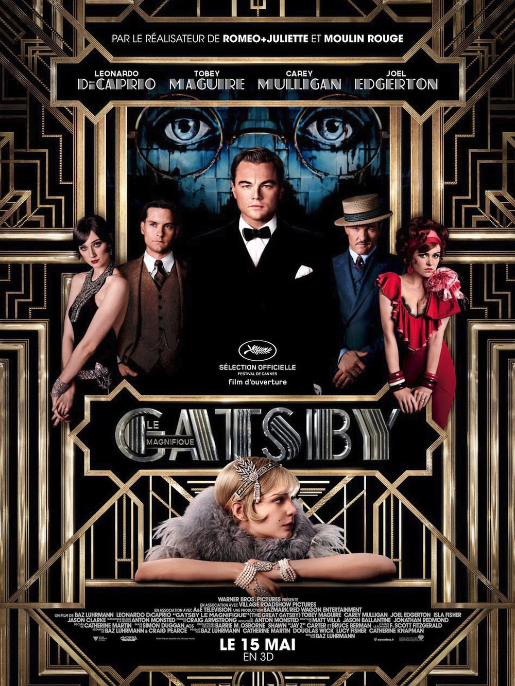
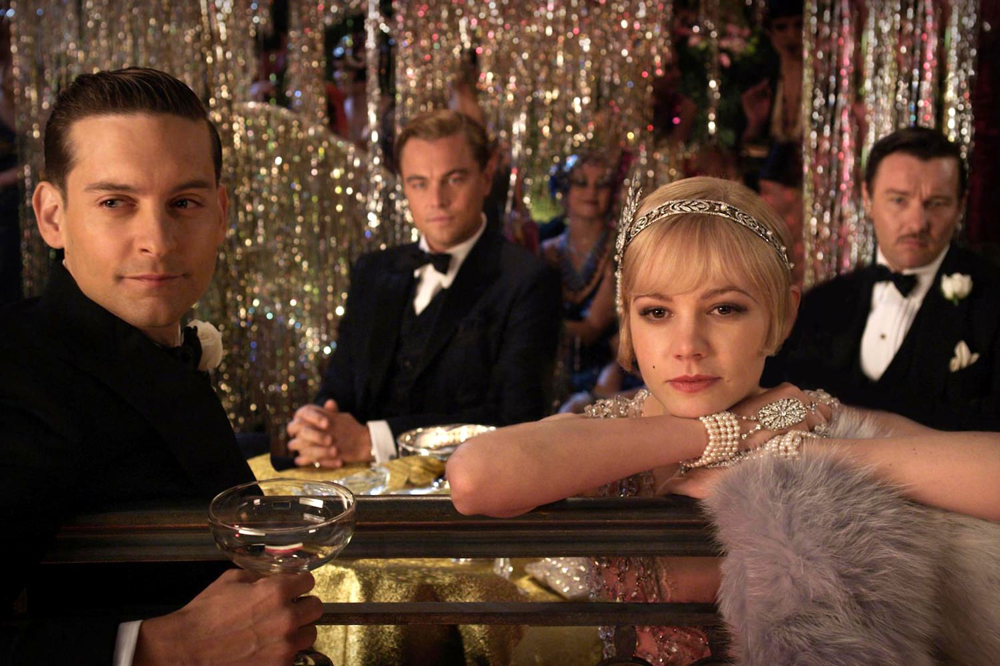
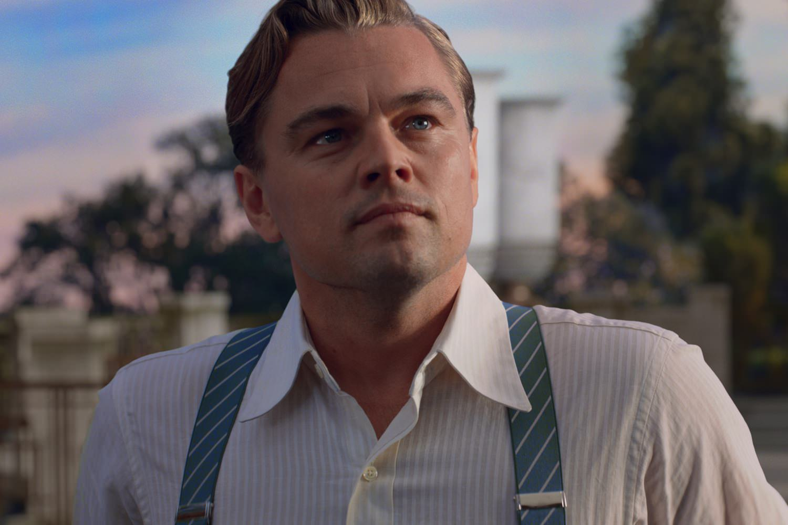

+++
type = "post"
titre = "<em>Gatsby le Magnifique</em>, Baz Luhrmann"
title = "Gatsby le Magnifique, Baz Luhrmann"
url = "/gatsby-le-magnifique-luhrmann"
date = "2013-05-15T23:35:39"
Lastmod = "2015-05-10T21:19:57"
cover = "gatsby-le-magnifique-leonardo-di-caprio-baz-luhrmann.jpg"
categorie = [ "À voir" ]
tag = [ "Adaptation littéraire", "Amour", "Blockbuster", "Drame", "Romance", "Société" ]
createur = [ "Baz Luhrmann" ]
acteur = [ "Carey Mulligan", "Joel Edgerton", "Leonardo Di Caprio", "Tobey Maguire" ]
annee = [ "2013" ]
weight = 2013
pays = [ "États-Unis" ]
original = "The Great Gatsby"

+++

Baz Luhrmann fait partie de ces cinéastes qui ont un univers spécifique et reconnaissable entre tous. On lui doit une poignée de films et pourtant une empreinte considérable sur le cinéma, avec ce style inspiré par les clips de MTV et cette façon de composer des bandes originales qui entremêlent tous les genres. Ce système inspiré également par les comédies musicales a culminé avec <a href="http://voiretmanger.fr/romeo-juliette-luhrmann/" title="Romeo + Juliette, Baz Lurhmann"><em>Romeo + Juliette</em></a> puis le célèbre <a href="http://voiretmanger.fr/moulin-rouge-luhrmann/" title="Moulin Rouge !, Baz Luhrmann"><em>Moulin Rouge !</em></a>, si bien que l’on pouvait être un peu inquiet en apprenant qu’il allait adapter au cinéma le roman de F. Scott Fitzgerald. De fait, <em>Gatsby le Magnifique</em> est sans conteste un film de Baz Lurhmann, mais cette affiliation évidente dès les premières images ne signifie pas que l’on a affaire à un <em>Moulin Rouge 2</em>. Le cinéaste a su évoluer sans renier son style, pour un résultat épuisant et parfois un peu pénible, mais qui fonctionne dans l’ensemble mieux que prévu.

Assez fidèle au roman dont il s’inspire, <em>Gatsby le Magnifique</em> centre malgré tout son scénario sur l’histoire d’amour entre Gatsby, richissime et mystérieux millionnaire qui donne les plus grosses fêtes de New York et Daisy, femme de l’aristocratie new-yorkaise qui a failli épouser Gatsby cinq années auparavant. Baz Luhrmann maintient malgré tout le point de vue extérieur avec le personnage de Nick Carraway, un jeune homme désargenté qui vient profiter de la richesse de New York dans les années 1920. Un peu par hasard, il loge dans une maison logée au pied du palais de Gatsby qui devient son voisin, mais il est surtout le cousin de Daisy. Le film prend un grand soin à entretenir aussi longtemps que possible le mystère autour du millionnaire qui est pourtant son sujet. Pendant toute la première partie de <em>Gatsby le Magnifique</em>, on entend beaucoup parler de cet homme, mais on ne le voit jamais et les plus énormes rumeurs contradictoires se multiplient à son sujet. On suit les pas de Nick, mais ces pas vont rapidement croiser ceux de Gatsby : ce dernier a repéré qu’il était de la famille de Daisy et il se rapproche de lui pour mieux s’approcher de celle qu’il aime depuis des années. Après avoir fraternisé avec Nick, il finit par lui demander d’inviter sa cousine pour prendre le thé chez lui : un rendez-vous arrangé qui réunit les deux tourtereaux et relance la grande histoire d’amour, au grand dam de l’époux de Daisy, évidemment. Baz Luhrmann a fait un bon travail d’adaptation et son scénario tient parfaitement la route, même s’il efface un petit peu la critique sociale du roman. <em>Gatsby le Magnifique</em> est d’abord une histoire d’amour, mais cette romance est assez fidèle à l’œuvre originale. Contrairement à <em>Roméo + Juliette</em>, le contexte socio-historique n’a pas été modifié au passage et le New York des années 1920 reconstitué par le cinéaste est plutôt crédible. Quant aux luttes entre les classes sociales, elles ont peut-être été édulcorées par l’histoire d’amour, mais elles sont bien présentes et plutôt bien vues : l’opposition entre l’aristocratie installée et les nouveaux riches est éternelle et la crasse des mauvais quartiers de la ville est saisissante. Ce n’est pas une analyse sociologique tout en finesse, mais <em>Gatsby le Magnifique</em> fonctionne plutôt bien sur ce point.

<em>Gatsby le Magnifique</em> reste avant tout un film de Baz Lurhmann, et cela se voit. Même s’il ne va pas autant dans l’excès qu’un <em>Moulin Rouge</em>, ce nouvel opus en fait des tonnes sur le plan visuel et impose aux spectateurs un montage extrêmement rapide digne d’un clip de hip-hop, un genre que semble tout particulièrement apprécier le cinéaste. La <a href="http://www.amazon.fr/gp/product/B00C2VGAW2/ref=as_li_ss_tl?ie=UTF8&#038;tag=leblogdenic07-21&#038;linkCode=as2&#038;camp=1642&#038;creative=19458&#038;creativeASIN=B00C2VGAW2">bande originale</a> du film est à nouveau un patchwork ahurissant où Jay-Z et Beyoncé côtoient Gotye ou Lana Del Rey dans une ambiance jazz pour coller à l’époque. Difficile de vraiment comprendre l&rsquo;intérêt du rap qui semble placé ici par simple plaisir de faire jeune, voire de provoquer avec des goûts qui se veulent absolument éclectiques, mais ce n&rsquo;est pas si gênant à l&rsquo;écran. Quant au film, c’est bien simple, les plans les plus longs dans le film ne dépassent pas la dizaine de secondes, tandis que certaines séquences enchaînent les plans de deux ou trois secondes chacun. L’effet est saisissant et même, par moment, réussi : les représentations des fêtes totalement folles de Gatsby sont parfaitement adaptées à ce système cinématographique qui rend très bien cette folie furieuse qui semble s’emparer de tous les participants. Baz Lurhmann s’en est donné à cœur joie que ce soit avec l’immense manoir de son personnage principal, ou ses fêtes colorées où l’alcool coule à flots alors qu’on est au cœur de la Prohibition et où tout est permis, sans exception. Ces séquences sont peut-être les meilleurs du film et la première rencontre entre Nick et le millionnaire est à cet égard une vraie réussite. C’est endiablé, c’est fou et c’est un peu kitsch, mais <em>Gatsby le Magnifique</em> représente des situations un peu folles et un peu kitsch. Malheureusement, le cinéaste ne s’est pas contenté de filmer ainsi les quelques scènes de fêtes, c’est tout son film qui est tourné et surtout monté de la même manière. Le long-métrage dure près de deux heures trente et il est bien vite épuisant à suivre : si l’on peut reconnaître la virtuosité du cinéaste, ses mouvements et jeux de caméra incessants et son regard systématiquement outrancier finissent par lasser. La longueur de l’ensemble n’en devient que plus gênante : <em>Gatsby le Magnifique</em> aurait gagné à perdre une bonne demi-heure, au moins, et le film accuse en l’état de quelques pertes de régime, ou plutôt des contrecoups liés à la fatigue visuelle. Une fatigue renforcée par le choix malheureux de la 3D : difficile de ne pas y voir un simple argument marketing et une manière de gonfler les chiffres, tant Baz Lurhmann ne l’exploite qu’en tant que gadget, et encore, dans une toute petite poignée de scènes. Si vous le pouvez, éviter cette 3D qui assombrit surtout l’image, sans vraie contrepartie. Le bilan semble négatif, mais <em>Gatsby le Magnifique</em> reste malgré tout assez plaisant, notamment grâce à ses acteurs, tout particulièrement grâce à Leonardo DiCaprio qui est vraiment impressionnant dans ce rôle qui lui va parfaitement. À ses côtés, Tobey Maguire ou Carey Mulligan s’en sortent, mais font un peu pâle figure.

Comme tous les cinéastes qui disposent de leur propre univers, <em>Gatsby le Magnifique</em> devrait convenir à tous ceux qui ont aimé les précédents films de Baz Luhrmann et constituer une épreuve insupportable pour tous ceux qui le détestent. La finesse n’a pas sa place ici et le résultat est vite fatiguant, d’autant qu’il est trop long, mais il faut reconnaître que ce sixième long-métrage fonctionne plutôt bien, dans l’ensemble. Déjà parce que le réalisateur n’a pas bêtement reproduit une formule, mais aussi parce que son Gatsby est plus traité de façon plus fine qu’au premier abord. Interprété par un Leonardo Di Caprio en grande forme, ce personnage qui se réfugie jusqu’au bout dans un rêve plutôt que d’affronter la réalité est finalement très touchant. <em>Gatsby le Magnifique</em> mérite ainsi d’être vu, ne serait-ce que pour cette prestation et sous réserve quand même de tolérer le style de Baz Lurhmann.

<h3>Vous voulez m&rsquo;aider ?</h3>
<ul>
<li><a href="http://www.amazon.fr/gp/product/B00DELXUKO/ref=as_li_ss_tl?ie=UTF8&#038;tag=leblogdenic07-21&#038;linkCode=as2&#038;camp=1642&#038;creative=19458&#038;creativeASIN=B00DELXUKO">Acheter le film en Blu-Ray et DVD sur Amazon</a></li>
<li><a href="http://www.amazon.fr/gp/product/B00DELXV4O/ref=as_li_ss_tl?ie=UTF8&#038;tag=leblogdenic07-21&#038;linkCode=as2&#038;camp=1642&#038;creative=19458&#038;creativeASIN=B00DELXV4O">Acheter le film en DVD sur Amazon</a></li>
<li><a href="https://itunes.apple.com/fr/movie/gatsby-le-magnifique-great/id680252319">Acheter ou louer le film sur l&rsquo;iTunes Store</a></li>
</ul>

