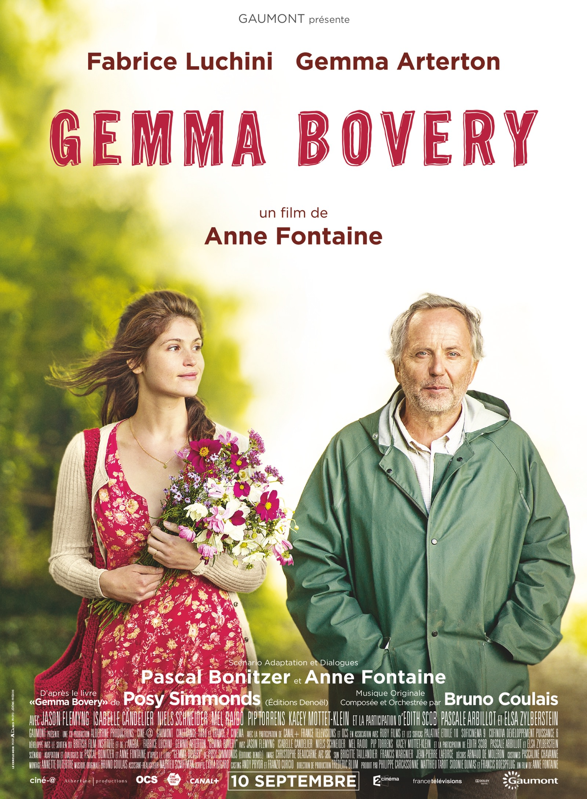
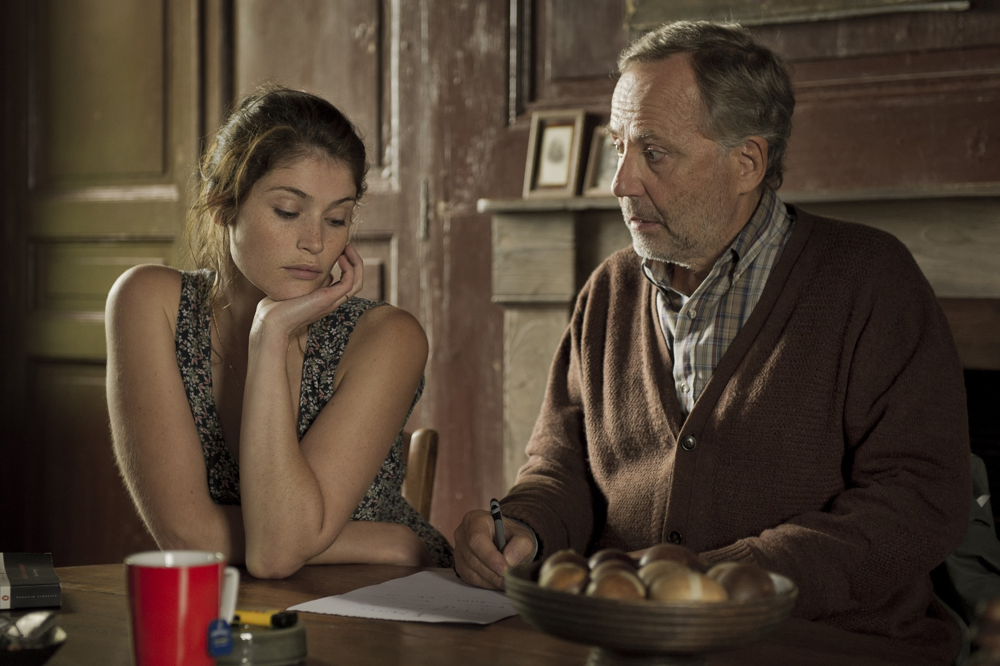

+++
titre = "<em>Gemma Bovery</em>, Anne Fontaine"
title = "Gemma Bovery, Anne Fontaine"
url = "/gemma-bovery-fontaine"
date = "2014-09-14T11:19:24"
Lastmod = "2014-09-14T11:27:11"
cover = "gemma-bovery-anne-fontaine-fabrice-luchini.jpg"
categorie = [ "À voir" ]
tag = [ "Adaptation bande-dessinée", "Amour", "Comédie", "Drame", "Humour", "Littérature", "Société", "Sorties du mois" ]
createur = [ "Anne Fontaine" ]
acteur = [ "Fabrice Luchini", "Gemma Arterton", "Isabelle Candelier", "Jason Flemyng", "Nils Schneider" ]
annee = [ "2014" ]
weight = 2014
pays = [ "France" ]

+++

Après <a href="http://voiretmanger.fr/tamara-drewe-frears/" title="Tamara Drewe, Stephen Frears"><em>Tamara Drewe</em></a>, <em>Gemma Bovery</em> est la nouvelle adaptation du travail de Posy Simmonds. Ce n&rsquo;est pas Stephen Frears qui réalise ce nouveau volet toutefois, mais une cinéaste française. Anne Fontaine ne tourne d&rsquo;ailleurs pas un film anglais, ni même tout à fait un film français, mais plutôt un entre-deux dans ce long-métrage qui adopte, comme le précédent, un ton difficile à cerner. Tour à tour comédie marquée par un humour aussi noir que drôle et drame amoureux, voire tragique, <em>Gemma Bovery</em> est un drôle d&rsquo;objet cinématographique. Que l&rsquo;on connaisse le chef-d&rsquo;œuvre de Flaubert qui plane en permanence sur le film ou non, c&rsquo;est en tout cas un divertissement très plaisant, à voir.

Même si le titre du film laisse entendre que le personnage principal est féminin, on suit en fait presque en permanence le point de vue de Martin, ancien parisien bobo reconverti depuis quelques années en boulanger d&rsquo;un petit village normand. Après une carrière intellectuelle médiocre, il espérait trouver une forme de paix en reprenant la boulangerie de son père et en faisant un travail uniquement manuel. Dès cette introduction, Anne Fontaine souligne l&rsquo;ironie de ce personnage en lui faisant dire que c&rsquo;est totalement raté. Comme on le comprend vite, l&rsquo;ironie domine dans <em>Gemma Bovery</em> et jusqu&rsquo;à la toute fin — que l&rsquo;on se gardera bien de révéler naturellement —, elle motive les personnages et l&rsquo;intrigue. Il faut dire que le point de départ du scénario est déjà très ironique : à côté de la maison où Martin habite avec femme et enfant, un couple d&rsquo;anglais emménage dans une vieille bicoque qui tombe un peu en ruine. Ce n&rsquo;est pas très original en soi, sauf que ce couple d&rsquo;anglais se nomme Bovery et que la femme se prénomme Gemma, tandis que son mari est Charlie… En grand fan de Flaubert, Martin ne pouvait pas ignorer la proximité troublante de sa nouvelle voisine avec l&rsquo;Emma et le Charles de <em>Madame Bovary</em>. De fait, c&rsquo;était l&rsquo;idée de base du roman graphique qui a servi de base au long-métrage : <em>Gemma Bovery</em> est une relecture moderne du chef-d&rsquo;œuvre de Gustave Flaubert, une vision à la fois très proche de l&rsquo;original, et en même temps assez différente.

Il ne faut pas avoir lu <em>Madame Bovary</em> pour comprendre et apprécier <em>Gemma Bovery</em>, même si le film est sans doute encore plus savoureux quand on a le roman original en tête. Comme le récit original, le long-métrage d&rsquo;Anne Fontaine multiplie les références et si la majorité sont explicitées par Martin, certaines pourront échapper au néophyte. Par exemple, dans le roman, le premier amant d&rsquo;Emma se nomme Rodolphe Boulanger : le fait que ce soit aussi le métier de Martin n&rsquo;a ainsi rien d&rsquo;un hasard. Toutefois, ces clins d&rsquo;œil restent secondaires et le film ne se résume pas à un hommage flaubertien. Au-delà de ces jeux littéraires donc, <em>Gemma Bovery</em> est aussi le récit d&rsquo;un amour incroyable, pour ne pas dire impossible, entre le boulanger du village et Gemma, très belle anglaise qui débarque en Normandie. Martin tombe instantanément amoureux de cette femme magnifique qui s&rsquo;émerveille pour tout, et en particulier pour ses pains. La belle ne semble pourtant pas s&rsquo;intéresser du tout à lui, mais cela n&rsquo;empêche pas le personnage principal de s&rsquo;entêter malgré tout. Fasciné par la proximité avec Flaubert, il veut à tout prix empêcher que le roman se reproduise et intervient ainsi dans la vie sentimentale de sa nouvelle voisine. Gemma n&rsquo;est pas heureuse avec son mari et elle va voir ailleurs, en l&rsquo;occurrence le châtelain local, un étudiant qui n&rsquo;a absolument pas envie de réviser son droit et qui préfère passer du temps avec l&rsquo;anglaise. Ce qui, de façon assez troublante naturellement, reproduit l&rsquo;une des séquences du roman. Par certains aspects, <em>Gemma Bovery</em> ressemble aussi à une enquête, puisque Martin fait tout pour éviter que Gemma suive le destin de son double littéraire. Anne Fontaine filme ainsi quelques scènes très drôles, comme celle où le boulanger s&rsquo;emporte sans raison apparente contre la mort aux rats que ses voisins veulent installer pour tuer les mulots.

<em>Gemma Bovery</em> n&rsquo;est absolument pas une adaptation de Flaubert, ni un hommage un peu lourd ou trop intellectuel du roman original. Comme la bande-dessinée qui l&rsquo;a inspiré, le long-métrage d&rsquo;Anne Fontaine est au contraire très drôle par moments et dans l&rsquo;ensemble très plaisant à suivre. Fabrice Luchini est époustouflant dans ce rôle à la fois si proche de l&rsquo;image qu&rsquo;on peut avoir de lui — Martin est un intellectuel fan absolu de Flaubert — et aussi très éloigné : il a constamment un regard hébété qui participe beaucoup au comique du film. À ses côtés, Gemma Arterton est une Gemma parfaitement réussie : très belle et sensuelle, elle découvre la Normandie avec une joie communicative, tout en manipulant ses prétendants avec beaucoup de malice. <em>Gemma Bovery</em> n&rsquo;est pas le film de l&rsquo;année, sans doute, mais c&rsquo;est une jolie comédie, qui donne en plus envie de relire <em>Madame Bovary</em>.

