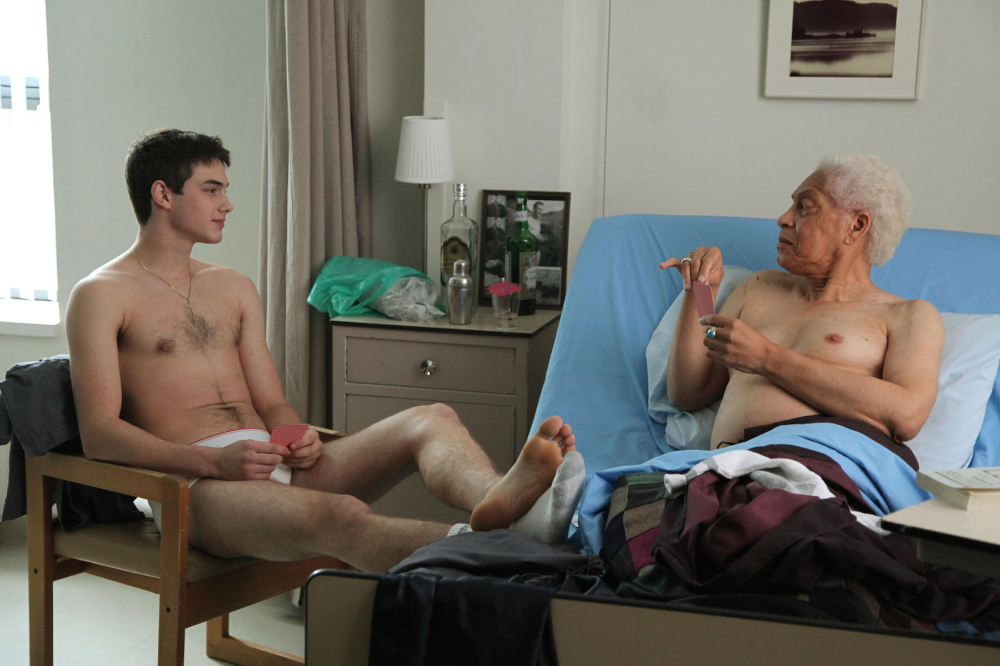
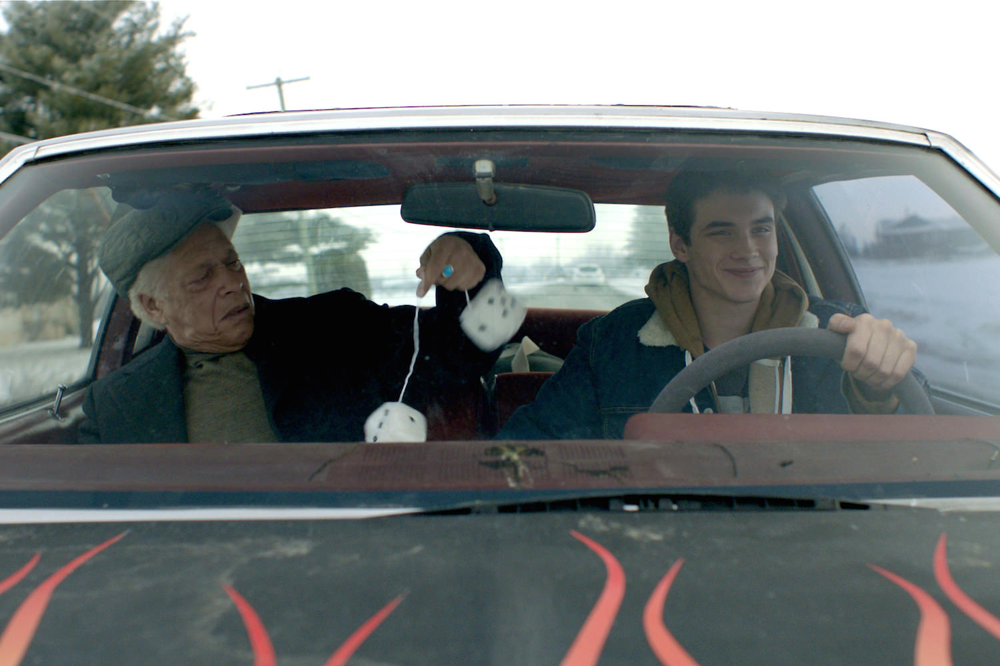

+++
type = "post"
titre = "<em>Gerontophilia</em>, Bruce LaBruce"
title = "Gerontophilia, Bruce LaBruce"
url = "/gerontophilia-labruce"
date = "2014-03-28T07:36:57"
Lastmod = "2014-12-22T14:47:58"
cover = "gerontophilia-pier-gabriel-lajoie-labruce.jpg"
categorie = [ "À voir" ]
tag = [ "Adolescence", "Amour", "Homosexualité", "Humour", "Romance", "Sorties du mois" ]
createur = [ "Bruce LaBruce" ]
acteur = [ "Pier-Gabriel Lajoie", "Walter Borden" ]
annee = [ "2014" ]
weight = 2014
pays = [ "Canada" ]

+++

Après avoir réalisé <em>L.A. Zombie</em>, un film plus ou moins pornographique, gay et zombie à la fois, le sulfureux Bruce LaBruce a décidé de se calmer pour son dernier long-métrage. De fait, si <em>Gerontophilia</em> a des accents sulfureux soigneusement entretenus par l’affiche qui annonce « <em>Une comédie romantique sans tabou</em> », le film n’est absolument pas pornographique et tire bien plus vers la comédie romantique, aussi surprenant que cela puisse paraître. En racontant l’histoire d’un garçon de 18 ans qui tombe amoureux d’un vieillard de 82, Bruce Labruce évoque un sujet extrêmement rare au cinéma comme ailleurs et il le fait avec toute la fraicheur nécessaire. <em>Gerontophilia</em> est un film bref et très touchant, à voir.

18 ans, une copine et une mère un peu excentrique : Lake est un jeune homme tout à fait banal en apparence, à peine sorti de l’adolescence et encore un pied dans cette période de la vie. Pourtant, il réalise peu à peu que s’il aime passer du temps avec sa petite amie, il n’y prend jamais de plaisir, alors que des hommes lui font beaucoup d’effet. Pas n’importe lesquels toutefois, uniquement les plus vieux, ceux qui ont déjà dépassé l’âge de la retraite de dix ou vingt ans. Le sujet n’est pas banal et Bruce Labruce ne prend pas de pincettes pour l’aborder. Dans une première scène, le cinéaste introduit un trouble en demandant simplement à son personnage principal de fixer des yeux le vieux monsieur qui aide les enfants à traverser et que personne ne regarde. Ce dernier est surpris de ce regard insistant du grand et beau garçon et d’emblée, <em>Gerontophilia</em> marque sa différence. Dans ce regard, on lit non pas du dédain ou de la moquerie, mais la gourmandise de celui qui jauge et qui essaie de susciter l’intérêt. Peu après, le premier émoi quand, maître-nageur dans une piscine pleine de personnes âgées affairées avec de l’aquagym, il doit sauver un vieillard de la noyade par un bouche-à-bouche qui l’oblige ensuite à se retirer très vite, masquant tant bien que mal son érection. Un autre aurait pu imaginer un scénario de film porno, mais Bruce LaBruce ne suit pas cette pente et reste toujours parfaitement convenable. Tout au plus pourra-t-on apercevoir brièvement un sexe ou une paire de fesses, mais <em>Gerontophilia</em> est beaucoup moins sulfureux qu’on voudrait bien le faire croire. Et pour cause, le sexe n’est vraiment le sujet du film, même si voir un jeune homme aussi mignon qui pourrait faire craquer toutes les filles ou tous les garçons de son âge s’intéresser exclusivement à des vieillards est intrigant, à tout le moins. Le film amène à se poser de nombreuses questions. Comment un jeune garçon de 18 ans peut s’intéresser à un homme de 82 ans, pas seulement comme un petit fils aimerait son grand-père, mais d’un amour également charnel ? Comment envisager son avenir quand on est aussi jeune, alors que l’on veut partager sa vie avec quelqu’un qui n’a plus longtemps à vivre ?

Sans même parler de relations sexuelles, Bruce Labruce suscite bon nombre d’interrogations pour tous ceux qui, comme Lake, ne se sentent pas exclusivement attirés par des personnes beaucoup plus âgées. Le cinéaste n’y répond pas, ce n’est d’ailleurs pas son objectif : au fond, ce film est avant tout une histoire d’amour et presque une comédie romantique. Le personnage principal est attiré par toutes les personnes âgées, comme en témoigne les deux premières rencontres de <em>Gerontophilia</em>, mais Lake ne tombe amoureux que de monsieur Peabody, l’un de ses patients lors d’un job d’été dans une maison de retraite. Au départ, son attirance est plus sexuelle et la première fois qu’il doit le nettoyer, le jeune homme tombe vite dans l’orgasme, mais la relation devient vite plus sérieuse. Le vieil homme s’amuse de ce beau jeune homme qui s’intéresse à lui, et l’intérêt se mue peu à peu en obsession, jusqu’au jour où Lake décide de le kidnapper pour partir avec lui, loin de la maison de retraite. Une telle histoire d’amour est un peu gonflée et Bruce LaBruce aurait facilement pu la rendre complètement ridicule, mais ce n’est absolument pas le cas. En partie grâce au scénario tout en finesse, mais surtout par le talent du jeune acteur qui incarne Lake, on ressent cet amour qui finit par toucher avec d’autant plus de force que <em>Gerontophilia</em> peut, par ailleurs, faire preuve d’humour. L’ex-copine de Lake le qualifie finalement de révolutionnaire et voit son action comme un acte révolutionnaire contre les préjugés, mais lui-même ne le voit pas de cette manière : il aime ces hommes ridés, c’est tout. La vraie réussite du film, c’est sans doute la découverte de Pier-Gabriel Lajoie : l’acteur canadien fait preuve d’une naïveté et d’une franchise confondante, si bien que l’on ne voit jamais le début du cynisme qui aurait pu ruiner toute l’entreprise. On croit à ses crises de jalousie quand d’autres hommes, fussent-ils des prostitués, s’adressent à monsieur Peabody ; on est touché par ses petites attentions, comme ces bougies qu’il allume pour faire une surprise à celui qu’il aime. L’ensemble devrait paraître absurde, mais on ne remet jamais l’amour de Lake en cause et on ressort de la salle en ayant l’impression d’avoir partagé une belle histoire. On est vraiment loin du film trash ou porno que l’on pouvait attendre…

Un très beau film : c’est la première idée qui revient après avoir vu <em>Gerontophilia</em>. Bruce LaBruce a sans conteste changé de genre avec ce nouveau long-métrage qui abandonne les idées un peu étranges et le sexe explicite au profit d’une histoire d’amour atypique, mais parfaitement crédible et totalement pudique. Grâce, notamment, au talent de son acteur principal, le cinéaste propose une belle histoire qui vient affronter les clichés que l’on avait tous plus ou moins. Ne serait-ce que pour cette raison, <em>Gerontophilia</em> mérite d’être vu.

<h3>Vous voulez <a href="/soutien/">m&rsquo;aider</a> ?</h3>
<ul>
<li><a href="http://www.amazon.fr/gp/product/B00M262K4O/ref=as_li_ss_tl?ie=UTF8&amp;tag=leblogdenic07-21&amp;linkCode=as2&amp;camp=1642&amp;creative=19458&amp;creativeASIN=B00M262K4O">Acheter le film en DVD sur Amazon</a></li>
<li><a href="https://itunes.apple.com/fr/movie/gerontophilia/id919909081">Acheter ou louer le film sur l&rsquo;iTunes Store</a></li>
</ul>

